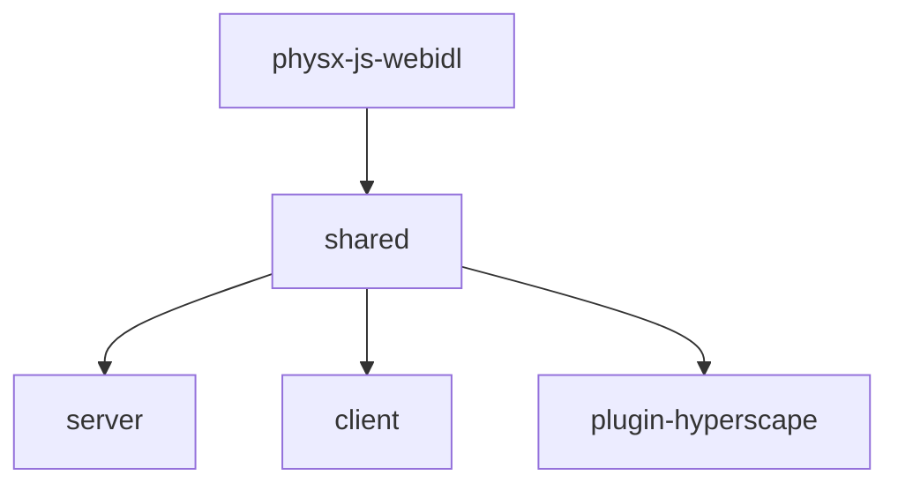

## Monorepo Structure

Hyperscape is a **Turbo monorepo** with 7 packages:

```
hyperscape/
├── packages/
│   ├── shared/              # @hyperscape/shared - Core 3D engine (ECS, Three.js, PhysX)
│   ├── server/              # @hyperscape/server - Game server (Fastify, WebSockets)
│   ├── client/              # @hyperscape/client - Web client (Vite, React)
│   ├── plugin-hyperscape/   # @hyperscape/plugin-hyperscape - ElizaOS AI agent plugin
│   ├── physx-js-webidl/     # @hyperscape/physx-js-webidl - PhysX WASM bindings
│   ├── asset-forge/         # 3d-asset-forge - AI asset generation (Elysia + React Three Fiber)
│   └── docs-site/           # Documentation (Docusaurus)
├── assets/                  # Shared game assets
├── world/                   # World configuration and manifests
└── scripts/                 # Build and dev scripts
```

## Build Dependency Graph

Packages must build in this order due to dependencies:



<Info>
  The `turbo.json` configuration handles build order automatically via `dependsOn: ["^build"]`.
</Info>

## Package Overview

### shared (`@hyperscape/shared`)

The core Hyperscape 3D engine containing:

- **Entity Component System (ECS)**: Game object architecture
- **Three.js integration**: 3D rendering (v0.180.0)
- **PhysX bindings**: Physics simulation via WASM
- **Networking**: Real-time multiplayer sync via WebSockets
- **React UI components**: In-game interface with styled-components
- **Game data**: Manifests for NPCs, items, world areas

**Key directories:**
```
packages/shared/src/
├── components/     # ECS components
├── core/           # Core engine classes
├── data/           # Game manifests (npcs.ts, items.ts, etc.)
├── entities/       # Entity definitions (PlayerEntity, MobEntity)
├── physics/        # PhysX wrapper
├── systems/        # ECS systems (combat, economy, etc.)
└── types/          # TypeScript types
```

### server (`@hyperscape/server`)

Game server built with:

- **Fastify 5**: HTTP API with rate limiting
- **WebSockets**: Real-time game state via `@fastify/websocket`
- **PostgreSQL/SQLite**: Database persistence
- **LiveKit**: Voice chat integration

**Key directories:**
```
packages/server/src/
├── database/       # Database schema and queries
├── infrastructure/ # Docker, CDN configuration
├── startup/        # Server initialization
├── systems/        # Server-specific systems
└── index.ts        # Entry point
```

### client (`@hyperscape/client`)

Web client featuring:

- **Vite**: Fast development builds with HMR
- **React 19**: UI framework
- **Three.js**: 3D rendering
- **Capacitor**: iOS/Android mobile builds
- **Privy**: Authentication
- **Farcaster**: Miniapp SDK integration

**Key directories:**
```
packages/client/src/
├── auth/           # Privy authentication
├── components/     # React UI components
├── game/           # Game loop and logic
├── hooks/          # React hooks
├── screens/        # UI screens (login, game, etc.)
└── index.tsx       # React entry point
```

### plugin-hyperscape (`@hyperscape/plugin-hyperscape`)

ElizaOS plugin enabling AI agents to:

- Perform actions (combat, skills, movement, banking)
- Query world state via 7 providers (goal, gameState, inventory, nearbyEntities, skills, equipment, availableActions)
- Make LLM-driven decisions with Anthropic, OpenAI, or OpenRouter
- Play autonomously as real players with full WebSocket connectivity

**Key Dependencies:**

```typescript
// From packages/plugin-hyperscape/package.json
"@elizaos/core": "^1.2.9"
"@elizaos/plugin-anthropic": "^1.5.12"
"@elizaos/plugin-openai": "1.5.16"
"@elizaos/plugin-openrouter": "^1.5.15"
"@elizaos/plugin-sql": "^1.6.4"
"@hyperscape/shared": "workspace:*"
```

### asset-forge (`3d-asset-forge`)

AI-powered asset generation using:

- **Elysia**: API server (with CORS, rate limiting, Swagger)
- **MeshyAI**: 3D model generation
- **GPT-4**: Design and lore generation
- **React Three Fiber**: 3D preview with `@react-three/fiber` and `@react-three/drei`
- **Drizzle ORM**: PostgreSQL database for asset tracking
- **TensorFlow.js**: Hand pose detection for VR/AR interactions

## Key Patterns

### Entity Component System

All game logic runs through ECS:

- **Entities**: Game objects (players, mobs, items)
- **Components**: Data containers (position, health, inventory)
- **Systems**: Logic processors (combat, skills, movement)

Entities are data containers—all logic lives in systems.

```
packages/shared/src/systems/shared/
├── character/      # Character-related systems
├── combat/         # Combat system
├── death/          # Death and respawn
├── economy/        # Banks, shops, trading
├── entities/       # Entity management
└── interaction/    # Player interactions
```

### Manifest-Driven Content

Game content is defined in TypeScript manifest files in `packages/shared/src/data/`:

| File | Purpose |
|------|---------|
| `npcs.ts` | NPC and mob definitions |
| `items.ts` | Item properties and stats |
| `world-areas.ts` | Zone configuration |
| `banks-stores.ts` | Shop inventories |
| `avatars.ts` | Avatar/character options |
| `equipment-stats.json` | Equipment bonuses |
| `equipment-requirements.json` | Level requirements |

Add new content by editing these files—no code changes required.
