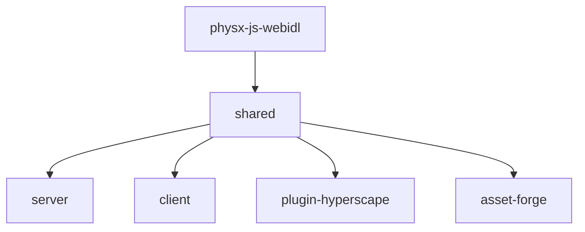

## Monorepo Structure

Hyperscape is a **Turbo monorepo** with 7 packages:

```
packages/
├── shared/              # Core 3D engine (ECS, Three.js, PhysX, networking)
├── server/              # Game server (Fastify, WebSockets, database)
├── client/              # Web client (Vite, React)
├── plugin-hyperscape/   # ElizaOS AI agent plugin
├── physx-js-webidl/     # PhysX WASM bindings
├── asset-forge/         # AI asset generation tools
└── docs-site/           # Documentation (Docusaurus - legacy)
```

## Build Dependency Graph

Packages must build in this order due to dependencies:



<Info>
  The `turbo.json` configuration handles build order automatically via `dependsOn: ["^build"]`.
</Info>

## Package Overview

### shared

The core Hyperscape 3D engine containing:

- **Entity Component System (ECS)**: Game object architecture
- **Three.js integration**: 3D rendering
- **PhysX bindings**: Physics simulation
- **Networking**: Real-time multiplayer sync
- **React UI components**: In-game interface

### server

Game server built with:

- **Fastify**: HTTP API
- **WebSockets**: Real-time game state
- **Drizzle ORM**: Database access
- **LiveKit**: Voice chat integration

### client

Web client featuring:

- **Vite**: Fast development builds
- **React 19**: UI framework
- **Three.js**: 3D rendering
- **Capacitor**: Mobile builds

### plugin-hyperscape

ElizaOS plugin enabling AI agents to:

- Perform actions (combat, skills, movement)
- Query world state
- Make LLM-driven decisions
- Play autonomously

### asset-forge

AI-powered asset generation using:

- **GPT-4**: Design generation
- **MeshyAI**: 3D model creation
- **Automatic rigging**: Humanoid setup

## Key Patterns

### Entity Component System

All game logic runs through ECS:

- **Entities**: Game objects (players, mobs, items)
- **Components**: Data containers (position, health, inventory)
- **Systems**: Logic processors (combat, skills, movement)

Entities are data containers—all logic lives in systems.

### Manifest-Driven Content

Game content is defined in JSON manifests:

- `npcs.ts`: NPC definitions
- `items.ts`: Item properties
- `world-areas.ts`: Zone configuration
- `banks-stores.ts`: Shop inventories

Add new content by editing these files—no code changes required.
