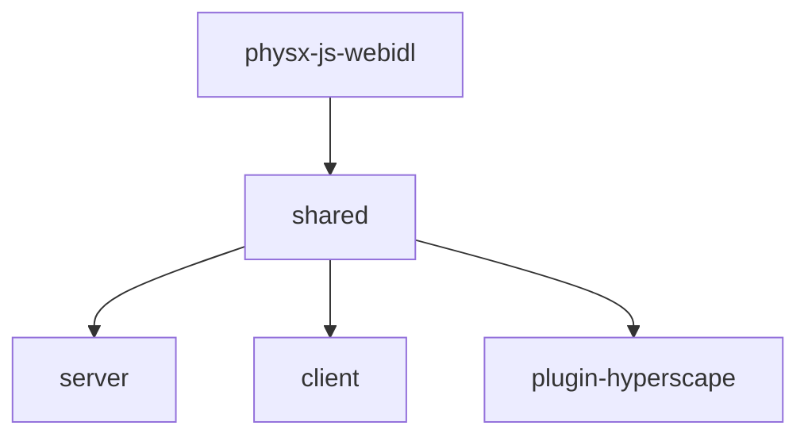

## Monorepo Structure

Hyperscape is a **Turbo monorepo** with core packages:

```
hyperscape/
├── packages/
│   ├── shared/              # @hyperscape/shared - Core 3D engine (ECS, Three.js, PhysX, React UI)
│   ├── server/              # @hyperscape/server - Game server (Fastify, WebSockets, PostgreSQL)
│   ├── client/              # @hyperscape/client - Web client (Vite, React)
│   ├── plugin-hyperscape/   # @hyperscape/plugin-hyperscape - ElizaOS AI agent plugin
│   ├── physx-js-webidl/     # @hyperscape/physx-js-webidl - PhysX WASM bindings
│   ├── procgen/             # @hyperscape/procgen - Procedural generation (trees, terrain, buildings)
│   ├── asset-forge/         # 3d-asset-forge - AI asset generation + VFX catalog
│   ├── duel-oracle-evm/     # EVM duel outcome oracle contracts
│   ├── duel-oracle-solana/  # Solana duel outcome oracle program
│   ├── contracts/           # MUD onchain game state (experimental)
│   └── website/             # @hyperscape/website - Marketing website (Next.js 15)
├── scripts/                 # Build and deployment scripts
└── docs/                    # Documentation markdown files
```

**Note:** The betting stack (`gold-betting-demo`, `evm-contracts`, `sim-engine`, `market-maker-bot`) has been split into a separate repository: [HyperscapeAI/hyperbet](https://github.com/HyperscapeAI/hyperbet)

## Build Dependency Graph

Packages must build in this order due to dependencies:



<Info>
  The `turbo.json` configuration handles build order automatically via `dependsOn: ["^build"]`.
</Info>

## Package Overview

### shared (`@hyperscape/shared`)

The core Hyperscape 3D engine containing:

- **Entity Component System (ECS)**: Game object architecture
- **Three.js integration**: WebGPU rendering (v0.183.1, TSL shaders only) - updated Feb 25, 2026
- **React 19.2.4**: UI framework (unified across monorepo) - updated Feb 25, 2026
- **PhysX bindings**: Physics simulation via WASM
- **Networking**: Real-time multiplayer sync via WebSockets
- **React UI components**: In-game interface with styled-components
- **Game data**: Manifests for NPCs, items, world areas
- **Procedural terrain**: Multi-threaded terrain generation with web workers
- **GPU Instancing**: InstancedMesh-based rendering for trees, particles, placeholders
- **Strategy Pattern**: Delegated visual strategies for resource rendering

<Warning>
**WebGPU Required**: All rendering uses TSL (Three Shading Language) which only works with WebGPU. WebGL fallback was removed in February 2026. Requires Chrome 113+, Edge 113+, or Safari 18+ (macOS 15+).
</Warning>

**Key directories:**
```
packages/shared/src/
├── components/     # ECS components
├── core/           # Core engine classes
├── data/           # Game manifests (npcs.ts, items.ts, etc.)
├── entities/       # Entity definitions (PlayerEntity, MobEntity)
├── physics/        # PhysX wrapper
├── systems/        # ECS systems (combat, economy, etc.)
│   └── shared/world/  # Terrain generation systems
│       ├── TerrainSystem.ts         # Main terrain orchestrator
│       ├── TerrainHeightParams.ts   # Centralized terrain constants
│       ├── TerrainWorker.ts         # Web worker for parallel generation
│       └── BiomeResourceGenerator.ts # Resource placement algorithms
└── types/          # TypeScript types
```

### server (`@hyperscape/server`)

Game server built with:

- **Fastify 5**: HTTP API with rate limiting
- **WebSockets**: Real-time game state via `@fastify/websocket`
- **PostgreSQL/SQLite**: Database persistence
- **LiveKit**: Voice chat integration

**Key directories:**
```
packages/server/src/
├── database/       # Database schema and queries
├── infrastructure/ # Docker, CDN configuration
├── startup/        # Server initialization
├── systems/        # Server-specific systems
└── index.ts        # Entry point
```

### client (`@hyperscape/client`)

Web client featuring:

- **Vite**: Fast development builds with HMR
- **React 19**: UI framework
- **Three.js**: 3D rendering
- **Capacitor**: iOS/Android mobile builds
- **Privy**: Authentication
- **Farcaster**: Miniapp SDK integration

**Key directories:**
```
packages/client/src/
├── auth/           # Privy authentication
├── components/     # React UI components
├── game/           # Game loop and logic
├── hooks/          # React hooks
├── screens/        # UI screens (login, game, etc.)
└── index.tsx       # React entry point
```

### plugin-hyperscape (`@hyperscape/plugin-hyperscape`)

ElizaOS plugin enabling AI agents to:

- Perform actions (combat, skills, movement, banking)
- Query world state via 7 providers (goal, gameState, inventory, nearbyEntities, skills, equipment, availableActions)
- Make LLM-driven decisions with Anthropic, OpenAI, or OpenRouter
- Play autonomously as real players with full WebSocket connectivity

**Key Dependencies:**

```typescript
// From packages/plugin-hyperscape/package.json (as of Feb 2026)
"@elizaos/core": "^2.0.0-alpha.26"  // Updated from 2.0.0-alpha.11 (Feb 25, 2026)
"@elizaos/plugin-anthropic": "^1.5.12"
"@elizaos/plugin-openai": "1.5.16"
"@elizaos/plugin-openrouter": "^1.5.15"
"@elizaos/plugin-sql": "^1.6.4"
"@hyperscape/shared": "workspace:*"
```

### asset-forge (`3d-asset-forge`)

AI-powered asset generation using:

- **Elysia**: API server (with CORS, rate limiting, Swagger)
- **MeshyAI**: 3D model generation
- **GPT-4**: Design and lore generation
- **React Three Fiber**: 3D preview with `@react-three/fiber` and `@react-three/drei`
- **Drizzle ORM**: PostgreSQL database for asset tracking
- **TensorFlow.js**: Hand pose detection for VR/AR interactions

### website (`@hyperscape/website`)

Marketing website built with:

- **Next.js 15**: Static site generation with App Router
- **React 19**: UI framework
- **Tailwind CSS 4**: Utility-first styling
- **Framer Motion**: Scroll animations and transitions
- **GSAP**: Advanced animations
- **Lenis**: Smooth scroll library
- **React Three Fiber**: 3D background effects

**Key Pages:**
- `/` - Landing page with hero, features, and CTA
- `/gold` - $GOLD token page with tokenomics

## Recent Dependency Updates (February 2026)

The following major dependencies were updated in late February 2026:

### Core Dependencies

| Package | Old Version | New Version | Update Type |
|---------|-------------|-------------|-------------|
| `three` | 0.182.0 | 0.183.1 | Minor |
| `@types/three` | 0.180.0 | 0.183.1 | Minor |
| `three-mesh-bvh` | 0.8.3 | 0.9.8 | Minor |
| `react` | 19.2.2 | 19.2.4 | Patch |
| `react-dom` | 19.2.2 | 19.2.4 | Patch |

### ElizaOS Ecosystem

| Package | Old Version | New Version | Update Type |
|---------|-------------|-------------|-------------|
| `@elizaos/core` | 2.0.0-alpha.11 | 2.0.0-alpha.26 | Patch |
| `@coral-xyz/anchor` | 0.31.1 | 0.32.1 | Minor |

### Development Tools

| Package | Old Version | New Version | Update Type |
|---------|-------------|-------------|-------------|
| `eslint` | 9.39.3 | 10.0.2 | Major |
| `typescript` | 5.9.2 | 5.9.3 | Patch |
| `@playwright/test` | 1.54.2 | 1.58.2 | Minor |
| `@types/node` | 24.8.0 | 25.3.0 | Major |
| `@types/chai` | 4.3.17 | 5.2.3 | Major |
| `chai` | 4.5.0 | 6.2.2 | Major |

### UI Libraries

| Package | Old Version | New Version | Update Type |
|---------|-------------|-------------|-------------|
| `framer-motion` | 11.18.2 | 12.34.3 | Major |
| `lucide-react` | 0.553.0 | 0.575.0 | Minor |
| `@ai-sdk/anthropic` | 1.2.12 | 3.0.46 | Major |
| `zod` | 3.25.76 | 4.3.6 | Major |
| `@vitejs/plugin-react` | 5.0.4 | 5.1.4 | Minor |
| `vite-plugin-node-polyfills` | 0.24.0 | 0.25.0 | Minor |
| `dotenv` | 16.6.1 | 17.3.1 | Major |
| `@capacitor/cli` | 7.5.0 | 8.1.0 | Major |

### Breaking Changes

**React 19.2.4 Unification (commit 3322e78):**
- All packages now use React 19.2.4 (previously mixed 19.2.2 and 19.2.4)
- Fixes client exception caused by version mismatch between packages
- Unified via root package.json overrides

**Playwright Override Removed (commit 64db27f):**
- Removed npm override for `playwright >= 1.55.1`
- Conflicted with direct dependency `^1.55.1` in Cloudflare build environment
- Caused EOVERRIDE error during deployment

**ESLint 10.0.2 (Major):**
- Breaking changes in configuration format
- All packages updated simultaneously to maintain consistency

**Zod 4.3.6 (Major):**
- Breaking changes in schema validation API
- Updated across all packages using Zod schemas

<Warning>
When updating dependencies, ensure all packages use the same React version to avoid runtime errors.
</Warning>

## Key Patterns

### Entity Component System

All game logic runs through ECS:

- **Entities**: Game objects (players, mobs, items)
- **Components**: Data containers (position, health, inventory)
- **Systems**: Logic processors (combat, skills, movement)

Entities are data containers—all logic lives in systems.

```
packages/shared/src/systems/shared/
├── character/      # Character-related systems
├── combat/         # Combat system
├── death/          # Death and respawn
├── economy/        # Banks, shops, trading
├── entities/       # Entity management
└── interaction/    # Player interactions
```

### GPU-Instanced Rendering Systems

**GLBTreeInstancer** (commit 0871acb) - InstancedMesh-based tree rendering

Replaces per-tree `scene.clone(true)` with shared InstancedMesh pools per LOD level. Trees from woodcutting.json now render via shared geometry references instead of deep-cloning all buffers on each spawn.

**Performance Impact:**
- Eliminated per-tree geometry cloning (saves ~2-5ms per tree spawn)
- Reduced draw calls from N trees to 3 (one per LOD level)
- FPS improvement: ~15-20% in dense forest areas
- Memory savings: ~80% reduction in geometry buffer allocations

**Implementation:**
- Location: `packages/shared/src/systems/shared/world/GLBTreeInstancer.ts`
- Manages LOD0/LOD1/LOD2 InstancedMesh pools per model
- Allocates instance slots from pre-sized pools (max 1000 instances per LOD)
- Handles depleted/stump/destroy lifecycle via no-op-safe calls
- Initialized in `createClientWorld.ts` when stage scene is ready

**ResourceEntity Visual Strategy Pattern**

Refactored ResourceEntity (~1700 lines removed) into delegated visual strategies using the Strategy Pattern. This separates rendering logic from entity lifecycle management.

**Visual Strategies:**
1. **TreeGLBVisualStrategy**: GLB tree models with LOD support via GLBTreeInstancer
2. **TreeProcgenVisualStrategy**: Procedurally generated trees via ProcgenTreeInstancer
3. **StandardModelVisualStrategy**: Generic 3D models (rocks, ores) via ModelCache
4. **FishingSpotVisualStrategy**: Fishing spot particles via ParticleManager
5. **PlaceholderVisualStrategy**: Fallback colored cubes via PlaceholderInstancer

**Factory Pattern:**
```typescript
// From createVisualStrategy.ts
export function createVisualStrategy(
  resource: ResourceEntity,
  resourceData: GatheringResource,
  world: World,
): ResourceVisualStrategy {
  // Sanitize modelPath (fix "null" string bug)
  const modelPath = resourceData.modelPath === "null" ? null : resourceData.modelPath;
  
  // Select strategy based on resource type and model availability
  if (resourceData.type === "fishing_spot") {
    return new FishingSpotVisualStrategy(resource, resourceData, world);
  }
  
  if (resourceData.type === "tree") {
    if (modelPath && modelPath.includes(".glb")) {
      return new TreeGLBVisualStrategy(resource, resourceData, world);
    }
    return new TreeProcgenVisualStrategy(resource, resourceData, world);
  }
  
  if (modelPath) {
    return new StandardModelVisualStrategy(resource, resourceData, world);
  }
  
  return new PlaceholderVisualStrategy(resource, resourceData, world);
}
```

**Strategy Interface:**
```typescript
interface ResourceVisualStrategy {
  initialize(): Promise<void>;
  setDepleted(depleted: boolean): void;
  destroy(): void;
}
```

**Benefits:**
- **Single Responsibility**: Each strategy handles one rendering approach
- **Open/Closed**: Add new strategies without modifying ResourceEntity
- **Testability**: Strategies can be tested in isolation
- **Maintainability**: ~1700 lines of conditional logic replaced with clean delegation
- **Bug Prevention**: Centralized model path sanitization prevents "null" string bugs

**PlaceholderInstancer**

Manages InstancedMesh pools for placeholder resources (trees/ores with missing models):
- Color-coded: green (trees), brown (ores), blue (fishing spots)
- Lifecycle: `allocate()` on spawn, `free()` on destroy
- Max 1000 instances per resource type
- Initialized in `createClientWorld.ts` alongside GLBTreeInstancer
- Location: `packages/shared/src/systems/shared/world/PlaceholderInstancer.ts`

**Bug Fixes:**
- Fixed fishing spot particles persisting after depletion (guard re-registration when depleted, zero ripple phase offset on unregister for full transparency)
- Fixed placeholder trees not rendering due to "null" string in modelPath (sanitize in ResourceSystem + createVisualStrategy factory, fix woodcutting.json)
- Removed dead ParticleSystem.move() method and leftover hack fixes

### Model Cache System

The shared package includes an IndexedDB-based model cache that stores processed 3D models for instant loading on subsequent page visits. This system was significantly improved in February 2026 (PR #935) to fix critical bugs affecting object visibility and texture persistence.

**Location**: `packages/shared/src/utils/rendering/ModelCache.ts`

**Purpose**: Cache processed GLTF/GLB models in IndexedDB to skip expensive parsing on subsequent loads. The cache stores:
- Serialized mesh geometry (positions, normals, UVs, skinning data)
- Material properties (colors, roughness, metalness, textures)
- Scene hierarchy (parent-child relationships, transforms)
- Animation clips (keyframes, tracks)
- Collision data (optional PhysX mesh data)

**Critical Fixes (PR #935, Feb 25, 2026):**

1. **Missing Objects Bug (Identity Map Fix)**:
   - **Issue**: Models with duplicate mesh names (e.g., "", "Cube", "Cube") lost objects after deserialization. `serializeNode` used `findIndex`-by-name which caused all duplicate names to resolve to the same index. Three.js `add()` auto-removes from previous parent, so only the last reference survived.
   - **Impact**: Altars and other multi-mesh models appeared incomplete or invisible after page refresh
   - **Fix**: Replaced name-based lookup with `Map<Object3D, number>` identity map built during traversal
   - **Code**:
     ```typescript
     // Build identity map during mesh collection
     const meshNodeToIndex = new Map<THREE.Object3D, number>();
     scene.traverse((node) => {
       if (node instanceof THREE.Mesh || node instanceof THREE.SkinnedMesh) {
         meshNodeToIndex.set(node, meshes.length);
         meshes.push(serializeMesh(node));
       }
     });
     
     // Use identity map in serializeNode (not name-based findIndex)
     const hierarchy = this.serializeNode(scene, meshNodeToIndex);
     ```
   - **Result**: All objects in models now render correctly after cache restore

2. **Lost Textures Bug (Pixel Extraction Fix)**:
   - **Issue**: Textures were serialized as ephemeral `blob:` URLs but never reloaded during deserialization
   - **Impact**: Models appeared white or with wrong colors after page refresh
   - **Fix**: Extract raw RGBA pixels via canvas `getImageData()` (synchronous) and restore as `THREE.DataTexture`
   - **Code**:
     ```typescript
     // Extract texture pixels synchronously
     private textureToPixelData(texture: THREE.Texture): SerializedTextureData | null {
       const image = texture.source?.data ?? texture.image;
       const canvas = document.createElement(\"canvas\");
       canvas.width = image.naturalWidth || image.width;
       canvas.height = image.naturalHeight || image.height;
       const ctx = canvas.getContext(\"2d\");
       ctx.drawImage(image, 0, 0);
       const imageData = ctx.getImageData(0, 0, canvas.width, canvas.height);
       return { pixels: imageData.data.buffer, width: canvas.width, height: canvas.height };
     }
     
     // Restore as DataTexture
     const restoreTex = (td: SerializedTextureData, srgb: boolean): THREE.DataTexture => {
       const tex = new THREE.DataTexture(
         new Uint8ClampedArray(td.pixels),
         td.width,
         td.height,
         THREE.RGBAFormat,
       );
       tex.colorSpace = srgb ? THREE.SRGBColorSpace : THREE.LinearSRGBColorSpace;
       tex.needsUpdate = true;
       return tex;
     };
     ```
   - **Result**: Textures persist correctly across page refreshes with no async loading race conditions

3. **Grey Trees in WebGPU (Duck-Type Fix)**:
   - **Issue**: `createDissolveMaterial` used `instanceof MeshStandardMaterial` which fails for `MeshStandardNodeMaterial` in WebGPU build (separate classes)
   - **Impact**: Tree materials rendered grey instead of textured in WebGPU mode
   - **Fix**: Replaced with duck-type property check
   - **Code**:
     ```typescript
     // Duck-type check instead of instanceof
     const src = source as THREE.MeshStandardMaterial & { map?: THREE.Texture | null; /* ... */ };
     if (src.color && src.roughness !== undefined) {
       // Copy PBR properties
       material.color.copy(src.color);
       material.roughness = src.roughness;
       // ...
     }
     ```
   - **Result**: Tree materials render correctly in both WebGL and WebGPU builds

**Additional Improvements:**
- `localStorage.setItem('disable-model-cache', 'true')` bypass option for debugging
- Error logging on IndexedDB `put()` and transaction failures
- Cache version bumped to 3 to invalidate broken entries
- All texture types supported: map, normalMap, emissiveMap, roughnessMap, metalnessMap, aoMap
- Proper color space handling (sRGB for diffuse, Linear for data textures)

**Debug Option:**
```typescript
// Disable model cache for debugging
localStorage.setItem('disable-model-cache', 'true');
// Re-enable
localStorage.removeItem('disable-model-cache');
```

### GPU-Instanced Particle System (PR #877)

The shared package includes a centralized particle system that uses GPU instancing for high-performance visual effects. Introduced in February 2026, this system provides dramatic performance improvements for fishing spots and other particle-heavy entities.

**Architecture:**
- **ParticleManager**: Central router that dispatches particle events to specialized sub-managers
  - Single entry point for all particle systems
  - Type-based routing to appropriate sub-manager
  - Ownership tracking for efficient lifecycle management
  - Extensible design for future particle types
- **WaterParticleManager**: GPU-instanced fishing spot effects
  - 4 InstancedMeshes (splash, bubble, shimmer, ripple) with TSL shaders
  - GPU-computed animations (parabolic arcs, wobble, twinkle, ring expansion)
  - Per-instance data via InstancedBufferAttributes
  - Fishing spot variant system (net, bait, fly)

**Performance Benefits:**
- **Draw Call Reduction**: ~150 → 4 per fishing spot (97% reduction)
- **FPS Improvement**: 65-70 → 120 on reference hardware (80% increase)
- **CPU Savings**: ~450 lines of per-entity animation code eliminated
- **GPU-Driven**: All particle updates computed on GPU via TSL shaders
- **Zero CPU Overhead**: No per-frame CPU particle animation

**Location:**
```
packages/shared/src/entities/managers/particleManager/
├── ParticleManager.ts        # Central router with ownership tracking
├── WaterParticleManager.ts   # Fishing spot particles (splash, bubble, shimmer, ripple)
└── index.ts                  # Public exports
```

**Technical Implementation:**
- **InstancedBufferAttributes**: Per-particle data storage
  - spotPos (vec3): fishing spot world center
  - ageLifetime (vec2): current age, total lifetime
  - angleRadius (vec2): polar angle, radial distance
  - dynamics (vec4): peakHeight, size, speed, direction
- **TSL NodeMaterials**: GPU-computed particle animations using Three.js Shading Language
  - Billboard orientation via camera right/up vectors
  - Parabolic arc trajectories for splash particles
  - Wobble and drift patterns for bubbles
  - Twinkle effects for shimmer particles
  - Ring expansion and fade for ripples
- **Vertex Buffer Budget**: 7 of 8 max attributes per particle layer
  - position(1) + uv(1) + instanceMatrix(1) + spotPos(1) + ageLifetime(1) + angleRadius(1) + dynamics(1)
- **Pool Sizes**: MAX_SPLASH=96, MAX_BUBBLE=72, MAX_SHIMMER=72, MAX_RIPPLE=24
- **Fishing Variants**: Net (calm), Bait (medium), Fly (active)
  - Variant-specific colors, ripple speeds, particle counts
  - Burst intervals: Net 5-10s, Bait 3-7s, Fly 2-5s
  - Burst splash counts: Net 2, Bait 3, Fly 4
- **Burst System**: Fish activity bursts fire splash particles simultaneously
  - Burst center randomized within 0.05-0.15 radius
  - Burst particles have higher peak heights (0.25-0.6 vs 0.12-0.32)
  - Burst particles cluster around burst center with 0.06 spread

**Integration:**
- **ResourceSystem**: Creates ParticleManager on client startup
  - Retroactive registration for entities created before system start
  - Listens to RESOURCE_SPAWNED events for particle routing
  - Per-frame update drives all particle managers via update(dt, camera)
  - Proper disposal on system shutdown
- **ResourceEntity**: Delegates particle lifecycle to ParticleManager
  - Lazy registration pattern (retries if manager not ready during entity init)
  - Retains only lightweight glow mesh for interaction detection
  - Proper cleanup via unregister on entity destroy
  - Removed ~450 lines of CPU particle animation code

**Extensibility:**
To add new particle types (fire, magic, dust, blood):
1. Create new sub-manager class in `particleManager/` folder
2. Instantiate in ParticleManager constructor
3. Add routing logic in register/unregister/move/handleEvent methods
4. Call update() and dispose() from ParticleManager

See [Particle System Documentation](/wiki/engine/particles) for complete API reference and implementation details.

### Manifest-Driven Content

Game content is defined in JSON manifest files in `packages/server/world/assets/manifests/`:

| File | Purpose |
|------|---------|
| `npcs.json` | NPC and mob definitions |
| `items/weapons.json` | Combat weapons |
| `items/tools.json` | Skilling tools |
| `items/resources.json` | Gathered materials |
| `items/food.json` | Cooked consumables |
| `gathering/woodcutting.json` | Trees and log yields |
| `gathering/mining.json` | Rocks and ore yields |
| `gathering/fishing.json` | Fishing spots and catch rates |
| `recipes/smelting.json` | Furnace recipes |
| `recipes/smithing.json` | Anvil recipes |
| `recipes/cooking.json` | Cooking recipes |
| `tier-requirements.json` | Centralized level requirements |
| `skill-unlocks.json` | Skill progression milestones |
| `stores.json` | Shop inventories |
| `world-areas.json` | Zone configuration |
| `biomes.json` | Biome definitions |
| `vegetation.json` | Procedural vegetation |
| `stations.json` | Station models and configurations |
| `model-bounds.json` | Auto-generated model footprints (build-time) |

Add new content by editing these JSON files—no code changes required.

## Code Quality & Architecture

### Code Audit Fixes (February 2026)

A comprehensive code audit was performed in commit 3bc59db, addressing critical issues:

**1. Memory Leak Fix:**
- **Issue**: InventoryInteractionSystem registered 9 event listeners that were never removed
- **Impact**: Memory leak on every player connection
- **Fix**: Use AbortController for proper event listener cleanup
```typescript
const abortController = new AbortController();
world.on('inventory:add', handler, { signal: abortController.signal });
// Cleanup on system destroy
abortController.abort();
```

**2. JWT Secret Security:**
- **Issue**: JWT_SECRET optional in production, allowing unsigned tokens
- **Impact**: Security vulnerability in production deployments
- **Fix**: Now throws error in production/staging if JWT_SECRET not set
```typescript
if (NODE_ENV === 'production' || NODE_ENV === 'staging') {
  if (!JWT_SECRET) {
    throw new Error('JWT_SECRET is required in production/staging');
  }
}
```

**3. WebGPU Enforcement:**
- **Issue**: WebGL fallback attempted but all shaders use TSL (WebGPU-only)
- **Impact**: Broken rendering on WebGL-only browsers
- **Fix**: Enforce WebGPU-only rendering with user-friendly error screen
```typescript
if (!navigator.gpu) {
  // Show error screen with browser upgrade instructions
  throw new Error('WebGPU not supported. Please upgrade your browser.');
}
```

**4. Dead Code Removal (commit 7c3dc985):**
- Deleted `PacketHandlers.ts` (3,098 lines of dead code, never imported)
- Updated audit TODOs to reflect actual codebase state:
  - AUDIT-002: ServerNetwork already decomposed into 30+ modules (not 116K lines)
  - AUDIT-003: ClientNetwork handlers are intentional thin wrappers (not bloated)
  - AUDIT-005: `any` types reduced from 142 to ~46 after cleanup

**5. Type Safety Improvements (commit d9113595):**
- Eliminated explicit `any` types in core game logic
- `tile-movement.ts`: Removed 13 any casts by properly typing BuildingCollisionService
- `proxy-routes.ts`: Replaced any with proper types (unknown, Buffer | string, Error)
- `ClientGraphics.ts`: Added safe cast after WebGPU verification

**Remaining `any` types (acceptable):**
- TSL shader code (ProceduralGrass.ts) - @types/three limitation
- Browser polyfills (polyfills.ts) - intentional mock implementations
- Test files - acceptable for test fixtures

### Architectural TODOs

The codebase includes TODO comments tracking architectural refactoring opportunities:

**AUDIT-001: Entity.ts Decomposition**
- Current: Entity.ts is large but manageable
- Recommendation: Extract visual/physics/networking concerns to separate classes
- Priority: Low (current structure works well)

**AUDIT-002: ServerNetwork Split**
- Status: ✅ Already decomposed into 30+ modules
- Location: `packages/server/src/systems/ServerNetwork/handlers/`
- Actual size: ~3K lines (not 116K as originally estimated)

**AUDIT-003: ClientNetwork Split**
- Status: ✅ Handlers are intentional thin wrappers
- Purpose: Emit events for other systems to handle
- Actual size: ~5K lines (not 165K as originally estimated)
- Extraction not needed - current design is correct

**AUDIT-004: Circular Dependency Fix**
- Status: ✅ Fixed in commits 3b9c0f2, 05c2892 (Feb 26, 2026)
- Solution: Removed cross-references between shared ↔ procgen
- Uses devDependencies for TypeScript type resolution without build cycle

**AUDIT-005: Any Type Cleanup**
- Status: ✅ Reduced from 142 to ~46 (commit d9113595)
- Remaining any types are in acceptable locations (shaders, polyfills, tests)

## Build Pipeline

### Circular Dependency Handling

The build system handles circular dependencies between packages gracefully:

**procgen ↔ shared circular dependency (FIXED):**
- **Previous Issue**: `@hyperscape/shared` imports from `@hyperscape/procgen`, procgen imports from shared
- **Solution** (commits 3b9c0f2, 05c2892):
  - Removed cross-references entirely from both package.json files
  - Added procgen as devDependency in shared for TypeScript type resolution
  - devDependencies not followed by turbo's `^build` topological ordering (no cycle)
  - Imports still resolve at runtime via bun workspace resolution
- **Result**: Clean builds work without circular dependency errors

**plugin-hyperscape ↔ shared circular dependency:**
- Similar pattern with `--skipLibCheck` in shared's declaration generation
- Variable shadowing fixes (e.g., PlayerMovementSystem.ts tile redeclaration)

### Automated Model Bounds Extraction

The server package includes a build-time task that automatically extracts collision footprints from 3D models:

```bash
# Runs automatically during build (cached by Turbo)
bun run extract-bounds
```

**How it works:**
1. Scans `world/assets/models/**/*.glb` files
2. Parses glTF position accessor min/max values
3. Calculates bounding boxes and tile footprints
4. Generates `world/assets/manifests/model-bounds.json`

**Turbo Configuration** (`packages/server/turbo.json`):
```json
{
  "tasks": {
    "extract-bounds": {
      "inputs": [
        "world/assets/models/**/*.glb",
        "scripts/extract-model-bounds.ts"
      ],
      "outputs": ["world/assets/manifests/model-bounds.json"],
      "cache": true
    },
    "build": {
      "dependsOn": ["^build", "extract-bounds"]
    }
  }
}
```

<Info>
The bounds extraction is **cached** - it only re-runs when GLB files or the script changes. This keeps builds fast while ensuring collision data stays in sync with models.
</Info>
