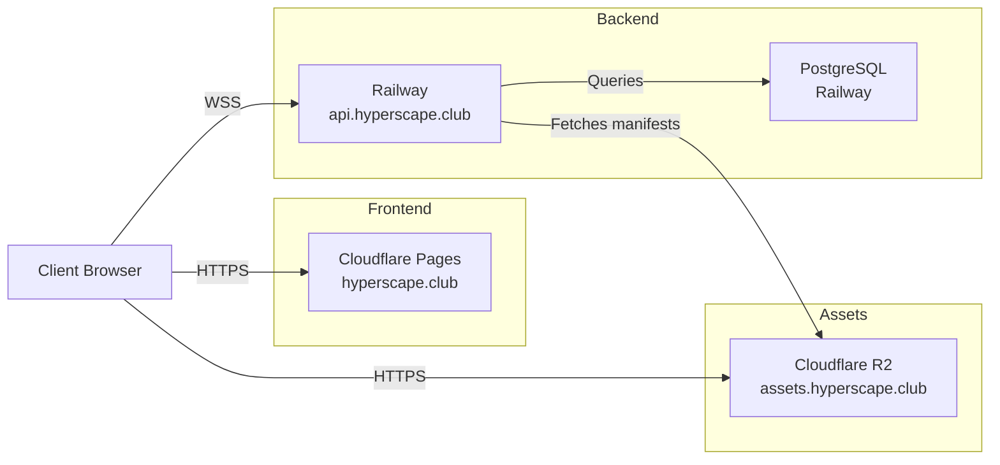
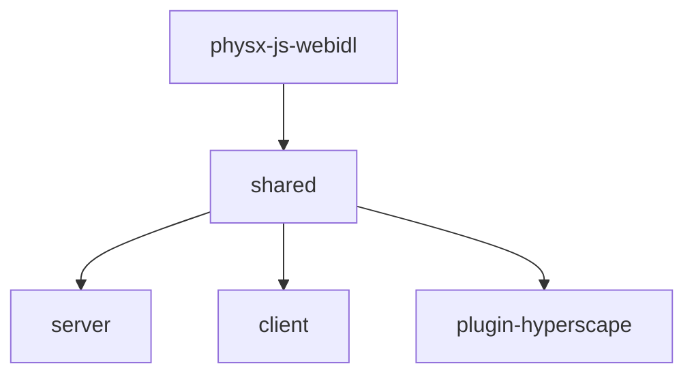

## Deployment Architecture

Hyperscape uses a modern cloud-native architecture with separate services:



### Production Stack

| Component | Service | URL | Purpose |
|-----------|---------|-----|---------|
| **Frontend** | Cloudflare Pages | hyperscape.club | React SPA, static assets |
| **API/WebSocket** | Railway | api.hyperscape.club | Game server, real-time sync |
| **Database** | Railway PostgreSQL | (internal) | Player data, world state |
| **Assets/CDN** | Cloudflare R2 | assets.hyperscape.club | 3D models, manifests, audio |

### Staging Stack

| Component | Service | URL | Purpose |
|-----------|---------|-----|---------|
| **Frontend** | Cloudflare Pages | staging.hyperscape.club | Staging frontend |
| **API/WebSocket** | Railway | staging-api.hyperscape.club | Staging server |
| **Database** | Railway PostgreSQL | (internal) | Staging database |
| **Assets/CDN** | Cloudflare R2 | staging-assets.hyperscape.club | Staging assets |

<Info>
  The staging environment is a complete isolated instance for testing changes before production deployment.
</Info>

## Monorepo Structure

Hyperscape is a **Turbo monorepo** with 7 packages:

```
hyperscape/
├── packages/
│   ├── shared/              # @hyperscape/shared - Core 3D engine (ECS, Three.js, PhysX)
│   ├── server/              # @hyperscape/server - Game server (Fastify, WebSockets)
│   ├── client/              # @hyperscape/client - Web client (Vite, React)
│   ├── plugin-hyperscape/   # @hyperscape/plugin-hyperscape - ElizaOS AI agent plugin
│   ├── physx-js-webidl/     # @hyperscape/physx-js-webidl - PhysX WASM bindings
│   ├── asset-forge/         # 3d-asset-forge - AI asset generation (Elysia + React Three Fiber)
│   └── docs-site/           # Documentation (Docusaurus)
├── scripts/                 # Build and dev scripts
├── nixpacks.toml            # Railway build configuration
├── Dockerfile.server        # Multi-stage Docker build for server
├── railway.server.json      # Railway service configuration
└── .railwayignore           # Files excluded from Railway uploads
```

## Production Architecture

Hyperscape uses a split deployment model:

```
┌─────────────────────┐
│  Cloudflare Pages   │  Frontend (hyperscape.club)
│  - React client     │
│  - Static assets    │
└──────────┬──────────┘
           │ HTTPS/WSS
           ▼
┌─────────────────────┐
│  Railway            │  Backend (hyperscape-production.up.railway.app)
│  - Game server      │
│  - WebSocket API    │
│  - PostgreSQL       │
└──────────┬──────────┘
           │ Fetches manifests
           ▼
┌─────────────────────┐
│  Cloudflare R2      │  CDN (assets.hyperscape.club)
│  - 3D models        │
│  - Audio files      │
│  - Textures         │
│  - Manifests        │
└─────────────────────┘
```

**Key Features:**
- **Manifest Loading**: Server fetches manifests from CDN at startup (no Git LFS in production)
- **CORS**: Automatic allowlist for Cloudflare Pages and Railway domains
- **Frontend Serving**: Server can serve built client from `public/` directory
- **Asset Routing**: Conditional asset routes based on client build presence

## Build Dependency Graph

Packages must build in this order due to dependencies:



<Info>
  The `turbo.json` configuration handles build order automatically via `dependsOn: ["^build"]`.
</Info>

## Package Overview

### shared (`@hyperscape/shared`)

The core Hyperscape 3D engine containing:

- **Entity Component System (ECS)**: Game object architecture
- **Three.js integration**: 3D rendering (v0.180.0)
- **PhysX bindings**: Physics simulation via WASM
- **Networking**: Real-time multiplayer sync via WebSockets
- **React UI components**: In-game interface with styled-components
- **Game data**: Manifests for NPCs, items, world areas

**Key directories:**
```
packages/shared/src/
├── components/     # ECS components
├── core/           # Core engine classes
├── data/           # Game manifests (npcs.ts, items.ts, etc.)
├── entities/       # Entity definitions (PlayerEntity, MobEntity)
├── physics/        # PhysX wrapper
├── systems/        # ECS systems (combat, economy, etc.)
└── types/          # TypeScript types
```

### server (`@hyperscape/server`)

Game server built with:

- **Fastify 5**: HTTP API with rate limiting
- **WebSockets**: Real-time game state via `@fastify/websocket`
- **PostgreSQL/SQLite**: Database persistence
- **LiveKit**: Voice chat integration

**Key directories:**
```
packages/server/src/
├── database/       # Database schema and queries
├── infrastructure/ # Docker, CDN configuration
├── startup/        # Server initialization
├── systems/        # Server-specific systems
└── index.ts        # Entry point
```

### client (`@hyperscape/client`)

Web client featuring:

- **Vite**: Fast development builds with HMR
- **React 19**: UI framework
- **Three.js**: 3D rendering
- **Capacitor**: iOS/Android mobile builds
- **Privy**: Authentication
- **Farcaster**: Miniapp SDK integration

**Key directories:**
```
packages/client/src/
├── auth/           # Privy authentication
├── components/     # React UI components
├── game/           # Game loop and logic
├── hooks/          # React hooks
├── screens/        # UI screens (login, game, etc.)
└── index.tsx       # React entry point
```

### plugin-hyperscape (`@hyperscape/plugin-hyperscape`)

ElizaOS plugin enabling AI agents to:

- Perform actions (combat, skills, movement, banking, social)
- Query world state via 7 providers (goal, gameState, inventory, nearbyEntities, skills, equipment, availableActions)
- Make LLM-driven decisions with Anthropic, OpenAI, or OpenRouter
- Play autonomously as real players with full WebSocket connectivity
- Train all 12 skills including Agility (passive movement-based XP)

**Key Dependencies:**

```typescript
// From packages/plugin-hyperscape/package.json
"@elizaos/core": "^1.7.0"
"@elizaos/plugin-anthropic": "^1.5.12"
"@elizaos/plugin-openai": "^1.6.0"
"@elizaos/plugin-openrouter": "^1.5.17"
"@elizaos/plugin-ollama": "^1.2.4"  // NEW: Local LLM support
"@elizaos/plugin-sql": "^1.7.0"
"@hyperscape/shared": "workspace:*"
```

### asset-forge (`3d-asset-forge`)

AI-powered asset generation using:

- **Elysia**: API server (with CORS, rate limiting, Swagger)
- **MeshyAI**: 3D model generation
- **GPT-4**: Design and lore generation
- **React Three Fiber**: 3D preview with `@react-three/fiber` and `@react-three/drei`
- **Drizzle ORM**: PostgreSQL database for asset tracking
- **TensorFlow.js**: Hand pose detection for VR/AR interactions

## Key Patterns

### Entity Component System

All game logic runs through ECS:

- **Entities**: Game objects (players, mobs, items)
- **Components**: Data containers (position, health, inventory)
- **Systems**: Logic processors (combat, skills, movement)

Entities are data containers—all logic lives in systems.

```
packages/shared/src/systems/shared/
├── character/      # Character-related systems
├── combat/         # Combat system
├── death/          # Death and respawn
├── economy/        # Banks, shops, trading
├── entities/       # Entity management
└── interaction/    # Player interactions
```

### Manifest-Driven Content

Game content is defined in JSON manifest files. In production, manifests are fetched from the CDN at server startup and cached locally in `packages/server/world/assets/manifests/`:

| File | Purpose |
|------|---------|
| `npcs.json` | NPC and mob definitions |
| `items/weapons.json` | Combat weapons |
| `items/tools.json` | Skilling tools |
| `items/resources.json` | Gathered materials |
| `items/food.json` | Cooked consumables |
| `gathering/woodcutting.json` | Trees and log yields |
| `gathering/mining.json` | Rocks and ore yields |
| `gathering/fishing.json` | Fishing spots and catch rates |
| `recipes/smelting.json` | Furnace recipes |
| `recipes/smithing.json` | Anvil recipes |
| `recipes/cooking.json` | Cooking recipes |
| `tier-requirements.json` | Centralized level requirements |
| `skill-unlocks.json` | Skill progression milestones |
| `stores.json` | Shop inventories |
| `world-areas.json` | Zone configuration |
| `biomes.json` | Biome definitions |
| `vegetation.json` | Procedural vegetation |
| `stations.json` | Station models and configurations |
| `model-bounds.json` | Auto-generated model footprints (build-time) |

Add new content by editing these JSON files—no code changes required.

## Asset Serving Architecture

### Development

In development, assets are served from a local Docker CDN:

```bash
bun run cdn:up  # Starts nginx on port 8080
```

**Asset flow:**
1. Client requests asset: `http://localhost:8080/models/goblin/goblin.vrm`
2. nginx serves from `packages/server/world/assets/`
3. Manifests loaded from local filesystem

### Production

In production, assets are served from Cloudflare R2:

```bash
# Automatic upload via GitHub Actions
# .github/workflows/deploy-cloudflare.yml
```

**Asset flow:**
1. Client requests asset: `https://assets.hyperscape.club/models/goblin/goblin.vrm`
2. Cloudflare R2 serves with global CDN caching
3. Server fetches manifests from R2 at startup
4. Manifests cached locally in `packages/server/world/assets/manifests/`

**Manifest fetching:**
```typescript
// From packages/server/src/startup/config.ts
await fetchManifestsFromCDN(CDN_URL, manifestsDir, NODE_ENV);
```

**Files fetched** (30+ manifests):
- `npcs.json`, `stores.json`, `world-areas.json`, `prayers.json`
- `items/*.json` (weapons, tools, resources, food, misc)
- `gathering/*.json` (woodcutting, mining, fishing)
- `recipes/*.json` (cooking, firemaking, smelting, smithing)

### Staging

Staging uses a separate R2 bucket (`hyperscape-assets-staging`) to isolate test content from production.

## Build Pipeline

### Automated Model Bounds Extraction

The server package includes a build-time task that automatically extracts collision footprints from 3D models:

```bash
# Runs automatically during build (cached by Turbo)
bun run extract-bounds
```

**How it works:**
1. Scans `world/assets/models/**/*.glb` files
2. Parses glTF position accessor min/max values
3. Calculates bounding boxes and tile footprints
4. Generates `world/assets/manifests/model-bounds.json`

**Turbo Configuration** (`packages/server/turbo.json`):
```json
{
  "tasks": {
    "extract-bounds": {
      "inputs": [
        "world/assets/models/**/*.glb",
        "scripts/extract-model-bounds.ts"
      ],
      "outputs": ["world/assets/manifests/model-bounds.json"],
      "cache": true
    },
    "build": {
      "dependsOn": ["^build", "extract-bounds"]
    }
  }
}
```

<Info>
The bounds extraction is **cached** - it only re-runs when GLB files or the script changes. This keeps builds fast while ensuring collision data stays in sync with models.
</Info>

## Deployment Architecture

### Railway Deployment

Hyperscape server deploys to Railway with automated CI/CD:

**Configuration Files**:
- **`nixpacks.toml`**: Nixpacks build configuration (recommended)
- **`Dockerfile.server`**: Multi-stage Docker build (alternative)
- **`railway.server.json`**: Railway service configuration
- **`.railwayignore`**: Excludes large directories from upload
- **`.github/workflows/deploy-railway.yml`**: Automated deployment workflow

**Build Process**:
1. Install system dependencies (python3, make, g++, git, cairo, pango)
2. Install Node dependencies with `bun install --frozen-lockfile`
3. Clone assets repository (manifests needed by DataManager)
4. Build packages in order: shared → server
5. Start server with `bun dist/index.js`

**Asset Handling**:
- Assets are **not uploaded** to Railway (excluded via `.railwayignore`)
- Assets are **cloned during build** from GitHub assets repository
- Assets are **served from CDN** in production (not bundled with server)
- `ensure-assets.mjs` detects CI environments and skips download

**Environment Detection**:
```javascript
function isCI() {
  return !!(
    process.env.CI ||
    process.env.RAILWAY_ENVIRONMENT ||
    process.env.RAILWAY_SERVICE_ID ||
    process.env.SKIP_ASSETS
  );
}
```

### Split Deployment Model

Hyperscape supports split deployments:

- **Server**: Railway, Fly.io, or Docker host
- **Client**: Vercel, Netlify, or static hosting
- **Database**: PostgreSQL (Neon, Railway, or self-hosted)
- **Assets**: CDN or object storage (R2, S3)

**Environment Variable Coordination**:
- `PRIVY_APP_ID` (server) must match `PUBLIC_PRIVY_APP_ID` (client)
- Client's `PUBLIC_WS_URL` and `PUBLIC_API_URL` must point to server
- Both must use same `PUBLIC_CDN_URL` for assets
