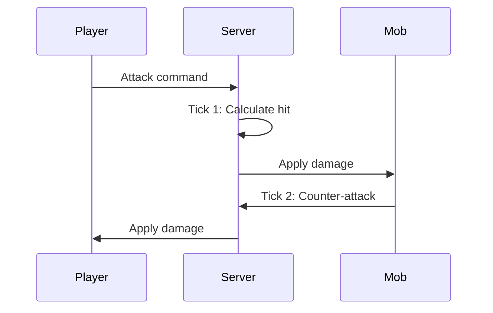

## Overview

Hyperscape uses RuneScape-style tick-based combat with authentic mechanics including attack styles, accuracy formulas, and damage calculations.

## Tick System

Combat operates on a **600ms tick** cycle, matching Old School RuneScape:

- Actions resolve once per tick
- Attack speed determined by weapon
- Damage calculated each hit



## Combat Stats

| Stat | Purpose |
|------|---------|
| **Attack** | Accuracy, weapon requirements |
| **Strength** | Maximum hit, damage bonus |
| **Defense** | Evasion, armor requirements |
| **Constitution** | Health points |
| **Range** | Ranged accuracy and damage |

### Combat Level

Aggregate level calculated from combat stats:

```
Combat Level = (ATK + STR + DEF + CON) / 4 + Range / 8
```

## Attack Styles

Players choose how XP is distributed:

| Style | XP Gain |
|-------|---------|
| **Accurate** | Attack + Constitution |
| **Aggressive** | Strength + Constitution |
| **Defensive** | Defense + Constitution |
| **Controlled** | Equal split |

## Damage Calculation

### Accuracy Roll

```
Accuracy = AttackLevel * AttackBonus * Style Modifier
Evasion = DefenseLevel * DefenseBonus
Hit Chance = Accuracy / (Accuracy + Evasion)
```

### Max Hit

```
MaxHit = floor((StrengthLevel + StrengthBonus) * StyleModifier / 10)
Damage = random(0, MaxHit)
```

## Ranged Combat

Ranged attacks require:

- Bow equipped in weapon slot
- Arrows equipped in arrow slot
- Arrows consumed on each attack

<Warning>
  Without arrows, the bow cannot attack. Arrows are not recoverable.
</Warning>

## Death Mechanics

When health reaches zero:

1. Items drop at death location (headstone)
2. Player respawns at nearest starter town
3. Headstone persists for item retrieval
4. Other players cannot loot your headstone

## Mob Aggression

| Behavior | Description |
|----------|-------------|
| **Passive** | Never attacks first |
| **Aggressive** | Attacks players in range |
| **Level-gated** | Ignores high-level players |
| **Always Aggressive** | Attacks regardless of level |

### Aggro Range

Each mob has an aggro radius. Entering this range triggers combat for aggressive mobs.

### Chase Behavior

Mobs return to spawn point if player escapes their chase range.

## Loot System

On mob death:

| Drop Type | Behavior |
|-----------|----------|
| **Guaranteed** | Coins (always drop) |
| **Common** | Basic items |
| **Uncommon** | Equipment matching mob tier |
| **Rare** | Higher-tier equipment |

Drop tables are defined in `packages/shared/src/data/npcs.ts`.
