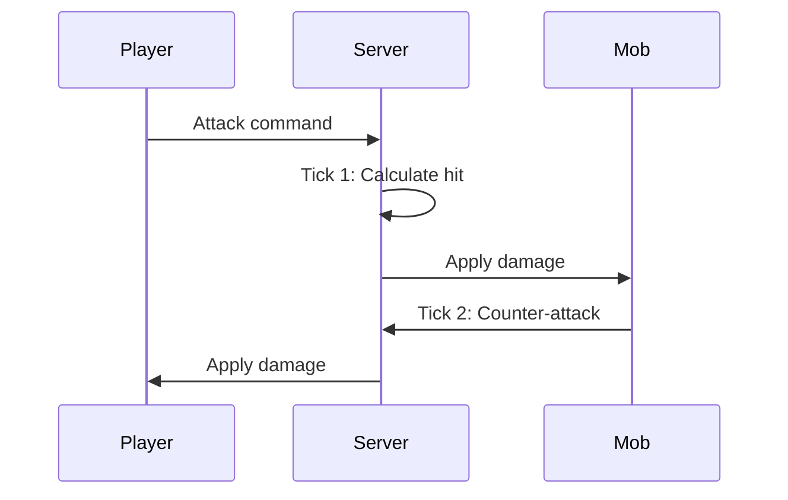

## Overview

Hyperscape uses RuneScape-style tick-based combat with authentic mechanics including attack styles, accuracy formulas, and damage calculations.

## Tick System

Combat operates on a **600ms tick** cycle, matching Old School RuneScape:

```typescript
// From packages/shared/src/constants/CombatConstants.ts
export const COMBAT_CONSTANTS = {
  MELEE_RANGE: 2,
  RANGED_RANGE: 10,
  ATTACK_COOLDOWN_MS: 2400,      // 2.4 seconds - standard weapon (4 ticks)
  COMBAT_TIMEOUT_MS: 10000,      // 10 seconds without attacks ends combat
  TICK_DURATION_MS: 600,         // 0.6 seconds per game tick
  BASE_CONSTANT: 64,             // Added to equipment bonuses
  EFFECTIVE_LEVEL_CONSTANT: 8,   // Added to effective levels
  DAMAGE_DIVISOR: 640,           // Used in max hit calculation
  MIN_DAMAGE: 0,                 // OSRS: Can hit 0 (miss)
  MAX_DAMAGE: 200,               // OSRS damage cap
};
```



## Combat Stats

| Stat | Purpose |
|------|---------|
| **Attack** | Accuracy, weapon requirements |
| **Strength** | Maximum hit, damage bonus |
| **Defense** | Evasion, armor requirements |
| **Constitution** | Health points |
| **Range** | Ranged accuracy and damage |

### Combat Level

Aggregate level calculated from combat stats:

```
Combat Level = (ATK + STR + DEF + CON) / 4 + Range / 8
```

## Attack Styles

Players choose how XP is distributed:

| Style | XP Gain |
|-------|---------|
| **Accurate** | Attack + Constitution |
| **Aggressive** | Strength + Constitution |
| **Defensive** | Defense + Constitution |
| **Controlled** | Equal split |

## Damage Calculation

The combat system uses OSRS-style formulas with equipment bonuses:

```typescript
// From packages/shared/src/systems/shared/combat/CombatSystem.ts
// CombatSystem extracts stats from entities:

// For players - get stats from components:
const statsComponent = attacker.getComponent("stats");
attackerData = {
  stats: {
    attack: stats.attack.level,    // Skill level
    strength: stats.strength.level,
    defense: stats.defense.level,
    ranged: stats.ranged.level,
  },
};

// For mobs - get stats from mob data:
const mobData = attackerMob.getMobData();
attackerData = {
  config: { attackPower: mobData.attackPower },
};

// Equipment bonuses from EquipmentSystem are added to damage
const equipmentStats = this.playerEquipmentStats.get(attacker.id);
const result = calculateDamage(attackerData, targetData, AttackType.MELEE, equipmentStats);
```

### OSRS Constants

```typescript
// From CombatConstants.ts
BASE_CONSTANT: 64,             // Added to equipment bonuses in formulas
EFFECTIVE_LEVEL_CONSTANT: 8,   // Added to effective levels
DAMAGE_DIVISOR: 640,           // Used in max hit calculation
```

## Ranged Combat

Ranged combat uses bows and arrows for long-distance attacks:

### Requirements

- **Bow** equipped in weapon slot (shortbow, oak shortbow, willow shortbow, maple shortbow)
- **Arrows** equipped in arrow slot (bronze, iron, steel, mithril, adamant)
- Arrows consumed on each attack (not recoverable)

### Bow Tiers

| Bow | Ranged Level | Attack Bonus | Attack Speed |
|-----|--------------|--------------|--------------|
| Shortbow | 1 | +8 | 4 ticks |
| Oak shortbow | 5 | +14 | 4 ticks |
| Willow shortbow | 20 | +20 | 4 ticks |
| Maple shortbow | 30 | +29 | 4 ticks |

### Arrow Types

| Arrow | Ranged Level | Ranged Strength |
|-------|--------------|-----------------|
| Bronze arrow | 1 | +7 |
| Iron arrow | 1 | +10 |
| Steel arrow | 5 | +16 |
| Mithril arrow | 20 | +22 |
| Adamant arrow | 30 | +31 |

### Ranged Prayers

| Prayer | Level | Effect |
|--------|-------|--------|
| Sharp Eye | 8 | +5% ranged attack and strength |
| Hawk Eye | 26 | +10% ranged attack and strength |

<Warning>
  Without arrows, the bow cannot attack. Arrows are consumed on each shot and are not recoverable.
</Warning>

## Magic Combat

Magic combat uses staves and runes to cast combat spells:

### Requirements

- **Staff** equipped in weapon slot (staff, magic staff, elemental staves)
- **Runes** in inventory for spell casting
- Sufficient Magic level for the spell

### Staves

| Staff | Magic Level | Attack Bonus | Special Effect |
|-------|-------------|--------------|----------------|
| Staff | 1 | +4 | None |
| Magic staff | 1 | +10 | None |
| Staff of air | 1 | +10 | Infinite air runes |
| Staff of water | 1 | +10 | Infinite water runes |
| Staff of earth | 1 | +10 | Infinite earth runes |
| Staff of fire | 1 | +10 | Infinite fire runes |

### Combat Spells

**Strike Spells** (Low-level):

| Spell | Level | Max Hit | XP | Runes Required |
|-------|-------|---------|----|----|
| Wind Strike | 1 | 2 | 5.5 | 1 air, 1 mind |
| Water Strike | 5 | 4 | 7.5 | 1 air, 1 water, 1 mind |
| Earth Strike | 9 | 6 | 9.5 | 1 air, 2 earth, 1 mind |
| Fire Strike | 13 | 8 | 11.5 | 2 air, 3 fire, 1 mind |

**Bolt Spells** (Mid-level):

| Spell | Level | Max Hit | XP | Runes Required |
|-------|-------|---------|----|----|
| Wind Bolt | 17 | 9 | 13.5 | 2 air, 1 chaos |
| Water Bolt | 23 | 10 | 16.5 | 2 air, 2 water, 1 chaos |
| Earth Bolt | 29 | 11 | 19.5 | 2 air, 3 earth, 1 chaos |
| Fire Bolt | 35 | 12 | 22.5 | 3 air, 4 fire, 1 chaos |

### Runes

**Elemental Runes**:
- Air rune (4 gp)
- Water rune (4 gp)
- Earth rune (4 gp)
- Fire rune (4 gp)

**Catalytic Runes**:
- Mind rune (3 gp) - Used for Strike spells
- Chaos rune (90 gp) - Used for Bolt spells

### Magic Prayers

| Prayer | Level | Effect |
|--------|-------|--------|
| Mystic Will | 9 | +5% magic attack and defence |
| Mystic Lore | 27 | +10% magic attack and defence |

<Info>
Elemental staves provide infinite runes of their element, significantly reducing spell costs. For example, a Staff of Air provides infinite air runes for all spells.
</Info>

## Death Mechanics

When health reaches zero:

1. Items drop at death location (headstone)
2. Player respawns at nearest starter town
3. Headstone persists for item retrieval
4. Other players cannot loot your headstone

## Mob Aggression

```typescript
// From packages/shared/src/constants/CombatConstants.ts
export const AGGRO_CONSTANTS = {
  DEFAULT_BEHAVIOR: "passive",
  AGGRO_UPDATE_INTERVAL_MS: 100,
  ALWAYS_AGGRESSIVE_LEVEL: 999, // Ignores level differences
  MOB_BEHAVIORS: {
    default: {
      behavior: "passive",
      detectionRange: 5,
      leashRange: 10,
      levelIgnoreThreshold: 0,
    },
  },
};
```

| Behavior | Description |
|----------|-------------|
| **Passive** | Never attacks first |
| **Aggressive** | Attacks players in range |
| **Level-gated** | Ignores players above threshold |
| **Always Aggressive** | Attacks regardless of level (levelIgnoreThreshold: 999) |

### Aggro Range

Each mob has a `detectionRange`. Entering this range triggers combat for aggressive mobs.

### Chase Behavior

Mobs return to spawn point if player escapes their `leashRange`.

## Loot System

On mob death:

| Drop Type | Behavior |
|-----------|----------|
| **Guaranteed** | Coins (always drop) |
| **Common** | Basic items |
| **Uncommon** | Equipment matching mob tier |
| **Rare** | Higher-tier equipment |

Drop tables are defined in `packages/shared/src/data/npcs.ts`.

---

## Duel Arena (PvP)

The Duel Arena is a dedicated PvP zone where players can challenge each other to combat with customizable rules and stakes.

### Location

The Duel Arena consists of:
- **Lobby** (center: x=250, z=295) - Main gathering area with spawn point
- **Hospital** (center: x=210, z=295) - Healing area with Nurse Sarah
- **6 Combat Arenas** - 16×16 tile arenas arranged in 2×3 grid with trapdoors

### Arena Layout

| Arena | Center Position | Spawn Points |
|-------|----------------|--------------|
| Arena 1 | (210, 210) | (206, 210), (214, 210) |
| Arena 2 | (250, 210) | (246, 210), (254, 210) |
| Arena 3 | (290, 210) | (286, 210), (294, 210) |
| Arena 4 | (210, 260) | (206, 260), (214, 260) |
| Arena 5 | (250, 260) | (246, 260), (254, 260) |
| Arena 6 | (290, 260) | (286, 260), (294, 260) |

### NPCs

- **Nurse Sarah** (Hospital) - Restores health and prayer points
- **Duel Scoreboard** (Lobby) - View rankings and statistics
- **Duel Master Marcus** (Lobby) - Provides guidance on dueling

### Features

- **Safe Zones**: Lobby and hospital are PvP-disabled
- **Duel-Only Combat**: Arena zones only allow consensual duels
- **Bank Access**: Bank chest available in lobby
- **Healing Services**: Free health and prayer restoration at hospital
- **Trapdoors**: Each arena has 4 trapdoors at corners for hazards

### Duel Mechanics

Players can challenge others to duels with:
- **Customizable Rules**: Combat restrictions (no ranged, no food, no forfeit, etc.)
- **Equipment Restrictions**: Disable specific equipment slots
- **Stakes**: Bet inventory items on the outcome
- **Anti-Scam Protection**: Acceptance resets when stakes change

<Info>
Right-click another player and select "Challenge to Duel" to begin. Both players must agree to rules and stakes before combat starts.
</Info>
