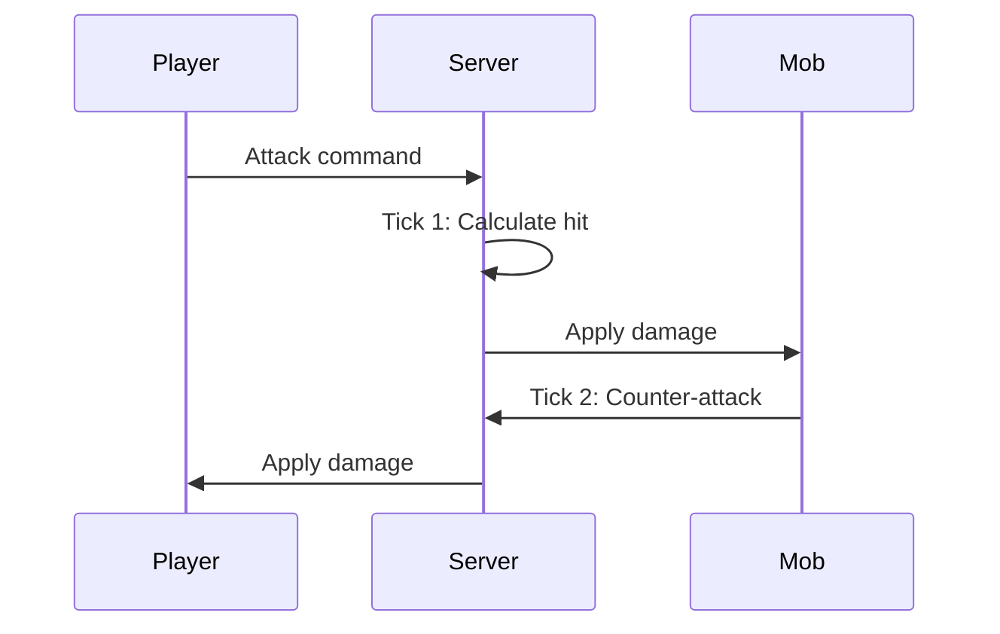

## Overview

Hyperscape uses RuneScape-style tick-based combat with authentic mechanics including attack styles, accuracy formulas, and damage calculations.

## Tick System

Combat operates on a **600ms tick** cycle, matching Old School RuneScape:

```typescript
// From packages/shared/src/constants/CombatConstants.ts
export const COMBAT_CONSTANTS = {
  MELEE_RANGE: 2,
  RANGED_RANGE: 10,
  ATTACK_COOLDOWN_MS: 2400,      // 2.4 seconds - standard weapon (4 ticks)
  COMBAT_TIMEOUT_MS: 10000,      // 10 seconds without attacks ends combat
  TICK_DURATION_MS: 600,         // 0.6 seconds per game tick
  BASE_CONSTANT: 64,             // Added to equipment bonuses
  EFFECTIVE_LEVEL_CONSTANT: 8,   // Added to effective levels
  DAMAGE_DIVISOR: 640,           // Used in max hit calculation
  MIN_DAMAGE: 0,                 // OSRS: Can hit 0 (miss)
  MAX_DAMAGE: 200,               // OSRS damage cap
};
```



## Combat Stats

| Stat | Purpose |
|------|---------|
| **Attack** | Accuracy, weapon requirements |
| **Strength** | Maximum hit, damage bonus |
| **Defense** | Evasion, armor requirements |
| **Constitution** | Health points |
| **Range** | Ranged accuracy and damage |

### Combat Level

Aggregate level calculated from combat stats:

```
Combat Level = (ATK + STR + DEF + CON) / 4 + Range / 8
```

## Attack Styles

Players choose how XP is distributed:

| Style | XP Gain |
|-------|---------|
| **Accurate** | Attack + Constitution |
| **Aggressive** | Strength + Constitution |
| **Defensive** | Defense + Constitution |
| **Controlled** | Equal split |

## Damage Calculation

The combat system uses OSRS-style formulas with equipment bonuses:

```typescript
// From packages/shared/src/systems/shared/combat/CombatSystem.ts
// CombatSystem extracts stats from entities:

// For players - get stats from components:
const statsComponent = attacker.getComponent("stats");
attackerData = {
  stats: {
    attack: stats.attack.level,    // Skill level
    strength: stats.strength.level,
    defense: stats.defense.level,
    ranged: stats.ranged.level,
  },
};

// For mobs - get stats from mob data:
const mobData = attackerMob.getMobData();
attackerData = {
  config: { attackPower: mobData.attackPower },
};

// Equipment bonuses from EquipmentSystem are added to damage
const equipmentStats = this.playerEquipmentStats.get(attacker.id);
const result = calculateDamage(attackerData, targetData, AttackType.MELEE, equipmentStats);
```

### OSRS Constants

```typescript
// From CombatConstants.ts
BASE_CONSTANT: 64,             // Added to equipment bonuses in formulas
EFFECTIVE_LEVEL_CONSTANT: 8,   // Added to effective levels
DAMAGE_DIVISOR: 640,           // Used in max hit calculation
```

## Ranged Combat

Ranged attacks require:

- Bow equipped in weapon slot
- Arrows equipped in arrow slot
- Arrows consumed on each attack

<Warning>
  Without arrows, the bow cannot attack. Arrows are not recoverable.
</Warning>

## Death Mechanics

When health reaches zero:

1. Items drop at death location (headstone)
2. Player respawns at nearest starter town
3. Headstone persists for item retrieval
4. Other players cannot loot your headstone

## Mob Aggression

```typescript
// From packages/shared/src/constants/CombatConstants.ts
export const AGGRO_CONSTANTS = {
  DEFAULT_BEHAVIOR: "passive",
  AGGRO_UPDATE_INTERVAL_MS: 100,
  ALWAYS_AGGRESSIVE_LEVEL: 999, // Ignores level differences
  MOB_BEHAVIORS: {
    default: {
      behavior: "passive",
      detectionRange: 5,
      leashRange: 10,
      levelIgnoreThreshold: 0,
    },
  },
};
```

| Behavior | Description |
|----------|-------------|
| **Passive** | Never attacks first |
| **Aggressive** | Attacks players in range |
| **Level-gated** | Ignores players above threshold |
| **Always Aggressive** | Attacks regardless of level (levelIgnoreThreshold: 999) |

### Aggro Range

Each mob has a `detectionRange`. Entering this range triggers combat for aggressive mobs.

### Chase Behavior

Mobs return to spawn point if player escapes their `leashRange`.

## Loot System

On mob death:

| Drop Type | Behavior |
|-----------|----------|
| **Guaranteed** | Coins (always drop) |
| **Common** | Basic items |
| **Uncommon** | Equipment matching mob tier |
| **Rare** | Higher-tier equipment |

Drop tables are defined in `packages/shared/src/data/npcs.ts`.

---

## Duel Arena (PvP)

Hyperscape features a **player-vs-player dueling system** with customizable rules and stakes:

### Duel Features

- **Customizable Rules**: Toggle 10 combat restrictions (no ranged, no food, no forfeit, etc.)
- **Equipment Restrictions**: Disable specific equipment slots
- **Stakes**: Bet inventory items on the outcome
- **6 Arenas**: Dedicated combat zones with wall collision
- **Anti-Scam Protection**: Acceptance resets when stakes change
- **Disconnect Handling**: 30-second grace period during combat

### Duel Flow

1. **Challenge** — Player A challenges Player B (must be in Duel Arena zone)
2. **Rules** — Both players negotiate combat rules and equipment restrictions
3. **Stakes** — Both players add items to stake
4. **Confirm** — Read-only review before combat
5. **Countdown** — 3-2-1-FIGHT! (players frozen and teleported to arena)
6. **Combat** — Fight until death or forfeit
7. **Resolution** — Winner receives all stakes, both players restored to full health

<Info>
See [Duel Arena System](/wiki/game-systems/duel-arena) for complete documentation including network protocol, server architecture, and testing.
</Info>
