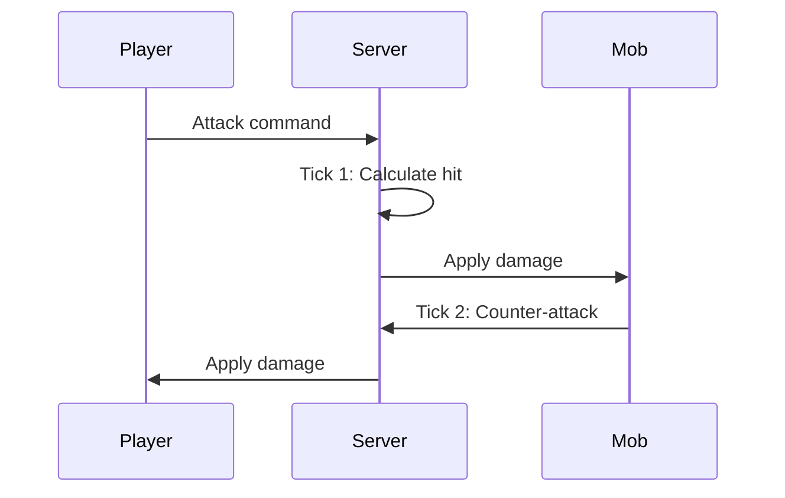

## Overview

Hyperscape uses RuneScape-style tick-based combat with authentic mechanics including attack styles, accuracy formulas, and damage calculations.

## Tick System

Combat operates on a **600ms tick** cycle, matching Old School RuneScape:

```typescript
// From packages/shared/src/constants/CombatConstants.ts
export const COMBAT_CONSTANTS = {
  MELEE_RANGE: 2,
  RANGED_RANGE: 10,
  ATTACK_COOLDOWN_MS: 2400,      // 2.4 seconds - standard weapon (4 ticks)
  COMBAT_TIMEOUT_MS: 10000,      // 10 seconds without attacks ends combat
  TICK_DURATION_MS: 600,         // 0.6 seconds per game tick
  BASE_CONSTANT: 64,             // Added to equipment bonuses
  EFFECTIVE_LEVEL_CONSTANT: 8,   // Added to effective levels
  DAMAGE_DIVISOR: 640,           // Used in max hit calculation
  MIN_DAMAGE: 0,                 // OSRS: Can hit 0 (miss)
  MAX_DAMAGE: 200,               // OSRS damage cap
};
```



## Combat Stats

| Stat | Purpose |
|------|---------|
| **Attack** | Accuracy, weapon requirements |
| **Strength** | Maximum hit, damage bonus |
| **Defense** | Evasion, armor requirements |
| **Constitution** | Health points |
| **Range** | Ranged accuracy and damage |

### Combat Level

Aggregate level calculated from combat stats:

```
Combat Level = (ATK + STR + DEF + CON) / 4 + Range / 8
```

## Attack Styles

Players choose how XP is distributed:

| Style | XP Gain |
|-------|---------|
| **Accurate** | Attack + Constitution |
| **Aggressive** | Strength + Constitution |
| **Defensive** | Defense + Constitution |
| **Controlled** | Equal split |

## Damage Calculation

The combat system uses OSRS-style formulas with equipment bonuses:

```typescript
// From packages/shared/src/systems/shared/combat/CombatSystem.ts
// CombatSystem extracts stats from entities:

// For players - get stats from components:
const statsComponent = attacker.getComponent("stats");
attackerData = {
  stats: {
    attack: stats.attack.level,    // Skill level
    strength: stats.strength.level,
    defense: stats.defense.level,
    ranged: stats.ranged.level,
  },
};

// For mobs - get stats from mob data:
const mobData = attackerMob.getMobData();
attackerData = {
  config: { attackPower: mobData.attackPower },
};

// Equipment bonuses from EquipmentSystem are added to damage
const equipmentStats = this.playerEquipmentStats.get(attacker.id);
const result = calculateDamage(attackerData, targetData, AttackType.MELEE, equipmentStats);
```

### OSRS Constants

```typescript
// From CombatConstants.ts
BASE_CONSTANT: 64,             // Added to equipment bonuses in formulas
EFFECTIVE_LEVEL_CONSTANT: 8,   // Added to effective levels
DAMAGE_DIVISOR: 640,           // Used in max hit calculation
```

## Ranged Combat

Ranged combat is now fully implemented with OSRS-accurate mechanics for bows and arrows.

### Requirements

- **Bow** equipped in weapon slot
- **Arrows** equipped in ammo slot
- Arrows consumed on each attack (100% consumption, no Ava's device yet)

### Combat Styles

| Style | Speed | Accuracy | Range | XP Split |
|-------|-------|----------|-------|----------|
| **Accurate** | Base | +3 Ranged | Normal | Ranged + Constitution |
| **Rapid** | -1 tick | Normal | Normal | Ranged + Constitution |
| **Longrange** | Base | Normal | +2 tiles | Ranged + Defense + Constitution |

### Damage Formula

```typescript
// Effective Ranged Level
const effectiveRanged = floor(rangedLevel * prayerBonus) + styleBonus + 8;

// Max Hit
const maxHit = floor(0.5 + effectiveRanged * (rangedStrength + 64) / 640);

// rangedStrength comes from equipped arrows
```

### Projectile System

Ranged attacks use a projectile system with OSRS-accurate hit delays:

```typescript
// Hit delay formula: 1 + floor((3 + distance) / 6)
const hitDelayTicks = 1 + Math.floor((3 + distance) / 6);
```

Projectiles are rendered as 3D arrow meshes that travel from attacker to target.

<Warning>
  Without arrows, the bow cannot attack. Arrows are consumed on every shot (100% loss rate).
</Warning>

## Magic Combat

Magic combat allows spellcasting with or without a staff equipped.

### Requirements

- **Magic level** sufficient for the spell
- **Runes** in inventory (or infinite runes from elemental staff)
- **Spell selected** for autocast (optional)

### Combat Styles

| Style | Accuracy | Range | XP Split |
|-------|----------|-------|----------|
| **Accurate** | +3 Magic | Normal | Magic + Constitution |
| **Longrange** | +1 Magic | +2 tiles | Magic + Defense + Constitution |
| **Autocast** | Normal | Normal | Magic + Constitution |

### Spells (F2P)

**Strike Tier (Levels 1-13):**
- Wind Strike (L1): 2 max hit
- Water Strike (L5): 4 max hit
- Earth Strike (L9): 6 max hit
- Fire Strike (L13): 8 max hit

**Bolt Tier (Levels 17-35):**
- Wind Bolt (L17): 9 max hit
- Water Bolt (L23): 10 max hit
- Earth Bolt (L29): 11 max hit
- Fire Bolt (L35): 12 max hit

### Damage Formula

```typescript
// Effective Magic Level
const effectiveMagic = floor(magicLevel * prayerBonus) + styleBonus + 8;

// Max Hit = spell base damage (no equipment modifiers in F2P)
const maxHit = spellBaseMaxHit;
```

### Magic Defense

Magic defense uses a unique formula combining Magic and Defense levels:

```typescript
// For players
const effectiveDefense = floor(0.7 * magicLevel + 0.3 * defenseLevel) + 9;

// For NPCs
const effectiveDefense = magicLevel + 9;
```

### Rune Consumption

Runes are consumed on each cast. Elemental staves provide infinite runes:

- **Staff of Air**: Infinite air runes
- **Staff of Water**: Infinite water runes
- **Staff of Earth**: Infinite earth runes
- **Staff of Fire**: Infinite fire runes

### Autocast

Players can select a spell for autocast, which automatically casts that spell when attacking:

```typescript
// Set autocast spell
world.network.send("setAutocast", { spellId: "fire_strike" });

// Clear autocast
world.network.send("setAutocast", { spellId: null });
```

### Projectile Visuals

Magic spells render as colored orbs with element-specific colors:

- **Wind**: Light gray/white
- **Water**: Blue
- **Earth**: Brown
- **Fire**: Orange-red

Projectiles use OSRS-accurate hit delay formula:

```typescript
// Hit delay formula: 1 + floor((1 + distance) / 3)
const hitDelayTicks = 1 + Math.floor((1 + distance) / 3);
```

## Death Mechanics

When health reaches zero:

1. Items drop at death location (headstone)
2. Player respawns at nearest starter town
3. Headstone persists for item retrieval
4. Other players cannot loot your headstone

## Mob Aggression

```typescript
// From packages/shared/src/constants/CombatConstants.ts
export const AGGRO_CONSTANTS = {
  DEFAULT_BEHAVIOR: "passive",
  AGGRO_UPDATE_INTERVAL_MS: 100,
  ALWAYS_AGGRESSIVE_LEVEL: 999, // Ignores level differences
  MOB_BEHAVIORS: {
    default: {
      behavior: "passive",
      detectionRange: 5,
      leashRange: 10,
      levelIgnoreThreshold: 0,
    },
  },
};
```

| Behavior | Description |
|----------|-------------|
| **Passive** | Never attacks first |
| **Aggressive** | Attacks players in range |
| **Level-gated** | Ignores players above threshold |
| **Always Aggressive** | Attacks regardless of level (levelIgnoreThreshold: 999) |

### Aggro Range

Each mob has a `detectionRange`. Entering this range triggers combat for aggressive mobs.

### Chase Behavior

Mobs return to spawn point if player escapes their `leashRange`.

## Loot System

On mob death:

| Drop Type | Behavior |
|-----------|----------|
| **Guaranteed** | Coins (always drop) |
| **Common** | Basic items |
| **Uncommon** | Equipment matching mob tier |
| **Rare** | Higher-tier equipment |

Drop tables are defined in `packages/shared/src/data/npcs.ts`.
