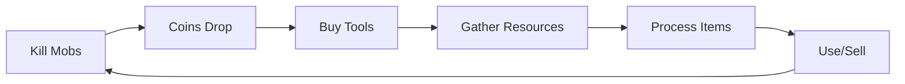

## Overview

Hyperscape features a player-driven economy with banking, shops, loot drops, and item trading.

## Currency

**Coins** are the universal currency:

- Dropped by all mobs
- Used to purchase from shops
- Stackable in inventory

## Inventory

### Capacity

- **28 slots** in active inventory
- Items must be managed carefully
- Stackable items (coins, arrows) share a slot

### Item Properties

| Property | Description |
|----------|-------------|
| **Stackable** | Multiple units per slot |
| **Tradeable** | Can be exchanged |
| **Weight** | Affects run energy |
| **Requirements** | Level gates for use |

## Banking

### Features

- Unlimited storage slots
- Accessible at bank locations in starter towns
- Each bank is independent (no shared storage)

### Operations

- **Deposit**: Move items from inventory to bank
- **Withdraw**: Move items from bank to inventory
- **Organize**: Drag to rearrange

<Info>
  Banks are safe storage—items cannot be lost from banks.
</Info>

## Shops

### General Store

Available in all starter towns:

| Item | Price |
|------|-------|
| Bronze Hatchet | 50 coins |
| Fishing Rod | 25 coins |
| Tinderbox | 15 coins |
| Arrows (10) | 20 coins |

### Shop Mechanics

- Stock replenishes over time
- Prices are fixed
- Sell items back for reduced value

## Loot Drops

### Mob Drops

All mobs drop loot on death:

| Mob Tier | Typical Drops |
|----------|---------------|
| Level 1 | Coins, bronze equipment (rare) |
| Level 2 | More coins, steel equipment (uncommon) |
| Level 3 | Substantial coins, mithril equipment (uncommon) |

### Drop Tables

Configured in `packages/shared/src/data/npcs.ts`:

```typescript
drops: [
  { itemId: "coins", quantity: [5, 20], chance: 1.0 },
  { itemId: "steel_sword", quantity: 1, chance: 0.1 }
]
```

## Economy Flow



## Item Tiers

### Weapons

| Tier | Attack Req | Examples |
|------|------------|----------|
| Bronze | 1 | Bronze Sword |
| Steel | 10 | Steel Sword |
| Mithril | 20 | Mithril Sword |

### Armor

| Tier | Defense Req | Slots |
|------|-------------|-------|
| Leather | 1 | Helmet, Body, Legs |
| Steel | 10 | Helmet, Body, Legs |
| Mithril | 20 | Helmet, Body, Legs |

### Bows

| Tier | Range Req | Type |
|------|-----------|------|
| Wood | 1 | Shortbow |
| Oak | 10 | Oak Bow |
| Willow | 20 | Willow Bow |

## Future Features

<Info>
  Player-to-player trading and a Grand Exchange are planned but not in MVP scope.
</Info>
