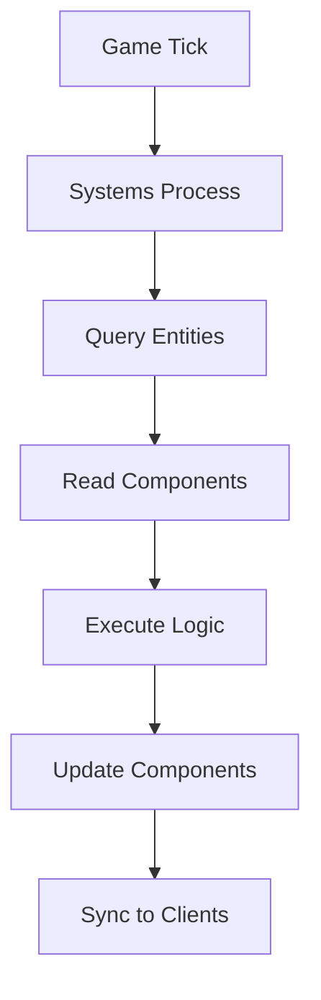

## Overview

Hyperscape uses an Entity Component System (ECS) architecture for all game logic. This pattern separates data from behavior, making the codebase modular and extensible.

## Core Concepts

### Entities

Entities are game objects with 3D representation, networking, physics, and component-based architecture:

```typescript
// From packages/shared/src/entities/Entity.ts (lines 7-13)
// Key Features:
// - **3D Representation**: Three.js Object3D with mesh, position, rotation, scale
// - **Component System**: Modular components for combat, stats, interaction, etc.
// - **Physics**: Optional PhysX rigid body integration
// - **Networking**: State synchronization across clients
// - **Lifecycle**: spawn(), update(), fixedUpdate(), destroy()
```

Examples: Players, Mobs, Items, Resources, NPCs, Headstones

### Components

Components are registered data containers. Hyperscape uses a component factory system:

```typescript
// From packages/shared/src/entities/Entity.ts (lines 17-23)
// Component Architecture:
// - CombatComponent: Health, attack, defense
// - StatsComponent: Skills, levels, XP
// - InteractionComponent: Player interaction handlers
// - DataComponent: Custom data storage
// - UsageComponent: Item usage logic
// - VisualComponent: 3D model, materials, animations
```

| Component | Data |
|-----------|------|
| `transform` | Position, rotation, scale (auto-added) |
| `health` | Current/max HP, regeneration rate, isDead |
| `combat` | Attack style, target, cooldown, range |
| `stats` | All skills with levels and XP |
| `inventory` | 28 item slots with quantities |
| `equipment` | Weapon, armor slots |
| `movement` | Speed, destination, path, isRunning |
| `stamina` | Current/max, drain/regen rates |

### Systems

Systems contain all game logic. They query entities by component and process them each tick.

| System | Responsibility |
|--------|----------------|
| `CombatSystem` | Damage calculation, hit rolls |
| `MovementSystem` | Pathfinding, position updates |
| `SkillSystem` | XP gain, level calculations |
| `InventorySystem` | Item management |
| `PersistenceSystem` | Database saves |

## Why ECS?

### Composition Over Inheritance

Instead of deep class hierarchies, entities gain capabilities by adding components:

```
Player = Entity + Position + Health + Inventory + Stats + Combat
Tree = Entity + Position + Resource + Harvestable
```

### Performance

Systems process entities in batches, enabling efficient updates for many game objects.

**Recent Optimizations:**
- **GPU-Instanced Particles** (PR #877): Centralized particle system with 97% draw call reduction
  - Fishing spots: ~150 → 4 draw calls per spot
  - FPS improvement: 65-70 → 120 on reference hardware (80% increase)
  - ~450 lines of CPU animation code eliminated
  - GPU-driven particle updates via TSL shaders (zero CPU overhead)
  - ParticleManager architecture with specialized sub-managers
  - See [Particle System](/packages/shared#particle-system) for details
- **Raycast Proxy**: Invisible capsule meshes for instant entity click detection (~700-1800ms improvement over VRM SkinnedMesh raycast)
- **Event-Driven Health**: Client health bars use events instead of polling (eliminates race conditions)
- **React Optimizations**: `useMemo` and `useCallback` in InventoryPanel for render efficiency
- **Map-Based Tracking**: O(1) lookups for eat delay and attack cooldown management
- **Model Normalization**: Scale normalization runs once at load time, before caching

### Flexibility

Add new features by creating new components and systems without modifying existing code.

## Data Flow



## Working with ECS

### Adding Components

```typescript
// From packages/shared/src/entities/Entity.ts (lines 409-446)
addComponent<T extends Component = Component>(
  type: string,
  data?: Record<string, unknown>,
): T {
  const component = createComponent(type, this, data);
  this.components.set(type, component);
  if (component.init) component.init();
  return component as T;
}
```

### Getting Components

```typescript
// Get component with type safety
const healthComponent = entity.getComponent<HealthComponent>('health');
if (healthComponent?.data) {
  const currentHealth = healthComponent.data.current;
}

// Check if entity has component
if (entity.hasComponent('combat')) {
  // Entity can fight
}
```

### Entity Lifecycle

```typescript
// From packages/shared/src/entities/Entity.ts (lines 40-46)
// Lifecycle:
// 1. Constructor: Creates entity with initial data/config
// 2. spawn(): Called when entity is added to world (override in subclasses)
// 3. update(delta): Called every frame for visual updates
// 4. fixedUpdate(delta): Called at fixed timestep (30 FPS) for physics
// 5. destroy(): Cleanup when entity is removed
```

### Network Synchronization

```typescript
// Mark entity as needing network sync
entity.markNetworkDirty();

// Get data for network transmission
const networkData = entity.getNetworkData();
```

## Key Files

| Location | Purpose |
|----------|---------|
| `packages/shared/src/entities/` | Entity class definitions |
| `packages/shared/src/systems/` | System implementations |
| `packages/shared/src/components/` | Component definitions |

## Design Principles

1. **Entities are data containers**—no logic in entity classes
2. **Systems own all behavior**—logic lives in systems
3. **Components are plain objects**—no methods, just data
4. **Use existing systems**—don't create new ones without good reason
