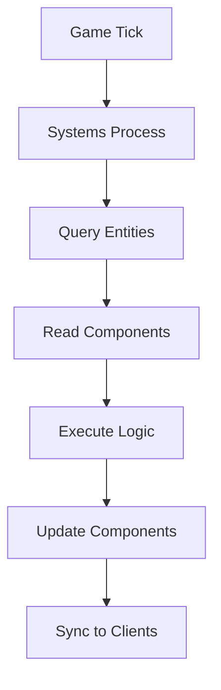

## Overview

Hyperscape uses an Entity Component System (ECS) architecture for all game logic. This pattern separates data from behavior, making the codebase modular and extensible.

## Core Concepts

### Entities

Entities are unique identifiers for game objects. They have no behavior or data themselves—just an ID.

Examples:
- Players
- Mobs (goblins, knights)
- Items (swords, logs)
- Resources (trees, fishing spots)
- Banks, shops

### Components

Components are pure data containers attached to entities. They define what an entity "has."

| Component | Data |
|-----------|------|
| `Position` | x, y, z coordinates |
| `Health` | current, max HP |
| `Inventory` | item slots |
| `Combat` | attack style, target |
| `Stats` | attack, strength, defense levels |

### Systems

Systems contain all game logic. They query entities by component and process them each tick.

| System | Responsibility |
|--------|----------------|
| `CombatSystem` | Damage calculation, hit rolls |
| `MovementSystem` | Pathfinding, position updates |
| `SkillSystem` | XP gain, level calculations |
| `InventorySystem` | Item management |
| `PersistenceSystem` | Database saves |

## Why ECS?

### Composition Over Inheritance

Instead of deep class hierarchies, entities gain capabilities by adding components:

```
Player = Entity + Position + Health + Inventory + Stats + Combat
Tree = Entity + Position + Resource + Harvestable
```

### Performance

Systems process entities in batches, enabling efficient updates for many game objects.

### Flexibility

Add new features by creating new components and systems without modifying existing code.

## Data Flow



## Working with ECS

### Getting Systems

```typescript
const combatSystem = world.getSystem('combat') as CombatSystem;
```

### Querying Entities

```typescript
const players = world.getEntitiesByType('Player');
const mobs = world.getEntitiesWithComponent('Combat');
```

### Event Handling

```typescript
world.on('inventory:add', (event: InventoryAddEvent) => {
  // Handle item added to inventory
});
```

## Key Files

| Location | Purpose |
|----------|---------|
| `packages/shared/src/entities/` | Entity class definitions |
| `packages/shared/src/systems/` | System implementations |
| `packages/shared/src/components/` | Component definitions |

## Design Principles

1. **Entities are data containers**—no logic in entity classes
2. **Systems own all behavior**—logic lives in systems
3. **Components are plain objects**—no methods, just data
4. **Use existing systems**—don't create new ones without good reason
