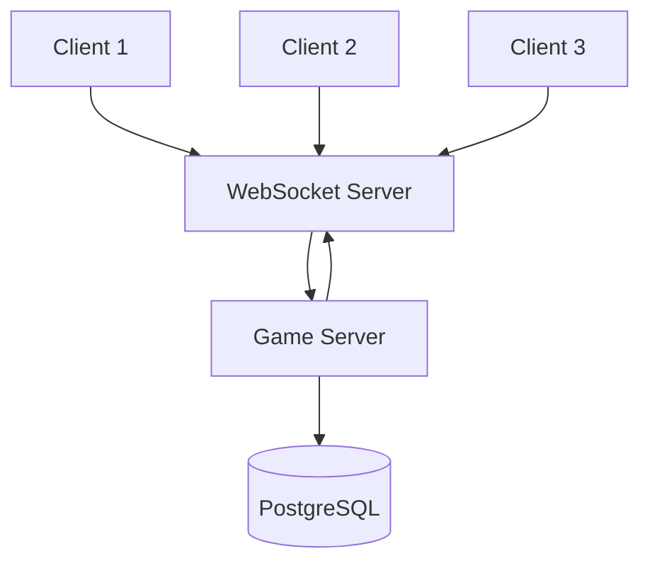

## Overview

Hyperscape is a real-time multiplayer game using WebSocket connections for low-latency communication between clients and the authoritative server.

## Network Architecture



## Server Authority

The server is the single source of truth:

| Responsibility | Location |
|----------------|----------|
| Combat calculations | Server |
| Item transactions | Server |
| XP and leveling | Server |
| Position validation | Server |
| Rendering | Client |
| Input collection | Client |

<Info>
  Clients predict movement locally but server corrects if needed.
</Info>

## Entity Synchronization

### Sync Flow

1. Server processes game tick
2. Entity changes collected
3. Delta updates sent to clients
4. Clients apply updates to local state

### Sync Data

| Data | Frequency |
|------|-----------|
| Position | Every tick (600ms) |
| Health | On change |
| Equipment | On change |
| Inventory | On change |
| Chat | Immediate |

## WebSocket Protocol

### Connection

```typescript
const ws = new WebSocket("wss://server/game");
ws.onmessage = (event) => {
  const message = JSON.parse(event.data);
  handleMessage(message);
};
```

### Message Types

| Type | Direction | Purpose |
|------|-----------|---------|
| `sync` | Server → Client | Entity updates |
| `action` | Client → Server | Player commands |
| `chat` | Bidirectional | Chat messages |
| `event` | Server → Client | Game events |

## Persistence

### Database Schema

Player data stored in PostgreSQL:

| Table | Data |
|-------|------|
| `players` | Account info, stats |
| `inventory` | Items owned |
| `bank` | Banked items |
| `skills` | XP and levels |

### Save Strategy

- **Immediate**: Critical changes (item transactions)
- **Periodic**: Stats, position (every 30 seconds)
- **On disconnect**: Full state save

## Authentication

Using [Privy](https://privy.io) for identity:

1. Client authenticates with Privy
2. JWT token sent to server
3. Server validates token
4. Session established

<Warning>
  Without Privy credentials, each session creates a new anonymous identity.
</Warning>

## LiveKit Integration

Optional voice chat via [LiveKit](https://livekit.io):

- Spatial audio based on position
- Push-to-talk or voice activation
- Server-managed rooms

Configure with `LIVEKIT_API_KEY` and `LIVEKIT_API_SECRET`.

## Scalability

### Current Architecture

- Single server instance
- All players in shared world
- SQLite for development, PostgreSQL for production

### Future Considerations

- Multiple server instances
- Zone-based sharding
- Load balancing

## Network Files

| Location | Purpose |
|----------|---------|
| `packages/shared/src/core/` | Networking core |
| `packages/server/src/` | Server implementation |
| `packages/client/src/lib/` | Client networking |
