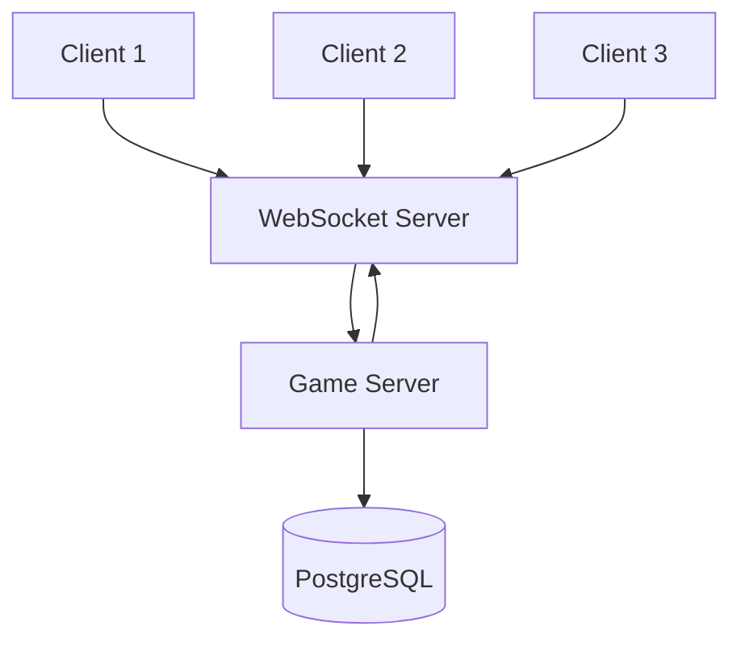

## Overview

Hyperscape is a real-time multiplayer game using WebSocket connections for low-latency communication between clients and the authoritative server.

## Network Architecture



## Server Authority

The server is the single source of truth:

| Responsibility | Location |
|----------------|----------|
| Combat calculations | Server |
| Item transactions | Server |
| XP and leveling | Server |
| Position validation | Server |
| Rendering | Client |
| Input collection | Client |

<Info>
  Clients predict movement locally but server corrects if needed.
</Info>

## Entity Synchronization

```typescript
// From packages/shared/src/constants/GameConstants.ts
export const NETWORK_CONSTANTS = {
  UPDATE_RATE: 20,                // 20 Hz (50ms)
  INTERPOLATION_DELAY: 100,       // milliseconds
  MAX_PACKET_SIZE: 1024,
  POSITION_SYNC_THRESHOLD: 0.1,   // meters
  ROTATION_SYNC_THRESHOLD: 0.1,   // radians
} as const;
```

### Sync Flow

1. Server processes game tick (600ms)
2. Entity changes collected via `markNetworkDirty()`
3. Delta updates sent to clients at 20 Hz
4. Clients apply updates and interpolate

### Entity Network Data

```typescript
// From packages/shared/src/entities/Entity.ts (lines 1400-1449)
getNetworkData(): Record<string, unknown> {
  return {
    id: this.id,
    type: this.type,
    name: this.name,
    position,
    rotation,
    scale,
    visible: this.node.visible,
    networkVersion: this.networkVersion,
    properties: this.config.properties || {},
    ...dataFields, // emote, inCombat, combatTarget, health
  };
}
```

### Sync Data

| Data | Frequency |
|------|-----------|
| Position | Every tick (600ms), threshold 0.1m |
| Rotation | On change, threshold 0.1 rad |
| Health | On change (immediate) |
| Equipment | On change |
| Inventory | On change |
| Combat state | On change |
| Chat | Immediate |

### Equipment Synchronization

Equipment visibility is synchronized across all players with proper VRM avatar loading:

```typescript
// From character-selection.ts
// Send existing players' equipment to the new player
const equipSys = world.getSystem("equipment");
if (equipSys?.getPlayerEquipment && world.entities?.items) {
  for (const [entityId, entity] of world.entities.items.entries()) {
    if (entityId !== socket.player.id && entity.type === "player") {
      const eq = equipSys.getPlayerEquipment(entityId);
      if (eq) {
        sendToFn(socket.id, "equipmentUpdated", {
          playerId: entityId,
          equipment: eq,
        });
      }
    }
  }
}

// Broadcast this player's equipment to all other players
if (Object.keys(equipmentData).length > 0) {
  sendFn("equipmentUpdated", {
    playerId: socket.player.id,
    equipment: equipmentData,
  }, socket.id);
}
```

**Equipment Sync Flow:**
1. **On player join**: Server sends existing players' equipment to joiner
2. **On player join**: Server broadcasts joiner's equipment to all other players
3. **On equipment change**: Server broadcasts update to all nearby players
4. **On reconnect**: Server re-sends all equipment (packets may be lost during disconnect)

**VRM Avatar Loading:**

Equipment is cached and replayed when VRM avatars finish loading:

```typescript
// From EquipmentVisualSystem.ts
// Subscribe to AVATAR_LOAD_COMPLETE to replay cached equipment
this.subscribe(EventType.AVATAR_LOAD_COMPLETE, (data) => {
  if (!data.success) return;

  // Replay pending equipment from queue
  const pending = this.pendingEquipment.get(data.playerId);
  if (pending && pending.length > 0) {
    for (const { slot, itemId } of pending) {
      this.handleEquipmentChange({ playerId: data.playerId, slot, itemId });
    }
  }

  // Safety net: replay from network cache
  const cached = network?.lastEquipmentByPlayerId?.[data.playerId];
  if (cached) {
    for (const slot of EQUIPMENT_SLOT_NAMES) {
      const itemId = cached[slot]?.itemId || cached[slot]?.item?.id;
      if (itemId && String(itemId) !== "0") {
        this.handleEquipmentChange({ playerId: data.playerId, slot, itemId });
      }
    }
  }
});
```

**Equipment Slot Coverage:**

The system now uses all 11 equipment slots instead of hardcoded 6:

```typescript
// From EquipmentConstants.ts
export const EQUIPMENT_SLOT_NAMES = [
  "weapon", "shield", "helmet", "body", "legs", "gloves", "boots",
  "cape", "amulet", "ring", "arrows"
];
```

**Avatar Helper:**

The `getAvatar()` helper resolves VRM from both `PlayerLocal` and `PlayerRemote`:

```typescript
// PlayerLocal exposes VRM via _avatar getter
// PlayerRemote stores VRM in avatar property
function getAvatar(player: PlayerWithAvatar): AvatarLike | undefined {
  return player._avatar || player.avatar;
}
```

This ensures equipment visuals work correctly for both local and remote players.

### Position Synchronization

Player positions are synchronized with spatial index updates to ensure proper network visibility:

```typescript
// From ServerNetwork/index.ts
// Update spatial index after teleport/respawn
this.spatialIndex.updatePlayerPosition(playerId, position.x, position.z);

// CRITICAL: Without this, sendToNearby() uses stale position
// Post-teleport tile movement broadcasts (e.g., combat follow) won't reach
// players whose spatial index is still at their pre-teleport position
```

**Spatial Index Integration:**

The spatial index tracks player positions for efficient `sendToNearby()` queries:

```typescript
// Update spatial index on position changes
this.spatialIndex.updatePlayerPosition(playerId, position.x, position.z);

// Send messages to nearby players only
this.sendToNearby(position, "entityModified", data);
```

**Critical Fixes (PR #875):**
- Spatial index now updated after teleport (fixes invisible combat movement in duels)
- Spatial index updated after respawn (fixes missing entity broadcasts)
- Authoritative position broadcast to all players on join (fixes initial transform sync)

### Remote Avatar Transform Sync

Remote player avatars are positioned and animated **before** being made visible to prevent T-pose flashing:

```typescript
// From PlayerRemote.ts
// CRITICAL: Sync base transform and position the avatar BEFORE making it visible.
// Without this, the avatar appears at (0,0,0) in T-pose for one frame because
// instance.move() normally only runs in update() on the next frame.
this.base.position.copy(this.node.position);
this.base.quaternion.copy(this.node.quaternion);
this.base.updateTransform();

if (avatarWithInstance.instance?.move) {
  avatarWithInstance.instance.move(this.base.matrixWorld);
}
if (avatarWithInstance.instance?.update) {
  avatarWithInstance.instance.update(0);
}

// NOW make avatar visible — it's already positioned and in idle pose
if (this.avatar?.instance?.raw?.scene) {
  this.avatar.instance.raw.scene.visible = true;
}
```

**Before Fix**: VRM avatar set to `visible=true` before `instance.move()` positioned it, causing one frame of T-pose at (0,0,0)

**After Fix**: Avatar positioned and animated into idle pose before visibility enabled

**Quaternion Sync:**

Remote player quaternions are now properly synced to prevent sideways-facing avatars:

```typescript
// Sync both position AND rotation to base transform
this.base.position.copy(this.lerpPosition.value);
this.base.quaternion.copy(this.lerpQuaternion.value);  // Added
this.node.quaternion.copy(this.lerpQuaternion.value);
this.base.updateTransform();
```

**Before Fix**: `base.quaternion` not synced, causing remote players to face sideways

**After Fix**: Both position and quaternion synced to base transform for correct orientation

## WebSocket Protocol

### Connection

```typescript
const ws = new WebSocket("wss://server/game");
ws.onmessage = (event) => {
  const message = JSON.parse(event.data);
  handleMessage(message);
};
```

### Message Types

| Type | Direction | Purpose |
|------|-----------|---------|
| `sync` | Server → Client | Entity updates |
| `action` | Client → Server | Player commands |
| `chat` | Bidirectional | Chat messages |
| `event` | Server → Client | Game events |

## Persistence

### Database Schema

Player data stored in PostgreSQL using Drizzle ORM:

```typescript
// From packages/server/src/database/schema.ts
// Key tables for persistence:

export const users = pgTable("users", {
  id: text("id").primaryKey(),
  name: text("name").notNull(),
  privyUserId: text("privyUserId").unique(),
  farcasterFid: text("farcasterFid"),
  wallet: text("wallet"),
});

export const characters = pgTable("characters", {
  id: text("id").primaryKey(),
  accountId: text("accountId").notNull(),
  // All skill levels and XP columns
  // Position, health, coins
  // Combat preferences
});

export const inventory = pgTable("inventory", {
  id: serial("id").primaryKey(),
  playerId: text("playerId").references(() => characters.id),
  itemId: text("itemId").notNull(),
  quantity: integer("quantity").default(1),
  slotIndex: integer("slotIndex").default(-1),
});

export const equipment = pgTable("equipment", {
  id: serial("id").primaryKey(),
  playerId: text("playerId").references(() => characters.id),
  slotType: text("slotType").notNull(),
  itemId: text("itemId"),
});
```

| Table | Data |
|-------|------|
| `users` | Account info, Privy/Farcaster IDs |
| `characters` | Full character with all skills |
| `inventory` | 28-slot item storage |
| `equipment` | Worn items by slot |
| `playerDeaths` | Death locks (anti-dupe) |
| `npcKills` | Kill statistics |

### Save Strategy

- **Immediate**: Critical changes (item transactions)
- **Periodic**: Stats, position (every 30 seconds)
- **On disconnect**: Full state save

## Authentication

Using [Privy](https://privy.io) for identity:

1. Client authenticates with Privy
2. JWT token sent to server
3. Server validates token
4. Session established

<Warning>
  Without Privy credentials, each session creates a new anonymous identity.
</Warning>

## LiveKit Integration

Optional voice chat via [LiveKit](https://livekit.io):

- Spatial audio based on position
- Push-to-talk or voice activation
- Server-managed rooms

Configure with `LIVEKIT_API_KEY` and `LIVEKIT_API_SECRET`.

## Scalability

### Current Architecture

- Single server instance
- All players in shared world
- SQLite for development, PostgreSQL for production

### Future Considerations

- Multiple server instances
- Zone-based sharding
- Load balancing

## Network Files

| Location | Purpose |
|----------|---------|
| `packages/shared/src/core/` | Networking core, World class |
| `packages/server/src/systems/ServerNetwork/` | Server WebSocket handling |
| `packages/server/src/systems/ServerNetwork/handlers/` | Message handlers |
| `packages/server/src/systems/ServerNetwork/authentication.ts` | Privy auth |
| `packages/server/src/systems/ServerNetwork/character-selection.ts` | Character handling |
| `packages/server/src/systems/ServerNetwork/movement.ts` | Position sync |
| `packages/server/src/systems/ServerNetwork/broadcast.ts` | Message broadcasting |
| `packages/client/src/lib/` | Client networking |
