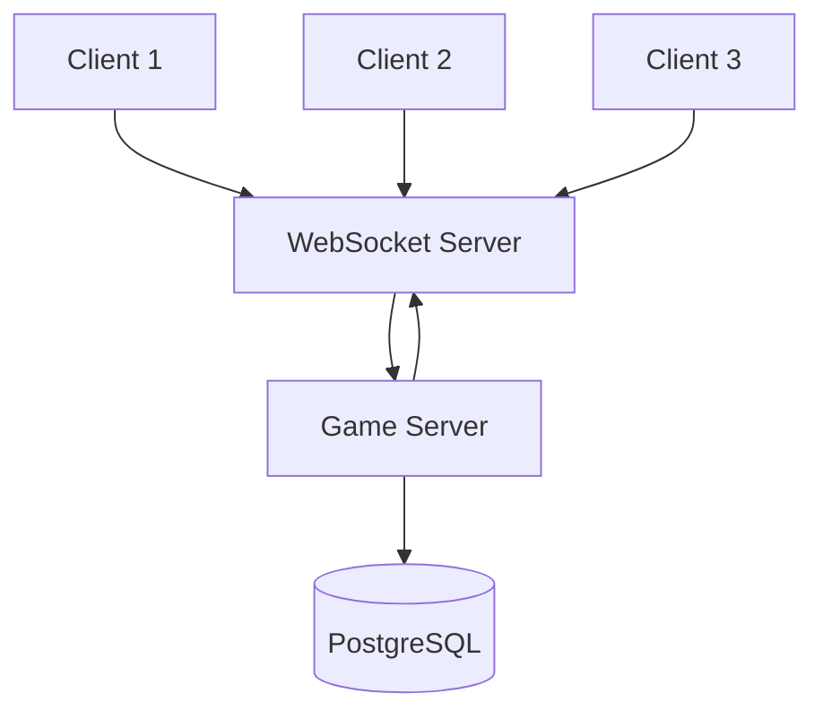

## Overview

Hyperscape is a real-time multiplayer game using WebSocket connections for low-latency communication between clients and the authoritative server.

## Network Architecture



## Server Authority

The server is the single source of truth:

| Responsibility | Location |
|----------------|----------|
| Combat calculations | Server |
| Item transactions | Server |
| XP and leveling | Server |
| Position validation | Server |
| Rendering | Client |
| Input collection | Client |

<Info>
  Clients predict movement locally but server corrects if needed.
</Info>

## Entity Synchronization

```typescript
// From packages/shared/src/constants/GameConstants.ts
export const NETWORK_CONSTANTS = {
  UPDATE_RATE: 20,                // 20 Hz (50ms)
  INTERPOLATION_DELAY: 100,       // milliseconds
  MAX_PACKET_SIZE: 1024,
  POSITION_SYNC_THRESHOLD: 0.1,   // meters
  ROTATION_SYNC_THRESHOLD: 0.1,   // radians
} as const;
```

### Sync Flow

1. Server processes game tick (600ms)
2. Entity changes collected via `markNetworkDirty()`
3. Delta updates sent to clients at 20 Hz
4. Clients apply updates and interpolate

### Entity Network Data

```typescript
// From packages/shared/src/entities/Entity.ts (lines 1400-1449)
getNetworkData(): Record<string, unknown> {
  return {
    id: this.id,
    type: this.type,
    name: this.name,
    position,
    rotation,
    scale,
    visible: this.node.visible,
    networkVersion: this.networkVersion,
    properties: this.config.properties || {},
    ...dataFields, // emote, inCombat, combatTarget, health
  };
}
```

### Sync Data

| Data | Frequency |
|------|-----------|
| Position | Every tick (600ms), threshold 0.1m |
| Rotation | On change, threshold 0.1 rad |
| Health | On change (immediate) |
| Equipment | On change |
| Inventory | On change |
| Combat state | On change |
| Chat | Immediate |

## WebSocket Protocol

### Connection

```typescript
const ws = new WebSocket("wss://server/game");
ws.onmessage = (event) => {
  const message = JSON.parse(event.data);
  handleMessage(message);
};
```

### Message Types

| Type | Direction | Purpose |
|------|-----------|---------|
| `sync` | Server → Client | Entity updates |
| `action` | Client → Server | Player commands |
| `chat` | Bidirectional | Chat messages |
| `event` | Server → Client | Game events |

## Persistence

### Database Schema

Player data stored in PostgreSQL using Drizzle ORM:

```typescript
// From packages/server/src/database/schema.ts
// Key tables for persistence:

export const users = pgTable("users", {
  id: text("id").primaryKey(),
  name: text("name").notNull(),
  privyUserId: text("privyUserId").unique(),
  farcasterFid: text("farcasterFid"),
  wallet: text("wallet"),
});

export const characters = pgTable("characters", {
  id: text("id").primaryKey(),
  accountId: text("accountId").notNull(),
  // All skill levels and XP columns
  // Position, health, coins
  // Combat preferences
});

export const inventory = pgTable("inventory", {
  id: serial("id").primaryKey(),
  playerId: text("playerId").references(() => characters.id),
  itemId: text("itemId").notNull(),
  quantity: integer("quantity").default(1),
  slotIndex: integer("slotIndex").default(-1),
});

export const equipment = pgTable("equipment", {
  id: serial("id").primaryKey(),
  playerId: text("playerId").references(() => characters.id),
  slotType: text("slotType").notNull(),
  itemId: text("itemId"),
});
```

| Table | Data |
|-------|------|
| `users` | Account info, Privy/Farcaster IDs |
| `characters` | Full character with all skills |
| `inventory` | 28-slot item storage |
| `equipment` | Worn items by slot |
| `playerDeaths` | Death locks (anti-dupe) |
| `npcKills` | Kill statistics |
| `friendships` | Bidirectional friend relationships |
| `friend_requests` | Pending friend requests |
| `ignore_lists` | Blocked players |

### Save Strategy

- **Immediate**: Critical changes (item transactions)
- **Periodic**: Stats, position (every 30 seconds)
- **On disconnect**: Full state save

## Authentication

Using [Privy](https://privy.io) for identity:

1. Client authenticates with Privy
2. JWT token sent to server
3. Server validates token
4. Session established

<Warning>
  Without Privy credentials, each session creates a new anonymous identity.
</Warning>

## LiveKit Integration

Optional voice chat via [LiveKit](https://livekit.io):

- Spatial audio based on position
- Push-to-talk or voice activation
- Server-managed rooms

Configure with `LIVEKIT_API_KEY` and `LIVEKIT_API_SECRET`.

## Scalability

### Current Architecture

- Single server instance
- All players in shared world
- SQLite for development, PostgreSQL for production

### Future Considerations

- Multiple server instances
- Zone-based sharding
- Load balancing

## Network Files

| Location | Purpose |
|----------|---------|
| `packages/shared/src/core/` | Networking core, World class |
| `packages/server/src/systems/ServerNetwork/` | Server WebSocket handling |
| `packages/server/src/systems/ServerNetwork/handlers/` | Message handlers |
| `packages/server/src/systems/ServerNetwork/authentication.ts` | Privy auth |
| `packages/server/src/systems/ServerNetwork/character-selection.ts` | Character handling |
| `packages/server/src/systems/ServerNetwork/movement.ts` | Position sync |
| `packages/server/src/systems/ServerNetwork/broadcast.ts` | Message broadcasting |
| `packages/client/src/lib/` | Client networking |
