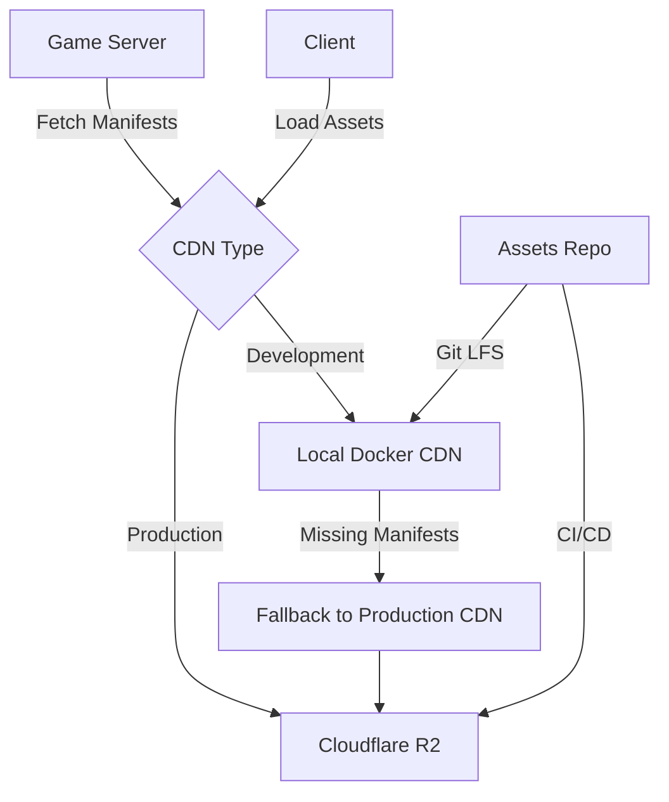

## Overview

Hyperscape uses a **CDN-based architecture** for serving game assets (3D models, textures, audio, manifests). The system supports local development with Docker nginx, production deployment to Cloudflare R2, and automatic fallback for incomplete local caches.

CDN code lives in:
- `scripts/cdn.mjs` - Local CDN Docker management
- `scripts/ensure-assets.mjs` - Asset download and LFS handling
- `packages/server/src/startup/config.ts` - Manifest fetching and validation

## Architecture



## Local Development CDN

### Docker nginx Setup

The local CDN runs in a Docker container serving from `packages/server/world/assets`:

```yaml
# packages/server/docker-compose.yml
services:
  cdn:
    image: nginx:alpine
    ports:
      - "8080:80"
    volumes:
      - ./world/assets:/usr/share/nginx/html:ro
```

### Starting the CDN

```bash
# Start CDN container
bun run cdn:up

# Restart with force-recreate (refreshes volume mounts)
bun run cdn

# Stop CDN
bun run cdn:down
```

**Force-recreate** is important when assets directory is replaced - it ensures volume mounts refresh.

### Asset Directory Structure

```
packages/server/world/assets/
├── manifests/              # JSON manifest files
│   ├── npcs.json
│   ├── items/
│   │   ├── weapons.json
│   │   ├── armor.json
│   │   ├── tools.json
│   │   ├── resources.json
│   │   ├── ammunition.json
│   │   ├── runes.json
│   │   ├── food.json
│   │   └── misc.json
│   ├── recipes/
│   │   ├── cooking.json
│   │   ├── crafting.json
│   │   ├── firemaking.json
│   │   ├── fletching.json
│   │   ├── runecrafting.json
│   │   ├── smelting.json
│   │   ├── smithing.json
│   │   └── tanning.json
│   ├── gathering/
│   │   ├── fishing.json
│   │   ├── mining.json
│   │   └── woodcutting.json
│   ├── quests.json
│   ├── world-areas.json
│   ├── duel-arenas.json
│   ├── combat-spells.json
│   ├── prayers.json
│   ├── stations.json
│   └── ...
├── world/                  # Environment assets
│   ├── base-environment.glb
│   └── day2-2k.jpg
├── models/                 # 3D models
│   ├── magic-staffs/       # Elemental staffs
│   │   ├── air-staff/
│   │   ├── earth-staff/
│   │   ├── fire-staff/
│   │   └── water-staff/
│   ├── mining-rocks/       # Mining resources
│   ├── bones/              # Bone drops
│   ├── coin-pile/          # Currency
│   └── ...
├── audio/                  # Sound effects and music
│   └── music/
│       ├── normal/
│       └── combat/
└── web/                    # PhysX WASM runtime
    ├── physx-js-webidl.wasm
    └── physx-js-webidl.js
```

## Manifest Validation

### Required Manifests

The server validates that critical manifests exist before starting:

```typescript
const requiredRootFiles = [
  "npcs.json",
  "world-areas.json",
  "biomes.json",
  "stores.json",
];

// Items manifest: either legacy single file OR full category directory
const hasItemsJson = await fs.pathExists("items.json");
const hasAllItemCategoryFiles = /* check items/*.json */;

if (!hasItemsJson && !hasAllItemCategoryFiles) {
  missing.push("items.json or items/{weapons,tools,resources,food,misc}.json");
}
```

### Validation Flow

```typescript
async function getMissingRequiredManifests(
  manifestsDir: string,
): Promise<string[]> {
  const missing: string[] = [];
  
  // Check required root files
  for (const file of requiredRootFiles) {
    const exists = await fs.pathExists(path.join(manifestsDir, file));
    if (!exists) {
      missing.push(file);
    }
  }
  
  // Check items manifest (legacy OR category files)
  // ...
  
  return missing;
}
```

If required manifests are missing, server throws error:

```typescript
throw new Error(
  `Missing required manifests: ${missing.join(", ")}. ` +
  `Ensure your CDN has /manifests populated or run 'bun install' to download assets.`,
);
```

## Production CDN Fallback

In development, if the local CDN is incomplete, the server automatically falls back to production:

```typescript
// Check if configured CDN is localhost
function isLocalhostUrl(url: string): boolean {
  const parsed = new URL(url);
  return (
    parsed.hostname === "localhost" ||
    parsed.hostname === "127.0.0.1" ||
    parsed.hostname === "0.0.0.0"
  );
}

// Fallback logic
if (
  nodeEnv === "development" &&
  missingRequired.length > 0 &&
  isLocalhostUrl(cdnUrl)
) {
  const fallbackCdnUrl = "https://assets.hyperscape.club";
  console.warn(`Falling back to production CDN: ${fallbackCdnUrl}`);
  await fetchFrom(fallbackCdnUrl);
}
```

This allows developers to start the game even if they haven't downloaded the full asset pack.

## Asset Download

### Automatic Download

Assets are automatically downloaded during `bun install`:

```bash
# Triggered by postinstall script
bun run scripts/ensure-assets.mjs
```

### Full Asset Detection

The script distinguishes between full assets and manifests-only:

```typescript
function hasFullAssets(dir) {
  // Manifests-only is treated as "missing"
  const hasWorld = dirHasNonHiddenFiles(path.join(dir, "world"));
  const hasModels = dirHasNonHiddenFiles(path.join(dir, "models"));
  return hasWorld && hasModels;
}
```

If only manifests exist, the script downloads the full asset pack.

### Git LFS Handling

```bash
# Clone assets repo with LFS
git clone --depth 1 https://github.com/HyperscapeAI/assets.git

# Ensure large binary assets are downloaded
git -C assets lfs pull
```

### Partial Directory Cleanup

If a partial/manifest-only directory exists, it's removed before cloning:

```typescript
if (existsSync(assetsDir) && !isGitRepo(assetsDir)) {
  console.log("Removing partial assets directory (manifests-only)...");
  rmSync(assetsDir, { recursive: true, force: true });
}
```

## Production Deployment

### Cloudflare R2

Production assets are deployed to Cloudflare R2:

```bash
# Deploy to R2 (GitHub Actions)
bun run scripts/upload-assets-r2.mjs
```

**Workflow**: `.github/workflows/deploy-cloudflare.yml`
- Triggers on push to `main` branch
- Uploads assets to R2 bucket
- Sets `PUBLIC_CDN_URL` environment variable

### Environment Variables

```bash
# Server
PUBLIC_CDN_URL=https://assets.hyperscape.club

# Client
PUBLIC_CDN_URL=https://assets.hyperscape.club
```

Both client and server need the CDN URL to load assets.

## CDN Verification

Test CDN health and asset availability:

```bash
cd packages/server
bun run scripts/verify-cdn.mjs
```

Tests:
- Health check endpoint
- Music files (normal/combat)
- Manifest files
- Environment models and textures

## Manifest Fetching

Server fetches manifests from CDN on startup:

```typescript
const MANIFEST_FILES = [
  "biomes.json",
  "buildings.json",
  "items.json",           // Legacy
  "items/weapons.json",   // Category files
  "items/tools.json",
  "items/resources.json",
  "items/food.json",
  "items/misc.json",
  "quests.json",
  "world-areas.json",
  // ... more manifests
];

for (const file of MANIFEST_FILES) {
  const url = `${cdnUrl}/manifests/${file}`;
  const response = await fetch(url);
  const content = await response.text();
  await fs.writeFile(localPath, content);
}
```

### Caching Strategy

- **Development**: Skip fetch if required manifests exist locally
- **Production**: Always fetch from CDN
- **Fallback**: Use production CDN if localhost CDN incomplete

## PhysX Assets

PhysX WASM runtime is copied to the CDN:

```typescript
function copyPhysXAssets() {
  const assetsWebDir = path.join(assetsDir, 'web');
  fs.mkdirSync(assetsWebDir, { recursive: true });
  
  const physxWasm = 'packages/physx-js-webidl/build/physx-js-webidl.wasm';
  const physxJs = 'packages/physx-js-webidl/build/physx-js-webidl.js';
  
  fs.copyFileSync(physxWasm, path.join(assetsWebDir, 'physx-js-webidl.wasm'));
  fs.copyFileSync(physxJs, path.join(assetsWebDir, 'physx-js-webidl.js'));
}
```

## Related Documentation

- [Configuration](/devops/configuration) - Environment variables
- [Docker](/devops/docker) - Docker setup
- [Deployment](/guides/deployment) - Production deployment
- [Manifests](/concepts/manifests) - Manifest file structure
