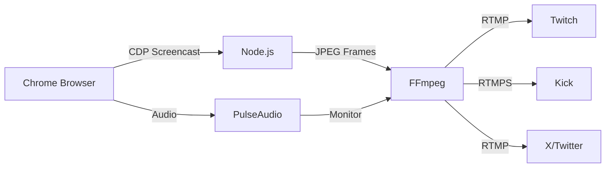

## Overview

Hyperscape streams gameplay to multiple platforms simultaneously using FFmpeg and RTMP. The streaming system supports:

- **Multi-platform fanout:** Twitch, Kick, X/Twitter
- **Hardware GPU rendering:** WebGPU with NVIDIA Vulkan or EGL
- **Audio capture:** Game music and sound effects via PulseAudio
- **Multiple capture modes:** CDP (default), WebCodecs, MediaRecorder

## Architecture



## Capture Modes

### CDP Mode (Default)

Chrome DevTools Protocol screencast capture—fastest and most reliable.

**Advantages:**
- 2-3x faster than MediaRecorder
- No browser-side encoding overhead
- Single encode step: JPEG → H.264
- Works in headless and headful mode

**Configuration:**
```bash
STREAM_CAPTURE_MODE=cdp
STREAM_CDP_QUALITY=80        # JPEG quality (1-100)
STREAM_FPS=30                # Target FPS
```

**How It Works:**
1. CDP `Page.startScreencast` captures compositor frames
2. Frames delivered as base64 JPEG
3. Node.js decodes and pipes to FFmpeg stdin
4. FFmpeg encodes to H.264 and streams to RTMP

### WebCodecs Mode (Experimental)

Uses browser's native VideoEncoder API for H.264 encoding.

**Advantages:**
- Hardware-accelerated encoding in browser
- FFmpeg uses `-c:v copy` (no re-encoding)
- Lowest CPU usage

**Disadvantages:**
- Experimental API
- May not work in all browsers
- Falls back to CDP if no traffic after 20s

**Configuration:**
```bash
STREAM_CAPTURE_MODE=webcodecs
```

### MediaRecorder Mode (Legacy)

Uses browser MediaRecorder API with WebSocket transfer.

**Advantages:**
- Works in all browsers
- Well-tested fallback

**Disadvantages:**
- Slowest (browser encodes VP8/VP9, FFmpeg re-encodes to H.264)
- WebSocket serialization overhead
- Higher CPU usage

**Configuration:**
```bash
STREAM_CAPTURE_MODE=mediarecorder
RTMP_BRIDGE_PORT=8765
```

## Streaming Destinations

### Twitch

```bash
TWITCH_STREAM_KEY=live_123456789_abcdefghij
TWITCH_RTMP_URL=rtmp://live.twitch.tv/app  # Optional override
```

**Default ingest:** `rtmp://live.twitch.tv/app`

### Kick

```bash
KICK_STREAM_KEY=sk_us-west-2_...
KICK_RTMP_URL=rtmps://fa723fc1b171.global-contribute.live-video.net/app
```

**Important:** Kick uses RTMPS (RTMP over TLS), not plain RTMP.

**Fixed in commit 5dbd239:** Kick URL was incorrect (`ingest.kick.com`), now uses correct IVS endpoint.

### X/Twitter

```bash
X_STREAM_KEY=your-stream-key
X_RTMP_URL=rtmp://sg.pscp.tv:80/x
```

**Default ingest:** `rtmp://sg.pscp.tv:80/x`

### YouTube (Disabled)

YouTube streaming is explicitly disabled as of commit b466233:

```bash
YOUTUBE_STREAM_KEY=
YOUTUBE_RTMP_URL=
```

**Why Disabled:**
- Stale keys were being used despite removal from config
- Explicitly setting to empty string prevents rtmp-bridge from adding it
- Current platforms: Twitch, Kick, X only

## Quality Settings

### Video Encoding

```bash
# Resolution (must be even numbers)
STREAM_CAPTURE_WIDTH=1280
STREAM_CAPTURE_HEIGHT=720

# Frame rate
STREAM_FPS=30

# Bitrate
STREAM_BITRATE=4500k  # Default: 4500 kbps

# Encoder preset
STREAM_PRESET=ultrafast  # ultrafast, superfast, veryfast, faster, fast, medium
```

### Buffering Modes

**Balanced Mode (Default)** - Commit 4c630f12:

```bash
STREAM_LOW_LATENCY=false

# FFmpeg settings:
# - tune: film (allows B-frames)
# - bufsize: 18000k (4x bitrate)
# - Better compression and smoother playback
```

**Low Latency Mode:**

```bash
STREAM_LOW_LATENCY=true

# FFmpeg settings:
# - tune: zerolatency (no B-frames)
# - bufsize: 9000k (2x bitrate)
# - Lower latency but more buffering for viewers
```

**When to Use Each:**

| Mode | Use Case | Latency | Stability |
|------|----------|---------|-----------|
| Balanced | Passive viewing, VODs, long streams | ~3-5s | High |
| Low Latency | Interactive, betting, live commentary | <1s | Medium |

### Audio Encoding

```bash
# Audio codec
STREAM_AUDIO_CODEC=aac
STREAM_AUDIO_BITRATE=128k
STREAM_AUDIO_SAMPLE_RATE=44100

# Audio capture
STREAM_AUDIO_ENABLED=true
PULSE_AUDIO_DEVICE=chrome_audio.monitor
```

## Stream Health Monitoring

### Recovery Configuration

```bash
# CDP stall detection
STREAM_CAPTURE_RECOVERY_TIMEOUT_MS=30000     # 30 seconds
STREAM_CAPTURE_RECOVERY_MAX_FAILURES=4       # Max failures before fallback

# FFmpeg restart attempts
FFMPEG_MAX_RESTART_ATTEMPTS=8                # Increased from 5 (commit 14a1e1b)
```

### Health Checks

The streaming system includes automatic health monitoring:

**CDP Stall Detection:**
- Monitors bytes received every 30 seconds
- If no traffic for 4 intervals (120s), triggers soft recovery
- Soft recovery: Restart CDP screencast without killing browser/FFmpeg
- Hard recovery: Full browser teardown and restart
- Fallback: Switch to MediaRecorder mode after 4 failed recoveries

**FFmpeg Monitoring:**
- Checks FFmpeg process health
- Restarts FFmpeg if it crashes
- Up to 8 restart attempts before giving up

### Status Endpoints

**Streaming State:**
```bash
GET /api/streaming/state

Response:
{
  "active": true,
  "destinations": [
    { "name": "twitch", "connected": true },
    { "name": "kick", "connected": true },
    { "name": "x", "connected": true }
  ],
  "stats": {
    "bytesReceived": 1234567890,
    "uptime": 3600000,
    "droppedFrames": 0,
    "backpressured": false
  }
}
```

**RTMP Status File:**
```bash
cat packages/server/public/live/rtmp-status.json

{
  "active": true,
  "destinations": [...],
  "stats": {...},
  "captureMode": "cdp",
  "updatedAt": 1234567890
}
```

## Streaming Timing

### Canonical Platform

```bash
# Platform used for anti-cheat timing
STREAMING_CANONICAL_PLATFORM=twitch  # Changed from youtube (commit 7f1b1fd)
```

**Why Twitch:**
- Lower latency than YouTube (~2-3s vs ~8-12s)
- More reliable for real-time betting
- Better for interactive streams

### Public Delay

```bash
# Delay before public can see stream
STREAMING_PUBLIC_DELAY_MS=0  # Changed from 12000ms (commit 7f1b1fd)
```

**Why 0ms:**
- Live betting requires real-time stream
- No delay needed for public viewers
- Matches Twitch's native latency

## Diagnostics

### Deployment Diagnostics

The deploy script automatically runs streaming diagnostics (commit cf53ad4):

```bash
# Streaming API state
curl -s http://localhost:5555/api/streaming/state | jq .

# Game client status
curl -s -o /dev/null -w "%{http_code}" http://localhost:3333

# RTMP status file
cat packages/server/public/live/rtmp-status.json

# FFmpeg processes
ps aux | grep ffmpeg | grep -v grep

# Stream processes
ps aux | grep -E "stream-to-rtmp|rtmp-bridge" | grep -v grep

# Recent PM2 logs (filtered for streaming)
bunx pm2 logs hyperscape-duel --nostream --lines 200 | \
  grep -iE "rtmp|ffmpeg|stream|capture|destination|twitch|kick|frame|fps|bitrate|error" | \
  tail -100
```

### Manual Diagnostics

**Check streaming is active:**
```bash
curl http://localhost:5555/api/streaming/state
```

**Check FFmpeg is running:**
```bash
ps aux | grep ffmpeg
# Should show: ffmpeg -f image2pipe -i - ...
```

**Check RTMP connections:**
```bash
# Twitch
curl -I rtmp://live.twitch.tv/app/$TWITCH_STREAM_KEY

# Kick (RTMPS)
openssl s_client -connect fa723fc1b171.global-contribute.live-video.net:443

# X
curl -I rtmp://sg.pscp.tv:80/x/$X_STREAM_KEY
```

**Check PulseAudio (audio):**
```bash
pactl info
pactl list short sinks | grep chrome_audio
pactl list short sources | grep chrome_audio.monitor
```

**Check GPU rendering:**
```bash
# Xorg mode
xdpyinfo -display :99
DISPLAY=:99 glxinfo | grep "OpenGL renderer"

# Headless EGL mode
ls -la /usr/lib/x86_64-linux-gnu/libEGL_nvidia.so.0

# Vulkan
export VK_ICD_FILENAMES=/usr/share/vulkan/icd.d/nvidia_icd.json
vulkaninfo --summary
```

## Troubleshooting

### Stream Not Appearing on Platforms

**Diagnosis:**
```bash
# 1. Check stream keys are configured
cat packages/server/.env | grep STREAM_KEY

# 2. Check FFmpeg is running
ps aux | grep ffmpeg

# 3. Check RTMP status
cat packages/server/public/live/rtmp-status.json

# 4. Check PM2 logs
bunx pm2 logs hyperscape-duel --lines 100 | grep -i "rtmp\|stream\|ffmpeg"
```

**Common Issues:**

1. **Stale stream keys** (commits 7ee730d, a71d4ba, 50f8bec):
   - Vast.ai servers can have old keys in environment
   - Solution: Explicitly unset and re-export before PM2 start

2. **Wrong RTMP URL** (commit 5dbd239):
   - Kick URL was incorrect
   - Solution: Use `rtmps://fa723fc1b171.global-contribute.live-video.net/app`

3. **YouTube enabled** (commit b466233):
   - Stale YouTube key being used
   - Solution: Set `YOUTUBE_STREAM_KEY=""`

### Black Screen

See [GPU Rendering Guide](/devops/gpu-rendering) for GPU troubleshooting.

### No Audio

See [Audio Streaming Guide](/devops/audio-streaming) for PulseAudio troubleshooting.

### Frequent Disconnects

**Symptom:** Stream disconnects every 2 minutes

**Cause:** CDP stall threshold too aggressive

**Solution:** Update to latest code (commit 14a1e1b):
- CDP stall threshold increased from 2 → 4 intervals (120s)
- Soft recovery added (no stream gap)
- FFmpeg restart attempts increased from 5 → 8

### Viewer Buffering

**Symptom:** Viewers experience frequent buffering

**Cause:** Aggressive low-latency settings

**Solution:** Use balanced mode (commit 4c630f12):
```bash
STREAM_LOW_LATENCY=false  # Default
```

See [Quality Settings](#quality-settings) for details.

## Performance

### CPU Usage

Expected CPU usage by component:

| Component | CPU Usage |
|-----------|-----------|
| Chrome (WebGPU) | 30-50% |
| FFmpeg (H.264) | 50-80% |
| PulseAudio | 1-2% |
| Node.js | 5-10% |
| **Total** | **90-140%** (1-1.5 cores) |

### GPU Usage

Expected GPU usage:

| Component | GPU Usage |
|-----------|-----------|
| WebGPU Rendering | 40-60% |
| Video Encoding (NVENC) | 10-20% |
| **Total** | **50-80%** |

### Memory Usage

Expected memory usage:

| Component | Memory |
|-----------|--------|
| Chrome | 1-2 GB |
| FFmpeg | 200-500 MB |
| Node.js | 100-200 MB |
| **Total** | **1.5-3 GB** |

### Bandwidth

Expected bandwidth usage:

| Stream | Bitrate | Bandwidth |
|--------|---------|-----------|
| Video (H.264) | 4500 kbps | ~560 KB/s |
| Audio (AAC) | 128 kbps | ~16 KB/s |
| **Total** | **4628 kbps** | **~580 KB/s** |

## Environment Variables Reference

### Capture Configuration

```bash
# Capture mode
STREAM_CAPTURE_MODE=cdp                      # cdp, webcodecs, mediarecorder

# Browser configuration
STREAM_CAPTURE_HEADLESS=false                # false, new, true
STREAM_CAPTURE_USE_EGL=false                 # true for headless EGL
STREAM_CAPTURE_CHANNEL=chrome-dev            # Browser channel
STREAM_CAPTURE_ANGLE=vulkan                  # vulkan, gl
STREAM_CAPTURE_DISABLE_WEBGPU=false          # Disable WebGPU

# Quality
STREAM_CDP_QUALITY=80                        # JPEG quality (1-100)
STREAM_FPS=30                                # Target FPS
STREAM_CAPTURE_WIDTH=1280                    # Width (must be even)
STREAM_CAPTURE_HEIGHT=720                    # Height (must be even)
```

### GPU Rendering

```bash
# Rendering mode
GPU_RENDERING_MODE=xorg                      # xorg, headless-egl
DISPLAY=:99                                  # X display (empty for EGL)
DUEL_CAPTURE_USE_XVFB=false                  # Always false (no software rendering)
VK_ICD_FILENAMES=/usr/share/vulkan/icd.d/nvidia_icd.json
```

### Audio Capture

```bash
# Audio streaming
STREAM_AUDIO_ENABLED=true
PULSE_AUDIO_DEVICE=chrome_audio.monitor
PULSE_SERVER=unix:/tmp/pulse-runtime/pulse/native
XDG_RUNTIME_DIR=/tmp/pulse-runtime
```

### Stream Destinations

```bash
# Twitch
TWITCH_STREAM_KEY=live_123456789_abcdefghij
TWITCH_RTMP_URL=rtmp://live.twitch.tv/app

# Kick (RTMPS)
KICK_STREAM_KEY=sk_us-west-2_...
KICK_RTMP_URL=rtmps://fa723fc1b171.global-contribute.live-video.net/app

# X/Twitter
X_STREAM_KEY=your-stream-key
X_RTMP_URL=rtmp://sg.pscp.tv:80/x

# YouTube (disabled)
YOUTUBE_STREAM_KEY=
```

### Quality Settings

```bash
# Buffering mode
STREAM_LOW_LATENCY=false                     # false (balanced), true (low latency)

# Encoding
STREAM_BITRATE=4500k
STREAM_PRESET=ultrafast
STREAM_AUDIO_BITRATE=128k
```

### Health Monitoring

```bash
# Recovery configuration
STREAM_CAPTURE_RECOVERY_TIMEOUT_MS=30000
STREAM_CAPTURE_RECOVERY_MAX_FAILURES=4
FFMPEG_MAX_RESTART_ATTEMPTS=8

# Timing
STREAMING_CANONICAL_PLATFORM=twitch
STREAMING_PUBLIC_DELAY_MS=0
```

## Related Documentation

- [GPU Rendering Guide](/devops/gpu-rendering) - GPU configuration
- [Audio Streaming Guide](/devops/audio-streaming) - PulseAudio setup
- [Deployment Guide](/guides/deployment) - Full deployment process
- [Configuration Reference](/devops/configuration) - All environment variables

## Commit History

Major streaming improvements (Feb 26-27, 2026):

### GPU Rendering
- **dd649da**: Fix headless mode flag passing (args vs Playwright option)
- **e51a332**: Add headless EGL mode for containers without DRM
- **30bdaf0**: Require NVIDIA Xorg, no software rendering fallback
- **5fe4a18**: Add robust Xorg/Xvfb fallback handling
- **263bfc5**: Use Xorg instead of Xvfb for NVIDIA GPU rendering
- **89b78e3**: Use NVIDIA hardware Vulkan instead of SwiftShader

### Audio Streaming
- **b9d2e41**: Improve audio stability with better buffering and sync
- **7a5fcbc**: Fix await in non-async function for PulseAudio check
- **aab66b0**: Fix PulseAudio permissions and add fallback
- **3b6f1ee**: Add audio capture via PulseAudio

### Quality & Stability
- **4c630f12**: Improve RTMP buffering for smoother playback
- **14a1e1b**: Increase CDP stall threshold and add soft recovery
- **5dbd239**: Fix Kick RTMP URL and add stream keys to CI/CD
- **7ee730d**: Pass correct stream keys through CI/CD to Vast.ai
- **cf53ad4**: Add detailed streaming diagnostics

### Configuration
- **b466233**: Comprehensive secrets injection overhaul
- **50f1a28**: Add PUBLIC_CDN_URL to ecosystem config
- **dda4396**: Add DATABASE_URL support for Vast.ai deployment
