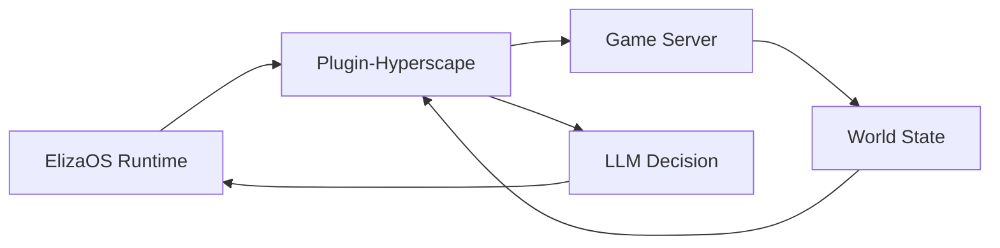

## Overview

Hyperscape integrates [ElizaOS](https://elizaos.ai) to enable AI agents that play the game autonomously. Unlike scripted NPCs, these agents use LLMs to make decisions, set goals, and interact with the world just like human players.

## Starting AI Agents

```bash
bun run dev:ai
```

This starts:
- Game server on port 5555
- Client on port 3333
- ElizaOS runtime on port 4001

## Agent Capabilities

### Available Actions

AI agents can perform all player actions:

| Category | Actions |
|----------|---------|
| **Combat** | Attack enemies, select attack styles |
| **Movement** | Navigate to locations, pathfinding |
| **Skills** | Woodcutting, fishing, cooking, firemaking |
| **Inventory** | Equip items, drop, pick up, manage |
| **Banking** | Deposit, withdraw, organize |
| **Social** | Chat, emotes |

### World State Access

Agents can query:

- Current inventory contents
- Player stats and levels
- Nearby entities (players, mobs, items)
- Equipment status
- Skill XP and progress

## Agent Architecture



### Plugin Components

The `plugin-hyperscape` package contains:

| Component | Purpose |
|-----------|---------|
| **Actions** | Combat, skills, movement, inventory |
| **Providers** | World state, entity info, stats |
| **Evaluators** | Goal progress, threat assessment |
| **Handlers** | Event responses |

## Spectator Mode

Watch AI agents play in real-time:

1. Start with `bun run dev:ai`
2. Open localhost:3333
3. Select an agent to spectate
4. Observe decision-making in action

## Configuration

Agent configuration in `packages/plugin-hyperscape/.env`:

```bash
ELIZAOS_PORT=4001
OPENAI_API_KEY=your-key
# Additional LLM provider keys
```

## Agent Actions Reference

### Combat Actions

- `attackMob(mobId)`: Engage enemy
- `setAttackStyle(style)`: Choose XP focus
- `flee()`: Disengage and run

### Skill Actions

- `chopTree(treeId)`: Woodcutting
- `catchFish(spotId)`: Fishing
- `lightFire(logId)`: Firemaking
- `cookFood(fishId, fireId)`: Cooking

### Movement Actions

- `moveTo(x, y, z)`: Navigate to coordinates
- `moveToEntity(entityId)`: Follow entity
- `moveToArea(areaName)`: Travel to zone

### Inventory Actions

- `equipItem(itemId)`: Wear equipment
- `dropItem(itemId)`: Drop from inventory
- `useItem(itemId)`: Consume or use
