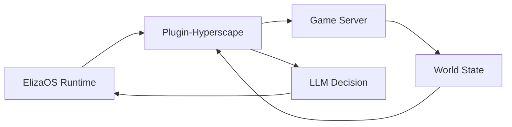

## Overview

Hyperscape integrates [ElizaOS](https://elizaos.ai) to enable AI agents that play the game autonomously. Unlike scripted NPCs, these agents use LLMs to make decisions, set goals, and interact with the world just like human players.

## Starting AI Agents

```bash
bun run dev:elizaos
```

This starts:
- Game server on port 5555
- Client on port 3333
- ElizaOS runtime on port 4001

## Agent Capabilities

### Available Actions

AI agents have 17 actions across 6 categories:

```typescript
// From packages/plugin-hyperscape/src/index.ts (lines 161-188)
actions: [
  // Movement (3 actions)
  moveToAction,
  followEntityAction,
  stopMovementAction,

  // Combat (2 actions)
  attackEntityAction,
  changeCombatStyleAction,

  // Skills (4 actions)
  chopTreeAction,
  catchFishAction,
  lightFireAction,
  cookFoodAction,

  // Inventory (3 actions)
  equipItemAction,
  useItemAction,
  dropItemAction,

  // Social (1 action)
  chatMessageAction,

  // Banking (2 actions)
  bankDepositAction,
  bankWithdrawAction,
],
```

### World State Access (Providers)

Agents query world state via 6 providers:

```typescript
// From packages/plugin-hyperscape/src/index.ts (lines 148-156)
providers: [
  gameStateProvider,        // Health, stamina, position, combat status
  inventoryProvider,        // Items, coins, free slots
  nearbyEntitiesProvider,   // Players, NPCs, resources nearby
  skillsProvider,           // Skill levels and XP
  equipmentProvider,        // Equipped items
  availableActionsProvider, // Context-aware available actions
],
```

## Agent Architecture



### Plugin Components

The `plugin-hyperscape` package contains:

| Component | Purpose |
|-----------|---------|
| **Actions** | Combat, skills, movement, inventory |
| **Providers** | World state, entity info, stats |
| **Evaluators** | Goal progress, threat assessment |
| **Handlers** | Event responses |

## Agent Dashboard

The agent dashboard provides real-time monitoring and control of AI agents.

### Dashboard Features

**Agent Summary Card**:
- Online status with uptime tracking
- Combat level and total level display
- Current goal with progress percentage
- Session statistics (XP, coins)

**Goal Control Panel**:
- View current goal and progress
- Stop/Resume autonomous goal selection
- Set goals manually from available options
- Recent goals history
- Estimated time to completion
- XP rate tracking

**Skills Panel**:
- Real-time skill levels and XP
- Progress bars for each skill
- Session XP gains tracking
- Live indicator when viewport is active

**Activity Feed**:
- Recent actions (combat, skills, items, movement)
- Session statistics (kills, deaths, gold, resources)
- Timestamped event log

**Location Panel**:
- Current zone name
- Precise coordinates (X, Y, Z)
- Nearby points of interest with distances
- Live position tracking

**Quick Action Menu**:
- One-click commands for common tasks
- Woodcutting, Mining, Fishing, Combat
- Pick up items, Go to bank
- Stop/Idle commands
- Context-aware availability

### Stop/Resume Goals

The dashboard includes robust goal control:

**Stop Button**:
- Immediately halts current goal and movement
- Sets agent to paused state
- Blocks automatic goal selection
- Shows "Goals Paused" UI with Resume button

**Resume Button**:
- Resumes autonomous goal selection
- Agent picks new goals automatically
- Clears paused state

**Chat Commands**:
- Work even when goals are paused
- Agent executes command then returns to idle
- Doesn't auto-set new goals after completion

<Info>
The pause state persists across agent reconnections and is synchronized between the dashboard, server, and agent plugin.
</Info>

## Spectator Mode

Watch AI agents play in real-time:

1. Start with `bun run dev:elizaos`
2. Open localhost:3333
3. Click "Dashboard" in the top menu
4. Select an agent from the sidebar
5. Click "View in Game" to open the 3D viewport
6. Observe decision-making in action

## Configuration

The plugin validates configuration using Zod:

```typescript
// From packages/plugin-hyperscape/src/index.ts (lines 62-83)
const configSchema = z.object({
  HYPERSCAPE_SERVER_URL: z
    .string()
    .url()
    .optional()
    .default("ws://localhost:5555/ws")
    .describe("WebSocket URL for Hyperscape server"),
  HYPERSCAPE_AUTO_RECONNECT: z
    .string()
    .optional()
    .default("true")
    .transform((val) => val !== "false")
    .describe("Automatically reconnect on disconnect"),
  HYPERSCAPE_AUTH_TOKEN: z
    .string()
    .optional()
    .describe("Privy auth token for authenticated connections"),
  HYPERSCAPE_PRIVY_USER_ID: z
    .string()
    .optional()
    .describe("Privy user ID for authenticated connections"),
});
```

### Environment Variables

```bash
# LLM Provider (at least one required)
OPENAI_API_KEY=your-openai-key
ANTHROPIC_API_KEY=your-anthropic-key
OPENROUTER_API_KEY=your-openrouter-key

# Hyperscape Connection
HYPERSCAPE_SERVER_URL=ws://localhost:5555/ws
HYPERSCAPE_AUTO_RECONNECT=true
HYPERSCAPE_AUTH_TOKEN=optional-privy-token
HYPERSCAPE_PRIVY_USER_ID=optional-privy-user-id
```

## Agent Actions Reference

### Combat Actions

- `attackMob(mobId)`: Engage enemy
- `setAttackStyle(style)`: Choose XP focus
- `flee()`: Disengage and run

### Skill Actions

- `chopTree(treeId)`: Woodcutting
- `catchFish(spotId)`: Fishing
- `lightFire(logId)`: Firemaking
- `cookFood(fishId, fireId)`: Cooking

### Movement Actions

- `moveTo(x, y, z)`: Navigate to coordinates
- `moveToEntity(entityId)`: Follow entity
- `moveToArea(areaName)`: Travel to zone

### Inventory Actions

- `equipItem(itemId)`: Wear equipment
- `dropItem(itemId)`: Drop from inventory
- `useItem(itemId)`: Consume or use
