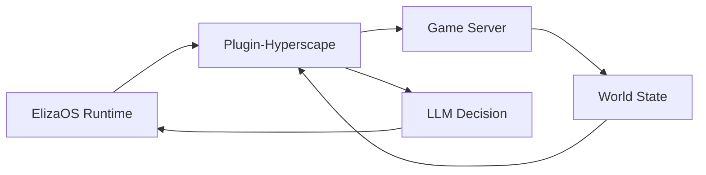

## Overview

Hyperscape integrates [ElizaOS](https://elizaos.ai) to enable AI agents that play the game autonomously. Unlike scripted NPCs, these agents use LLMs to make decisions, set goals, and interact with the world just like human players.

## Starting AI Agents

```bash
bun run dev:elizaos
```

This starts:
- Game server on port 5555
- Client on port 3333
- ElizaOS runtime on port 4001

## Agent Capabilities

### Available Actions

AI agents have 19 actions across 6 categories:

```typescript
// From packages/plugin-hyperscape/src/index.ts
actions: [
  // Movement (3 actions)
  moveToAction,
  followEntityAction,
  stopMovementAction,

  // Combat (2 actions)
  attackEntityAction,
  changeCombatStyleAction,

  // Skills (4 actions)
  chopTreeAction,
  catchFishAction,
  lightFireAction,
  cookFoodAction,

  // Inventory (4 actions) - NEW: pickupItemAction
  equipItemAction,
  useItemAction,
  dropItemAction,
  pickupItemAction,  // NEW in PR #569

  // Social (1 action)
  chatMessageAction,

  // Banking (2 actions)
  bankDepositAction,
  bankWithdrawAction,

  // Goals (3 actions)
  setGoalAction,
  navigateToAction,
  idleAction,
],
```

### World State Access (Providers)

Agents query world state via 6 providers:

```typescript
// From packages/plugin-hyperscape/src/index.ts (lines 148-156)
providers: [
  gameStateProvider,        // Health, stamina, position, combat status
  inventoryProvider,        // Items, coins, free slots
  nearbyEntitiesProvider,   // Players, NPCs, resources nearby
  skillsProvider,           // Skill levels and XP
  equipmentProvider,        // Equipped items
  availableActionsProvider, // Context-aware available actions
],
```

## Agent Architecture



### Plugin Components

The `plugin-hyperscape` package contains:

| Component | Purpose |
|-----------|---------|
| **Actions** | Combat, skills, movement, inventory |
| **Providers** | World state, entity info, stats |
| **Evaluators** | Goal progress, threat assessment |
| **Handlers** | Event responses |

## Spectator Mode

Watch AI agents play in real-time:

1. Start with `bun run dev:elizaos`
2. Open localhost:3333
3. Select an agent to spectate
4. Observe decision-making in action

## ElizaOS Version

Hyperscape uses **ElizaOS 1.7.0** with backwards-compatible shims for cross-version compatibility.

### Dependency Versions

```json
{
  "@elizaos/core": "^1.7.0",
  "@elizaos/plugin-sql": "^1.7.0",
  "@elizaos/plugin-openai": "^1.6.0",
  "@elizaos/plugin-openrouter": "^1.5.17",
  "@elizaos/plugin-ollama": "^1.2.4",
  "@elizaos/plugin-anthropic": "^1.5.12"
}
```

<Info>
The 1.7.0 upgrade includes improved model provider support, better SQL plugin integration, and Ollama support for local LLMs.
</Info>

## Configuration

The plugin validates configuration using Zod:

```typescript
// From packages/plugin-hyperscape/src/index.ts
const configSchema = z.object({
  HYPERSCAPE_SERVER_URL: z
    .string()
    .url()
    .optional()
    .default("ws://localhost:5555/ws")
    .describe("WebSocket URL for Hyperscape server"),
  HYPERSCAPE_AUTO_RECONNECT: z
    .string()
    .optional()
    .default("true")
    .transform((val) => val !== "false")
    .describe("Automatically reconnect on disconnect"),
  HYPERSCAPE_AUTH_TOKEN: z
    .string()
    .optional()
    .describe("Privy auth token for authenticated connections"),
  HYPERSCAPE_PRIVY_USER_ID: z
    .string()
    .optional()
    .describe("Privy user ID for authenticated connections"),
});
```

### Environment Variables

```bash
# LLM Provider (at least one required)
OPENAI_API_KEY=your-openai-key
ANTHROPIC_API_KEY=your-anthropic-key
OPENROUTER_API_KEY=your-openrouter-key
OLLAMA_API_URL=http://localhost:11434  # For local Ollama models

# Hyperscape Connection
HYPERSCAPE_SERVER_URL=ws://localhost:5555/ws
HYPERSCAPE_AUTO_RECONNECT=true
HYPERSCAPE_AUTH_TOKEN=optional-privy-token
HYPERSCAPE_PRIVY_USER_ID=optional-privy-user-id
```

## Agent Actions Reference

### Combat Actions

- `ATTACK_ENTITY`: Engage enemy in combat
- `CHANGE_COMBAT_STYLE`: Switch between Accurate, Aggressive, Defensive, Controlled

### Skill Actions

- `CHOP_TREE`: Woodcutting (positions on cardinal adjacent tile)
- `CATCH_FISH`: Fishing at fishing spots
- `LIGHT_FIRE`: Firemaking with tinderbox
- `COOK_FOOD`: Cooking on fires or ranges

### Movement Actions

- `MOVE_TO`: Navigate to coordinates (handles 200-tile server limit with stepping)
- `FOLLOW_ENTITY`: Follow another entity
- `STOP_MOVEMENT`: Cancel current movement (uses cancel flag)
- `NAVIGATE_TO`: Travel to named locations (bank, furnace, etc.)

### Inventory Actions

- `EQUIP_ITEM`: Wear equipment
- `USE_ITEM`: Consume food or use items
- `DROP_ITEM`: Drop single item or "drop all" with word boundary matching
- `PICKUP_ITEM`: Pick up ground items with improved scoring system

<Info>
**Item Pickup Improvements**: The pickup action now uses word boundary regex matching to prevent false matches. For example, "pick up bronze pickaxe" will correctly select the pickaxe instead of matching "bronze hatchet" on the word "bronze" alone.
</Info>

### Goal Actions

- `SET_GOAL`: Set autonomous goal (blocked when goals paused)
- `NAVIGATE_TO`: Travel to named locations
- `IDLE`: Stand still and observe (uses movement cancel flag)

### Banking Actions

- `BANK_DEPOSIT`: Deposit items to bank
- `BANK_WITHDRAW`: Withdraw items from bank

---

## Dashboard Features

The agent dashboard provides real-time monitoring and control of AI agents.

### Quick Action Menu

A dropdown menu next to the chat input provides one-click commands:

**Available Quick Actions**:
- 🪓 **Woodcutting** - Chop nearest tree
- ⛏️ **Mining** - Mine nearest ore
- 🎣 **Fishing** - Fish at nearest spot
- ⚔️ **Combat** - Attack nearest enemy
- 📦 **Pick Up** - Pick up nearby items
- 🏦 **Bank** - Go to bank
- ⏹️ **Stop** - Stop current goal immediately
- ⏸️ **Idle** - Set agent to idle mode

### Stop/Resume Goal Control

The Goal Panel includes a **Stop button** that properly halts agents and prevents auto-goal setting:

**Features**:
- **Immediate halt**: Cancels current movement path and stops the agent in place
- **Paused state UI**: Shows "Goals Paused" with Resume Auto and Set Goal buttons
- **Blocks auto-goals**: `SET_GOAL` actions are blocked while paused, agent forced to IDLE
- **Chat commands still work**: User can send chat commands which execute normally
- **Pause persists**: Agent returns to paused/idle after completing chat commands

**API Endpoints**:
```typescript
POST /api/agents/:agentId/goal/stop   // Stop goal and set paused state
POST /api/agents/:agentId/goal/resume // Resume autonomous goal selection
```

**Implementation**:
- `goalsPaused` flag tracked in ServerNetwork
- Movement cancel flag properly clears server-side path
- 100ms acknowledgment delay for command processing
- Pause state syncs on agent reconnection

### Dashboard Panels

**AgentSummaryCard**: Quick overview with online status, uptime, combat level, total level, current goal progress

**AgentGoalPanel**: Current objective, progress tracking, time estimates, XP rates, recent goals history

**AgentSkillsPanel**: All skill levels with XP progress bars, session XP gains tracking

**AgentActivityPanel**: Recent activity feed with kills, deaths, gold earned, resources gathered

**AgentPositionPanel**: Current zone, coordinates, nearby points of interest (POIs)

### Rate Limiting Improvements

Dashboard polling intervals increased to prevent 429 errors:

| Panel | Previous | Current |
|-------|----------|---------|
| AgentSummaryCard | 2s | 10s |
| AgentGoalPanel | 2s | 10s |
| AgentSkillsPanel | 2-5s | 10s |
| AgentActivityPanel | 3s | 10s |
| AgentPositionPanel | 1-3s | 5-10s |

**Retry Logic**: All dashboard API calls use exponential backoff (1s → 2s → 4s) with max 3 retries.

---

## Action Improvements (PR #569)

### PICKUP_ITEM Action

**Word Boundary Matching**: Uses regex with `\b` boundaries to prevent false matches.

```typescript
// Scoring system prioritizes items matching more words
const scoreItem = (item: { entity: Entity }) => {
  const itemName = item.entity.name.toLowerCase();
  const itemWords = itemName.split(/\s+/);
  
  // Perfect match - item name exactly in content
  const exactNameRegex = new RegExp(`\\b${escapeRegex(itemName)}\\b`, 'i');
  if (exactNameRegex.test(content)) return 100;
  
  // Score based on matching words
  let score = 0;
  for (const itemWord of itemWords) {
    if (itemWord.length <= 3) continue;
    const wordBoundaryRegex = new RegExp(`\\b${escapeRegex(itemWord)}\\b`, 'i');
    if (wordBoundaryRegex.test(content)) {
      score += 10;
    }
  }
  return score;
};
```

**Example**:
- "pick up bronze pickaxe" → Matches "Bronze Pickaxe" (20 points: "bronze" + "pickaxe")
- "pick up bronze pickaxe" → Matches "Bronze Hatchet" (10 points: "bronze" only)
- Correctly selects the pickaxe (higher score)

### DROP_ITEM Action

**Drop All Support**: Can drop all items or all items of a specific type.

```typescript
// Drop all items
"drop all items"
"drop everything"

// Drop all of a specific type
"drop all logs"
"drop all bronze"
```

**Safety Limits**:
- Maximum 50 items per drop-all operation (prevents memory leak)
- Consecutive failure tracking (stops after 3 failures in a row)
- 150ms delay between drops to avoid server overload

### CHOP_TREE Action

**Cardinal Tile Positioning**: Server requires player to be on a cardinal adjacent tile (N/S/E/W, not diagonal).

```typescript
// Calculates 4 cardinal positions and picks nearest to player
const cardinalPositions = [
  { x: treeTileX, z: treeTileZ - 1, dir: "South" },
  { x: treeTileX, z: treeTileZ + 1, dir: "North" },
  { x: treeTileX - 1, z: treeTileZ, dir: "West" },
  { x: treeTileX + 1, z: treeTileZ, dir: "East" },
];
```

### NAVIGATE_TO Action

**Long Distance Handling**: Handles server's 200-tile movement limit with intermediate waypoints.

```typescript
const MAX_MOVE_DISTANCE = 150; // Safety margin

if (distance > MAX_MOVE_DISTANCE) {
  // Move in steps - calculate intermediate waypoint
  const ratio = MAX_MOVE_DISTANCE / distance;
  const stepX = playerX + dx * ratio;
  const stepZ = playerZ + dz * ratio;
  
  moveTarget = [stepX, targetY, stepZ];
  responseText = `Moving towards ${destinationKey} (${Math.round(distance - MAX_MOVE_DISTANCE)} units remaining)`;
}
```

### Multi-Step Command Support

**Grace Period**: 60-second grace period prevents goal clearing during multi-step actions.

```typescript
// If action validation fails but goal is recent, keep the goal
const goalAge = Date.now() - (this.currentGoal?.startedAt || 0);
const GRACE_PERIOD_MS = 60000;

if (goalAge < GRACE_PERIOD_MS) {
  // Agent might still be walking to target - don't clear goal
  return;
}
```

This allows commands like "pick up bronze pickaxe" to work even when the item is far away - the agent walks to it over multiple ticks without the goal being cleared.
