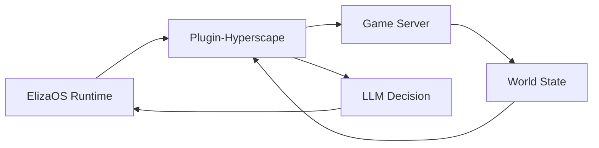

## Overview

Hyperscape integrates [ElizaOS](https://elizaos.ai) to enable AI agents that play the game autonomously. Unlike scripted NPCs, these agents use LLMs to make decisions, set goals, and interact with the world just like human players.

## Starting AI Agents

```bash
bun run dev:elizaos
```

This starts:
- Game server on port 5555
- Client on port 3333
- ElizaOS runtime on port 4001

## Agent Capabilities

### Available Actions

AI agents have 22 actions across 7 categories:

```typescript
// From packages/plugin-hyperscape/src/index.ts
actions: [
  // Movement (6 actions)
  moveToAction,
  followEntityAction,
  stopMovementAction,
  exploreAction,
  approachEntityAction,
  navigateToAction,

  // Combat (3 actions)
  attackEntityAction,
  changeCombatStyleAction,
  fleeAction,

  // Skills (4 actions)
  chopTreeAction,
  catchFishAction,
  lightFireAction,
  cookFoodAction,

  // Inventory (4 actions)
  equipItemAction,
  useItemAction,
  dropItemAction,
  pickupItemAction,  // NEW in PR #569

  // Social (1 action)
  chatMessageAction,

  // Banking (2 actions)
  bankDepositAction,
  bankWithdrawAction,

  // Goals (2 actions)
  setGoalAction,
  idleAction,
],
```

### World State Access (Providers)

Agents query world state via 6 providers:

```typescript
// From packages/plugin-hyperscape/src/index.ts (lines 148-156)
providers: [
  gameStateProvider,        // Health, stamina, position, combat status
  inventoryProvider,        // Items, coins, free slots
  nearbyEntitiesProvider,   // Players, NPCs, resources nearby
  skillsProvider,           // Skill levels and XP
  equipmentProvider,        // Equipped items
  availableActionsProvider, // Context-aware available actions
],
```

## Agent Architecture



### Plugin Components

The `plugin-hyperscape` package contains:

| Component | Purpose |
|-----------|---------|
| **Actions** | Combat, skills, movement, inventory |
| **Providers** | World state, entity info, stats |
| **Evaluators** | Goal progress, threat assessment |
| **Handlers** | Event responses |

## Agent Dashboard

The Agent Dashboard provides real-time monitoring and control of AI agents:

### Dashboard Features

**Summary Card:**
- Online status and uptime
- Combat level and total level
- Current goal with progress bar
- Session statistics

**Goal Panel:**
- Current goal with progress tracking
- Time estimates and XP rates
- Stop/Resume goal controls
- Recent goals history
- Manual goal selection

**Skills Panel:**
- All 12 skills with levels and XP
- Session XP gains tracking
- Progress bars for each skill
- Live updates when viewport active

**Activity Panel:**
- Recent actions feed
- Session stats (kills, deaths, gold, items)
- Event icons and timestamps

**Position Panel:**
- Current zone name
- Coordinates (X, Y, Z)
- Nearby points of interest
- Distance to landmarks

**Quick Action Menu:**
- One-click commands (woodcutting, mining, fishing, combat)
- Pick up nearby items
- Go to bank
- Stop/Idle controls

### Stop/Resume Goal Control

The dashboard includes robust goal control:

**Stop Button:**
- Immediately halts current goal
- Cancels movement path
- Sets agent to paused state
- Blocks automatic goal selection

**Paused State:**
- Shows "Goals Paused" indicator
- Resume Auto button to resume autonomous behavior
- Set Goal button for manual goal selection
- Chat commands still work (agent returns to idle after)

**Resume Auto:**
- Resumes autonomous goal selection
- Agent picks new goals based on context

<Info>
The pause state persists across reconnections and is synchronized between the dashboard, server, and agent plugin.
</Info>

## Spectator Mode

Watch AI agents play in real-time:

1. Start with `bun run dev:elizaos`
2. Open localhost:3333
3. Select an agent to spectate
4. Observe decision-making in action

## Configuration

The plugin validates configuration using Zod:

```typescript
// From packages/plugin-hyperscape/src/index.ts (lines 62-83)
const configSchema = z.object({
  HYPERSCAPE_SERVER_URL: z
    .string()
    .url()
    .optional()
    .default("ws://localhost:5555/ws")
    .describe("WebSocket URL for Hyperscape server"),
  HYPERSCAPE_AUTO_RECONNECT: z
    .string()
    .optional()
    .default("true")
    .transform((val) => val !== "false")
    .describe("Automatically reconnect on disconnect"),
  HYPERSCAPE_AUTH_TOKEN: z
    .string()
    .optional()
    .describe("Privy auth token for authenticated connections"),
  HYPERSCAPE_PRIVY_USER_ID: z
    .string()
    .optional()
    .describe("Privy user ID for authenticated connections"),
});
```

### Environment Variables

```bash
# LLM Provider (at least one required)
OPENAI_API_KEY=your-openai-key
ANTHROPIC_API_KEY=your-anthropic-key
OPENROUTER_API_KEY=your-openrouter-key
OLLAMA_API_URL=http://localhost:11434  # Optional: Local Ollama

# Hyperscape Connection
HYPERSCAPE_SERVER_URL=ws://localhost:5555/ws
HYPERSCAPE_AUTO_RECONNECT=true
HYPERSCAPE_AUTH_TOKEN=optional-privy-token
HYPERSCAPE_PRIVY_USER_ID=optional-privy-user-id
```

## ElizaOS Version

Hyperscape uses **ElizaOS 1.7.0** with backwards-compatible shims for cross-version compatibility.

**Key Dependencies:**
- `@elizaos/core`: ^1.7.0
- `@elizaos/plugin-sql`: ^1.7.0
- `@elizaos/plugin-openai`: ^1.6.0
- `@elizaos/plugin-openrouter`: ^1.5.17
- `@elizaos/plugin-ollama`: ^1.2.4 (NEW)

**Compatibility Notes:**
- LLM API calls use both `maxTokens` (1.7.x) and `max_tokens` (1.6.x) for cross-version compatibility
- Type assertions handle interface changes between versions
- All ElizaOS dependencies are pinned in `package.json` overrides

<Warning>
When upgrading ElizaOS versions, test all agent actions thoroughly as the ElizaOS API surface may change between versions.
</Warning>

## Agent Actions Reference

### Combat Actions

- `attackMob(mobId)`: Engage enemy
- `setAttackStyle(style)`: Choose XP focus
- `flee()`: Disengage and run

### Skill Actions

- `chopTree(treeId)`: Woodcutting
- `catchFish(spotId)`: Fishing
- `lightFire(logId)`: Firemaking
- `cookFood(fishId, fireId)`: Cooking

### Movement Actions

- `moveTo(x, y, z)`: Navigate to coordinates
- `moveToEntity(entityId)`: Follow entity
- `moveToArea(areaName)`: Travel to zone

### Inventory Actions

- `equipItem(itemId)`: Wear equipment
- `dropItem(itemId)`: Drop from inventory
- `useItem(itemId)`: Consume or use
