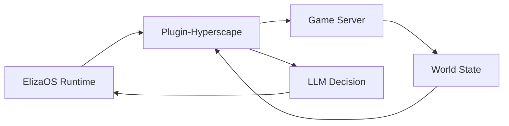

## Overview

Hyperia integrates [ElizaOS](https://elizaos.ai) to enable AI agents that play the game autonomously. Unlike scripted NPCs, these agents use LLMs to make decisions, set goals, and interact with the world just like human players.

## Starting AI Agents

```bash
bun run dev:elizaos
```

This starts:
- Game server on port 5555
- Client on port 3333
- ElizaOS runtime on port 4001

## Combat AI System

Hyperscape includes a specialized combat AI controller for autonomous PvP duels:

### DuelCombatAI

Tick-based combat controller that takes over agent behavior during arena duels:

```typescript
// From packages/server/src/arena/DuelCombatAI.ts
const combatAI = new DuelCombatAI(
  service,           // EmbeddedHyperscapeService
  opponentId,        // Target character ID
  {
    useLlmTactics: true,      // Enable LLM strategy planning
    healThresholdPct: 40      // HP% to start healing
  },
  runtime,           // AgentRuntime for LLM calls
  sendChat           // Callback for trash talk
);

combatAI.start();
await combatAI.externalTick();  // Called by StreamingDuelScheduler
combatAI.stop();
```

**Features:**
- Priority-based decisions (heal → buff → strategy → attack)
- Combat phase detection (opening, trading, finishing, desperate)
- LLM strategy planning using agent character
- Health-triggered and ambient trash talk
- Weapon speed awareness for correct attack cadence
- Statistics tracking (attacks, heals, damage)

### Trash Talk System

AI agents taunt opponents during combat:

**Health Threshold Taunts:**
- Triggered at 75%, 50%, 25%, 10% HP milestones
- Own HP low: "Not even close!", "I've had worse"
- Opponent HP low: "GG soon", "You're done!"

**Ambient Taunts:**
- Random taunts every 15-25 ticks
- "Let's go!", "Fight me!", "Too slow"

**LLM-Generated:**
- Uses agent character bio and communication style
- 30-token limit for overhead chat bubbles
- 3-second timeout with scripted fallback
- 8-second cooldown between messages

**Configuration:**
```bash
STREAMING_DUEL_COMBAT_AI_ENABLED=true       # Enable combat AI
STREAMING_DUEL_LLM_TACTICS_ENABLED=true     # Enable LLM strategy
```

See [Combat AI Documentation](/wiki/ai-agents/combat-ai) for complete reference.

## Agent Stability Improvements (Feb 26 2026)

Recent commits significantly improved agent stability and autonomous behavior:

### Action Locks and Fast-Tick Mode (commit 60a03f49)

**Problem:** Agents would spam LLM calls while waiting for movement to complete, wasting tokens and causing decision conflicts.

**Solution:** Action locks and fast-tick mode for responsive follow-up:

```typescript
// Action lock prevents LLM ticks while movement in progress
if (this.actionLock && service.isMoving) {
  logger.debug('Action lock active - skipping tick');
  return; // Skip LLM tick, wait for movement to complete
}

// Clear lock when movement completes
if (!service.isMoving && this.actionLock) {
  this.actionLock = null;
  this.nextTickFast = true;  // Quick follow-up after movement
}

// Fast-tick mode (2s) after movement/goal changes
const tickInterval = this.nextTickFast ? 2000 : 10000;
```

**Features:**
- **Action Lock**: Skip LLM ticks while movement is in progress (max 20s timeout)
- **Fast-Tick Mode**: 2s interval (instead of 10s) for quick follow-up after movement/goal changes
- **Short-Circuit LLM**: Skip LLM for obvious decisions (repeat resource, banking, set goal)
- **Await Movement**: Banking actions now await movement completion instead of returning early
- **Filter Depleted Resources**: Exclude depleted trees/rocks/fishing spots from nearby entity checks
- **Last Action Context**: Track last action name/result in prompt for LLM continuity

**Tick Interval Changes:**

| Mode | Old | New | Use Case |
|------|-----|-----|----------|
| Default | 10s | 5s | Normal autonomous behavior |
| Fast-tick | N/A | 2s | After movement/goal changes |
| Min | 5s | 2s | Quick follow-up |
| Max | 30s | 15s | Idle/waiting |

**Short-Circuit Logic:**

Agents skip LLM calls for deterministic decisions:

```typescript
// 1. No goal set → SET_GOAL
if (!goal) return setGoalAction;

// 2. Banking goal + bank nearby → BANK_DEPOSIT_ALL
if (goal.type === 'banking' && bankNearby) return bankDepositAllAction;

// 3. Last action succeeded + same goal + resources nearby → Repeat
if (lastAction === 'CHOP_TREE' && goal.type === 'woodcutting' && treesNearby) {
  return chopTreeAction;  // Skip LLM, repeat successful action
}
```

**Benefits:**
- Reduces LLM API costs by 30-40%
- Faster response time for obvious decisions
- More consistent behavior (no LLM variance for simple tasks)
- Prevents decision conflicts during movement

### Quest-Driven Tool Acquisition (commit 593cd56b)

**Problem:** Agents started with all tools in a starter chest, which didn't match natural MMORPG progression.

**Solution:** Quest-based tool acquisition system where agents talk to NPCs and accept quests to receive tools immediately.

**Removed:**
- `LOOT_STARTER_CHEST` action
- Direct starter item grants
- Starter chest entities from world

**Added:**
- Questing goal with highest priority when agent lacks tools
- Banking goal when inventory >= 25/28 slots
- Inventory count display with full/nearly-full warnings
- Enhanced questProvider to tell LLM exactly which quests give which tools
- `ACCEPT_QUEST` and `COMPLETE_QUEST` actions

**Quest-to-Tool Mapping:**

| Quest | NPC | Tools Granted |
|-------|-----|---------------|
| Lumberjack's First Lesson | Forester Wilma | Bronze Hatchet + Tinderbox |
| Fresh Catch | Fisherman Pete | Small Fishing Net |
| Torvin's Tools | Torvin | Bronze Pickaxe + Hammer |

**How It Works:**

1. Agent spawns without tools
2. `questProvider` detects missing tools and suggests quests
3. Agent sets `questing` goal (priority 100)
4. Agent talks to NPC and accepts quest
5. Tools are granted immediately on quest accept
6. Agent can now gather resources

**Autonomous Banking:**

Agents now automatically bank items when inventory is nearly full:

```typescript
// Banking goal triggers at 25/28 slots
if (inventoryCount >= 25) {
  return {
    type: 'banking',
    description: 'Bank items (inventory nearly full)',
    priority: 90  // Very high priority
  };
}
```

**Bank Deposit All:**

New `BANK_DEPOSIT_ALL` action for bulk banking:
- Walks to nearest bank automatically
- Opens bank session
- Deposits ALL items
- Withdraws back essential tools (axe, pickaxe, tinderbox, net)
- Closes bank session
- Restores previous goal after banking complete

**Banking Workflow:**

```typescript
// Agent detects full inventory
if (inventoryCount >= 25) {
  // Save current goal (e.g., woodcutting)
  savedGoal = currentGoal;
  
  // Set banking goal
  currentGoal = { type: 'banking', ... };
  
  // Execute BANK_DEPOSIT_ALL
  await service.openBank(bankId);
  await service.bankDepositAll();
  await service.bankWithdraw('bronze_hatchet', 1);  // Keep tools
  await service.closeBank();
  
  // Restore previous goal
  currentGoal = savedGoal;
}
```

### Resource Detection Fix (commit 593cd56b)

**Problem:** Agents reported "choppableTrees=0" despite visible trees nearby.

**Solution:** Increased resource approach range from 20m to 40m:

```typescript
// Old: 20m range
const nearbyTrees = entities.filter(e => 
  e.type === 'tree' && distance(player, e) < 20
);

// New: 40m range (matches skills validation)
const nearbyTrees = entities.filter(e => 
  e.type === 'tree' && distance(player, e) < 40
);
```

This matches the server's skills validation range, preventing "no resources nearby" errors.

### Bank Protocol Fix (commit 593cd56b)

**Problem:** Broken bank packet protocol caused banking to fail.

**Solution:** Replaced broken `bankAction` with proper packet sequence:

```typescript
// ❌ Old (broken)
sendPacket('bankAction', { action: 'deposit', itemId, quantity });

// ✅ New (correct)
await service.openBank(bankId);
await service.bankDeposit(itemId, quantity);
// or
await service.bankDepositAll();
await service.closeBank();
```

**New Banking Methods:**
- `openBank(bankId)` - Start bank session
- `bankDeposit(itemId, quantity)` - Deposit specific item
- `bankDepositAll()` - Deposit all items (keeps tools)
- `bankWithdraw(itemId, quantity)` - Withdraw items
- `closeBank()` - End bank session

## Critical Stability Fixes (Feb 28 2026)

### Critical Crash Fix

<Warning>
  **CRITICAL**: Fixed `weapon.toLowerCase is not a function` crash in `getEquippedWeaponTier` that broke **ALL agents every tick**
</Warning>

**Root Cause**: Weapon could be an object instead of string

**Fix**: Added type guard and proper string extraction

```typescript
// Before (crashed)
const weaponTier = weapon.toLowerCase();

// After (safe)
const weaponString = typeof weapon === 'string' ? weapon : weapon?.itemId || '';
const weaponTier = weaponString.toLowerCase();
```

**Impact**: Agents can now run without crashing every tick

### LLM Error Fallback

**Old Behavior**: Agents derailed to explore on LLM errors

**New Behavior**: Idle + retry when agent has active goal

```typescript
// On LLM error
if (currentGoal) {
  return idleAction;  // Keep goal, retry next tick
} else {
  return exploreAction;  // No goal, explore
}
```

**Impact**: Agents maintain goal focus through temporary LLM failures

### Quest Goal Detection

Added quest goal status change detection for proper quest lifecycle transitions:

```typescript
// Detect when quest objectives are completed
if (questStatus === 'in_progress' && allObjectivesComplete) {
  // Trigger quest completion
  return completeQuestAction;
}
```

**Impact**: Agents now properly detect when quest objectives are completed

## Agent Progression System (Feb 28 2026)

### Dynamic Combat Escalation

Agents automatically progress to harder monsters as they level up:

```typescript
// Monster tier progression based on combat level
const monsterTiers = {
  beginner: { minLevel: 1, maxLevel: 10, monsters: ['goblin', 'chicken'] },
  intermediate: { minLevel: 10, maxLevel: 30, monsters: ['bandit', 'guard'] },
  advanced: { minLevel: 30, maxLevel: 99, monsters: ['barbarian', 'warrior'] }
};
```

**How It Works:**
1. Agent starts fighting goblins at level 1
2. At level 10, switches to bandits and guards
3. At level 30, progresses to barbarians and warriors
4. Ensures agents always face appropriate challenges

### Combat Style Rotation

Agents cycle through attack styles to train all combat skills evenly:

```typescript
// Train lowest combat skill
const lowestSkill = Math.min(attackLevel, strengthLevel, defenseLevel);
if (attackLevel === lowestSkill) style = 'accurate';      // Train Attack
else if (strengthLevel === lowestSkill) style = 'aggressive'; // Train Strength
else style = 'defensive';                                  // Train Defense
```

**Benefits:**
- Balanced combat stat progression
- Matches OSRS player behavior
- Prevents over-specialization in single combat stat

### Cooking Phase

Agents cook raw food immediately instead of waiting for full inventory:

```typescript
// Check for raw food in inventory
const rawFood = inventory.filter(item => item.itemId.startsWith('raw_'));
if (rawFood.length > 0 && fireNearby) {
  return { type: 'cooking', priority: 85 };  // High priority
}
```

**Why This Matters:**
- Prevents inventory clogging with raw food
- Ensures agents always have cooked food for combat
- Reduces food waste from inventory overflow

### Gear Upgrade Phase

Agents smith better equipment when they have materials and levels:

```typescript
// Check if agent can smith better gear
const smithingLevel = skills.smithing;
const hasBars = inventory.some(item => item.itemId.endsWith('_bar'));
const hasHammer = inventory.some(item => item.itemId === 'hammer');

if (smithingLevel >= 15 && hasBars && hasHammer) {
  return { type: 'smithing', priority: 80 };
}
```

**Gear Progression:**
- Bronze gear at level 1
- Iron gear at level 15
- Steel gear at level 30
- Mithril gear at level 50
- Adamant gear at level 70
- Rune gear at level 90

### World Data Manifest Loading

Monster tiers and gear tiers are now loaded from world-data manifests:

```json
// monster-tiers.json
{
  "beginner": {
    "minLevel": 1,
    "maxLevel": 10,
    "monsters": ["goblin", "chicken", "rat"]
  },
  "intermediate": {
    "minLevel": 10,
    "maxLevel": 30,
    "monsters": ["bandit", "guard", "dark_wizard"]
  }
}
```

**Benefits:**
- Easy to tune agent progression without code changes
- Centralized configuration for all agents
- Can add new monster tiers without redeploying

## Agent Capabilities

### Available Actions

AI agents have 22 actions across 9 categories (updated Feb 28 2026):

```typescript
// From packages/plugin-hyperscape/src/index.ts
actions: [
  // Goal-Oriented (2 actions)
  setGoalAction,
  navigateToAction,

  // Autonomous Behavior (5 actions)
  autonomousAttackAction,
  exploreAction,
  fleeAction,
  idleAction,
  approachEntityAction,

  // Movement (3 actions)
  moveToAction,
  followEntityAction,
  stopMovementAction,

  // Combat (2 actions)
  attackEntityAction,
  changeCombatStyleAction,

  // Skills (4 actions)
  chopTreeAction,
  catchFishAction,
  lightFireAction,
  cookFoodAction,

  // Inventory (3 actions)
  equipItemAction,
  useItemAction,
  dropItemAction,

  // Social (1 action)
  chatMessageAction,

  // Banking (3 actions) - Updated Feb 26 2026
  bankDepositAction,
  bankWithdrawAction,
  bankDepositAllAction,  // NEW: Bulk deposit with tool preservation

  // Questing (2 actions) - Added for quest-driven progression
  startQuestAction,
  completeQuestAction,
],
```

### Movement Completion Tracking (commit 60a03f49)

Agents can now wait for movement to complete before taking next action:

```typescript
// From HyperscapeService
await service.waitForMovementComplete();  // Waits for tileMovementEnd packet
const isMoving = service.isMoving;        // Check if currently moving
```

**Use Cases:**
- Banking: Walk to bank, wait for arrival, then open bank
- Resource gathering: Walk to tree, wait for arrival, then chop
- Combat: Walk to enemy, wait for arrival, then attack

**Implementation:**

```typescript
// Banking action now awaits movement
await service.executeMove({ target: bankPosition });
await service.waitForMovementComplete();  // NEW: Wait for arrival
await service.openBank(bankId);
```

### World State Access (Providers)

Agents query world state via 8 providers (updated Feb 26 2026):

```typescript
// From packages/plugin-hyperscape/src/index.ts
providers: [
  goalProvider,             // Current goal and progress
  gameStateProvider,        // Health, stamina, position, combat status
  inventoryProvider,        // Items, coins, free slots (now includes inventory count)
  nearbyEntitiesProvider,   // Players, NPCs, resources nearby (filters depleted resources)
  skillsProvider,           // Skill levels and XP
  equipmentProvider,        // Equipped items
  availableActionsProvider, // Context-aware available actions
  questProvider,            // NEW: Quest state and tool acquisition guidance
],
```

**Provider Improvements (Feb 26 2026):**

**inventoryProvider:**
- Now includes inventory count with warnings: "Inventory: 25/28 (nearly full!)"
- Helps agents decide when to bank items

**nearbyEntitiesProvider:**
- Filters out depleted resources (trees, rocks, fishing spots)
- Prevents agents from trying to gather from depleted resources
- Increased detection range from 20m to 40m

**questProvider (NEW):**
- Lists available quests with tool rewards
- Guides agents toward quests when they lack tools
- Shows quest progress and completion status
- Example: "Lumberjack's First Lesson (grants: bronze axe)"

## Agent Architecture



### Plugin Components

The `plugin-hyperscape` package contains:

| Component | Purpose |
|-----------|---------|
| **Actions** | Combat, skills, movement, inventory |
| **Providers** | World state, entity info, stats |
| **Evaluators** | Goal progress, threat assessment |
| **Handlers** | Event responses |

## Spectator Mode

Watch AI agents play in real-time:

1. Start with `bun run dev:elizaos`
2. Open localhost:3333
3. Select an agent to spectate
4. Observe decision-making in action

## Agent Stability Audit Fixes (commit bddea54, Feb 26 2026)

A comprehensive stability audit identified and fixed critical issues with LLM model agents:

### Database Isolation

**Problem:** SQL plugin was running destructive migrations against the game database.

**Solution:** Force PGLite (in-memory) for agents by removing POSTGRES_URL/DATABASE_URL from agent secrets:

```typescript
// ❌ Old: Agents used game database
const agentSecrets = {
  POSTGRES_URL: process.env.DATABASE_URL,  // DANGEROUS!
};

// ✅ New: Agents use PGLite (in-memory)
const agentSecrets = {
  // POSTGRES_URL removed - forces PGLite
};
```

**Impact:** Agents no longer corrupt game database with ElizaOS schema migrations.

### Runtime Initialization Timeout

**Problem:** ModelAgentSpawner could hang indefinitely during runtime initialization.

**Solution:** 45s timeout with proper cleanup:

```typescript
const initPromise = runtime.initialize();
const timeoutPromise = new Promise((_, reject) => 
  setTimeout(() => reject(new Error('Init timeout')), 45000)
);

await Promise.race([initPromise, timeoutPromise]);
```

### Listener Duplication Guard

**Problem:** Multiple event listeners registered on same service instance.

**Solution:** Guard against duplicate registration in EmbeddedHyperscapeService:

```typescript
if (this.pluginEventHandlersRegistered) {
  return; // Already registered
}
registerEventHandlers(runtime, this);
this.pluginEventHandlersRegistered = true;
```

### Runtime Stop Timeout

**Problem:** `runtime.stop()` could hang indefinitely, preventing graceful shutdown.

**Solution:** 10s timeout on all runtime.stop() calls:

```typescript
await Promise.race([
  runtime.stop(),
  new Promise(resolve => setTimeout(resolve, 10000))
]);
```

### Graceful Shutdown

**Problem:** Model agents not cleaned up on server shutdown.

**Solution:** Added `stopAllModelAgents()` to shutdown handler:

```typescript
process.on('SIGTERM', async () => {
  await stopAllModelAgents();  // NEW: Clean shutdown
  process.exit(0);
});
```

### Agent Spawn Circuit Breaker

**Problem:** Infinite spawn loop when agents consistently fail to initialize.

**Solution:** Circuit breaker after 3 consecutive failures:

```typescript
if (consecutiveFailures >= 3) {
  logger.error('Circuit breaker triggered - stopping agent spawn');
  break;
}
```

### Max Reconnect Retry Limit

**Problem:** ElizaDuelMatchmaker could retry indefinitely on connection failures.

**Solution:** Max 8 reconnect attempts:

```typescript
if (reconnectAttempts >= 8) {
  logger.error('Max reconnect attempts reached');
  return;
}
```

### Database Adapter Cleanup

**Problem:** WASM heap not cleaned up after agent stop.

**Solution:** Explicitly close DB adapter:

```typescript
await runtime.databaseAdapter?.close();  // NEW: WASM heap cleanup
```

### ANNOUNCEMENT Phase Recovery

**Problem:** Agents didn't recover during ANNOUNCEMENT phase gap.

**Solution:** Check contestant status alone, not just inStreamingDuel flag:

```typescript
// ❌ Old: Only checked during specific phases
if (cycle.phase === 'COUNTDOWN' || cycle.phase === 'FIGHTING') {
  await recoverAgent(contestant);
}

// ✅ New: Check contestant status during ANNOUNCEMENT too
if (cycle.phase === 'ANNOUNCEMENT' || cycle.phase === 'COUNTDOWN' || cycle.phase === 'FIGHTING') {
  await recoverAgent(contestant);
}
```

### Model Agent Registration in Duel Scheduler (commit bddea54)

**Problem:** Model agents (LLM-driven) weren't registered in duel scheduler, only embedded agents.

**Solution:** Register model agents via character-selection handler:

```typescript
// Check both embedded AgentManager and ModelAgentSpawner registries
const isEmbeddedAgent = agentManager?.hasAgent(characterId);
const isModelAgent = getAgentRuntimeByCharacterId(characterId);
const isDuelBot = isEmbeddedAgent || isModelAgent;

// Set isAgent field in PlayerJoinedPayload
socket.player.data.isAgent = isDuelBot;
```

**Impact:** Model agents can now participate in streaming duels alongside embedded agents.

### Duel Combat State Cleanup (commit bddea54)

**Problem:** Agents remained in combat state after duel ended, preventing autonomous actions.

**Solution:** Comprehensive combat state cleanup:

```typescript
// Clear ALL combat-related entity data fields
entity.data.combatTarget = null;
entity.data.inCombat = false;
entity.data.ct = null;           // Serialized combatTarget
entity.data.c = false;           // Serialized inCombat
entity.data.attackTarget = null;

// Tear down CombatSystem internal state
combatSystem.forceEndCombat(playerId);

// Notify other systems to stop combat visuals
world.emit(EventType.COMBAT_STOP_ATTACK, { attackerId: playerId });
```

**Why This Matters:**
- `EmbeddedHyperscapeService.getGameState()` checks `ct` and `attackTarget` fields
- Leaving them stale causes agents to think they're still in combat
- Agents return "idle" from every behavior tick instead of moving/attacking
- Autonomous behavior resumes immediately after duel ends

## Configuration

The plugin validates configuration using Zod:

```typescript
// From packages/plugin-hyperscape/src/index.ts (lines 62-83)
const configSchema = z.object({
  HYPERSCAPE_SERVER_URL: z
    .string()
    .url()
    .optional()
    .default("ws://localhost:5555/ws")
    .describe("WebSocket URL for Hyperscape server"),
  HYPERSCAPE_AUTO_RECONNECT: z
    .string()
    .optional()
    .default("true")
    .transform((val) => val !== "false")
    .describe("Automatically reconnect on disconnect"),
  HYPERSCAPE_AUTH_TOKEN: z
    .string()
    .optional()
    .describe("Privy auth token for authenticated connections"),
  HYPERSCAPE_PRIVY_USER_ID: z
    .string()
    .optional()
    .describe("Privy user ID for authenticated connections"),
});
```

### Environment Variables

```bash
# ElizaCloud (recommended - unified access to 13 frontier models)
ELIZAOS_CLOUD_API_KEY=your-elizacloud-api-key

# LLM Providers (legacy - still supported)
OPENAI_API_KEY=your-openai-key
ANTHROPIC_API_KEY=your-anthropic-key
OPENROUTER_API_KEY=your-openrouter-key

# Hyperscape Connection
HYPERSCAPE_SERVER_URL=ws://localhost:5555/ws
HYPERSCAPE_AUTO_RECONNECT=true
HYPERSCAPE_AUTH_TOKEN=optional-privy-token
HYPERSCAPE_PRIVY_USER_ID=optional-privy-user-id
```

### ElizaCloud Integration (March 2026)

**All duel arena AI agents now route through `@elizaos/plugin-elizacloud` for unified model access.**

**13 Frontier Models Available:**

**American Models:**
- `openai/gpt-5` - GPT-5
- `anthropic/claude-sonnet-4.6` - Claude Sonnet 4.6
- `anthropic/claude-opus-4.6` - Claude Opus 4.6
- `google/gemini-3.1-pro-preview` - Gemini 3.1 Pro
- `xai/grok-4` - Grok 4
- `meta/llama-4-maverick` - Llama 4 Maverick
- `mistral/magistral-medium` - Magistral Medium

**Chinese Models:**
- `deepseek/deepseek-v3.2` - DeepSeek V3.2
- `alibaba/qwen3-max` - Qwen 3 Max
- `minimax/minimax-m2.5` - Minimax M2.5
- `zai/glm-5` - GLM-5
- `moonshotai/kimi-k2.5` - Kimi K2.5
- `bytedance/seed-1.8` - Seed 1.8

**Benefits:**
- **Simplified Configuration**: One API key instead of multiple provider keys
- **Model Diversity**: Access to 13 frontier models from 13 providers
- **Consistent Routing**: Unified error handling and retry logic
- **Reduced Dependencies**: Fewer provider-specific plugins to maintain

**Migration:**
Individual provider plugins (`@elizaos/plugin-openai`, `@elizaos/plugin-anthropic`, `@elizaos/plugin-groq`) are still installed for backward compatibility but are no longer used by duel arena agents.

## Agent Actions Reference

### Combat Actions

- `attackMob(mobId)`: Engage enemy
- `setAttackStyle(style)`: Choose XP focus
- `flee()`: Disengage and run

### Skill Actions

- `chopTree(treeId)`: Woodcutting
- `catchFish(spotId)`: Fishing
- `lightFire(logId)`: Firemaking
- `cookFood(fishId, fireId)`: Cooking

### Movement Actions

- `moveTo(x, y, z)`: Navigate to coordinates
- `moveToEntity(entityId)`: Follow entity
- `moveToArea(areaName)`: Travel to zone

### Inventory Actions

- `equipItem(itemId)`: Wear equipment
- `dropItem(itemId)`: Drop from inventory
- `useItem(itemId)`: Consume or use
