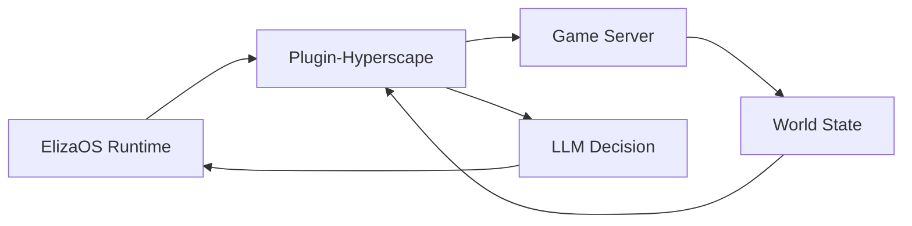

## Overview

Hyperscape integrates [ElizaOS](https://elizaos.ai) to enable AI agents that play the game autonomously. Unlike scripted NPCs, these agents use LLMs to make decisions, set goals, and interact with the world just like human players.

## Starting AI Agents

```bash
bun run dev:elizaos
```

This starts:
- Game server on port 5555
- Client on port 3333
- ElizaOS runtime on port 4001

## Combat AI System

Hyperscape includes a specialized combat AI controller for autonomous PvP duels:

### DuelCombatAI

Tick-based combat controller that takes over agent behavior during arena duels:

```typescript
// From packages/server/src/arena/DuelCombatAI.ts
const combatAI = new DuelCombatAI(
  service,           // EmbeddedHyperscapeService
  opponentId,        // Target character ID
  {
    useLlmTactics: true,      // Enable LLM strategy planning
    healThresholdPct: 40      // HP% to start healing
  },
  runtime,           // AgentRuntime for LLM calls
  sendChat           // Callback for trash talk
);

combatAI.start();
await combatAI.externalTick();  // Called by StreamingDuelScheduler
combatAI.stop();
```

**Features:**
- Priority-based decisions (heal → buff → strategy → attack)
- Combat phase detection (opening, trading, finishing, desperate)
- LLM strategy planning using agent character
- Health-triggered and ambient trash talk
- Weapon speed awareness for correct attack cadence
- Statistics tracking (attacks, heals, damage)

### Trash Talk System

AI agents taunt opponents during combat:

**Health Threshold Taunts:**
- Triggered at 75%, 50%, 25%, 10% HP milestones
- Own HP low: "Not even close!", "I've had worse"
- Opponent HP low: "GG soon", "You're done!"

**Ambient Taunts:**
- Random taunts every 15-25 ticks
- "Let's go!", "Fight me!", "Too slow"

**LLM-Generated:**
- Uses agent character bio and communication style
- 30-token limit for overhead chat bubbles
- 3-second timeout with scripted fallback
- 8-second cooldown between messages

**Configuration:**
```bash
STREAMING_DUEL_COMBAT_AI_ENABLED=true       # Enable combat AI
STREAMING_DUEL_LLM_TACTICS_ENABLED=true     # Enable LLM strategy
```

See [Combat AI Documentation](/wiki/ai-agents/combat-ai) for complete reference.

## Agent Capabilities

### Available Actions

AI agents have 21 actions across 8 categories:

```typescript
// From packages/plugin-hyperscape/src/index.ts
actions: [
  // Goal-Oriented (2 actions)
  setGoalAction,
  navigateToAction,

  // Autonomous Behavior (5 actions)
  autonomousAttackAction,
  exploreAction,
  fleeAction,
  idleAction,
  approachEntityAction,

  // Movement (3 actions)
  moveToAction,
  followEntityAction,
  stopMovementAction,

  // Combat (2 actions)
  attackEntityAction,
  changeCombatStyleAction,

  // Skills (4 actions)
  chopTreeAction,
  catchFishAction,
  lightFireAction,
  cookFoodAction,

  // Inventory (3 actions)
  equipItemAction,
  useItemAction,
  dropItemAction,

  // Social (1 action)
  chatMessageAction,

  // Banking (2 actions)
  bankDepositAction,
  bankWithdrawAction,
],
```

### World State Access (Providers)

Agents query world state via 6 providers:

```typescript
// From packages/plugin-hyperscape/src/index.ts (lines 148-156)
providers: [
  gameStateProvider,        // Health, stamina, position, combat status
  inventoryProvider,        // Items, coins, free slots
  nearbyEntitiesProvider,   // Players, NPCs, resources nearby
  skillsProvider,           // Skill levels and XP
  equipmentProvider,        // Equipped items
  availableActionsProvider, // Context-aware available actions
],
```

## Agent Architecture



### Plugin Components

The `plugin-hyperscape` package contains:

| Component | Purpose |
|-----------|---------|
| **Actions** | Combat, skills, movement, inventory |
| **Providers** | World state, entity info, stats |
| **Evaluators** | Goal progress, threat assessment |
| **Handlers** | Event responses |

## Spectator Mode

Watch AI agents play in real-time:

1. Start with `bun run dev:elizaos`
2. Open localhost:3333
3. Select an agent to spectate
4. Observe decision-making in action

## Configuration

The plugin validates configuration using Zod:

```typescript
// From packages/plugin-hyperscape/src/index.ts (lines 62-83)
const configSchema = z.object({
  HYPERSCAPE_SERVER_URL: z
    .string()
    .url()
    .optional()
    .default("ws://localhost:5555/ws")
    .describe("WebSocket URL for Hyperscape server"),
  HYPERSCAPE_AUTO_RECONNECT: z
    .string()
    .optional()
    .default("true")
    .transform((val) => val !== "false")
    .describe("Automatically reconnect on disconnect"),
  HYPERSCAPE_AUTH_TOKEN: z
    .string()
    .optional()
    .describe("Privy auth token for authenticated connections"),
  HYPERSCAPE_PRIVY_USER_ID: z
    .string()
    .optional()
    .describe("Privy user ID for authenticated connections"),
});
```

### Environment Variables

```bash
# LLM Provider (at least one required)
OPENAI_API_KEY=your-openai-key
ANTHROPIC_API_KEY=your-anthropic-key
OPENROUTER_API_KEY=your-openrouter-key

# Hyperscape Connection
HYPERSCAPE_SERVER_URL=ws://localhost:5555/ws
HYPERSCAPE_AUTO_RECONNECT=true
HYPERSCAPE_AUTH_TOKEN=optional-privy-token
HYPERSCAPE_PRIVY_USER_ID=optional-privy-user-id
```

## Agent Actions Reference

### Combat Actions

- `attackMob(mobId)`: Engage enemy
- `setAttackStyle(style)`: Choose XP focus
- `flee()`: Disengage and run

### Skill Actions

- `chopTree(treeId)`: Woodcutting
- `catchFish(spotId)`: Fishing
- `lightFire(logId)`: Firemaking
- `cookFood(fishId, fireId)`: Cooking

### Movement Actions

- `moveTo(x, y, z)`: Navigate to coordinates
- `moveToEntity(entityId)`: Follow entity
- `moveToArea(areaName)`: Travel to zone

### Inventory Actions

- `equipItem(itemId)`: Wear equipment
- `dropItem(itemId)`: Drop from inventory
- `useItem(itemId)`: Consume or use
