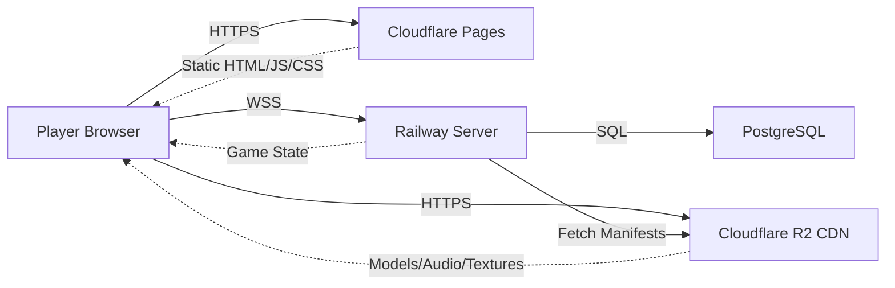

## Deployment Overview

Hyperscape uses a **split deployment architecture** for optimal performance and scalability:

- **Frontend**: Cloudflare Pages (hyperscape.club, hyperscape.pages.dev)
- **Backend/API**: Railway (hyperscape-production.up.railway.app)
- **Database**: PostgreSQL via Neon or Railway
- **Assets/CDN**: Cloudflare R2 (assets.hyperscape.club)

This architecture separates static frontend hosting from dynamic game server operations, enabling:
- Global CDN distribution for frontend assets
- Dedicated compute resources for game server
- Independent scaling of frontend and backend
- Automatic manifest fetching from CDN at server startup

## Environment Variables

### Server Production

```bash
# Required
DATABASE_URL=postgresql://...
JWT_SECRET=your-secret-key
PRIVY_APP_ID=your-app-id
PRIVY_APP_SECRET=your-app-secret

# Optional
PORT=5555
PUBLIC_CDN_URL=https://cdn.example.com
LIVEKIT_API_KEY=...
LIVEKIT_API_SECRET=...
```

### Client Production

```bash
PUBLIC_PRIVY_APP_ID=your-app-id
PUBLIC_API_URL=https://api.hyperscape.lol
PUBLIC_WS_URL=wss://api.hyperscape.lol
PUBLIC_CDN_URL=https://cdn.hyperscape.lol
```

<Warning>
  `PUBLIC_PRIVY_APP_ID` must match between client and server.
</Warning>

## Railway Deployment (Backend/API)

Railway hosts the game server with automatic deployments via GitHub Actions.

### Automated Deployment

The repository includes a GitHub Actions workflow that automatically deploys to Railway on every push to `main`:

```yaml
# .github/workflows/deploy-railway.yml
on:
  push:
    branches: [main]
    paths:
      - 'packages/shared/**'
      - 'packages/server/**'
      - 'packages/client/**'
      - 'nixpacks.toml'
      - 'Dockerfile.server'
```

**Deployment triggers:**
- Changes to shared, server, or client packages
- Updates to build configuration (nixpacks.toml, Dockerfile.server)
- Manual workflow dispatch

### Build Configuration

Railway uses **Nixpacks** for builds (configured in `nixpacks.toml`):

```toml
[phases.setup]
aptPkgs = ["python3", "make", "g++", "pkg-config", "libcairo2-dev"]

[phases.install]
cmds = ["bun install"]

[phases.build]
cmds = [
  "bun run build:shared",
  "bun run build:server",
  "mkdir -p packages/server/world/assets/manifests"
]

[start]
cmd = "cd packages/server && bun dist/index.js"

[variables]
CI = "true"
SKIP_ASSETS = "true"  # Assets served from Cloudflare R2
```

**Key features:**
- Skips asset download (served from CDN)
- Builds shared and server packages only
- Creates manifests directory for CDN-fetched manifests
- Uses Bun for fast installs and runtime

### Manual Deployment

<Steps>
  <Step title="Create Railway project">
    1. Go to [railway.app](https://railway.app)
    2. Create new project from GitHub repo
    3. Select `HyperscapeAI/hyperscape`
  </Step>
  
  <Step title="Configure service">
    - **Builder**: Nixpacks (auto-detected from nixpacks.toml)
    - **Root directory**: Leave as repository root
    - **Start command**: `cd packages/server && bun dist/index.js`
  </Step>
  
  <Step title="Add PostgreSQL">
    Add PostgreSQL service from Railway marketplace and link to your service.
  </Step>
  
  <Step title="Set environment variables">
    Required variables:
    ```bash
    DATABASE_URL=${{Postgres.DATABASE_URL}}  # Auto-linked
    JWT_SECRET=<generate-with-openssl-rand-base64-32>
    PRIVY_APP_ID=<from-privy-dashboard>
    PRIVY_APP_SECRET=<from-privy-dashboard>
    PUBLIC_CDN_URL=https://assets.hyperscape.club
    NODE_ENV=production
    ```
  </Step>
  
  <Step title="Configure GitHub Actions">
    Add Railway secrets to GitHub repository:
    - `RAILWAY_TOKEN`: API token from Railway dashboard
    - Project/service IDs are in `.github/workflows/deploy-railway.yml`
  </Step>
</Steps>

### Manifest Fetching

The server automatically fetches game manifests from the CDN at startup:

```typescript
// packages/server/src/startup/config.ts
await fetchManifestsFromCDN(CDN_URL, manifestsDir, NODE_ENV);
```

**Fetched manifests:**
- items.json, npcs.json, resources.json, tools.json
- biomes.json, world-areas.json, stores.json
- music.json, vegetation.json, buildings.json

**Behavior:**
- **Production**: Always fetches from CDN
- **Development**: Skips if local manifests exist
- **CI/Test**: Skips with `SKIP_MANIFESTS=true`

<Info>
Manifests are cached locally in `packages/server/world/assets/manifests/` with 5-minute cache headers for efficient updates.
</Info>

## Cloudflare Pages Deployment (Frontend)

The frontend is deployed to Cloudflare Pages with automatic deployments from GitHub.

### Production Domains

- **Primary**: https://hyperscape.club
- **Pages**: https://hyperscape.pages.dev
- **Preview**: `<branch>.hyperscape.pages.dev` (automatic for PRs)

### Build Configuration

**Framework preset**: None (Vite)  
**Build command**: `cd packages/client && bun run build`  
**Build output directory**: `packages/client/dist`  
**Root directory**: `/` (repository root)

### Environment Variables

Set in Cloudflare Pages dashboard → Settings → Environment variables:

```bash
# Required
PUBLIC_PRIVY_APP_ID=<from-privy-dashboard>

# Production API endpoints
PUBLIC_API_URL=https://hyperscape-production.up.railway.app
PUBLIC_WS_URL=wss://hyperscape-production.up.railway.app/ws
PUBLIC_CDN_URL=https://assets.hyperscape.club

# Optional
PUBLIC_APP_URL=https://hyperscape.club
```

<Warning>
`PUBLIC_PRIVY_APP_ID` must match the `PRIVY_APP_ID` set in Railway server environment.
</Warning>

### CORS Configuration

The server automatically allows Cloudflare Pages domains:

```typescript
// packages/server/src/startup/http-server.ts
const allowedOrigins = [
  "https://hyperscape.club",
  "https://www.hyperscape.club",
  "https://hyperscape.pages.dev",
  /^https?:\/\/.+\.hyperscape\.pages\.dev$/,  // Preview deployments
];
```

### Alternative: Vercel Deployment

<Steps>
  <Step title="Import project">
    Import `packages/client` directory to Vercel.
  </Step>
  
  <Step title="Configure build">
    - **Root directory**: `packages/client`
    - **Build command**: `bun run build`
    - **Output directory**: `dist`
    - **Install command**: `bun install`
  </Step>
  
  <Step title="Set environment variables">
    Add all `PUBLIC_*` environment variables listed above.
  </Step>
</Steps>

## Database Setup

### Neon PostgreSQL

1. Create database at [neon.tech](https://neon.tech)
2. Copy connection string
3. Set as `DATABASE_URL` in server environment

### Migrations

```bash
cd packages/server
bunx drizzle-kit push      # Apply schema
bunx drizzle-kit migrate   # Run migrations
```

## CDN Setup

### Production: Cloudflare R2

Hyperscape uses Cloudflare R2 for production asset hosting:

**Domain**: https://assets.hyperscape.club  
**Bucket**: Cloudflare R2 with public access

**Asset structure:**
```
assets.hyperscape.club/
├── manifests/          # Game data (items.json, npcs.json, etc.)
├── models/             # 3D models (.glb)
├── audio/              # Music and sound effects
└── textures/           # Texture files
```

**Upload assets:**
```bash
# Sync local assets to R2 (requires Cloudflare credentials)
bun run sync:r2
bun run sync:r2:dry     # Preview changes
```

### Development: Local Docker CDN

Use the included nginx CDN for local development:

```bash
bun run cdn:up          # Start CDN container
bun run cdn:down        # Stop CDN container
bun run cdn:restart     # Force restart
```

**Configuration** (`packages/server/docker-compose.yml`):
```yaml
services:
  cdn:
    image: nginx:alpine
    ports:
      - "8080:80"
    volumes:
      - ../../assets:/usr/share/nginx/html:ro
```

**Verify CDN:**
```bash
bun run cdn:verify      # Check CDN is serving assets
```

### Alternative: Self-Hosted Cloud Storage

Upload assets to S3, R2, or similar:

1. Build assets: `bun run assets:optimize`
2. Upload `assets/` directory to your bucket
3. Set `PUBLIC_CDN_URL` to bucket URL (both client and server)
4. Ensure manifests are publicly accessible at `<CDN_URL>/manifests/`

## Production Checklist

### Infrastructure
- [ ] Railway project created and linked to GitHub
- [ ] Cloudflare Pages project created
- [ ] PostgreSQL database provisioned (Neon or Railway)
- [ ] Cloudflare R2 bucket created for assets
- [ ] Custom domains configured (optional)

### Configuration
- [ ] Server environment variables set in Railway
- [ ] Client environment variables set in Cloudflare Pages
- [ ] Privy App ID and Secret configured (both client and server)
- [ ] JWT_SECRET generated (32+ characters)
- [ ] ADMIN_CODE set for production security

### Assets & CDN
- [ ] Assets uploaded to Cloudflare R2
- [ ] Manifests publicly accessible at `<CDN_URL>/manifests/`
- [ ] PUBLIC_CDN_URL configured in both client and server
- [ ] CDN CORS headers configured for cross-origin access

### Security
- [ ] SSL/TLS enabled (automatic with Railway and Cloudflare)
- [ ] WebSocket URL uses wss:// protocol
- [ ] Rate limiting enabled (automatic in production)
- [ ] CORS origins configured for production domains

### Verification
- [ ] Server health check responds: `https://<server>/status`
- [ ] Frontend loads: `https://hyperscape.club`
- [ ] WebSocket connects successfully
- [ ] Assets load from CDN (check browser network tab)
- [ ] Authentication works (Privy login flow)

## Deployment Architecture Diagram



## Troubleshooting Deployments

### Railway Build Failures

**Issue**: Build fails with "lockfile had changes"

**Solution**: Regenerate lockfile locally and commit:
```bash
bun install
git add bun.lock
git commit -m "chore: update bun.lock"
```

### Frontend Not Loading

**Issue**: Railway serves 503 "Frontend not available"

**Cause**: Client build not copied to server's public directory

**Solution**: Verify build phase in `nixpacks.toml` includes:
```bash
cp -r packages/client/dist/* packages/server/public/
```

### Manifests Not Loading

**Issue**: Server logs "Failed to fetch manifests from CDN"

**Solutions**:
1. Verify `PUBLIC_CDN_URL` is set correctly
2. Check manifests are publicly accessible: `curl <CDN_URL>/manifests/items.json`
3. Ensure CORS headers allow server origin
4. In development, manifests can be local (skips CDN fetch)

### CORS Errors

**Issue**: Browser console shows CORS errors

**Solution**: Verify allowed origins in `packages/server/src/startup/http-server.ts`:
```typescript
const allowedOrigins = [
  "https://hyperscape.club",
  "https://hyperscape.pages.dev",
  /^https?:\/\/.+\.hyperscape\.pages\.dev$/,
];
```

Add your custom domain if using one.
