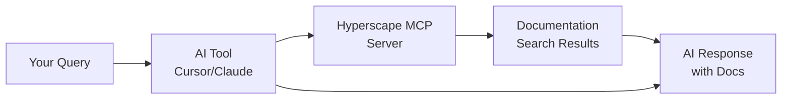

# MCP Server

Connect your AI coding tools directly to Hyperscape documentation using the [Model Context Protocol (MCP)](https://www.mintlify.com/docs/ai/model-context-protocol). This allows Claude, Cursor, VS Code, and other AI tools to search our documentation in real-time while generating responses.

<Info>
MCP is an open protocol that creates standardized connections between AI applications and external services. When connected, your AI tool can proactively search Hyperscape documentation during response generation.
</Info>

## Hyperscape MCP Server URL

<CodeGroup>
```text MCP Server URL
https://hyperscape-ai.mintlify.app/mcp
```
</CodeGroup>

---

## Benefits

<CardGroup cols={2}>
  <Card title="Real-Time Documentation" icon="bolt">
    AI tools search our docs during response generation, not just when asked
  </Card>
  <Card title="Accurate Answers" icon="bullseye">
    Get precise Hyperscape-specific guidance instead of generic responses
  </Card>
  <Card title="Always Up-to-Date" icon="rotate">
    Documentation updates are immediately available to your AI tools
  </Card>
  <Card title="Contextual Search" icon="magnifying-glass">
    AI determines relevance and searches automatically based on your questions
  </Card>
</CardGroup>

---

## Connect Your AI Tool

Select your AI tool below for setup instructions:

<Tabs>
  <Tab title="Cursor">
    ### Step 1: Open MCP Settings

    1. Press `Ctrl + Shift + P` (Windows/Linux) or `Cmd + Shift + P` (macOS) to open the command palette
    2. Search for **"Open MCP settings"**
    3. Select **Add custom MCP** to open the `mcp.json` file

    ### Step 2: Add Configuration

    Add the following to your `mcp.json`:

    <CodeGroup>
    ```json mcp.json
    {
      "mcpServers": {
        "Hyperscape": {
          "url": "https://hyperscape-ai.mintlify.app/mcp"
        }
      }
    }
    ```
    </CodeGroup>

    ### Step 3: Test the Connection

    In Cursor's chat, ask:

    > "What tools do you have available?"

    Cursor should show **Hyperscape** as an available MCP tool.

    ### Step 4: Start Using It

    Ask Cursor questions about Hyperscape development:

    - "How do I set up the Hyperscape development environment?"
    - "What are the combat constants in Hyperscape?"
    - "How does the ECS system work in Hyperscape?"

    <Tip>
    See the [Cursor MCP documentation](https://docs.cursor.com/context/model-context-protocol) for more details.
    </Tip>
  </Tab>

  <Tab title="Claude Code">
    ### Step 1: Add the MCP Server

    Run the following command in your terminal:

    <CodeGroup>
    ```bash Add MCP Server
    claude mcp add --transport http Hyperscape https://hyperscape-ai.mintlify.app/mcp
    ```
    </CodeGroup>

    ### Step 2: Verify the Connection

    Check that the server was added:

    <CodeGroup>
    ```bash Verify Connection
    claude mcp list
    ```
    </CodeGroup>

    You should see `Hyperscape` in the list of connected MCP servers.

    ### Step 3: Start Using It

    Claude Code will now automatically search Hyperscape documentation when relevant to your questions. Try asking:

    - "How do I set up the Hyperscape development environment?"
    - "What are the combat constants in Hyperscape?"
    - "How does the ECS system work in Hyperscape?"

    <Tip>
    See the [Claude Code MCP documentation](https://docs.anthropic.com/en/docs/claude-code/mcp) for more details.
    </Tip>
  </Tab>

  <Tab title="VS Code">
    ### Step 1: Create MCP Configuration File

    Create a `.vscode/mcp.json` file in your project root:

    <CodeGroup>
    ```json .vscode/mcp.json
    {
      "servers": {
        "Hyperscape": {
          "type": "http",
          "url": "https://hyperscape-ai.mintlify.app/mcp"
        }
      }
    }
    ```
    </CodeGroup>

    ### Step 2: Reload VS Code

    Reload your VS Code window to apply the MCP configuration (`Ctrl + Shift + P` → "Reload Window").

    ### Step 3: Test the Connection

    Use the VS Code Copilot chat to ask questions about Hyperscape:

    - "How do I set up the Hyperscape development environment?"
    - "What are the combat constants in Hyperscape?"
    - "How does the ECS system work in Hyperscape?"

    <Tip>
    See the [VS Code MCP documentation](https://code.visualstudio.com/docs/copilot/chat/mcp-servers) for more details.
    </Tip>
  </Tab>

  <Tab title="Claude Web/Desktop">
    ### Step 1: Navigate to Connectors

    1. Open [Claude](https://claude.ai) in your browser or desktop app
    2. Go to **Settings** → **Connectors**

    ### Step 2: Add Custom Connector

    1. Select **Add custom connector**
    2. Enter the following details:
       - **Name**: `Hyperscape`
       - **URL**: `https://hyperscape-ai.mintlify.app/mcp`
    3. Click **Add**

    ### Step 3: Use in Conversations

    1. When chatting with Claude, click the **attachments button** (plus icon)
    2. Select **Hyperscape** from the list
    3. Ask questions about Hyperscape development:

    - "How do I set up the Hyperscape development environment?"
    - "What are the combat constants in Hyperscape?"
    - "How does the ECS system work in Hyperscape?"

    <Tip>
    See the [Claude MCP documentation](https://support.anthropic.com/en/articles/11175166-how-to-use-the-model-context-protocol-mcp-connectors) for more details.
    </Tip>
  </Tab>
</Tabs>

---

## How It Works

When an AI tool has the Hyperscape MCP server connected:

1. **Contextual Detection**: The AI determines when Hyperscape documentation is relevant to your question
2. **Automatic Search**: The AI searches our documentation during response generation
3. **Real-Time Integration**: Search results are incorporated into the AI's response
4. **No Manual Prompting**: You don't need to explicitly ask the AI to search the docs



---

## Example Queries

Once connected, try asking your AI tool:

<Accordion title="Development Setup">
- "How do I install Hyperscape locally?"
- "What are the prerequisites for running the dev server?"
- "How do I run the game with AI agents?"
</Accordion>

<Accordion title="Architecture Questions">
- "Explain the Entity Component System in Hyperscape"
- "How does the combat system calculate damage?"
- "What is the tick duration in Hyperscape?"
</Accordion>

<Accordion title="AI Agent Development">
- "What actions are available for ElizaOS agents?"
- "How do I create a new AI agent action?"
- "What providers give context to AI agents?"
</Accordion>

<Accordion title="Game Systems">
- "How does the banking system work?"
- "What are the mob AI states?"
- "How are ground items handled?"
</Accordion>

---

## Troubleshooting

<Tabs>
  <Tab title="Cursor">
    **MCP server not appearing?**
    - Press `Ctrl + Shift + P` and search "Open MCP settings"
    - Verify your `mcp.json` has valid JSON syntax (no trailing commas)
    - Restart Cursor after saving the configuration

    **Not getting Hyperscape-specific answers?**
    - Mention "Hyperscape" explicitly in your question
    - Check that the MCP server shows as connected in Cursor's tools
  </Tab>

  <Tab title="Claude Code">
    **Server not added?**
    - Ensure you have the latest Claude Code installed
    - Run `claude mcp list` to verify the server was added
    - Try removing and re-adding: `claude mcp remove Hyperscape` then add again

    **Connection issues?**
    - Check your internet connection
    - Verify the URL is exactly `https://hyperscape-ai.mintlify.app/mcp`
  </Tab>

  <Tab title="VS Code">
    **Configuration not recognized?**
    - Ensure the file is at `.vscode/mcp.json` (not just `mcp.json`)
    - Reload VS Code window after creating the file
    - Check for JSON syntax errors

    **Copilot not using the MCP?**
    - Make sure you have GitHub Copilot extension installed
    - Verify MCP support is enabled in your VS Code version
  </Tab>

  <Tab title="Claude Web/Desktop">
    **Connector not showing?**
    - Go to Settings → Connectors and verify Hyperscape is listed
    - Try removing and re-adding the connector
    - Refresh the Claude page/app

    **Can't find attachments button?**
    - Look for the **+** icon in the chat input area
    - The connector must be added before it appears in the list
  </Tab>
</Tabs>

---

## Related Resources

- [Mintlify MCP Documentation](https://www.mintlify.com/docs/ai/model-context-protocol)
- [Model Context Protocol Specification](https://modelcontextprotocol.io/)
- [Cursor MCP Guide](https://docs.cursor.com/context/model-context-protocol)
- [Claude Code MCP Guide](https://docs.anthropic.com/en/docs/claude-code/mcp)
