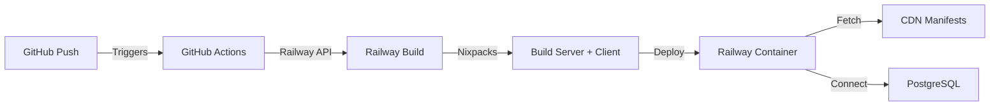

## Overview

Hyperscape uses **Railway** for backend deployment with automated GitHub Actions integration. The server handles both API requests and serves the built frontend for unified deployment.

## Architecture



### Services

| Service | Platform | URL |
|---------|----------|-----|
| **Backend/API** | Railway | `hyperscape-production.up.railway.app` |
| **Frontend** | Cloudflare Pages | `hyperscape.club` |
| **Database** | Railway PostgreSQL | Internal |
| **Assets/CDN** | Cloudflare R2 | `cdn.hyperscape.club` |

## Automated Deployment

### GitHub Actions Workflow

Deployments trigger automatically on push to `main`:

```yaml
# .github/workflows/deploy-railway.yml
on:
  push:
    branches:
      - main
    paths:
      - 'packages/shared/**'
      - 'packages/client/**'
      - 'packages/server/**'
      - 'packages/plugin-hyperscape/**'
      - 'package.json'
      - 'bun.lock'
      - 'nixpacks.toml'
      - 'railway.server.json'
      - 'Dockerfile.server'
```

**Workflow Steps**:
1. Checkout code
2. Trigger Railway deployment via GraphQL API
3. Wait for deployment to start
4. Poll deployment status (5 attempts, 30s intervals)
5. Report success or failure

### Required Secrets

Configure in GitHub repository settings:

| Secret | Purpose | Where to Get |
|--------|---------|--------------|
| `RAILWAY_TOKEN` | API authentication | Railway dashboard → Account → Tokens |

**Project IDs** are hardcoded in the workflow:
- `RAILWAY_PROJECT_ID`: `e5f5ba11-0380-4d71-aa0b-343d89a58c0d`
- `RAILWAY_SERVICE_ID`: `f0b42e3b-3001-4ef1-926f-af6c3c138777`
- `RAILWAY_ENVIRONMENT_ID`: `194f3565-ba2f-4c98-87d2-85dfc3a5110b`

## Build Configuration

### Nixpacks (`nixpacks.toml`)

Railway uses Nixpacks for builds:

```toml
[phases.setup]
# Install system dependencies for native modules
aptPkgs = [
  "python3", "make", "g++", "pkg-config",
  "libcairo2-dev", "libpango1.0-dev", "libjpeg-dev",
  "libgif-dev", "librsvg2-dev", "ca-certificates"
]

[phases.install]
cmds = ["bun install"]

[phases.build]
cmds = [
  "bun run build:shared",
  "bun run build:server",
  "bun run build:client",
  "cp -r packages/client/dist/* packages/server/public/"
]

[start]
cmd = "cd packages/server && bun dist/index.js"

[variables]
CI = "true"
SKIP_ASSETS = "true"
NODE_ENV = "production"
TURBO_FORCE = "true"
```

**Key Features**:
- Builds shared, server, AND client in single deployment
- Copies client build to server's `public/` directory
- Skips asset download (manifests fetched from CDN at runtime)
- Forces fresh Turbo builds (no cache)

### Alternative: Docker Build

For Docker-based deployments, use `Dockerfile.server`:

```dockerfile
# Multi-stage build
FROM oven/bun:1.1.38-debian AS builder
# ... install deps, build packages

FROM oven/bun:1.1.38-debian AS runtime
# ... copy built artifacts, minimal runtime
CMD ["bun", "run", "start"]
```

**Build from repo root**:
```bash
docker build -f Dockerfile.server -t hyperscape-server .
docker run -p 5555:5555 hyperscape-server
```

## Environment Variables

### Required

```bash
# Database (auto-set by Railway PostgreSQL service)
DATABASE_URL=postgresql://...

# Security
JWT_SECRET=your-random-secret-key

# Authentication
PRIVY_APP_ID=your-privy-app-id
PRIVY_APP_SECRET=your-privy-app-secret

# Assets
PUBLIC_CDN_URL=https://cdn.hyperscape.club
```

### Optional

```bash
# Server
PORT=5555
NODE_ENV=production

# Deployment Tracking
COMMIT_HASH=abc123def456

# ElizaOS Integration
ELIZAOS_URL=https://your-elizaos-instance.com
```

### Railway-Specific

Railway automatically sets these:

| Variable | Purpose |
|----------|---------|
| `RAILWAY_ENVIRONMENT` | Environment name (production/staging) |
| `RAILWAY_SERVICE_ID` | Service identifier |
| `DATABASE_URL` | PostgreSQL connection string (if service added) |

## Manifest Fetching

The server **fetches manifests from CDN at startup** instead of bundling them:

```typescript
// From packages/server/src/startup/config.ts
await fetchManifestsFromCDN(CDN_URL, manifestsDir, NODE_ENV);
```

**Fetched Manifests**:
- `items.json`
- `npcs.json`
- `resources.json`
- `tools.json`
- `biomes.json`
- `world-areas.json`
- `stores.json`
- `music.json`
- `vegetation.json`
- `buildings.json`

**Behavior**:
- **Production**: Always fetches from `PUBLIC_CDN_URL`
- **Development**: Skips if local manifests exist
- **Fallback**: Uses existing local manifests if CDN fetch fails

Manifests are cached in `packages/server/world/assets/manifests/` and served to clients via `/manifests/` route with 5-minute cache headers.

## CORS Configuration

The server accepts requests from multiple origins:

**Production Domains**:
- `https://hyperscape.club`
- `https://www.hyperscape.club`
- `https://hyperscape.pages.dev`
- `http://hyperscape.pages.dev` (HTTP fallback)
- `https://hyperscape-production.up.railway.app`

**Dynamic Patterns**:
- `http://localhost:*` (any localhost port)
- `https://*.hyperscape.pages.dev` (Cloudflare preview deployments)
- `https://*.up.railway.app` (Railway preview deployments)

**Configuration**: `packages/server/src/startup/http-server.ts`

## Frontend Serving

The server serves the built client from `public/` directory:

**Routes**:
- `/` → `public/index.html` (no-cache headers)
- `/assets/*` → Client assets (if they exist in `public/assets/`)
- `/manifests/*` → Game data manifests (5-minute cache)
- `/assets/world/*` → World assets (1-year cache, immutable)

**SPA Catch-All**: Any non-API route serves `index.html` for client-side routing.

## Debugging

### Debug Endpoints

**Check public directory contents**:
```bash
curl https://hyperscape-production.up.railway.app/debug/public
```

Returns:
```json
{
  "publicDir": "/app/packages/server/public",
  "assetsDir": "/app/packages/server/public/assets",
  "publicContents": ["index.html", "assets", "favicon.ico", ...],
  "assetsContents": ["index-abc123.js", "index-def456.css", ...]
}
```

### Build Verification

Railway build logs show:
```
=== Building shared package ===
=== Building server package ===
=== Building client package ===
=== Copying client to server public ===
=== Build complete ===
```

### Health Check

```bash
curl https://hyperscape-production.up.railway.app/status
```

## Manual Setup

If not using GitHub Actions:

<Steps>
  <Step title="Create Railway project">
    1. Go to [railway.app](https://railway.app)
    2. Create new project from GitHub repo
    3. Select `HyperscapeAI/hyperscape`
  </Step>

  <Step title="Configure service">
    - **Builder**: Nixpacks (auto-detected)
    - **Root Directory**: `/` (monorepo root)
    - **Start Command**: `cd packages/server && bun dist/index.js`
  </Step>

  <Step title="Add PostgreSQL">
    1. Click "New" → "Database" → "PostgreSQL"
    2. Railway automatically sets `DATABASE_URL`
  </Step>

  <Step title="Set environment variables">
    Add in Railway dashboard:
    ```bash
    JWT_SECRET=your-random-secret
    PRIVY_APP_ID=your-privy-app-id
    PRIVY_APP_SECRET=your-privy-app-secret
    PUBLIC_CDN_URL=https://cdn.hyperscape.club
    NODE_ENV=production
    ```
  </Step>

  <Step title="Deploy">
    Click "Deploy" or push to main branch.
  </Step>
</Steps>

## Troubleshooting

### Build Fails

**Check Railway logs** for error messages:
- Missing dependencies → Add to `nixpacks.toml` aptPkgs
- Build timeout → Optimize build steps
- Out of memory → Upgrade Railway plan

### Frontend Not Loading

**Symptom**: 503 error or "Frontend not available"

**Cause**: Client build not copied to `public/`

**Solution**: Verify build command includes:
```bash
cp -r packages/client/dist/* packages/server/public/
```

### Manifests Not Loading

**Symptom**: Game data missing or errors about missing manifests

**Cause**: CDN fetch failed and no local manifests exist

**Solution**:
1. Verify `PUBLIC_CDN_URL` is set correctly
2. Check CDN is accessible from Railway
3. Ensure manifests exist at `${PUBLIC_CDN_URL}/manifests/`

### Database Connection Failed

**Symptom**: Server crashes with database errors

**Cause**: `DATABASE_URL` not set or PostgreSQL service not added

**Solution**:
1. Add PostgreSQL service in Railway dashboard
2. Verify `DATABASE_URL` is set automatically
3. Run migrations: `bunx drizzle-kit push`

## Production Checklist

- [ ] Railway project created and connected to GitHub
- [ ] PostgreSQL service added
- [ ] Environment variables configured (JWT_SECRET, PRIVY_*, PUBLIC_CDN_URL)
- [ ] GitHub Actions secrets set (RAILWAY_TOKEN)
- [ ] Build succeeds and server starts
- [ ] Frontend accessible at Railway URL
- [ ] WebSocket connections working
- [ ] Manifests fetched from CDN successfully
- [ ] Database migrations applied

## Related Documentation

- [Deployment Overview](/guides/deployment)
- [Configuration](/devops/configuration)
- [Docker Setup](/devops/docker)
- [Troubleshooting](/devops/troubleshooting)
