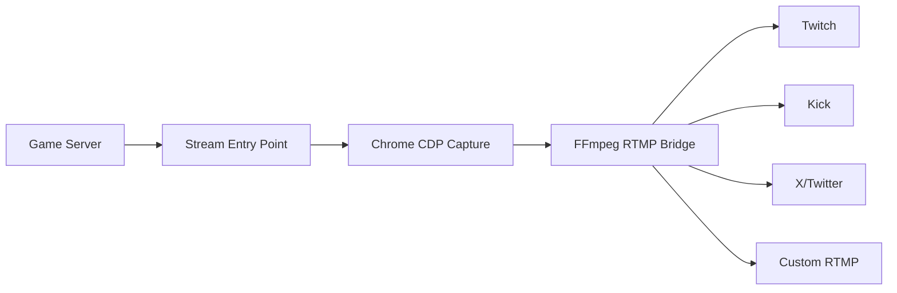

## Overview

Hyperscape includes a production-ready streaming infrastructure for broadcasting AI vs AI duel arena matches to multiple platforms simultaneously (Twitch, Kick, X/Twitter, YouTube).

## Architecture



### Components

| Component | Purpose |
|-----------|---------|
| **Stream Entry Point** | Dedicated `stream.html` / `stream.tsx` for optimized capture |
| **CDP Capture** | Chrome DevTools Protocol for frame capture |
| **RTMP Bridge** | FFmpeg multiplexer for multi-platform streaming |
| **Viewer Access Control** | Token-based access for trusted viewers |
| **Stream Destinations** | Auto-detection and management of RTMP endpoints |

## Stream Entry Points

### Dedicated Stream Client

Hyperscape includes dedicated entry points optimized for streaming capture:

**Files:**
- `packages/client/src/stream.html` - HTML entry point
- `packages/client/src/stream.tsx` - React streaming client
- `packages/client/vite.config.ts` - Multi-page build configuration

**Features:**
- Optimized for headless browser capture
- Minimal UI overhead
- WebGPU-optimized rendering
- Separate from main game client

**Access:**
```bash
# Development
http://localhost:3333/?page=stream

# Production
https://hyperscape.gg/?page=stream
```

### Client Viewport Mode Detection

The `clientViewportMode` utility detects the current rendering mode:

```typescript
import { clientViewportMode } from '@hyperscape/shared';

const mode = clientViewportMode();
// Returns: 'stream' | 'spectator' | 'normal'
```

**Use Cases:**
- Disable UI elements in stream mode
- Optimize rendering for capture
- Enable spectator-specific features

## Stream Capture

### Chrome DevTools Protocol (CDP)

Hyperscape uses CDP for high-performance frame capture:

**Configuration:**
```bash
# Capture mode
STREAM_CAPTURE_MODE=cdp                         # cdp (default), mediarecorder, or webcodecs

# Chrome configuration
STREAM_CAPTURE_HEADLESS=false                   # false (Xorg/Xvfb), new (headless modes)
STREAM_CAPTURE_CHANNEL=chrome-dev               # Use Chrome Dev channel for WebGPU
STREAM_CAPTURE_ANGLE=vulkan                     # vulkan (default), gl, or swiftshader
STREAM_CAPTURE_EXECUTABLE=/usr/bin/google-chrome-unstable  # Explicit Chrome path (optional)

# Capture quality
STREAM_CDP_QUALITY=80                           # JPEG quality for CDP screencast (1-100)
STREAM_FPS=30                                   # Target frames per second
STREAM_CAPTURE_WIDTH=1280                       # Capture resolution width (must be even)
STREAM_CAPTURE_HEIGHT=720                       # Capture resolution height (must be even)
STREAM_GOP_SIZE=60                              # GOP size in frames (default: 60)
```

### WebGPU Buffer Upload Fallback

Handles `mappedAtCreation` failures gracefully:

```typescript
// From packages/shared/src/utils/rendering/webgpuBufferUploads.ts
try {
  buffer = device.createBuffer({ mappedAtCreation: true, ... });
} catch (error) {
  // Fallback: create unmapped buffer and write data separately
  buffer = device.createBuffer({ mappedAtCreation: false, ... });
  device.queue.writeBuffer(buffer, 0, data);
}
```

**Impact:** Improves WebGPU stability on various GPU drivers.

## RTMP Streaming

### Stream Destinations

Hyperscape supports multiple RTMP destinations with auto-detection:

**Supported Platforms:**
- Twitch
- Kick (RTMPS)
- X/Twitter
- YouTube (deprecated)
- Custom RTMP servers

**Auto-Detection:**
```bash
# Stream destinations auto-detected from configured keys
# Uses || logic: TWITCH_RTMP_STREAM_KEY || TWITCH_STREAM_KEY

# Twitch
TWITCH_RTMP_STREAM_KEY=live_123456789_abcdefghij
TWITCH_RTMP_URL=rtmp://live.twitch.tv/app       # Optional override

# Kick (RTMPS)
KICK_STREAM_KEY=your-kick-stream-key
KICK_RTMP_URL=rtmps://fa723fc1b171.global-contribute.live-video.net/app

# X/Twitter
X_STREAM_KEY=your-x-stream-key
X_RTMP_URL=rtmp://sg.pscp.tv:80/x

# Custom RTMP
CUSTOM_RTMP_NAME=Custom
CUSTOM_RTMP_URL=rtmp://your-server/live
CUSTOM_STREAM_KEY=your-key
```

**Explicit Destination Control:**
```bash
# Override auto-detection
STREAM_ENABLED_DESTINATIONS=twitch,kick,x
```

### FFmpeg RTMP Bridge

The RTMP bridge multiplexes a single stream to multiple destinations:

**Features:**
- Single encode, multiple outputs (tee muxer)
- Per-destination stream keys
- Automatic reconnection
- Health monitoring

**Configuration:**
```bash
# RTMP Bridge Settings
RTMP_BRIDGE_PORT=8765
GAME_URL=http://localhost:3333/?page=stream

# Optional local HLS output
HLS_OUTPUT_PATH=packages/server/public/live/stream.m3u8
HLS_SEGMENT_PATTERN=packages/server/public/live/stream-%09d.ts
HLS_TIME_SECONDS=2
HLS_LIST_SIZE=24
HLS_DELETE_THRESHOLD=96
HLS_START_NUMBER=1700000000
HLS_FLAGS=delete_segments+append_list+independent_segments+program_date_time+omit_endlist+temp_file
```

## Viewer Access Control

### Streaming Viewer Access Tokens

Secure access control for live streaming viewers:

**Configuration:**
```bash
# Optional secret token for trusted viewers
STREAMING_VIEWER_ACCESS_TOKEN=replace-with-random-secret-token
```

**Access Levels:**
1. **Loopback Viewers**: Always allowed (localhost connections)
2. **Trusted Viewers**: Require access token
3. **Public Viewers**: Subject to public delay

**Implementation:**
```typescript
// From packages/server/src/streaming/stream-viewer-access-token.ts
export function isAuthorizedStreamViewer(
  request: FastifyRequest,
  token?: string
): boolean {
  // Loopback always allowed
  if (isLoopbackRequest(request)) return true;
  
  // Check access token
  const configuredToken = process.env.STREAMING_VIEWER_ACCESS_TOKEN;
  if (!configuredToken) return false;
  
  return token === configuredToken;
}
```

**Usage:**
```bash
# Connect with access token
ws://localhost:5555/ws?viewerToken=your-secret-token
```

### Public Delay

Configure delay for public streaming viewers:

```bash
# Canonical output platform for timing defaults
STREAMING_CANONICAL_PLATFORM=youtube            # youtube | twitch | hls

# Override delay (milliseconds)
STREAMING_PUBLIC_DELAY_MS=15000                 # Default varies by platform
```

**Platform Defaults:**
- YouTube: 15000ms (15 seconds)
- Twitch: 12000ms (12 seconds)
- HLS: 4000ms (4 seconds)

## Deployment

### Vast.ai Deployment

Enhanced Vast.ai deployment with remote database support:

**Auto-Detection:**
```bash
# deploy-vast.sh auto-detects remote database mode
# Checks for DATABASE_URL in environment
# Sets USE_LOCAL_POSTGRES=false when remote database detected
```

**Stream Key Management:**
```bash
# Explicitly unset and re-export stream keys before PM2 start
unset TWITCH_STREAM_KEY X_STREAM_KEY X_RTMP_URL KICK_STREAM_KEY KICK_RTMP_URL
source /root/hyperscape/packages/server/.env
bunx pm2 start ecosystem.config.cjs
```

**Why This Matters:**
- Prevents stale stream keys from shell environment
- Ensures PM2 picks up correct keys from .env file
- Required for CI/CD deployments

### PM2 Configuration

Production deployment uses PM2 for process management:

```javascript
// From ecosystem.config.cjs
module.exports = {
  apps: [{
    name: "hyperscape-duel",
    script: "scripts/duel-stack.mjs",
    interpreter: "bun",
    
    env: {
      // Stream keys forwarded through PM2
      TWITCH_RTMP_STREAM_KEY: process.env.TWITCH_RTMP_STREAM_KEY || "",
      KICK_STREAM_KEY: process.env.KICK_STREAM_KEY || "",
      X_STREAM_KEY: process.env.X_STREAM_KEY || "",
      
      // Streaming configuration
      STREAMING_CANONICAL_PLATFORM: "twitch",
      STREAMING_PUBLIC_DELAY_MS: "0",
      STREAM_ENABLED_DESTINATIONS: "twitch,kick,x"
    }
  }]
};
```

### GitHub Actions Integration

Stream keys passed through CI/CD:

```yaml
# .github/workflows/deploy-vast.yml
- name: Deploy to Vast.ai
  env:
    TWITCH_RTMP_STREAM_KEY: ${{ secrets.TWITCH_RTMP_STREAM_KEY }}
    KICK_STREAM_KEY: ${{ secrets.KICK_STREAM_KEY }}
    X_STREAM_KEY: ${{ secrets.X_STREAM_KEY }}
  run: |
    # Write secrets to /tmp before git reset
    cat > /tmp/hyperscape-secrets.env << 'ENVEOF'
    TWITCH_RTMP_STREAM_KEY=${{ secrets.TWITCH_RTMP_STREAM_KEY }}
    KICK_STREAM_KEY=${{ secrets.KICK_STREAM_KEY }}
    X_STREAM_KEY=${{ secrets.X_STREAM_KEY }}
    ENVEOF
    
    # Deploy script restores from /tmp after git reset
    bash scripts/deploy-vast.sh
```

## Duel Oracle Configuration

### Oracle System

The duel oracle publishes verifiable duel outcomes to blockchain:

**Configuration:**
```bash
# Enable oracle publishing
DUEL_ARENA_ORACLE_ENABLED=true
DUEL_ARENA_ORACLE_PROFILE=testnet               # local | testnet | mainnet

# Metadata API base URL
DUEL_ARENA_ORACLE_METADATA_BASE_URL=https://your-domain.example/api/duel-arena/oracle

# Oracle record storage
DUEL_ARENA_ORACLE_STORE_PATH=/var/lib/hyperscape/duel-arena-oracle/records.json
```

### Oracle Fields

**New Fields (Commit aecab58):**
- `damageA` - Total damage dealt by participant A
- `damageB` - Total damage dealt by participant B
- `winReason` - Reason for victory ("knockout", "timeout", "forfeit")
- `seed` - Cryptographic seed for replay verification
- `replayHashHex` - Hash of replay data for integrity verification
- `resultHashHex` - Combined hash of all duel outcome data

**Database Schema:**
```sql
-- arena_rounds table
ALTER TABLE arena_rounds ADD COLUMN damage_a INTEGER;
ALTER TABLE arena_rounds ADD COLUMN damage_b INTEGER;
ALTER TABLE arena_rounds ADD COLUMN win_reason TEXT;
ALTER TABLE arena_rounds ADD COLUMN seed TEXT;
ALTER TABLE arena_rounds ADD COLUMN replay_hash_hex TEXT;
ALTER TABLE arena_rounds ADD COLUMN result_hash_hex TEXT;
```

### EVM Oracle Targets

```bash
# Shared EVM signer (works across Base, BSC, AVAX)
DUEL_ARENA_ORACLE_EVM_PRIVATE_KEY=0x...

# Base Sepolia (testnet)
DUEL_ARENA_ORACLE_BASE_SEPOLIA_RPC_URL=https://sepolia.base.org
DUEL_ARENA_ORACLE_BASE_SEPOLIA_CONTRACT_ADDRESS=0x...
DUEL_ARENA_ORACLE_BASE_SEPOLIA_PRIVATE_KEY=0x...  # Optional override

# BSC Testnet
DUEL_ARENA_ORACLE_BSC_TESTNET_RPC_URL=https://data-seed-prebsc-1-s1.binance.org:8545
DUEL_ARENA_ORACLE_BSC_TESTNET_CONTRACT_ADDRESS=0x...
DUEL_ARENA_ORACLE_BSC_TESTNET_PRIVATE_KEY=0x...   # Optional override

# Base Mainnet
DUEL_ARENA_ORACLE_BASE_MAINNET_RPC_URL=https://mainnet.base.org
DUEL_ARENA_ORACLE_BASE_MAINNET_CONTRACT_ADDRESS=0x...
DUEL_ARENA_ORACLE_BASE_MAINNET_PRIVATE_KEY=0x...  # Optional override

# BSC Mainnet
DUEL_ARENA_ORACLE_BSC_MAINNET_RPC_URL=https://bsc-dataseed.binance.org
DUEL_ARENA_ORACLE_BSC_MAINNET_CONTRACT_ADDRESS=0x...
DUEL_ARENA_ORACLE_BSC_MAINNET_PRIVATE_KEY=0x...   # Optional override
```

### Solana Oracle Targets

```bash
# Shared Solana signer (works on devnet and mainnet-beta)
DUEL_ARENA_ORACLE_SOLANA_AUTHORITY_SECRET=base58-or-json-array
DUEL_ARENA_ORACLE_SOLANA_REPORTER_SECRET=base58-or-json-array
DUEL_ARENA_ORACLE_SOLANA_KEYPAIR_PATH=/absolute/path/to/solana-shared.json

# Devnet
DUEL_ARENA_ORACLE_SOLANA_DEVNET_RPC_URL=https://api.devnet.solana.com
DUEL_ARENA_ORACLE_SOLANA_DEVNET_WS_URL=wss://api.devnet.solana.com/
DUEL_ARENA_ORACLE_SOLANA_DEVNET_PROGRAM_ID=6Tx7s2UG4maFWakRFVi4GeecXJYyBXQF8f2vJdQShSpV
DUEL_ARENA_ORACLE_SOLANA_DEVNET_AUTHORITY_SECRET=  # Optional override
DUEL_ARENA_ORACLE_SOLANA_DEVNET_REPORTER_SECRET=   # Optional override

# Mainnet
DUEL_ARENA_ORACLE_SOLANA_MAINNET_RPC_URL=https://api.mainnet-beta.solana.com
DUEL_ARENA_ORACLE_SOLANA_MAINNET_WS_URL=wss://api.mainnet-beta.solana.com/
DUEL_ARENA_ORACLE_SOLANA_MAINNET_PROGRAM_ID=6Tx7s2UG4maFWakRFVi4GeecXJYyBXQF8f2vJdQShSpV
DUEL_ARENA_ORACLE_SOLANA_MAINNET_AUTHORITY_SECRET=  # Optional override
DUEL_ARENA_ORACLE_SOLANA_MAINNET_REPORTER_SECRET=   # Optional override
```

### Local Oracle Testing

```bash
# Local Anvil (EVM)
DUEL_ARENA_ORACLE_PROFILE=local
DUEL_ARENA_ORACLE_ANVIL_RPC_URL=http://127.0.0.1:8545
DUEL_ARENA_ORACLE_ANVIL_CONTRACT_ADDRESS=0x...
DUEL_ARENA_ORACLE_ANVIL_PRIVATE_KEY=0x...

# Local Solana
DUEL_ARENA_ORACLE_SOLANA_LOCALNET_RPC_URL=http://127.0.0.1:8899
DUEL_ARENA_ORACLE_SOLANA_LOCALNET_WS_URL=ws://127.0.0.1:8900
DUEL_ARENA_ORACLE_SOLANA_LOCALNET_PROGRAM_ID=6Tx7s2UG4maFWakRFVi4GeecXJYyBXQF8f2vJdQShSpV
DUEL_ARENA_ORACLE_SOLANA_LOCALNET_AUTHORITY_SECRET=
DUEL_ARENA_ORACLE_SOLANA_LOCALNET_REPORTER_SECRET=
```

## Running Streaming Duels

### Full Duel Stack

Start the complete streaming duel system:

```bash
bun run duel
```

**This starts:**
- Game server with streaming duel scheduler
- Duel matchmaker bots (AI agents fighting each other)
- RTMP bridge for multi-platform streaming
- Local HLS stream for web playback

**Options:**
```bash
bun run duel --bots=8              # Start with 8 duel bots
bun run duel --skip-betting        # Skip betting app (stream only)
bun run duel --skip-stream         # Skip RTMP/HLS (betting only)
```

### Stream-Only Mode

Run streaming without betting:

```bash
bun run duel --skip-betting
```

### Local Testing

Test streaming locally without external platforms:

```bash
# Start local RTMP server
docker run -d -p 1935:1935 tiangolo/nginx-rtmp

# Configure for local testing
CUSTOM_RTMP_URL=rtmp://localhost:1935/live
CUSTOM_STREAM_KEY=test

# View test stream
ffplay rtmp://localhost:1935/live/test
```

## Monitoring

### Stream Health

Monitor stream health via API:

```bash
# Check streaming status
GET /api/streaming/status

# Response
{
  "enabled": true,
  "destinations": ["twitch", "kick", "x"],
  "fps": 30,
  "resolution": "1280x720",
  "uptime": 3600
}
```

### Diagnostics

```bash
# Streaming diagnostics endpoint
GET /admin/streaming/diagnostics
Headers:
  x-admin-code: <ADMIN_CODE>

# Response includes:
# - RTMP status
# - FFmpeg processes
# - Recent PM2 logs
# - Stream API state
```

## Troubleshooting

### Stream Not Appearing

**Check stream keys:**
```bash
# Verify keys are set
echo $TWITCH_RTMP_STREAM_KEY
echo $KICK_STREAM_KEY
echo $X_STREAM_KEY
```

**Check PM2 environment:**
```bash
# PM2 may have stale environment
bunx pm2 kill
bunx pm2 start ecosystem.config.cjs
```

### WebGPU Initialization Failures

**Check GPU support:**
```bash
# Visit in browser
https://webgpureport.org

# Check Chrome GPU info
chrome://gpu
```

**Vast.ai Requirements:**
- NVIDIA GPU with display driver (`gpu_display_active=true`)
- Xorg or Xvfb (not headless)
- Chrome uses ANGLE/Vulkan for WebGPU

### FFmpeg Errors

**Check FFmpeg installation:**
```bash
ffmpeg -version
```

**Check RTMP connectivity:**
```bash
# Test RTMP endpoint
ffmpeg -re -f lavfi -i testsrc -t 10 -f flv rtmp://live.twitch.tv/app/your-key
```

## Best Practices

### Security

1. **Never commit stream keys** - Use environment variables only
2. **Rotate keys regularly** - Generate new keys monthly
3. **Use viewer access tokens** - Protect live stream access
4. **Monitor unauthorized access** - Check viewer logs

### Performance

1. **Use production client build** - Set `DUEL_USE_PRODUCTION_CLIENT=true`
2. **Optimize capture resolution** - 1280x720 recommended for 30fps
3. **Monitor CPU usage** - FFmpeg encoding is CPU-intensive
4. **Use hardware encoding** - Enable GPU encoding if available

### Reliability

1. **Enable auto-restart** - PM2 handles process crashes
2. **Monitor stream health** - Use `/api/streaming/status` endpoint
3. **Test before going live** - Use local RTMP server for testing
4. **Have fallback plan** - Keep backup stream keys ready

## Related Documentation

<CardGroup cols={2}>
  <Card title="AI Agents" icon="bot" href="/guides/ai-agents">
    Learn about ElizaOS agent integration
  </Card>
  <Card title="Deployment" icon="rocket" href="/guides/deployment">
    Deploy to production environments
  </Card>
  <Card title="Configuration" icon="sliders" href="/devops/configuration">
    Environment variable reference
  </Card>
  <Card title="Duel Arena" icon="swords" href="/wiki/game-systems/duel-arena">
    Duel arena system documentation
  </Card>
</CardGroup>
