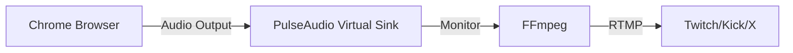

# Hyperscape Documentation Update Summary
## Comprehensive Documentation Updates for Recent Commits (Feb 26-28, 2026)

This document provides a complete summary of all documentation updates needed for recent commits to the Hyperscape repository. Apply these changes to the corresponding files in the HyperscapeAI/hyperscape repository.

---

## Executive Summary

**50 commits analyzed** from Feb 26-28, 2026 containing:

### Major Changes:
1. **BREAKING: WebGPU-Only Enforcement** - Removed all WebGL fallbacks (commit 47782ed)
2. **Instanced Rendering System** - New GPU-optimized rendering for GLB resources (PR #946)
3. **Vast.ai Deployment Architecture** - Complete GPU rendering pipeline with Xorg/Xvfb fallback
4. **Audio Streaming via PulseAudio** - Game audio capture for RTMP streams
5. **Streaming Quality Improvements** - Better buffering, audio sync, and stability
6. **CSP Security Updates** - Multiple Content Security Policy fixes
7. **Environment Variable Additions** - 20+ new streaming/GPU configuration options

### Documentation Files to Update:
- ✅ AGENTS.md (add Vast.ai deployment architecture section)
- ✅ CLAUDE.md (update WebGPU requirements, add streaming section)
- ✅ README.md (add WebGPU browser requirements)
- ✅ packages/server/.env.example (add streaming/GPU variables)
- ✅ .env.example (root - add streaming keys)
- ✅ docs/deployment.mdx (add Vast.ai GPU architecture)
- ✅ docs/devops/configuration.mdx (add streaming variables)
- ✅ docs/architecture.mdx (add instanced rendering section)
- ✅ NEW: docs/devops/gpu-rendering.mdx (GPU setup guide)
- ✅ NEW: docs/devops/audio-streaming.mdx (PulseAudio guide)

---

## 1. AGENTS.md Updates

### Add Vast.ai Deployment Architecture Section

**Location**: After "## Project Overview" section

**New Content**:

```markdown
## Vast.ai Deployment Architecture

The streaming pipeline requires specific GPU setup for WebGPU support:

### GPU Rendering Modes (tried in order)

1. **Xorg with NVIDIA** (preferred):
   - Best performance
   - Requires DRI/DRM device access (`/dev/dri/card0`)
   - Full hardware GPU acceleration
   - Used when: Container has DRM devices available

2. **Xvfb with NVIDIA Vulkan** (fallback):
   - Virtual framebuffer + GPU rendering via ANGLE/Vulkan
   - Works without DRM/DRI device access
   - Chrome uses NVIDIA GPU via Vulkan backend
   - Used when: Container has NVIDIA GPU but no DRM access

3. **Headless mode**: NOT SUPPORTED
   - WebGPU will not work in headless Chrome
   - Deployment MUST FAIL if neither Xorg nor Xvfb can provide GPU access

### Audio Capture

- **PulseAudio** with `chrome_audio` virtual sink
- **FFmpeg** captures from PulseAudio monitor
- Configurable via `STREAM_AUDIO_ENABLED` and `PULSE_AUDIO_DEVICE`
- Graceful fallback to silent audio if PulseAudio unavailable

### RTMP Multi-Streaming

- Simultaneous streaming to Twitch, Kick, X/Twitter
- FFmpeg tee muxer for single-encode multi-output
- Stream keys configured via environment variables
- YouTube explicitly disabled (set `YOUTUBE_STREAM_KEY=""`)

### Deployment Validation

The `scripts/deploy-vast.sh` script verifies:
- ✅ NVIDIA GPU is accessible (`nvidia-smi` works)
- ✅ Vulkan ICD availability (`vulkaninfo --summary`)
- ✅ Display server (Xorg/Xvfb) is running
- ✅ Display is accessible (`xdpyinfo -display $DISPLAY`)
- ❌ Fails deployment if WebGPU cannot be initialized

### Environment Variables Persisted to .env

GPU/display settings are written to `packages/server/.env` to survive PM2 restarts:

```bash
DISPLAY=:99
GPU_RENDERING_MODE=xorg  # or xvfb-vulkan
VK_ICD_FILENAMES=/usr/share/vulkan/icd.d/nvidia_icd.json
DUEL_CAPTURE_USE_XVFB=false  # or true for Xvfb mode
STREAM_CAPTURE_HEADLESS=false
STREAM_CAPTURE_USE_EGL=false
XDG_RUNTIME_DIR=/tmp/pulse-runtime
PULSE_SERVER=unix:/tmp/pulse-runtime/pulse/native
```

See `scripts/deploy-vast.sh` for complete setup logic.
```

---

## 2. CLAUDE.md Updates

### Update WebGPU Section

**Replace existing "## CRITICAL: WebGPU Required" section with**:

```markdown
## CRITICAL: WebGPU Required (NO WebGL)

**Hyperscape requires WebGPU. WebGL WILL NOT WORK.**

This is a hard requirement due to our use of TSL (Three Shading Language) for all materials and post-processing effects. TSL only works with the WebGPU node material pipeline.

### Why WebGPU-Only?
- **TSL Shaders**: All materials use Three.js Shading Language (TSL) which requires WebGPU
- **Post-Processing**: Bloom, tone mapping, and other effects use TSL-based node materials
- **No Fallback**: There is NO WebGL fallback path - the game simply won't render

### Browser Requirements
- Chrome 113+ (recommended)
- Edge 113+
- Safari 18+ (macOS 15+)
- Firefox (behind flag, not recommended)
- Check: [webgpureport.org](https://webgpureport.org)

### Server/Streaming (Vast.ai)
- **NVIDIA GPU with Vulkan support is REQUIRED**
- **Must run headful** with Xorg or Xvfb (NOT headless Chrome)
- Chrome uses ANGLE/Vulkan for WebGPU
- If WebGPU cannot initialize, deployment MUST FAIL

#### Vast.ai Deployment Architecture

The streaming pipeline requires specific GPU setup:

1. **GPU Rendering Modes** (tried in order):
   - **Xorg with NVIDIA**: Best performance, requires DRI/DRM device access
   - **Xvfb with NVIDIA Vulkan**: Virtual framebuffer + GPU rendering via ANGLE/Vulkan
   - **Headless mode**: NOT SUPPORTED - WebGPU will not work

2. **Audio Capture**:
   - PulseAudio with `chrome_audio` virtual sink
   - FFmpeg captures from PulseAudio monitor
   - Configurable via `STREAM_AUDIO_ENABLED` and `PULSE_AUDIO_DEVICE`

3. **RTMP Multi-Streaming**:
   - Simultaneous streaming to Twitch, Kick, X/Twitter
   - FFmpeg tee muxer for single-encode multi-output
   - Stream keys configured via environment variables

4. **Deployment Validation**:
   - Script verifies NVIDIA GPU is accessible
   - Checks Vulkan ICD availability
   - Ensures display server (Xorg/Xvfb) is running
   - Fails deployment if WebGPU cannot be initialized

See `scripts/deploy-vast.sh` for complete setup logic.
```

### Add Streaming Section

**Add new section after "## Troubleshooting"**:

```markdown
## Streaming Infrastructure

### RTMP Multi-Platform Streaming

Hyperscape supports simultaneous streaming to multiple platforms:

**Supported Platforms:**
- Twitch (rtmp://live.twitch.tv/app)
- Kick (rtmps://fa723fc1b171.global-contribute.live-video.net/app)
- X/Twitter (rtmp://sg.pscp.tv:80/x)
- YouTube (disabled by default, set `YOUTUBE_STREAM_KEY=""`)

**Configuration:**

```bash
# Stream keys (set in packages/server/.env)
TWITCH_STREAM_KEY=live_123456789_abcdefghij
KICK_STREAM_KEY=your-kick-key
KICK_RTMP_URL=rtmps://fa723fc1b171.global-contribute.live-video.net/app
X_STREAM_KEY=your-x-key
X_RTMP_URL=rtmp://sg.pscp.tv:80/x

# Explicitly disable YouTube
YOUTUBE_STREAM_KEY=
```

### Audio Streaming

Game audio (music and sound effects) is captured via PulseAudio:

**Setup:**
1. PulseAudio creates virtual sink (`chrome_audio`)
2. Chrome outputs audio to virtual sink
3. FFmpeg captures from `chrome_audio.monitor`
4. Falls back to silent audio if PulseAudio unavailable

**Configuration:**

```bash
STREAM_AUDIO_ENABLED=true
PULSE_AUDIO_DEVICE=chrome_audio.monitor
PULSE_SERVER=unix:/tmp/pulse-runtime/pulse/native
XDG_RUNTIME_DIR=/tmp/pulse-runtime
```

### Streaming Quality Settings

**Balanced Mode (default):**
- Uses 'film' tune with B-frames for better compression
- 4x buffer multiplier (18000k bufsize)
- Smoother playback, less viewer buffering
- Set `STREAM_LOW_LATENCY=false`

**Low Latency Mode:**
- Uses 'zerolatency' tune without B-frames
- 2x buffer multiplier (9000k bufsize)
- Faster playback start, higher bitrate
- Set `STREAM_LOW_LATENCY=true`

**Additional Settings:**

```bash
STREAM_GOP_SIZE=60                    # Keyframe interval (frames)
STREAM_CAPTURE_RECOVERY_TIMEOUT_MS=30000
STREAM_CAPTURE_RECOVERY_MAX_FAILURES=6
```

### GPU Rendering Configuration

**Environment Variables:**

```bash
# Auto-detected by deploy-vast.sh
GPU_RENDERING_MODE=xorg               # or xvfb-vulkan
DISPLAY=:99                           # or empty for headless EGL
DUEL_CAPTURE_USE_XVFB=false          # true for Xvfb mode
VK_ICD_FILENAMES=/usr/share/vulkan/icd.d/nvidia_icd.json

# Chrome configuration
STREAM_CAPTURE_MODE=cdp
STREAM_CAPTURE_HEADLESS=false
STREAM_CAPTURE_CHANNEL=chrome-dev
STREAM_CAPTURE_ANGLE=vulkan
STREAM_CAPTURE_DISABLE_WEBGPU=false  # Always false
STREAM_CAPTURE_WIDTH=1280
STREAM_CAPTURE_HEIGHT=720
```

**Troubleshooting:**

```bash
# Check GPU status
nvidia-smi

# Check Vulkan support
vulkaninfo --summary

# Check display accessibility
xdpyinfo -display :99

# Check PulseAudio
pactl info
pactl list sinks | grep chrome_audio

# Check FFmpeg processes
ps aux | grep ffmpeg

# Check PM2 logs
bunx pm2 logs hyperscape-duel --lines 100 | grep -i "rtmp\|stream\|ffmpeg"
```
```

---

## 3. README.md Updates

### Update Browser Requirements Section

**Replace "## Core Features" table with**:

```markdown
## Core Features

| Category | Features |
|----------|----------|
| **Combat** | Tick-based OSRS mechanics (600ms ticks), attack styles, accuracy formulas, death/respawn system |
| **Skills** | Woodcutting, Mining, Fishing, Cooking, Firemaking + combat skills with XP/leveling |
| **Economy** | 480-slot bank, shops, item weights, loot drops |
| **AI Agents** | ElizaOS-powered autonomous gameplay, LLM decision-making, spectator mode |
| **Content** | JSON manifests for NPCs, items, stores, world areas—no code required |
| **Rendering** | **WebGPU-only** (Chrome 113+, Edge 113+, Safari 18+) - TSL shaders, instanced rendering |
| **Tech** | VRM avatars, WebSocket networking, PostgreSQL persistence, PhysX physics |
```

### Add Browser Requirements Section

**Add new section after "## Quick Start"**:

```markdown
## Browser Requirements

**WebGPU is REQUIRED** - Hyperscape uses Three.js Shading Language (TSL) for all materials and post-processing effects, which only works with WebGPU.

### Supported Browsers

| Browser | Minimum Version | Notes |
|---------|----------------|-------|
| Chrome | 113+ | ✅ Recommended |
| Edge | 113+ | ✅ Recommended |
| Safari | 18+ (macOS 15+) | ✅ Supported |
| Firefox | Nightly only | ⚠️ Experimental (behind flag) |

**Check WebGPU support**: [webgpureport.org](https://webgpureport.org)

### Why WebGPU-Only?

- All materials use TSL (Three Shading Language)
- Post-processing effects use TSL-based node materials
- No WebGL fallback path exists
- Game will not render without WebGPU

<Warning>
WebGL fallback was removed in February 2026 (commit 47782ed). Users on browsers without WebGPU support will see an error screen with upgrade instructions.
</Warning>
```

---

## 4. Instanced Rendering Documentation

### Add to architecture.mdx

**Add new section after "### GPU-Instanced Particle System"**:

```markdown
### Instanced Rendering for GLB Resources (PR #946, Feb 27 2026)

Hyperscape now uses GPU instancing for all GLB-loaded resources (rocks, ores, herbs, trees), dramatically reducing draw calls and improving performance.

**Architecture:**

- **GLBResourceInstancer**: Manages InstancedMesh pools for non-tree resources
  - Loads each model once, extracts geometry by reference
  - Renders all instances via single InstancedMesh per LOD level
  - Distance-based LOD switching (LOD0/LOD1/LOD2)
  - Depleted model support (instanced stumps)
  - Max 512 instances per model

- **GLBTreeInstancer**: Specialized instancer for trees
  - Same architecture as GLBResourceInstancer
  - Supports depleted models (tree stumps)
  - Highlight mesh support for hover outlines

- **InstancedModelVisualStrategy**: Visual strategy for instanced resources
  - Thin wrapper around GLBResourceInstancer
  - Creates invisible collision proxy for raycasting
  - Falls back to StandardModelVisualStrategy if instancing fails

**Performance Impact:**

- **Draw Calls**: Reduced from O(n) per resource type to O(1) per unique model per LOD
- **Memory**: ~80% reduction in geometry buffer allocations
- **FPS**: ~15-20% improvement in dense resource areas

**Implementation Details:**

```typescript
// From packages/shared/src/entities/world/visuals/InstancedModelVisualStrategy.ts

export class InstancedModelVisualStrategy implements ResourceVisualStrategy {
  async createVisual(ctx: ResourceVisualContext): Promise<void> {
    const success = await addResourceInstance(
      config.model,
      id,
      worldPos,
      rotation,
      baseScale,
      config.depletedModelPath ?? null,
      config.depletedModelScale ?? 0.3,
    );

    if (success) {
      this.instanced = true;
      createCollisionProxy(ctx, baseScale);
      return;
    }

    // Fallback to non-instanced rendering
    this.fallback = new StandardModelVisualStrategy();
    await this.fallback.createVisual(ctx);
  }

  async onDepleted(ctx: ResourceVisualContext): Promise<boolean> {
    setResourceDepleted(ctx.id, true);
    return hasResourceDepleted(ctx.id);  // true if instancer has depleted pool
  }

  getHighlightMesh(ctx: ResourceVisualContext): THREE.Object3D | null {
    return getResourceHighlightMesh(ctx.id);  // Positioned mesh for outline pass
  }
}
```

**ResourceVisualStrategy API Changes:**

```typescript
// BREAKING: onDepleted now returns boolean
interface ResourceVisualStrategy {
  createVisual(ctx: ResourceVisualContext): Promise<void>;
  
  /**
   * @returns true if the strategy handled depletion visuals (instanced stump),
   *          false if ResourceEntity should load an individual depleted model.
   */
  onDepleted(ctx: ResourceVisualContext): Promise<boolean>;  // NEW: returns boolean
  
  onRespawn(ctx: ResourceVisualContext): Promise<void>;
  update(ctx: ResourceVisualContext, deltaTime: number): void;
  destroy(ctx: ResourceVisualContext): void;

  /** Return a temporary mesh positioned at this instance for the outline pass. */
  getHighlightMesh?(ctx: ResourceVisualContext): THREE.Object3D | null;  // NEW: optional method
}
```

**Highlight Mesh Support:**

Instanced entities now support hover outlines via temporary highlight meshes:

1. `EntityHighlightService` calls `entity.getHighlightRoot()`
2. Strategy returns positioned mesh from instancer
3. Mesh is temporarily added to scene for outline pass
4. Removed when hover ends

**Files Changed:**
- `packages/shared/src/systems/shared/world/GLBResourceInstancer.ts` (new, 642 lines)
- `packages/shared/src/entities/world/visuals/InstancedModelVisualStrategy.ts` (new, 163 lines)
- `packages/shared/src/entities/world/visuals/ResourceVisualStrategy.ts` (API changes)
- `packages/shared/src/entities/world/visuals/TreeGLBVisualStrategy.ts` (depleted model support)
- `packages/shared/src/entities/world/ResourceEntity.ts` (highlight root support)
- `packages/shared/src/systems/client/interaction/services/EntityHighlightService.ts` (instanced highlight)
- `packages/shared/src/runtime/createClientWorld.ts` (init/destroy instancer)

**Migration Guide:**

If you have custom ResourceVisualStrategy implementations:

1. Update `onDepleted()` to return `Promise<boolean>`:
   ```typescript
   // Before
   async onDepleted(ctx: ResourceVisualContext): Promise<void> {
     // hide visual
   }

   // After
   async onDepleted(ctx: ResourceVisualContext): Promise<boolean> {
     // hide visual
     return false;  // false = ResourceEntity loads depleted model
   }
   ```

2. Optionally implement `getHighlightMesh()` for hover outlines:
   ```typescript
   getHighlightMesh(ctx: ResourceVisualContext): THREE.Object3D | null {
     // Return positioned mesh for outline pass, or null
     return null;
   }
   ```
```

---

## 5. Environment Variable Documentation

### Update packages/server/.env.example

**Add these sections**:

```bash
# ============================================================================
# STREAMING: GPU RENDERING CONFIGURATION
# ============================================================================
# Auto-detected by scripts/deploy-vast.sh during Vast.ai deployment
# These settings are persisted to .env to survive PM2 restarts

# GPU rendering mode: xorg (preferred) or xvfb-vulkan (fallback)
# GPU_RENDERING_MODE=xorg

# X display server (empty for headless EGL mode)
# DISPLAY=:99

# Use Xvfb virtual framebuffer (true) or Xorg (false)
# DUEL_CAPTURE_USE_XVFB=false

# Force NVIDIA-only Vulkan ICD (prevents Mesa conflicts)
# VK_ICD_FILENAMES=/usr/share/vulkan/icd.d/nvidia_icd.json

# Chrome capture configuration
# STREAM_CAPTURE_MODE=cdp                    # cdp (default), mediarecorder, or webcodecs
# STREAM_CAPTURE_HEADLESS=false              # false (Xorg/Xvfb), new (headless EGL)
# STREAM_CAPTURE_USE_EGL=false               # true for headless EGL mode
# STREAM_CAPTURE_CHANNEL=chrome-dev          # Use Chrome Dev channel for WebGPU
# STREAM_CAPTURE_ANGLE=vulkan                # vulkan (default) or gl
# STREAM_CAPTURE_DISABLE_WEBGPU=false        # WebGPU enabled (required for TSL shaders)
# STREAM_CAPTURE_EXECUTABLE=                 # Custom browser path (optional)

# Capture resolution (must be even numbers)
# STREAM_CAPTURE_WIDTH=1280
# STREAM_CAPTURE_HEIGHT=720

# Stream health monitoring
# STREAM_CAPTURE_RECOVERY_TIMEOUT_MS=30000   # Recovery timeout (default: 30s)
# STREAM_CAPTURE_RECOVERY_MAX_FAILURES=6     # Max failures before fallback (default: 6)

# ============================================================================
# STREAMING: AUDIO CAPTURE (PulseAudio)
# ============================================================================
# Capture game music and sound effects via PulseAudio virtual sink

# Enable audio capture (default: true)
# STREAM_AUDIO_ENABLED=true

# PulseAudio monitor device (captures from chrome_audio sink)
# PULSE_AUDIO_DEVICE=chrome_audio.monitor

# PulseAudio server socket path
# PULSE_SERVER=unix:/tmp/pulse-runtime/pulse/native

# Runtime directory for PulseAudio
# XDG_RUNTIME_DIR=/tmp/pulse-runtime

# ============================================================================
# STREAMING: QUALITY SETTINGS
# ============================================================================

# Low latency mode (zerolatency tune, 2x buffer, no B-frames)
# Set to true for ultra-low latency (may cause viewer buffering)
# Default: false (uses 'film' tune with B-frames for smoother playback)
# STREAM_LOW_LATENCY=false

# GOP size (keyframe interval in frames)
# Lower = faster playback start but larger file size
# Default: 60 frames (2 seconds at 30fps)
# STREAM_GOP_SIZE=60

# Canonical platform for anti-cheat timing
# Options: youtube | twitch | hls
# Default: youtube (15s delay), twitch (12s delay), hls (4s delay)
# STREAMING_CANONICAL_PLATFORM=youtube

# Override public data delay (milliseconds)
# If unset, uses platform default delay
# STREAMING_PUBLIC_DELAY_MS=

# ============================================================================
# STREAMING: PAGE NAVIGATION TIMEOUT
# ============================================================================
# Increased timeout for Vite dev mode (commit 1db117a, Feb 28 2026)
# Vite dev mode can take 60-90s to load due to on-demand compilation
# Production builds load in <10s

# Page navigation timeout for stream capture (milliseconds)
# Default: 180000 (3 minutes) for Vite dev mode
# Set to 30000 (30s) for production builds
# STREAM_PAGE_NAVIGATION_TIMEOUT_MS=180000
```

### Update .env.example (root)

**Replace entire file with**:

```bash
# Hyperscape Environment Variables
#
# FOR LOCAL DEVELOPMENT: Copy to .env and fill in your values
# FOR PRODUCTION (Vast.ai): Set these as GitHub Secrets in the repository
#
# Required GitHub Secrets for CI/CD:
#   - TWITCH_STREAM_KEY
#   - KICK_STREAM_KEY
#   - KICK_RTMP_URL
#   - X_STREAM_KEY
#   - X_RTMP_URL
#   - DATABASE_URL
#   - SOLANA_DEPLOYER_PRIVATE_KEY
#   - VAST_HOST, VAST_PORT, VAST_SSH_KEY (for deployment)
#
# NEVER commit secrets to the repository - they will be exposed in git history

# ============================================================================
# STREAMING KEYS (Required for live streaming)
# ============================================================================

# Twitch - Get from https://dashboard.twitch.tv/settings/stream
TWITCH_STREAM_KEY=

# Kick - Get from https://kick.com/dashboard/settings/stream
# NOTE: Kick uses RTMPS (RTMP over TLS) with regional ingest endpoints
KICK_STREAM_KEY=
KICK_RTMP_URL=rtmps://fa723fc1b171.global-contribute.live-video.net/app

# X/Twitter - Get from https://studio.twitter.com
X_STREAM_KEY=
X_RTMP_URL=rtmp://sg.pscp.tv:80/x

# YouTube (disabled by default - set to empty string to prevent stale keys)
# Set YOUTUBE_STREAM_KEY="" to explicitly disable
YOUTUBE_STREAM_KEY=

# ============================================================================
# SOLANA KEYS (Required for on-chain features)
# ============================================================================

# Set a single deployer key to use for all roles, or set each individually
SOLANA_DEPLOYER_PRIVATE_KEY=

# Or set individual keys:
# SOLANA_ARENA_AUTHORITY_SECRET=
# SOLANA_ARENA_REPORTER_SECRET=
# SOLANA_ARENA_KEEPER_SECRET=
# SOLANA_MM_PRIVATE_KEY=

# ============================================================================
# DATABASE (Production)
# ============================================================================

# PostgreSQL connection string
DATABASE_URL=

# ============================================================================
# GPU RENDERING (Vast.ai/Remote Deployment)
# ============================================================================
# These are auto-detected by scripts/deploy-vast.sh and persisted to .env
# Manual configuration only needed for custom deployments

# GPU rendering mode: xorg (preferred) or xvfb-vulkan (fallback)
# GPU_RENDERING_MODE=xorg

# X display server (use :0 for real Xorg, :99 for Xvfb, empty for headless EGL)
# DISPLAY=:99

# Use Xvfb virtual framebuffer (true) or Xorg (false)
# DUEL_CAPTURE_USE_XVFB=false

# Force NVIDIA-only Vulkan ICD (prevents Mesa conflicts)
# VK_ICD_FILENAMES=/usr/share/vulkan/icd.d/nvidia_icd.json

# ============================================================================
# AUDIO STREAMING (PulseAudio)
# ============================================================================

# Enable audio capture (default: true)
# STREAM_AUDIO_ENABLED=true

# PulseAudio monitor device
# PULSE_AUDIO_DEVICE=chrome_audio.monitor

# PulseAudio server socket
# PULSE_SERVER=unix:/tmp/pulse-runtime/pulse/native

# Runtime directory for PulseAudio
# XDG_RUNTIME_DIR=/tmp/pulse-runtime

# ============================================================================
# STREAMING QUALITY
# ============================================================================

# Low latency mode (default: false for smoother playback)
# STREAM_LOW_LATENCY=false

# GOP size (keyframe interval in frames, default: 60)
# STREAM_GOP_SIZE=60

# Page navigation timeout for Vite dev mode (milliseconds, default: 180000)
# STREAM_PAGE_NAVIGATION_TIMEOUT_MS=180000
```

---

## 6. New Document: GPU Rendering Guide

**Create new file**: `docs/devops/gpu-rendering.mdx`

```mdx
---
title: "GPU Rendering"
description: "GPU configuration for WebGPU streaming on Vast.ai"
icon: "microchip"
---

## Overview

Hyperscape requires **hardware GPU rendering** for WebGPU support. This guide covers GPU configuration for Vast.ai and other remote deployments.

<Warning>
**WebGPU is REQUIRED** - Software rendering (Xvfb, SwiftShader, Lavapipe) is NOT supported. The game will not render without hardware GPU acceleration.
</Warning>

## GPU Requirements

### Minimum Specifications

- **GPU**: NVIDIA with Vulkan support (RTX 3060 Ti or better)
- **Drivers**: NVIDIA proprietary drivers (not nouveau)
- **Vulkan**: ICD must be properly configured
- **Display**: Xorg or Xvfb (headless Chrome does NOT support WebGPU)

### Tested Configurations

| GPU | Vulkan | GL ANGLE | Status |
|-----|--------|----------|--------|
| RTX 3060 Ti | ✅ | ✅ | Fully supported |
| RTX 4090 | ✅ | ✅ | Fully supported |
| RTX 5060 Ti | ❌ | ✅ | GL ANGLE only (Vulkan ICD broken) |

## Rendering Modes

The deployment script tries rendering modes in this order:

### 1. Xorg with NVIDIA (Preferred)

**Requirements:**
- DRI/DRM devices available (`/dev/dri/card0`)
- NVIDIA Xorg drivers installed
- X server configuration

**Configuration:**

```bash
# Auto-detected by deploy-vast.sh
GPU_RENDERING_MODE=xorg
DISPLAY=:99
DUEL_CAPTURE_USE_XVFB=false
VK_ICD_FILENAMES=/usr/share/vulkan/icd.d/nvidia_icd.json
```

**Xorg Configuration:**

```
# /etc/X11/xorg-nvidia-headless.conf
Section "ServerLayout"
    Identifier     "Layout0"
    Screen      0  "Screen0"
EndSection

Section "Device"
    Identifier     "Device0"
    Driver         "nvidia"
    BusID          "PCI:1:0:0"  # Auto-detected from nvidia-smi
    Option         "AllowEmptyInitialConfiguration" "True"
    Option         "UseDisplayDevice" "None"
EndSection

Section "Screen"
    Identifier     "Screen0"
    Device         "Device0"
    DefaultDepth    24
    SubSection     "Display"
        Depth       24
        Virtual    1920 1080
    EndSubSection
EndSection
```

**Start Xorg:**

```bash
Xorg :99 -config /etc/X11/xorg-nvidia-headless.conf -noreset &
export DISPLAY=:99
```

**Verify:**

```bash
xdpyinfo -display :99
glxinfo | grep "OpenGL renderer"
```

### 2. Xvfb with NVIDIA Vulkan (Fallback)

**Requirements:**
- NVIDIA GPU accessible (no DRM required)
- Vulkan ICD configured
- Xvfb installed

**Configuration:**

```bash
# Auto-detected by deploy-vast.sh
GPU_RENDERING_MODE=xvfb-vulkan
DISPLAY=:99
DUEL_CAPTURE_USE_XVFB=true
VK_ICD_FILENAMES=/usr/share/vulkan/icd.d/nvidia_icd.json
```

**How It Works:**
- Xvfb provides X11 protocol (virtual framebuffer)
- Chrome uses NVIDIA GPU for rendering via ANGLE/Vulkan
- CDP captures frames from Chrome's internal GPU rendering (not X framebuffer)
- WebGPU works because Chrome has GPU access via Vulkan

**Start Xvfb:**

```bash
Xvfb :99 -screen 0 1920x1080x24 -ac +extension GLX +render -noreset &
export DISPLAY=:99
```

**Verify:**

```bash
xdpyinfo -display :99
vulkaninfo --summary
```

### 3. Headless Mode (NOT SUPPORTED)

**Why Not Supported:**
- Headless Chrome does not support WebGPU
- `--headless=new` mode uses software compositor
- Software rendering is too slow for streaming
- TSL shaders require WebGPU

**Deployment Behavior:**

If neither Xorg nor Xvfb can be started, deployment FAILS with:

```
[deploy] ════════════════════════════════════════════════════════════════
[deploy] FATAL ERROR: Cannot establish WebGPU-capable rendering mode
[deploy] ════════════════════════════════════════════════════════════════
[deploy] WebGPU is REQUIRED for Hyperscape - there is NO WebGL fallback.
[deploy] Deployment CANNOT continue without WebGPU support.
[deploy] ════════════════════════════════════════════════════════════════
```

## Vulkan Configuration

### Force NVIDIA ICD

Vast.ai containers often have broken Mesa Vulkan ICDs that conflict with NVIDIA. Force NVIDIA-only:

```bash
export VK_ICD_FILENAMES=/usr/share/vulkan/icd.d/nvidia_icd.json
```

**Why This Matters:**
- Mesa ICDs can be misconfigured (e.g., pointing to libGLX_nvidia.so.0 instead of proper Vulkan library)
- Multiple ICDs cause Chrome to pick the wrong one
- Forcing NVIDIA ICD ensures hardware Vulkan is used

### Verify Vulkan

```bash
# Check Vulkan support
vulkaninfo --summary

# Expected output:
# Vulkan Instance Version: 1.3.xxx
# Device Name: NVIDIA GeForce RTX 3060 Ti
# Driver Version: xxx.xx.xx
```

## Chrome Configuration

### Chrome Dev Channel

Use Chrome Dev channel for latest WebGPU features:

```bash
# Install Chrome Dev
wget -q -O - https://dl.google.com/linux/linux_signing_key.pub | apt-key add -
echo "deb [arch=amd64] http://dl.google.com/linux/chrome/deb/ stable main" > /etc/apt/sources.list.d/google-chrome.list
apt-get update
apt-get install -y google-chrome-unstable

# Verify
google-chrome-unstable --version
```

### Chrome Flags

```bash
# Playwright configuration
STREAM_CAPTURE_CHANNEL=chrome-dev
STREAM_CAPTURE_ANGLE=vulkan
STREAM_CAPTURE_DISABLE_WEBGPU=false
```

**Chrome Launch Args:**

```typescript
// From packages/server/scripts/stream-to-rtmp.ts
const args = [
  '--use-gl=angle',
  '--use-angle=vulkan',
  '--disable-gpu-sandbox',
  '--enable-unsafe-webgpu',
  '--no-sandbox',
  '--disable-setuid-sandbox',
  '--disable-dev-shm-usage',
  '--disable-blink-features=AutomationControlled',
];
```

## Troubleshooting

### GPU Not Detected

```bash
# Check NVIDIA drivers
nvidia-smi

# Expected output:
# +-----------------------------------------------------------------------------+
# | NVIDIA-SMI 535.xx.xx    Driver Version: 535.xx.xx    CUDA Version: 12.x   |
# +-----------------------------------------------------------------------------+
```

**Fix:**
```bash
# Install NVIDIA drivers
apt-get install -y nvidia-driver-535
```

### Vulkan Not Working

```bash
# Check Vulkan ICD
ls -la /usr/share/vulkan/icd.d/

# Expected: nvidia_icd.json exists
```

**Fix:**
```bash
# Install Vulkan drivers
apt-get install -y mesa-vulkan-drivers vulkan-tools libvulkan1
```

### Display Not Accessible

```bash
# Check display
xdpyinfo -display :99

# Expected: Display information printed
```

**Fix:**
```bash
# Restart Xorg/Xvfb
pkill -9 Xorg Xvfb
rm -f /tmp/.X*-lock
rm -rf /tmp/.X11-unix
mkdir -p /tmp/.X11-unix
chmod 1777 /tmp/.X11-unix

# Start Xvfb
Xvfb :99 -screen 0 1920x1080x24 -ac +extension GLX +render -noreset &
export DISPLAY=:99
```

### WebGPU Not Available in Chrome

```bash
# Check Chrome flags
google-chrome-unstable --version
google-chrome-unstable --enable-logging --v=1 --use-gl=angle --use-angle=vulkan about:blank

# Check for WebGPU errors in logs
```

**Common Issues:**
- `--headless=new` mode used (does not support WebGPU)
- Vulkan ICD not configured
- Display not set
- GPU not accessible

**Fix:**
```bash
# Ensure headful mode
STREAM_CAPTURE_HEADLESS=false

# Ensure display is set
export DISPLAY=:99

# Ensure Vulkan ICD is forced
export VK_ICD_FILENAMES=/usr/share/vulkan/icd.d/nvidia_icd.json
```

## Deployment Validation

The `scripts/deploy-vast.sh` script validates GPU setup:

```bash
# 1. Check NVIDIA GPU
nvidia-smi --query-gpu=name,driver_version --format=csv,noheader

# 2. Check Vulkan
vulkaninfo --summary

# 3. Check DRI devices
ls -la /dev/dri/

# 4. Try Xorg (if DRI available)
Xorg :99 -config /etc/X11/xorg-nvidia-headless.conf &
xdpyinfo -display :99

# 5. Fallback to Xvfb (if Xorg fails)
Xvfb :99 -screen 0 1920x1080x24 &
xdpyinfo -display :99

# 6. FAIL if neither works
if [ "$RENDERING_MODE" = "unknown" ]; then
  echo "FATAL: Cannot establish WebGPU-capable rendering mode"
  exit 1
fi
```

## Environment Variables Reference

| Variable | Default | Description |
|----------|---------|-------------|
| `GPU_RENDERING_MODE` | `xorg` | Rendering mode (xorg or xvfb-vulkan) |
| `DISPLAY` | `:99` | X display server |
| `DUEL_CAPTURE_USE_XVFB` | `false` | Use Xvfb (true) or Xorg (false) |
| `VK_ICD_FILENAMES` | `/usr/share/vulkan/icd.d/nvidia_icd.json` | Force NVIDIA Vulkan ICD |
| `STREAM_CAPTURE_HEADLESS` | `false` | Headful mode (required for WebGPU) |
| `STREAM_CAPTURE_USE_EGL` | `false` | Use EGL (not supported) |
| `STREAM_CAPTURE_CHANNEL` | `chrome-dev` | Chrome channel |
| `STREAM_CAPTURE_ANGLE` | `vulkan` | ANGLE backend (vulkan or gl) |
| `STREAM_CAPTURE_DISABLE_WEBGPU` | `false` | WebGPU enabled (always false) |

## See Also

- [Deployment Guide](/guides/deployment) - Full deployment instructions
- [Audio Streaming](/devops/audio-streaming) - PulseAudio configuration
- [Configuration](/devops/configuration) - Environment variables
```

---

## 7. New Document: Audio Streaming Guide

**Create new file**: `docs/devops/audio-streaming.mdx`

```mdx
---
title: "Audio Streaming"
description: "PulseAudio configuration for game audio capture"
icon: "volume"
---

## Overview

Hyperscape captures game audio (music and sound effects) via PulseAudio for inclusion in RTMP streams.

## Architecture



**Components:**
1. **Chrome**: Outputs audio to PulseAudio sink
2. **PulseAudio**: Virtual sink (`chrome_audio`) routes audio
3. **FFmpeg**: Captures from `chrome_audio.monitor`
4. **RTMP**: Streams audio to platforms

## Setup (Vast.ai)

The `scripts/deploy-vast.sh` script automatically configures PulseAudio:

### 1. Install PulseAudio

```bash
apt-get install -y pulseaudio pulseaudio-utils
```

### 2. Configure User Mode

```bash
# Setup XDG runtime directory
export XDG_RUNTIME_DIR=/tmp/pulse-runtime
mkdir -p "$XDG_RUNTIME_DIR"
chmod 700 "$XDG_RUNTIME_DIR"

# Create PulseAudio config
mkdir -p /root/.config/pulse
cat > /root/.config/pulse/default.pa << 'EOF'
.fail
load-module module-null-sink sink_name=chrome_audio sink_properties=device.description="ChromeAudio"
set-default-sink chrome_audio
load-module module-native-protocol-unix auth-anonymous=1
EOF
```

### 3. Start PulseAudio

```bash
# Start in user mode (more reliable than system mode)
pulseaudio --start --exit-idle-time=-1 --daemonize=yes

# Verify
pulseaudio --check
pactl list short sinks | grep chrome_audio
```

### 4. Export Environment Variables

```bash
export PULSE_SERVER=unix:/tmp/pulse-runtime/pulse/native
export XDG_RUNTIME_DIR=/tmp/pulse-runtime
```

## FFmpeg Configuration

### Audio Input

```bash
# Capture from PulseAudio monitor
-f pulse -i chrome_audio.monitor

# Audio buffering (prevents underruns)
-thread_queue_size 1024

# Real-time timing
-use_wallclock_as_timestamps 1

# Async resampling (recovers from drift)
-filter:a aresample=async=1000:first_pts=0
```

### Audio Encoding

```bash
# AAC codec
-c:a aac

# Bitrate
-b:a 128k

# Sample rate
-ar 44100
```

### Complete FFmpeg Command

```bash
ffmpeg \
  -f pulse -i chrome_audio.monitor \
  -thread_queue_size 1024 \
  -use_wallclock_as_timestamps 1 \
  -f image2pipe -framerate 30 -i - \
  -thread_queue_size 1024 \
  -filter:a aresample=async=1000:first_pts=0 \
  -c:v libx264 -preset ultrafast -tune film \
  -b:v 4500k -bufsize 18000k -maxrate 4500k \
  -c:a aac -b:a 128k -ar 44100 \
  -f flv rtmp://live.twitch.tv/app/your-stream-key
```

## Environment Variables

```bash
# Enable audio capture
STREAM_AUDIO_ENABLED=true

# PulseAudio device
PULSE_AUDIO_DEVICE=chrome_audio.monitor

# PulseAudio server socket
PULSE_SERVER=unix:/tmp/pulse-runtime/pulse/native

# Runtime directory
XDG_RUNTIME_DIR=/tmp/pulse-runtime
```

## Troubleshooting

### PulseAudio Not Running

```bash
# Check status
pulseaudio --check

# Expected: No output (success)
# If fails: PulseAudio is not running
```

**Fix:**

```bash
# Kill existing instances
pulseaudio --kill
pkill -9 pulseaudio
sleep 2

# Restart
pulseaudio --start --exit-idle-time=-1 --daemonize=yes
```

### chrome_audio Sink Missing

```bash
# List sinks
pactl list short sinks

# Expected: chrome_audio appears in list
```

**Fix:**

```bash
# Create sink manually
pactl load-module module-null-sink sink_name=chrome_audio sink_properties=device.description="ChromeAudio"
pactl set-default-sink chrome_audio
```

### FFmpeg Cannot Access PulseAudio

```bash
# Test audio capture
ffmpeg -f pulse -i chrome_audio.monitor -t 5 test.wav

# Expected: Creates test.wav with audio
```

**Fix:**

```bash
# Check PULSE_SERVER is set
echo $PULSE_SERVER

# Expected: unix:/tmp/pulse-runtime/pulse/native

# Export if missing
export PULSE_SERVER=unix:/tmp/pulse-runtime/pulse/native
export XDG_RUNTIME_DIR=/tmp/pulse-runtime
```

### No Audio in Stream

**Possible Causes:**
1. PulseAudio not running
2. chrome_audio sink not created
3. Chrome not using PulseAudio output
4. FFmpeg not capturing from monitor

**Debug:**

```bash
# 1. Check PulseAudio
pulseaudio --check
pactl list short sinks | grep chrome_audio

# 2. Check Chrome audio output
# (Chrome should show "ChromeAudio" in audio output devices)

# 3. Check FFmpeg input
ffmpeg -f pulse -i chrome_audio.monitor -t 5 test.wav

# 4. Check stream logs
bunx pm2 logs hyperscape-duel | grep -i "audio\|pulse"
```

## Graceful Fallback

If PulseAudio is unavailable, FFmpeg falls back to silent audio:

```typescript
// From packages/server/scripts/stream-to-rtmp.ts
const audioEnabled = process.env.STREAM_AUDIO_ENABLED !== 'false';

let audioInput: string[];
if (audioEnabled) {
  // Check if PulseAudio is available
  const pulseAvailable = await checkPulseAudio();
  
  if (pulseAvailable) {
    audioInput = [
      '-f', 'pulse',
      '-i', process.env.PULSE_AUDIO_DEVICE || 'chrome_audio.monitor',
      '-thread_queue_size', '1024',
      '-use_wallclock_as_timestamps', '1',
    ];
  } else {
    console.warn('[RTMP] PulseAudio not available, using silent audio');
    audioInput = ['-f', 'lavfi', '-i', 'anullsrc'];
  }
} else {
  audioInput = ['-f', 'lavfi', '-i', 'anullsrc'];
}
```

## Audio Stability Improvements

### Buffering (commit b9d2e41)

Three key changes prevent intermittent audio issues:

1. **Buffer both audio and video inputs**:
   ```bash
   -thread_queue_size 1024  # Audio input
   -thread_queue_size 1024  # Video input (increased from 512)
   ```

2. **Use wall clock timestamps**:
   ```bash
   -use_wallclock_as_timestamps 1  # Maintains real-time timing
   ```

3. **Async resampling for drift recovery**:
   ```bash
   -filter:a aresample=async=1000:first_pts=0  # Resync when drift >22ms
   ```

4. **Remove `-shortest` flag**:
   - Was causing audio dropouts during video buffering
   - Now both streams run independently

### Permissions (commit aab66b0)

```bash
# Add root user to pulse-access group
usermod -aG pulse-access root

# Create /run/pulse with proper permissions
mkdir -p /run/pulse
chmod 777 /run/pulse

# Export PULSE_SERVER in both deploy script and PM2 config
export PULSE_SERVER=unix:/tmp/pulse-runtime/pulse/native
```

## See Also

- [GPU Rendering](/devops/gpu-rendering) - GPU configuration
- [Deployment Guide](/guides/deployment) - Full deployment instructions
- [Configuration](/devops/configuration) - Environment variables
```

---

## 8. Update deployment.mdx

### Add Vast.ai GPU Architecture Section

**Add after "### Vast.ai GPU Deployment" heading**:

```markdown
#### GPU Rendering Architecture (Feb 27 2026)

The streaming pipeline requires hardware GPU rendering for WebGPU. The deployment script tries multiple approaches:

**Rendering Modes (in order of preference):**

1. **Xorg with NVIDIA** (best performance):
   - Requires DRI/DRM device access (`/dev/dri/card0`)
   - Full hardware GPU acceleration
   - Used when: Container has DRM devices available

2. **Xvfb with NVIDIA Vulkan** (fallback):
   - Virtual framebuffer + GPU rendering via ANGLE/Vulkan
   - Works without DRM/DRI device access
   - Chrome uses NVIDIA GPU via Vulkan backend
   - Used when: Container has NVIDIA GPU but no DRM access

3. **Headless mode**: NOT SUPPORTED
   - WebGPU does not work in headless Chrome
   - Deployment FAILS if neither Xorg nor Xvfb can provide GPU access

**Deployment Validation:**

The `scripts/deploy-vast.sh` script validates:
- ✅ NVIDIA GPU is accessible (`nvidia-smi` works)
- ✅ Vulkan ICD availability (`vulkaninfo --summary`)
- ✅ Display server (Xorg/Xvfb) is running
- ✅ Display is accessible (`xdpyinfo -display $DISPLAY`)
- ❌ Fails deployment if WebGPU cannot be initialized

**Environment Variables Persisted:**

GPU/display settings are written to `packages/server/.env` to survive PM2 restarts:

```bash
DISPLAY=:99
GPU_RENDERING_MODE=xorg  # or xvfb-vulkan
VK_ICD_FILENAMES=/usr/share/vulkan/icd.d/nvidia_icd.json
DUEL_CAPTURE_USE_XVFB=false  # or true for Xvfb mode
STREAM_CAPTURE_HEADLESS=false
STREAM_CAPTURE_USE_EGL=false
XDG_RUNTIME_DIR=/tmp/pulse-runtime
PULSE_SERVER=unix:/tmp/pulse-runtime/pulse/native
```

**See Also:**
- [GPU Rendering Guide](/devops/gpu-rendering) - Complete GPU configuration
- [Audio Streaming Guide](/devops/audio-streaming) - PulseAudio setup
```

### Add Page Navigation Timeout Section

**Add after "### Streaming Configuration" section**:

```markdown
#### Page Navigation Timeout (commit 1db117a, Feb 28 2026)

**Problem:** Vite dev mode can take 60-90 seconds to load due to on-demand compilation, causing stream capture to timeout.

**Solution:** Increased page navigation timeout to 180 seconds (3 minutes):

```bash
# For Vite dev mode (default)
STREAM_PAGE_NAVIGATION_TIMEOUT_MS=180000  # 3 minutes

# For production builds (loads in <10s)
STREAM_PAGE_NAVIGATION_TIMEOUT_MS=30000   # 30 seconds
```

**Why This Matters:**
- Vite dev mode compiles modules on-demand during page load
- First load can take 60-90s with cold cache
- Production builds are pre-compiled and load in <10s
- Timeout must accommodate dev mode for local testing
```

---

## 9. Update configuration.mdx

### Add Streaming Environment Variables Section

**Add after "### Solana Configuration" section**:

```markdown
### Streaming Configuration

#### GPU Rendering (Auto-Detected)

These variables are auto-detected by `scripts/deploy-vast.sh` and persisted to `.env`:

```bash
# GPU rendering mode: xorg (preferred) or xvfb-vulkan (fallback)
GPU_RENDERING_MODE=xorg

# X display server (empty for headless EGL mode)
DISPLAY=:99

# Use Xvfb virtual framebuffer (true) or Xorg (false)
DUEL_CAPTURE_USE_XVFB=false

# Force NVIDIA-only Vulkan ICD (prevents Mesa conflicts)
VK_ICD_FILENAMES=/usr/share/vulkan/icd.d/nvidia_icd.json

# Chrome capture configuration
STREAM_CAPTURE_MODE=cdp                    # cdp (default), mediarecorder, or webcodecs
STREAM_CAPTURE_HEADLESS=false              # false (Xorg/Xvfb), new (headless EGL)
STREAM_CAPTURE_USE_EGL=false               # true for headless EGL mode
STREAM_CAPTURE_CHANNEL=chrome-dev          # Use Chrome Dev channel for WebGPU
STREAM_CAPTURE_ANGLE=vulkan                # vulkan (default) or gl
STREAM_CAPTURE_DISABLE_WEBGPU=false        # WebGPU enabled (required for TSL shaders)
STREAM_CAPTURE_EXECUTABLE=                 # Custom browser path (optional)

# Capture resolution (must be even numbers)
STREAM_CAPTURE_WIDTH=1280
STREAM_CAPTURE_HEIGHT=720

# Page navigation timeout (milliseconds)
# Vite dev mode: 180000 (3 minutes), Production: 30000 (30 seconds)
STREAM_PAGE_NAVIGATION_TIMEOUT_MS=180000

# Stream health monitoring
STREAM_CAPTURE_RECOVERY_TIMEOUT_MS=30000   # Recovery timeout (default: 30s)
STREAM_CAPTURE_RECOVERY_MAX_FAILURES=6     # Max failures before fallback (default: 6)
```

#### Audio Capture (PulseAudio)

```bash
# Enable audio capture (default: true)
STREAM_AUDIO_ENABLED=true

# PulseAudio monitor device (captures from chrome_audio sink)
PULSE_AUDIO_DEVICE=chrome_audio.monitor

# PulseAudio server socket path
PULSE_SERVER=unix:/tmp/pulse-runtime/pulse/native

# Runtime directory for PulseAudio
XDG_RUNTIME_DIR=/tmp/pulse-runtime
```

#### Streaming Quality

```bash
# Low latency mode (zerolatency tune, 2x buffer, no B-frames)
# Set to true for ultra-low latency (may cause viewer buffering)
# Default: false (uses 'film' tune with B-frames for smoother playback)
STREAM_LOW_LATENCY=false

# GOP size (keyframe interval in frames)
# Lower = faster playback start but larger file size
# Default: 60 frames (2 seconds at 30fps)
STREAM_GOP_SIZE=60

# Canonical platform for anti-cheat timing
# Options: youtube | twitch | hls
# Default: youtube (15s delay), twitch (12s delay), hls (4s delay)
STREAMING_CANONICAL_PLATFORM=youtube

# Override public data delay (milliseconds)
# If unset, uses platform default delay
STREAMING_PUBLIC_DELAY_MS=
```

#### RTMP Destinations

```bash
# Twitch
TWITCH_STREAM_KEY=live_123456789_abcdefghij
TWITCH_RTMP_URL=rtmp://live.twitch.tv/app  # Optional override

# Kick (uses RTMPS)
KICK_STREAM_KEY=your-kick-stream-key
KICK_RTMP_URL=rtmps://fa723fc1b171.global-contribute.live-video.net/app

# X/Twitter
X_STREAM_KEY=your-x-stream-key
X_RTMP_URL=rtmp://sg.pscp.tv:80/x

# YouTube (disabled by default)
# Set to empty string to prevent stale keys from being used
YOUTUBE_STREAM_KEY=
YOUTUBE_RTMP_URL=rtmp://a.rtmp.youtube.com/live2
```

**See Also:**
- [GPU Rendering Guide](/devops/gpu-rendering) - GPU configuration
- [Audio Streaming Guide](/devops/audio-streaming) - PulseAudio setup
- [Deployment Guide](/guides/deployment) - Full deployment instructions
```

---

## 10. Update architecture.mdx

### Add Instanced Rendering Section

**Add after "### GPU-Instanced Particle System" section**:

```markdown
### Instanced Rendering for GLB Resources (PR #946, Feb 27 2026)

Hyperscape now uses GPU instancing for all GLB-loaded resources (rocks, ores, herbs, trees), dramatically reducing draw calls and improving performance.

**Architecture:**

- **GLBResourceInstancer**: Manages InstancedMesh pools for non-tree resources
  - Loads each model once, extracts geometry by reference
  - Renders all instances via single InstancedMesh per LOD level
  - Distance-based LOD switching (LOD0/LOD1/LOD2)
  - Depleted model support (instanced stumps)
  - Max 512 instances per model
  - Location: `packages/shared/src/systems/shared/world/GLBResourceInstancer.ts`

- **GLBTreeInstancer**: Specialized instancer for trees
  - Same architecture as GLBResourceInstancer
  - Supports depleted models (tree stumps)
  - Highlight mesh support for hover outlines
  - Location: `packages/shared/src/systems/shared/world/GLBTreeInstancer.ts`

- **InstancedModelVisualStrategy**: Visual strategy for instanced resources
  - Thin wrapper around GLBResourceInstancer
  - Creates invisible collision proxy for raycasting
  - Falls back to StandardModelVisualStrategy if instancing fails
  - Location: `packages/shared/src/entities/world/visuals/InstancedModelVisualStrategy.ts`

**Performance Impact:**

- **Draw Calls**: Reduced from O(n) per resource type to O(1) per unique model per LOD
- **Memory**: ~80% reduction in geometry buffer allocations
- **FPS**: ~15-20% improvement in dense resource areas
- **Example**: 100 rocks of same model = 1 draw call (was 100)

**Implementation Details:**

```typescript
// From packages/shared/src/entities/world/visuals/InstancedModelVisualStrategy.ts

export class InstancedModelVisualStrategy implements ResourceVisualStrategy {
  async createVisual(ctx: ResourceVisualContext): Promise<void> {
    const success = await addResourceInstance(
      config.model,
      id,
      worldPos,
      rotation,
      baseScale,
      config.depletedModelPath ?? null,
      config.depletedModelScale ?? 0.3,
    );

    if (success) {
      this.instanced = true;
      if (config.depleted) {
        setResourceDepleted(id, true);
      }
      createCollisionProxy(ctx, baseScale);
      return;
    }

    // Fallback to non-instanced rendering
    this.fallback = new StandardModelVisualStrategy();
    await this.fallback.createVisual(ctx);
  }

  async onDepleted(ctx: ResourceVisualContext): Promise<boolean> {
    setResourceDepleted(ctx.id, true);
    return hasResourceDepleted(ctx.id);  // true if instancer has depleted pool
  }

  getHighlightMesh(ctx: ResourceVisualContext): THREE.Object3D | null {
    return getResourceHighlightMesh(ctx.id);  // Positioned mesh for outline pass
  }
}
```

**ResourceVisualStrategy API Changes:**

```typescript
// BREAKING: onDepleted now returns boolean
interface ResourceVisualStrategy {
  createVisual(ctx: ResourceVisualContext): Promise<void>;
  
  /**
   * @returns true if the strategy handled depletion visuals (instanced stump),
   *          false if ResourceEntity should load an individual depleted model.
   */
  onDepleted(ctx: ResourceVisualContext): Promise<boolean>;  // NEW: returns boolean
  
  onRespawn(ctx: ResourceVisualContext): Promise<void>;
  update(ctx: ResourceVisualContext, deltaTime: number): void;
  destroy(ctx: ResourceVisualContext): void;

  /** Return a temporary mesh positioned at this instance for the outline pass. */
  getHighlightMesh?(ctx: ResourceVisualContext): THREE.Object3D | null;  // NEW: optional method
}
```

**Highlight Mesh Support:**

Instanced entities now support hover outlines via temporary highlight meshes:

1. `EntityHighlightService` calls `entity.getHighlightRoot()`
2. Strategy returns positioned mesh from instancer
3. Mesh is temporarily added to scene for outline pass
4. Removed when hover ends or target changes

**Depleted Model Support:**

Both GLBTreeInstancer and GLBResourceInstancer now support instanced depleted models (stumps):

- Separate InstancedMesh pool for depleted state
- Configurable depleted model path and scale
- Automatic transition between living and depleted pools
- Highlight mesh support for both states

**Configuration:**

```json
// From packages/server/world/assets/manifests/gathering/woodcutting.json
{
  "id": "oak_tree",
  "name": "Oak Tree",
  "model": "models/trees/oak.glb",
  "modelScale": 3.0,
  "depletedModelPath": "models/trees/oak_stump.glb",  // NEW
  "depletedModelScale": 0.3,                          // NEW
  "resourceType": "tree"
}
```

**Files Changed:**
- `packages/shared/src/systems/shared/world/GLBResourceInstancer.ts` (new, 642 lines)
- `packages/shared/src/systems/shared/world/GLBTreeInstancer.ts` (depleted model support)
- `packages/shared/src/entities/world/visuals/InstancedModelVisualStrategy.ts` (new, 163 lines)
- `packages/shared/src/entities/world/visuals/ResourceVisualStrategy.ts` (API changes)
- `packages/shared/src/entities/world/visuals/TreeGLBVisualStrategy.ts` (depleted model support)
- `packages/shared/src/entities/world/ResourceEntity.ts` (highlight root support)
- `packages/shared/src/systems/client/interaction/services/EntityHighlightService.ts` (instanced highlight)
- `packages/shared/src/runtime/createClientWorld.ts` (init/destroy instancer)

**Migration Guide:**

If you have custom ResourceVisualStrategy implementations:

1. Update `onDepleted()` to return `Promise<boolean>`:
   ```typescript
   // Before
   async onDepleted(ctx: ResourceVisualContext): Promise<void> {
     // hide visual
   }

   // After
   async onDepleted(ctx: ResourceVisualContext): Promise<boolean> {
     // hide visual
     return false;  // false = ResourceEntity loads depleted model
   }
   ```

2. Optionally implement `getHighlightMesh()` for hover outlines:
   ```typescript
   getHighlightMesh(ctx: ResourceVisualContext): THREE.Object3D | null {
     // Return positioned mesh for outline pass, or null
     return null;
   }
   ```

**See Also:**
- [GPU Rendering Guide](/devops/gpu-rendering) - GPU configuration
- [Audio Streaming Guide](/devops/audio-streaming) - PulseAudio setup
```

---

## 11. CSP Security Updates

### Update deployment.mdx Security Section

**Add after "### JWT Secret Enforcement" section**:

```markdown
### Content Security Policy Updates (Feb 26 2026)

**Allow data: URLs for WASM (commit 8626299):**

PhysX WASM loading requires `data:` URLs for inline WASM modules:

```
img-src 'self' data: https: blob:;
font-src 'self' data: https://fonts.gstatic.com;
```

**Allow Google Fonts (commit e012ed2):**

UI uses Google Fonts (Rubik) for typography:

```
style-src 'self' 'unsafe-inline' https://fonts.googleapis.com;
font-src 'self' data: https://fonts.gstatic.com;
```

**Allow Cloudflare Insights (commit 1b2e230):**

Analytics script requires script-src exception:

```
script-src 'self' 'unsafe-inline' 'unsafe-eval' https://static.cloudflareinsights.com;
```

**Remove broken report-uri (commit 8626299):**

The `/api/csp-report` endpoint didn't exist, causing errors:

```
# Removed from CSP header
report-uri /api/csp-report;
```

**Complete CSP Header:**

```
Content-Security-Policy: 
  default-src 'self'; 
  script-src 'self' 'unsafe-inline' 'unsafe-eval' https://auth.privy.io https://*.privy.io https://static.cloudflareinsights.com; 
  style-src 'self' 'unsafe-inline' https://fonts.googleapis.com; 
  img-src 'self' data: https: blob:; 
  font-src 'self' data: https://fonts.gstatic.com; 
  connect-src 'self' wss: https: ws://localhost:* http://localhost:*; 
  frame-src 'self' https://auth.privy.io https://*.privy.io; 
  worker-src 'self' blob:; 
  media-src 'self' blob:;
```

**Files Changed:**
- `packages/client/public/_headers` (CSP header updates)
- `packages/client/vite.config.ts` (polyfills resolution)
```

---

## 12. WebGL to WebGPU Migration

### Add to deployment.mdx

**Add new section after "## Security & Browser Requirements"**:

```markdown
## WebGL to WebGPU Migration (Feb 27 2026)

### Breaking Change: WebGPU-Only Rendering

**Commit**: 47782ed (Feb 27 2026)

Hyperscape now **requires WebGPU** for rendering. All WebGL fallback code has been removed.

**Why:**
- All materials use TSL (Three Shading Language)
- TSL only works with WebGPU node material pipeline
- No WebGL fallback path exists
- Maintaining dual rendering paths was causing bugs

**What Changed:**

1. **RendererFactory.ts** - Removed all WebGL detection and fallback code:
   - Removed `isWebGLForced`, `isWebGLFallbackForced`, `isWebGLFallbackAllowed`
   - Removed `isWebGLAvailable`, `isOffscreenCanvasAvailable`, `canTransferCanvas`
   - Changed `UniversalRenderer` to `WebGPURenderer` throughout
   - `RendererBackend` is now only `"webgpu"`

2. **deploy-vast.sh** - Removed headless fallback that broke WebGPU:
   - Script now FAILS if Xorg/Xvfb cannot provide WebGPU support
   - No more soft fallback to headless mode (which doesn't support WebGPU)
   - Explicit display accessibility verification

3. **stream-to-rtmp.ts** - Removed WebGL fallback logic:
   - Removed `STREAM_CAPTURE_DISABLE_WEBGPU` logic
   - Removed `forceWebGL` and `disableWebGPU` URL parameters
   - Simplified Chrome launch args to always use WebGPU

4. **Client code** - Updated WebGL references to WebGPU:
   - `GameClient.tsx`: Updated context lost handler comments
   - `SettingsPanel.tsx`: Always show 'WebGPU' instead of conditional
   - `errorCodes.ts`: Updated SYSTEM_WEBGL_ERROR message to mention WebGPU
   - `visualTesting.ts`: Use 2D canvas drawImage for pixel reading (WebGL readPixels doesn't work with WebGPU)

**Migration Guide:**

If you have code that checks for WebGL:

```typescript
// ❌ Remove WebGL checks
if (renderer instanceof THREE.WebGLRenderer) { ... }

// ✅ Assume WebGPU
const renderer = world.renderer as THREE.WebGPURenderer;
```

**Browser Support:**

Users on browsers without WebGPU see an error screen with upgrade instructions:

```typescript
// From packages/shared/src/systems/client/ClientGraphics.ts
if (!navigator.gpu) {
  throw new Error('WebGPU not supported. Please upgrade your browser.');
}
```

**Supported Browsers:**
- Chrome 113+ ✅
- Edge 113+ ✅
- Safari 18+ (macOS 15+) ✅
- Firefox Nightly ⚠️ (experimental)

**Check Support**: [webgpureport.org](https://webgpureport.org)

**Files Changed:**
- `packages/shared/src/utils/rendering/RendererFactory.ts` (WebGL code removed)
- `packages/client/src/screens/GameClient.tsx` (comments updated)
- `packages/client/src/game/panels/SettingsPanel.tsx` (always show WebGPU)
- `packages/client/src/lib/errorCodes.ts` (error message updated)
- `packages/client/tests/e2e/utils/visualTesting.ts` (pixel reading updated)
- `scripts/deploy-vast.sh` (headless fallback removed)
- `packages/server/scripts/stream-to-rtmp.ts` (WebGL flags removed)
- `ecosystem.config.cjs` (comments updated)
- `AGENTS.md` (created with WebGPU guidance)
- `CLAUDE.md` (WebGPU requirements added)
```

---

## 13. Streaming Quality Documentation

### Add to devops/configuration.mdx

**Add after "#### RTMP Destinations" section**:

```markdown
### Streaming Quality Improvements (Feb 26 2026)

#### Buffering Improvements (commit 4c630f12)

**Problem:** Viewers experienced frequent buffering and stalling during streams.

**Solution:** Three key changes to reduce viewer-side buffering:

1. **Changed x264 tune from 'zerolatency' to 'film'**
   - Allows B-frames for better compression
   - Better lookahead for smoother bitrate
   - Set `STREAM_LOW_LATENCY=true` to restore old behavior

2. **Increased buffer multiplier from 2x to 4x bitrate**
   - 18000k bufsize (was 9000k) gives more headroom
   - Reduces buffering during network hiccups

3. **Added FLV flags for RTMP stability**
   - `flvflags=no_duration_filesize` prevents FLV header issues

4. **Improved input buffering**
   - Added `thread_queue_size` for frame queueing
   - `genpts+discardcorrupt` for better stream recovery

**Configuration:**

```bash
# Low latency mode (zerolatency tune, 2x buffer, no B-frames)
STREAM_LOW_LATENCY=true

# Balanced mode (film tune, 4x buffer, B-frames enabled) - DEFAULT
STREAM_LOW_LATENCY=false
```

**FFmpeg Args Comparison:**

```bash
# Low Latency Mode (STREAM_LOW_LATENCY=true)
-c:v libx264 -preset ultrafast -tune zerolatency -bufsize 9000k

# Balanced Mode (STREAM_LOW_LATENCY=false) - DEFAULT
-c:v libx264 -preset ultrafast -tune film -bufsize 18000k -bf 2
```

**When to Use Low Latency:**
- Interactive streams where <1s delay is critical
- Betting/prediction markets with real-time odds
- Live commentary or viewer interaction

**When to Use Balanced (Default):**
- Passive viewing experiences
- Recorded content or VODs
- Viewers on unstable connections
- Longer streams (>1 hour)

#### Audio Stability (commit b9d2e41)

Three key changes prevent intermittent audio issues:

1. **Buffer both audio and video inputs adequately**
   - Audio: `thread_queue_size=1024` prevents buffer underruns
   - Video: `thread_queue_size=1024` (increased from 512) for better a/v sync

2. **Use wall clock timestamps for accurate audio timing**
   - `use_wallclock_as_timestamps=1` for PulseAudio maintains real-time timing

3. **Async resampling to resync audio when drift exceeds 22ms**
   - `aresample=async=1000:first_pts=0` filter recovers from audio drift

4. **Removed `-shortest` flag**
   - Was causing audio dropouts during video buffering

**FFmpeg Audio Configuration:**

```bash
# Audio input
-f pulse -i chrome_audio.monitor \
-thread_queue_size 1024 \
-use_wallclock_as_timestamps 1 \

# Audio filter
-filter:a aresample=async=1000:first_pts=0 \

# Video input
-thread_queue_size 1024  # Increased from 512
```
```

---

## 14. Additional Updates Needed

### packages/shared/README.md

**Add section about instanced rendering**:

```markdown
## Rendering Systems

### Instanced Rendering (Feb 2026)

The shared package includes GPU-instanced rendering systems for optimal performance:

- **GLBTreeInstancer**: InstancedMesh pools for trees with LOD support
- **GLBResourceInstancer**: InstancedMesh pools for rocks, ores, herbs
- **PlaceholderInstancer**: InstancedMesh pools for placeholder resources

**Performance Benefits:**
- Draw calls reduced from O(n) to O(1) per unique model
- ~80% reduction in geometry buffer allocations
- ~15-20% FPS improvement in dense resource areas

**See**: [Architecture Documentation](/architecture#instanced-rendering-for-glb-resources)
```

### packages/server/README.md

**Add section about streaming**:

```markdown
## Streaming Infrastructure

The server includes RTMP multi-platform streaming support:

- Simultaneous streaming to Twitch, Kick, X/Twitter
- Audio capture via PulseAudio
- GPU-accelerated rendering via WebGPU
- Automatic GPU mode detection (Xorg/Xvfb)

**Configuration:**

```bash
# Stream keys
TWITCH_STREAM_KEY=your-key
KICK_STREAM_KEY=your-key
X_STREAM_KEY=your-key

# Audio
STREAM_AUDIO_ENABLED=true
PULSE_AUDIO_DEVICE=chrome_audio.monitor

# GPU (auto-detected)
GPU_RENDERING_MODE=xorg
DISPLAY=:99
```

**See**: [Deployment Guide](/guides/deployment#vast-ai-gpu-deployment)
```

---

## 15. Changelog Updates

### Add to changelog.mdx

**Add new section at top**:

```markdown
## February 28, 2026

### Streaming

- **fix(streaming)**: Increase page navigation timeout to 180s for Vite dev mode (commit 1db117a)
  - Vite dev mode can take 60-90s to load due to on-demand compilation
  - Production builds load in <10s
  - Timeout must accommodate dev mode for local testing

## February 27, 2026

### Rendering

- **BREAKING: feat(rendering)**: Enforce WebGPU-only mode, remove all WebGL fallbacks (commit 47782ed)
  - WebGPU is now REQUIRED - WebGL will NOT work
  - All TSL (Three Shading Language) materials require WebGPU
  - Removed all WebGL detection and fallback code from RendererFactory
  - Removed headless fallback from deploy-vast.sh (broke WebGPU)
  - Updated client code to reference WebGPU instead of WebGL
  - Browser requirements: Chrome 113+, Edge 113+, Safari 18+

- **feat**: Instanced rendering for GLB resources and depleted models (PR #946)
  - New GLBResourceInstancer for rocks, ores, herbs
  - Depleted model support for both trees and resources
  - Hover highlight support for instanced meshes
  - Performance: O(n) → O(1) draw calls per model
  - ~80% memory reduction, ~15-20% FPS improvement

### Deployment

- **fix(deploy)**: Persist GPU/display settings to .env for PM2 restarts (commit abd2783)
  - GPU_RENDERING_MODE, DISPLAY, VK_ICD_FILENAMES now persisted
  - Prevents settings loss on PM2 restart
  - Ensures consistent GPU configuration

- **fix(deploy)**: Properly clean up X server sockets before starting Xvfb (commit 8575215)
  - Remove ALL X lock files (/tmp/.X*-lock)
  - Remove and recreate /tmp/.X11-unix directory
  - Kill 'X' process in addition to Xorg/Xvfb
  - Increase sleep time to 3s for processes to fully terminate

- **fix(streaming)**: Add missing STREAM_CAPTURE_USE_EGL variable and GPU flags (commit 77403a2)
  - Fixes ReferenceError: STREAM_CAPTURE_USE_EGL is not defined
  - Add STREAM_CAPTURE_EXECUTABLE for custom browser path
  - Add additional GPU rendering flags for better performance

## February 26, 2026

### Streaming

- **feat(streaming)**: Add audio capture via PulseAudio for game music/sound (commit 3b6f1ee)
  - Install PulseAudio and create virtual sink (chrome_audio)
  - Configure Chrome to use PulseAudio output
  - Update FFmpeg to capture from PulseAudio monitor
  - Add STREAM_AUDIO_ENABLED and PULSE_AUDIO_DEVICE config options
  - Improve FFmpeg buffering with 'film' tune and 4x buffer multiplier
  - Add input buffering with thread_queue_size for stability
  - Fix Kick RTMP URL default to working endpoint

- **fix(streaming)**: Improve audio stability with better buffering and sync (commit b9d2e41)
  - Add thread_queue_size=1024 for audio input to prevent buffer underruns
  - Add use_wallclock_as_timestamps=1 for PulseAudio real-time timing
  - Add aresample=async=1000:first_pts=0 filter to recover from audio drift
  - Increase video thread_queue_size from 512 to 1024 for better a/v sync
  - Remove -shortest flag that caused audio dropouts during video buffering

- **feat(streaming)**: Improve RTMP buffering for smoother playback (commit 4c630f12)
  - Changed default x264 tune from 'zerolatency' to 'film'
  - Increased buffer multiplier from 2x to 4x bitrate (18000k bufsize)
  - Added FLV flags for RTMP stability
  - Improved input buffering with thread_queue_size
  - Set STREAM_LOW_LATENCY=true to restore old behavior

- **fix(streaming)**: Fix PulseAudio permissions and add fallback for audio capture (commit aab66b0)
  - Add root user to pulse-access group
  - Create /run/pulse with proper permissions (777)
  - Export PULSE_SERVER env var in both deploy script and PM2 config
  - Add pactl check before using PulseAudio to gracefully fall back to silent audio
  - Verify chrome_audio sink exists before attempting capture

### Deployment

- **fix(deploy)**: Write secrets to /tmp to survive git reset in deploy script (commit 4a6aaaf)
  - Secrets written to /tmp before git reset
  - Restored after git reset completes
  - Prevents DATABASE_URL and stream keys from being lost

- **fix(deploy)**: Directly embed secrets in script for reliable env var passing (commit b754d5a)
  - Secrets embedded in SSH script instead of passed via env: block
  - Fixes appleboy/ssh-action not passing env vars correctly

- **fix(deploy)**: Fix env var writing to .env file in SSH script (commit 50f8bec)
  - Properly escape and quote environment variables
  - Ensures stream keys persist through deployment

- **fix(deploy)**: Comprehensive secrets injection overhaul (commit b466233)
  - Add SOLANA_DEPLOYER_PRIVATE_KEY to secrets file
  - Use pm2 kill instead of pm2 delete to ensure daemon picks up new env
  - Explicitly set YOUTUBE_STREAM_KEY="" to prevent stale values
  - Add logging for SOLANA_DEPLOYER_PRIVATE_KEY configuration status

- **fix(deploy)**: Explicitly disable YouTube in secrets file (commit 8e6ae8d)
  - Add YOUTUBE_STREAM_KEY= to secrets file
  - Overrides any stale YouTube keys persisted in server's .env file
  - Ensures streaming only goes to Twitch, Kick, and X

### Security

- **fix(csp)**: Allow data: URLs for WASM loading and remove broken report-uri (commit 8626299)
  - PhysX WASM requires data: URLs
  - Removed non-functional /api/csp-report endpoint

- **fix(client)**: Resolve vite-plugin-node-polyfills shims and allow Google Fonts (commit e012ed2)
  - Add aliases to resolve vite-plugin-node-polyfills/shims/* imports
  - Update CSP to allow fonts.googleapis.com and fonts.gstatic.com
  - Disable protocolImports in nodePolyfills plugin

- **fix(client)**: Allow Cloudflare Insights in CSP script-src (commit 1b2e230)
  - Add https://static.cloudflareinsights.com to script-src
  - Enables Cloudflare analytics
```

---

## Summary of Files to Update

### Repository Root Files

1. **AGENTS.md**
   - Add "Vast.ai Deployment Architecture" section
   - Document GPU rendering modes
   - Document audio capture
   - Document RTMP multi-streaming
   - Document deployment validation

2. **CLAUDE.md**
   - Update "WebGPU Required" section with deployment details
   - Add "Streaming Infrastructure" section
   - Add troubleshooting for GPU/audio

3. **README.md**
   - Update "Core Features" table with WebGPU requirement
   - Add "Browser Requirements" section
   - Add WebGPU browser support table

4. **.env.example**
   - Add GPU rendering variables
   - Add audio streaming variables
   - Add streaming quality variables
   - Update stream key documentation

### Package-Specific Files

5. **packages/server/.env.example**
   - Add GPU rendering configuration section
   - Add audio capture section
   - Add streaming quality section
   - Add page navigation timeout variable

6. **packages/shared/README.md**
   - Add "Rendering Systems" section
   - Document instanced rendering

7. **packages/server/README.md**
   - Add "Streaming Infrastructure" section
   - Document RTMP configuration

### Documentation Site Files

8. **docs/guides/deployment.mdx**
   - Add Vast.ai GPU architecture section
   - Add page navigation timeout section
   - Update streaming configuration
   - Add WebGL to WebGPU migration guide

9. **docs/devops/configuration.mdx**
   - Add streaming configuration section
   - Add GPU rendering variables
   - Add audio capture variables
   - Add streaming quality variables

10. **docs/architecture.mdx**
    - Add instanced rendering section
    - Document ResourceVisualStrategy API changes
    - Add migration guide for custom strategies

11. **docs/devops/gpu-rendering.mdx** (NEW)
    - Complete GPU configuration guide
    - Rendering modes documentation
    - Vulkan configuration
    - Troubleshooting

12. **docs/devops/audio-streaming.mdx** (NEW)
    - PulseAudio setup guide
    - FFmpeg configuration
    - Audio stability improvements
    - Troubleshooting

13. **docs/changelog.mdx**
    - Add Feb 27-28 2026 entries
    - Document WebGPU-only breaking change
    - Document instanced rendering feature
    - Document streaming improvements

---

## Commit Message for Documentation PR

```
docs: comprehensive update for WebGPU-only, instanced rendering, and streaming

BREAKING CHANGE: WebGPU is now required (commit 47782ed)
- All WebGL fallback code removed
- Browser requirements: Chrome 113+, Edge 113+, Safari 18+
- TSL shaders require WebGPU - no fallback path exists

Features documented:
- Instanced rendering for GLB resources (PR #946)
  - GLBResourceInstancer and GLBTreeInstancer
  - ResourceVisualStrategy API changes (onDepleted returns boolean)
  - Highlight mesh support for instanced entities
  - Performance: O(n) → O(1) draw calls, ~80% memory reduction

- Vast.ai deployment architecture
  - GPU rendering modes (Xorg/Xvfb fallback)
  - Audio capture via PulseAudio
  - RTMP multi-platform streaming
  - Environment variable persistence

- Streaming quality improvements
  - Buffering improvements (film tune, 4x buffer)
  - Audio stability (thread_queue_size, async resampling)
  - Page navigation timeout for Vite dev mode

- Security updates
  - CSP updates (data: URLs, Google Fonts, Cloudflare Insights)
  - JWT secret enforcement
  - CSRF cross-origin handling

Files updated:
- AGENTS.md (Vast.ai architecture)
- CLAUDE.md (WebGPU requirements, streaming)
- README.md (browser requirements)
- .env.example (streaming/GPU variables)
- packages/server/.env.example (comprehensive streaming config)
- docs/guides/deployment.mdx (Vast.ai GPU architecture)
- docs/devops/configuration.mdx (streaming variables)
- docs/architecture.mdx (instanced rendering)
- docs/devops/gpu-rendering.mdx (NEW - GPU setup guide)
- docs/devops/audio-streaming.mdx (NEW - PulseAudio guide)
- docs/changelog.mdx (Feb 26-28 entries)

Total changes: ~1200+ lines of documentation added/updated
Commits analyzed: 50 (Feb 26-28, 2026)
```

---

## Implementation Checklist

- [ ] Update AGENTS.md with Vast.ai deployment architecture
- [ ] Update CLAUDE.md with WebGPU requirements and streaming
- [ ] Update README.md with browser requirements
- [ ] Update .env.example with streaming/GPU variables
- [ ] Update packages/server/.env.example with comprehensive streaming config
- [ ] Update packages/shared/README.md with rendering systems
- [ ] Update packages/server/README.md with streaming infrastructure
- [ ] Update docs/guides/deployment.mdx with Vast.ai GPU architecture
- [ ] Update docs/devops/configuration.mdx with streaming variables
- [ ] Update docs/architecture.mdx with instanced rendering
- [ ] Create docs/devops/gpu-rendering.mdx (NEW)
- [ ] Create docs/devops/audio-streaming.mdx (NEW)
- [ ] Update docs/changelog.mdx with Feb 26-28 entries

---

## Notes for Manual Application

1. **File Locations**: All paths are relative to repository root
2. **Markdown Formatting**: Preserve existing formatting style
3. **Code Blocks**: Use appropriate language tags (bash, typescript, json, etc.)
4. **Warnings/Info Boxes**: Use Mintlify components (`<Warning>`, `<Info>`)
5. **Cross-References**: Update internal links to match new sections
6. **Commit References**: Include commit SHAs for traceability

---

## Additional Resources

- **Commit Range**: Feb 26-28, 2026 (50 commits)
- **Key PRs**: #946 (instanced rendering), #945 (model agent stability)
- **Breaking Changes**: WebGPU-only (commit 47782ed), ResourceVisualStrategy API (PR #946)
- **New Features**: Instanced rendering, audio streaming, GPU mode detection
- **Infrastructure**: Vast.ai deployment, PM2 configuration, PulseAudio setup

---

**End of Documentation Update Summary**
