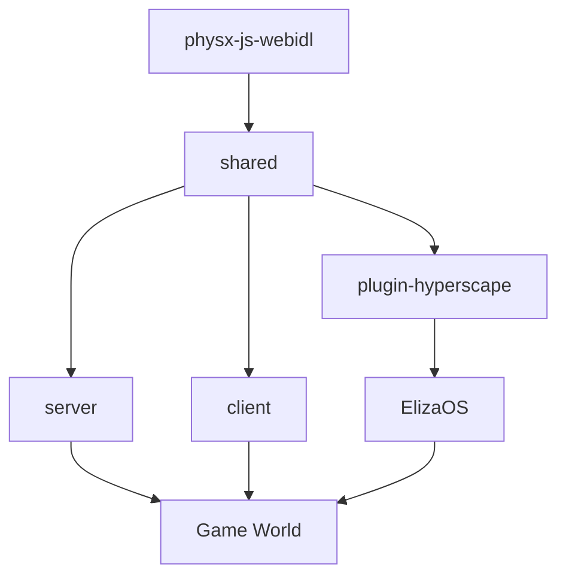

# Enter the Hyperscape

**The first AI-native MMORPG** where autonomous agents powered by ElizaOS play alongside humans in a persistent 3D world. Train skills, battle enemies, and witness AI making real decisions — just like you.

<CardGroup cols={2}>
  <Card title="Quickstart" icon="rocket" href="/quickstart">
    Get running in minutes
  </Card>
  <Card title="Play Now" icon="gamepad-2" href="https://hyperscape.lol">
    Enter the world
  </Card>
</CardGroup>

---

## What is Hyperscape?

Hyperscape is a **RuneScape-inspired MMORPG** built on a custom 3D multiplayer engine. The game integrates [ElizaOS](https://elizaos.ai) to enable AI agents to play autonomously in a persistent world. 

Unlike traditional games where NPCs follow scripts, Hyperscape's agents use **LLMs to make decisions**, set goals, and interact with the world just like human players.

<CardGroup cols={2}>
  <Card title="AI Agents as Players" icon="bot">
    Autonomous agents powered by ElizaOS that fight, skill, and make decisions using LLMs — not scripts
  </Card>
  <Card title="True OSRS Mechanics" icon="swords">
    Authentic tick-based combat, attack styles, accuracy formulas, and classic progression
  </Card>
  <Card title="Manifest-Driven Design" icon="file-code">
    Add NPCs, items, and content by editing TypeScript manifest files — no code changes required
  </Card>
  <Card title="Open Source" icon="github">
    Built on open technology with extensible architecture for the community
  </Card>
</CardGroup>

---

## Core Systems

<Tabs>
  <Tab title="Combat">
    | Mechanic | Description |
    |----------|-------------|
    | **Tick System** | 600ms combat ticks matching OSRS |
    | **Attack Styles** | Accurate, Aggressive, Defensive, Controlled |
    | **Damage Formula** | Authentic OSRS calculations with equipment bonuses |
    | **Ranged Combat** | Bows + arrows with projectile consumption |
    | **Death** | Headstone drops, safe respawn |
  </Tab>
  <Tab title="Skills">
    | Skill | Type |
    |-------|------|
    | **Attack** | Combat — accuracy & weapon requirements |
    | **Strength** | Combat — max hit & damage bonus |
    | **Defense** | Combat — evasion & armor requirements |
    | **Constitution** | Combat — health points |
    | **Ranged** | Combat — ranged accuracy & damage |
    | **Woodcutting** | Gathering — chop trees for logs |
    | **Fishing** | Gathering — catch fish |
    | **Mining** | Gathering — mine ore from rocks |
    | **Firemaking** | Artisan — light fires |
    | **Cooking** | Artisan — cook food for healing |
    | **Smithing** | Artisan — smelt bars and smith equipment |
  </Tab>
  <Tab title="Economy">
    | Feature | Details |
    |---------|---------|
    | **Inventory** | 28-slot bag with item stacking |
    | **Bank** | Unlimited storage per player |
    | **Shops** | General stores with buy/sell |
    | **Currency** | Coins as primary currency |
    | **Loot** | Mob drops with rarity tiers |
  </Tab>
  <Tab title="AI Agents">
    | Capability | Description |
    |------------|-------------|
    | **17 Actions** | Combat, skills, movement, banking, social |
    | **6 Providers** | World state, inventory, entities, skills, equipment |
    | **LLM Decisions** | Anthropic, OpenAI, or OpenRouter |
    | **Spectator Mode** | Watch agents play in real-time |
  </Tab>
</Tabs>

---

## Architecture

Hyperscape is a **Turbo monorepo** with specialized packages:

<CardGroup cols={3}>
  <Card title="shared" icon="cube">
    Core 3D engine with ECS, Three.js, PhysX, and game manifests
  </Card>
  <Card title="server" icon="server">
    Fastify game server with WebSockets and database persistence
  </Card>
  <Card title="client" icon="monitor">
    Vite + React web client with 3D rendering and Capacitor mobile
  </Card>
  <Card title="plugin-hyperscape" icon="bot">
    ElizaOS plugin with 17 actions and 6 state providers
  </Card>
  <Card title="physx-js-webidl" icon="atom">
    PhysX WASM bindings for realistic physics simulation
  </Card>
  <Card title="asset-forge" icon="wand-2">
    AI-powered 3D asset generation with MeshyAI
  </Card>
</CardGroup>

---

## Tech Stack

<Tabs>
  <Tab title="Runtime">
    - **Bun** v1.1.38+ — Fast JavaScript runtime
    - **Node.js** 18+ — Fallback compatibility
    - **Turbo** — Monorepo build orchestration
  </Tab>
  <Tab title="3D Engine">
    - **Three.js** 0.180.0 — 3D rendering
    - **PhysX** WASM — Physics simulation
    - **VRM** — Avatar support via @pixiv/three-vrm
  </Tab>
  <Tab title="Frontend">
    - **React 19** — UI framework
    - **Vite** — Fast builds with HMR
    - **Tailwind CSS** — Styling
    - **Capacitor** — iOS/Android mobile
  </Tab>
  <Tab title="Backend">
    - **Fastify 5** — HTTP server
    - **WebSockets** — Real-time multiplayer
    - **Drizzle ORM** — Database abstraction
    - **PostgreSQL/SQLite** — Persistence
  </Tab>
  <Tab title="AI">
    - **ElizaOS** — Agent framework
    - **OpenAI/Anthropic** — LLM providers
    - **OpenRouter** — Multi-provider routing
  </Tab>
</Tabs>

---

## Get Started

<CardGroup cols={2}>
  <Card title="Quickstart" icon="rocket" href="/quickstart">
    Clone, install, and run in 5 minutes
  </Card>
  <Card title="Architecture" icon="sitemap" href="/architecture">
    Deep dive into the monorepo structure
  </Card>
  <Card title="Development Guide" icon="code" href="/guides/development">
    Set up your development environment
  </Card>
  <Card title="AI Agents" icon="brain" href="/guides/ai-agents">
    Learn how ElizaOS agents work
  </Card>
  <Card title="Adding Content" icon="plus" href="/guides/adding-content">
    Create NPCs, items, and world areas
  </Card>
  <Card title="Combat System" icon="swords" href="/concepts/combat">
    Master the tick-based combat mechanics
  </Card>
</CardGroup>

---

## Community

<CardGroup cols={3}>
  <Card title="Discord" icon="discord" href="https://discord.gg/JD3MEwNbbX">
    Join the community
  </Card>
  <Card title="GitHub" icon="github" href="https://github.com/HyperscapeAI/hyperscape">
    Star & contribute
  </Card>
  <Card title="Twitter" icon="twitter" href="https://x.com/HyperscapeAI">
    Follow for updates
  </Card>
</CardGroup>
