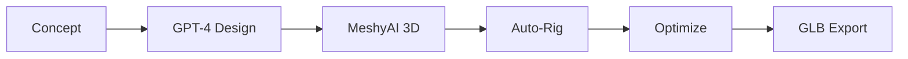

## Overview

The `asset-forge` package provides AI-powered tools for generating game assets:

- GPT-4 for design generation
- MeshyAI for 3D model creation
- Automatic rigging for humanoids
- Asset optimization pipeline

## Package Location

```
packages/asset-forge/
├── src/
│   ├── api/            # API server
│   ├── components/     # React UI
│   ├── generators/     # AI generators
│   ├── optimizers/     # Mesh optimization
│   ├── rigging/        # Auto-rigging
│   └── index.ts        # Entry point
└── .env.example        # Environment template
```

## Features

### Design Generation

Use GPT-4 to create asset concepts:

- Character descriptions
- Equipment designs
- Environment elements

### 3D Model Creation

MeshyAI converts concepts to 3D models:

- Text-to-3D generation
- Style consistency
- Multiple variations

### Auto-Rigging

Automatic rigging for humanoid models:

- Bone structure detection
- Weight painting
- Animation compatibility

### Optimization

Asset optimization for web delivery:

- Triangle reduction (2000 target)
- Texture compression
- LOD generation

## Configuration

```bash
# Required
OPENAI_API_KEY=your-key
MESHY_API_KEY=your-key

# Optional
ASSET_FORGE_PORT=3400
ASSET_FORGE_API_PORT=3401
```

## Running

```bash
bun run dev:forge    # Start AssetForge UI and API
```

Opens:
- UI at [http://localhost:3400](http://localhost:3400)
- API at [http://localhost:3401](http://localhost:3401)

## Asset Pipeline



## Commands

```bash
bun run assets:optimize          # Optimize all assets
bun run assets:optimize:dry      # Preview optimization
bun run assets:optimize:textures # Textures only
bun run assets:optimize:models   # Models only
```

## Output Formats

| Format | Purpose |
|--------|---------|
| GLB | 3D models |
| VRM | Avatars |
| PNG/WebP | Textures |

## Dependencies

| Package | Purpose |
|---------|---------|
| `openai` | GPT-4 API |
| `@gltf-transform/core` | GLB processing |
| `meshoptimizer` | Mesh optimization |

## Integration

Generated assets go to `packages/server/world/assets/` for use in the game.

<Info>
  AssetForge is optional—the game works with existing assets.
</Info>
