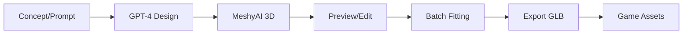

## Overview

The `3d-asset-forge` package provides AI-powered tools for generating game assets and browsing visual effects:

- MeshyAI for 3D model generation
- GPT-4 for design and lore generation
- React Three Fiber for 3D preview
- Drizzle ORM for asset database
- **VFX Catalog Browser** for inspecting game effects

## Package Location

```
packages/asset-forge/
├── src/
│   ├── components/     # React UI components
│   │   └── VFX/        # VFX catalog components
│   ├── data/
│   │   └── vfx-catalog.ts  # VFX effect metadata
│   ├── pages/
│   │   └── VFXPage.tsx     # VFX browser page
│   └── index.ts        # Entry point
├── server/
│   └── api-elysia.ts   # Elysia API server
├── scripts/
│   ├── audit-assets.ts      # Asset auditing
│   └── normalize-all-assets.ts # Asset normalization
├── drizzle.config.ts   # Database configuration
└── .env.example        # Environment template
```

## Features

### VFX Catalog Browser

Interactive browser for all game visual effects with live Three.js previews (added in commit 69105229, Feb 25, 2026):

**Categories:**
- **Magic Spells** (8 effects): Strike and Bolt spells (Wind, Water, Earth, Fire)
  - Multi-layer orb rendering with outer glow, core, and orbiting sparks
  - Trail particles with additive blending
  - Pulse animations for bolt-tier spells (5 Hz pulse, 0.2 amplitude)
  - Orbit animation with gentle vertical bobbing
- **Arrow Projectiles** (6 effects): Metal-tiered arrows (Default, Bronze, Iron, Steel, Mithril, Adamant)
  - 3D arrow meshes with shaft, head, and fletching
  - Metallic materials with proper roughness
  - Rotating preview animation
- **Glow Particles** (3 effects): Altar, Fire, and Torch effects
  - GPU-instanced particle systems
  - 4-layer composition (pillar, wisp, spark, base) for altar
  - Procedural noise-based fire shader with smooth value noise
  - Soft radial falloff designed for additive blending
  - Per-particle turbulent vertex motion for natural flickering
- **Fishing Spots** (3 effects): Water particle effects (Net, Bait, Fly)
  - Splash arcs, bubble rise, shimmer twinkle, ripple rings
  - Burst system for fish activity
  - Variant-specific colors and particle counts
- **Teleport** (1 effect): Multi-phase teleportation sequence
  - Ground rune circle with procedural canvas texture
  - Dual beams with Hermite elastic overshoot curve
  - Shockwave rings with easeOutExpo expansion
  - Helix spiral particles (12 particles, 2 strands)
  - Burst particles with gravity simulation (8 particles)
  - Point light with dynamic intensity (0 → 5.0 peak → 0)
  - 4 phases: Gather (0-20%), Erupt (20-34%), Sustain (34-68%), Fade (68-100%)
  - 2.5 second duration
- **Combat HUD** (2 effects): Damage splats and XP drops
  - Canvas-based rendering with rounded rectangles
  - Hit/miss color coding (dark red vs dark blue)
  - Float-up animations with easing curves

**Features:**
- **Live Three.js Previews**: Real-time 3D rendering with orbit controls
  - Spell orbs orbit in gentle circles with vertical bobbing
  - Arrows rotate to show all angles
  - Glow particles demonstrate full lifecycle
  - Water effects show splash/bubble/shimmer/ripple layers
  - Teleport effect loops through all 4 phases
- **Detail Panels**:
  - Color palette swatches with hex codes
  - Parameter tables (size, intensity, duration, speed, etc.)
  - Layer breakdown for multi-layer effects (glow particles)
  - Phase timeline visualization (teleport effect)
  - Component breakdown for complex effects (teleport)
  - Variant panels for effects with multiple styles (combat HUD)
- **Sidebar Navigation**:
  - Category grouping with icons (Sparkles, Target, Flame, Waves, Sword)
  - Collapsible sections with effect counts
  - Click to select effect and view details
  - Empty state when no effect selected

**Technical Implementation:**
- **Standalone Metadata**: Effect data in `vfx-catalog.ts` (no game engine imports)
  - Prevents Asset Forge from pulling in full game engine
  - Data duplicated from source-of-truth files (documented in comments)
- **Source-of-Truth Files**:
  - `packages/shared/src/data/spell-visuals.ts` (spell projectiles)
  - `packages/shared/src/entities/managers/particleManager/GlowParticleManager.ts` (glow particles)
  - `packages/shared/src/entities/managers/particleManager/WaterParticleManager.ts` (fishing spots)
  - `packages/shared/src/systems/client/ClientTeleportEffectsSystem.ts` (teleport)
  - `packages/shared/src/systems/client/DamageSplatSystem.ts` (damage splats)
  - `packages/shared/src/systems/client/XPDropSystem.ts` (XP drops)
- **Procedural Textures**: Matches engine's DataTexture approach
  - `createGlowTexture()`: Radial gradient with configurable sharpness
  - `createRingTexture()`: Ring pattern with soft falloff
  - Cached textures to avoid regeneration
- **Billboard Rendering**: Camera-facing particles
  - `Billboard` component copies camera quaternion each frame
  - Ensures particles always face viewer
- **Additive Blending**: All glow effects use `THREE.AdditiveBlending`
  - Overlapping particles merge naturally
  - Bright cores with soft falloff
- **Animation Systems**:
  - Spell orbs: Orbit path with `useFrame` hook
  - Glow particles: Instanced rendering with per-particle lifecycle
  - Water particles: Parabolic arcs, wobble, twinkle, ring expansion
  - Teleport: Multi-phase state machine with easing curves

**Access:** Navigate to `/vfx` in Asset Forge to browse the catalog.

**Files Added:**
- `src/components/VFX/EffectDetailPanel.tsx` (205 lines)
- `src/components/VFX/VFXPreview.tsx` (1691 lines)
- `src/data/vfx-catalog.ts` (663 lines)
- `src/pages/VFXPage.tsx` (242 lines)
- `src/constants/navigation.ts` (updated with VFX route)

### Design Generation

Use GPT-4 to create asset concepts:

- Character descriptions
- Equipment designs
- Environment elements
- Lore and backstories

### 3D Model Creation

MeshyAI converts concepts to 3D models:

- Text-to-3D generation
- Style consistency
- Multiple variations

### Asset Management

Database-backed asset management:

- PostgreSQL via Drizzle ORM
- Asset metadata tracking
- Generation history

### 3D Preview

React Three Fiber powered preview:

- Real-time 3D viewing
- Hand pose detection (TensorFlow)
- VRM avatar support

## Tech Stack

```typescript
// From packages/asset-forge/package.json
{
  "name": "3d-asset-forge",  // Note: package name is "3d-asset-forge"
  "dependencies": {
    "elysia": "^1.4.15",                           // API server
    "@elysiajs/cors": "^1.4.0",                    // CORS middleware
    "@elysiajs/swagger": "^1.3.1",                 // API documentation
    "@react-three/fiber": "^9.0.0",                // 3D rendering
    "@react-three/drei": "^10.7.6",                // 3D helpers
    "@pixiv/three-vrm": "^3.4.3",                  // VRM avatar support
    "@tensorflow/tfjs": "^4.22.0",                 // TensorFlow.js
    "@tensorflow-models/hand-pose-detection": "^2.0.1", // Hand tracking
    "drizzle-orm": "^0.44.6",                      // Database ORM
    "zustand": "^5.0.6",                           // State management
    "three": "^0.181.0",                           // 3D engine
  }
}
```

| Technology | Purpose |
|------------|---------|
| Elysia 1.4 | API server with CORS, rate limiting, Swagger |
| React Three Fiber 9 | 3D rendering in React |
| TensorFlow.js | Hand pose detection for VR/AR |
| Drizzle ORM | PostgreSQL database |
| Zustand 5 | State management |
| Tailwind CSS | Styling |
| Vite 6 | Build tool |

## Configuration

```bash
# Required
OPENAI_API_KEY=your-openai-key
MESHY_API_KEY=your-meshy-key

# Database
DATABASE_URL=postgresql://...
```

## Running

### Development

```bash
cd packages/asset-forge
bun run dev    # Start frontend + backend
```

Opens:
- Frontend: [http://localhost:5173](http://localhost:5173)
- API: Runs via Elysia

### Production

```bash
bun run build     # Build frontend
bun run start     # Start API server
```

## Commands

```bash
# From packages/asset-forge/package.json scripts

# Development
bun run dev              # Frontend (Vite) + Backend (Elysia) concurrently
bun run dev:frontend     # Vite dev server only
bun run dev:backend      # Elysia API only (bun server/api-elysia.ts)

# Build
bun run build            # Clean + Vite build
bun run build:services   # Build services for production
bun run clean            # Remove dist/

# Database (Drizzle)
bun run db:generate      # Generate migrations (drizzle-kit generate)
bun run db:push          # Apply schema (drizzle-kit push)
bun run db:studio        # Open Drizzle Studio GUI

# Assets
bun run assets:audit     # Audit existing assets (scripts/audit-assets.ts)
bun run assets:normalize # Normalize all assets (scripts/normalize-all-assets.ts)

# Quality
bun run typecheck        # TypeScript type checking
bun run count:lines      # Count lines of code
bun run check:deps       # Check dependencies (depcheck)
bun run check:all        # Full check (knip)
```

## Equipment Fitting Workflow

Asset Forge includes a comprehensive equipment fitting system for weapons and armor:

### Equipment Viewer

The Equipment Viewer (`/equipment` page) provides tools for fitting weapons to VRM avatars:

**Features:**
- **Grip Detection**: Automatic weapon handle detection using AI vision
  - Analyzes weapon geometry to find grip point
  - Normalizes weapon position so grip is at origin
  - Enables consistent hand placement across all weapons
- **Manual Adjustment**: Fine-tune position, rotation, and scale
  - 3-axis position controls (X, Y, Z in meters)
  - 3-axis rotation controls (X, Y, Z in degrees)
  - Scale override for weapon size
  - Real-time preview with VRM avatar
- **Bone Attachment**: Attach to VRM hand bones
  - Right hand (default) or left hand
  - Supports Asset Forge V1 and V2 metadata formats
  - Pre-baked matrix transforms for advanced positioning
- **Export Options**:
  - Save configuration to metadata.json
  - Export aligned GLB model (weapon with baked transforms)
  - Export equipped avatar (VRM with weapon attached)

### Batch Workflow (New in PR #894)

For processing multiple weapons of the same type efficiently:

**1. Batch Apply Fitting:**
- Select a weapon and configure fitting (position, rotation, scale, grip)
- Click "Apply Fitting to All [subtype]s" button
- Applies configuration to all weapons of same subtype (e.g., all shortswords)
- Progress overlay shows current asset and completion percentage
- Updates `hyperscapeAttachment` metadata for all selected weapons

**2. Batch Review & Export:**
- Click "Review & Export All [subtype]s" button
- Enters review mode with navigation bar at bottom
- Step through weapons using prev/next buttons
- Visual mesh swaps without reloading transforms (preserves fitting)
- Export current weapon or skip to next
- Export All button processes remaining weapons automatically
- Progress dots show current weapon and export status (green checkmarks)
- Done button exits review mode and restores original weapon

**Geometry Normalization:**
- Flattens all intermediate GLTF node transforms into mesh geometry
- Eliminates hierarchy differences between weapons from different sources
- Axis alignment: Rotates geometry so longest axis matches reference weapon
- Flip detection: Uses vertex centroid bias to detect 180° orientation flips
- Position alignment: Shifts bbox center to match reference weapon
- Ensures consistent grip offset across all weapons in batch

**API Endpoints:**
- `POST /api/assets/batch-apply-fitting` - Apply config to multiple assets
- `POST /api/assets/:id/save-aligned` - Save aligned GLB model

**UI Components:**
- `BatchProgressOverlay` - Progress spinner for batch operations
- `BatchReviewBar` - Navigation bar with export controls
- Weapon subtype grouping with collapsible sections

### Weapon Subtypes

Weapons are now organized by subtype for batch operations:

- **Shortsword**: One-handed short blades (bronze, iron, steel, mithril, adamant, rune)
- **Longsword**: One-handed long blades
- **Scimitar**: Curved one-handed blades
- **2H Sword**: Two-handed great swords
- **Axe**: One-handed and two-handed axes
- **Mace**: Blunt weapons
- **Dagger**: Short stabbing weapons
- **Spear**: Piercing polearms

Each subtype has specific size constraints and proportions defined in `equipment.ts` constants.

## Asset Pipeline



## Output Formats

| Format | Purpose |
|--------|---------|
| GLB | 3D models |
| VRM | Avatars |
| PNG/WebP | Textures |

## Dependencies

| Package | Purpose |
|---------|---------|
| `elysia` | API server |
| `@react-three/fiber` | 3D rendering |
| `@react-three/drei` | 3D helpers |
| `drizzle-orm` | Database ORM |
| `@pixiv/three-vrm` | VRM support |
| `zustand` | State management |

## Integration

Generated assets can be used in the main game by placing them in `packages/server/world/assets/`.

<Info>
  Asset Forge is optional—the game works with existing assets. It's a separate tool for creating new content.
</Info>

## License

MIT License
