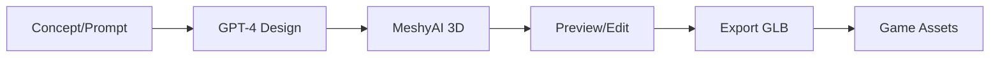

## Overview

The `3d-asset-forge` package provides AI-powered tools for generating game assets:

- MeshyAI for 3D model generation
- GPT-4 for design and lore generation
- React Three Fiber for 3D preview
- Drizzle ORM for asset database

## Package Location

```
packages/asset-forge/
├── src/
│   ├── components/     # React UI components
│   └── index.ts        # Entry point
├── server/
│   └── api-elysia.ts   # Elysia API server
├── scripts/
│   ├── audit-assets.ts      # Asset auditing
│   └── normalize-all-assets.ts # Asset normalization
├── drizzle.config.ts   # Database configuration
└── .env.example        # Environment template
```

## Features

### Design Generation

Use GPT-4 to create asset concepts:

- Character descriptions
- Equipment designs
- Environment elements
- Lore and backstories

### 3D Model Creation

MeshyAI converts concepts to 3D models:

- Text-to-3D generation
- Style consistency
- Multiple variations

### Asset Management

Database-backed asset management:

- PostgreSQL via Drizzle ORM
- Asset metadata tracking
- Generation history

### 3D Preview

React Three Fiber powered preview:

- Real-time 3D viewing
- Hand pose detection (TensorFlow)
- VRM avatar support

## Tech Stack

```typescript
// From packages/asset-forge/package.json
{
  "name": "3d-asset-forge",  // Note: package name is "3d-asset-forge"
  "dependencies": {
    "elysia": "^1.4.15",                           // API server
    "@elysiajs/cors": "^1.4.0",                    // CORS middleware
    "@elysiajs/swagger": "^1.3.1",                 // API documentation
    "@react-three/fiber": "^9.0.0",                // 3D rendering
    "@react-three/drei": "^10.7.6",                // 3D helpers
    "@pixiv/three-vrm": "^3.4.3",                  // VRM avatar support
    "@tensorflow/tfjs": "^4.22.0",                 // TensorFlow.js
    "@tensorflow-models/hand-pose-detection": "^2.0.1", // Hand tracking
    "drizzle-orm": "^0.44.6",                      // Database ORM
    "zustand": "^5.0.6",                           // State management
    "three": "^0.181.0",                           // 3D engine
  }
}
```

| Technology | Purpose |
|------------|---------|
| Elysia 1.4 | API server with CORS, rate limiting, Swagger |
| React Three Fiber 9 | 3D rendering in React |
| TensorFlow.js | Hand pose detection for VR/AR |
| Drizzle ORM | PostgreSQL database |
| Zustand 5 | State management |
| Tailwind CSS | Styling |
| Vite 6 | Build tool |

## Configuration

```bash
# Required
OPENAI_API_KEY=your-openai-key
MESHY_API_KEY=your-meshy-key

# Database
DATABASE_URL=postgresql://...
```

## Running

### Development

```bash
cd packages/asset-forge
bun run dev    # Start frontend + backend
```

Opens:
- Frontend: [http://localhost:5173](http://localhost:5173)
- API: Runs via Elysia

### Production

```bash
bun run build     # Build frontend
bun run start     # Start API server
```

## Commands

```bash
# From packages/asset-forge/package.json scripts

# Development
bun run dev              # Frontend (Vite) + Backend (Elysia) concurrently
bun run dev:frontend     # Vite dev server only
bun run dev:backend      # Elysia API only (bun server/api-elysia.ts)

# Build
bun run build            # Clean + Vite build
bun run build:services   # Build services for production
bun run clean            # Remove dist/

# Database (Drizzle)
bun run db:generate      # Generate migrations (drizzle-kit generate)
bun run db:push          # Apply schema (drizzle-kit push)
bun run db:studio        # Open Drizzle Studio GUI

# Assets
bun run assets:audit     # Audit existing assets (scripts/audit-assets.ts)
bun run assets:normalize # Normalize all assets (scripts/normalize-all-assets.ts)

# Quality
bun run typecheck        # TypeScript type checking
bun run count:lines      # Count lines of code
bun run check:deps       # Check dependencies (depcheck)
bun run check:all        # Full check (knip)
```

## Asset Pipeline



## Output Formats

| Format | Purpose |
|--------|---------|
| GLB | 3D models |
| VRM | Avatars |
| PNG/WebP | Textures |

## Dependencies

| Package | Purpose |
|---------|---------|
| `elysia` | API server |
| `@react-three/fiber` | 3D rendering |
| `@react-three/drei` | 3D helpers |
| `drizzle-orm` | Database ORM |
| `@pixiv/three-vrm` | VRM support |
| `zustand` | State management |

## Integration

Generated assets can be used in the main game by placing them in `packages/server/world/assets/`.

<Info>
  Asset Forge is optional—the game works with existing assets. It's a separate tool for creating new content.
</Info>

## License

MIT License
