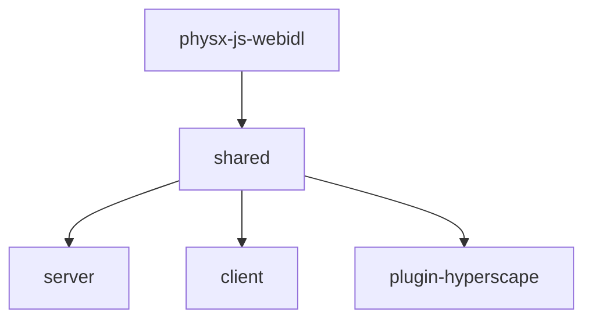

## Monorepo Structure

Hyperscape is organized as a Turbo monorepo with 7 packages:

```
packages/
├── shared/              # Core 3D engine (@hyperscape/shared)
├── server/              # Game server (@hyperscape/server)
├── client/              # Web client (@hyperscape/client)
├── plugin-hyperscape/   # ElizaOS AI plugin (@hyperscape/plugin-hyperscape)
├── physx-js-webidl/     # PhysX WASM bindings (@hyperscape/physx-js-webidl)
├── asset-forge/         # AI asset generation (3d-asset-forge)
└── docs-site/           # Documentation (Docusaurus)
```

## Package Dependencies



<Info>
  `asset-forge` is independent and doesn't depend on other packages.
</Info>

## Package Summary

<CardGroup cols={2}>
  <Card title="shared" icon="cube" href="/packages/shared">
    Core 3D engine with ECS, Three.js, PhysX, and networking
  </Card>
  <Card title="server" icon="server" href="/packages/server">
    Game server with Fastify, WebSockets, and database
  </Card>
  <Card title="client" icon="browser" href="/packages/client">
    Web client with Vite, React, and 3D rendering
  </Card>
  <Card title="plugin-hyperscape" icon="robot" href="/packages/plugin-hyperscape">
    ElizaOS integration for AI agents
  </Card>
  <Card title="asset-forge" icon="wand-magic-sparkles" href="/packages/asset-forge">
    AI-powered 3D asset generation
  </Card>
</CardGroup>

## Build Order

Due to dependencies, packages must build in order:

1. **physx-js-webidl** (5-10 min first time, cached after)
2. **shared** (depends on physx)
3. **All other packages** (depend on shared)

Turbo handles this automatically with `dependsOn: ["^build"]`.

## Package Versions

| Package | Version | Description |
|---------|---------|-------------|
| `@hyperscape/shared` | 0.13.0 | Core engine |
| `@hyperscape/server` | 0.13.0 | Game server |
| `@hyperscape/client` | 0.13.0 | Web client |
| `@hyperscape/plugin-hyperscape` | 1.0.0 | ElizaOS plugin |
| `3d-asset-forge` | 1.0.0 | Asset generation |

## Package Commands

### Build

```bash
bun run build           # Build all packages
bun run build:shared    # Build shared only
bun run build:client    # Build client only
bun run build:server    # Build server only
```

### Development

```bash
bun run dev             # All packages with watch
bun run dev:shared      # Shared with watch
bun run dev:client      # Client with HMR (port 3333)
bun run dev:server      # Server with restart (port 5555)
bun run dev:elizaos     # With AI agents
```

### Testing

```bash
npm test                # Run all tests (Playwright)
```

## Package Manager

All packages use **Bun** as the package manager and runtime (v1.1.38+).

```bash
bun install             # Install all dependencies
bun run <script>        # Run package scripts
bun start               # Start production server
```

## Workspaces

Defined in root `package.json`:

```json
{
  "workspaces": ["packages/*"]
}
```

Cross-package imports use workspace protocol:

```json
{
  "dependencies": {
    "@hyperscape/shared": "workspace:*",
    "@hyperscape/plugin-hyperscape": "workspace:*"
  }
}
```

## Engine Requirements

| Requirement | Version |
|-------------|---------|
| Node.js | ≥22.11.0 |
| Bun | ≥1.1.38 |

## License

- Core packages: **GPL-3.0-only**
- plugin-hyperscape: **MIT**
- asset-forge: **MIT**
