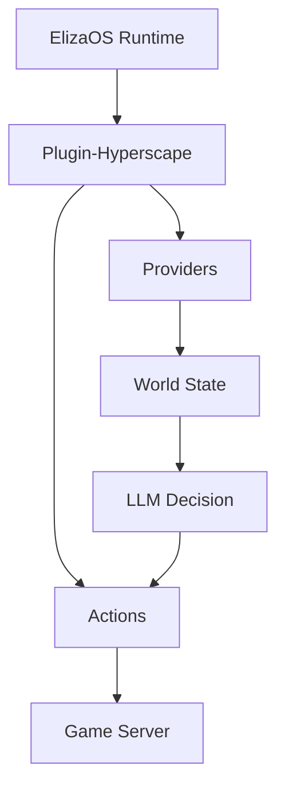

## Overview

The `plugin-hyperscape` package enables AI agents to play Hyperscape autonomously using ElizaOS:

- Agent actions (combat, skills, movement)
- World state providers
- LLM decision-making
- Spectator mode

## Package Location

```
packages/plugin-hyperscape/
├── src/
│   ├── actions/        # Agent actions
│   ├── clients/        # WebSocket client
│   ├── config/         # Configuration
│   ├── content-packs/  # Character templates
│   ├── evaluators/     # Goal evaluation
│   ├── events/         # Event handlers
│   ├── handlers/       # Message handlers
│   ├── managers/       # State management
│   ├── providers/      # World state providers
│   ├── routes/         # API routes
│   ├── services/       # Core services
│   ├── systems/        # Agent systems
│   ├── templates/      # LLM prompts
│   ├── testing/        # Test utilities
│   ├── types/          # TypeScript types
│   ├── utils/          # Helper functions
│   ├── index.ts        # Plugin entry
│   └── service.ts      # Main service
└── .env.example        # Environment template
```

## Actions

Agent capabilities organized by category:

### Combat

| Action | Purpose |
|--------|---------|
| `attackMob` | Engage enemy |
| `setAttackStyle` | Choose XP focus |
| `flee` | Disengage |

### Skills

| Action | Purpose |
|--------|---------|
| `chopTree` | Woodcutting |
| `catchFish` | Fishing |
| `lightFire` | Firemaking |
| `cookFood` | Cooking |

### Movement

| Action | Purpose |
|--------|---------|
| `moveTo` | Navigate to position |
| `moveToEntity` | Follow entity |
| `moveToArea` | Travel to zone |

### Inventory

| Action | Purpose |
|--------|---------|
| `equipItem` | Wear equipment |
| `dropItem` | Remove from inventory |
| `useItem` | Consume or use |
| `bankDeposit` | Store in bank |
| `bankWithdraw` | Retrieve from bank |

## Providers

World state accessible to agents:

| Provider | Data |
|----------|------|
| `inventoryProvider` | Current inventory |
| `statsProvider` | Player stats |
| `nearbyProvider` | Entities in range |
| `equipmentProvider` | Worn items |
| `skillsProvider` | XP and levels |

## Configuration

```bash
# ElizaOS
ELIZAOS_PORT=4001

# LLM Provider
OPENAI_API_KEY=your-key
# or
ANTHROPIC_API_KEY=your-key
```

## Running

```bash
bun run dev:ai    # Game + AI agents
```

This starts ElizaOS on port 4001 alongside the game.

## Agent Architecture



## Dependencies

| Package | Purpose |
|---------|---------|
| `@elizaos/core` | ElizaOS framework |
| `@hyperscape/shared` | Core engine |
| `ws` | WebSocket client |

## Key Files

| File | Purpose |
|------|---------|
| `src/index.ts` | Plugin registration |
| `src/service.ts` | Main service |
| `src/actions/` | All agent actions |
| `src/providers/` | State providers |
