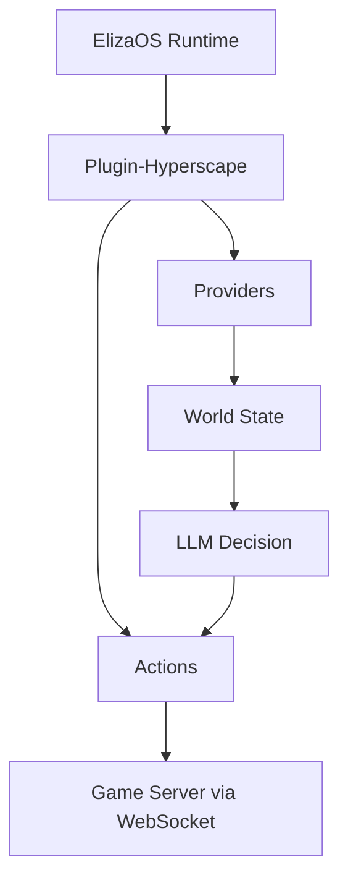

## Overview

The `@hyperscape/plugin-hyperscape` package enables AI agents to play Hyperscape autonomously using ElizaOS:

- Agent actions (combat, skills, movement)
- World state providers
- LLM decision-making via OpenAI/Anthropic/OpenRouter
- Full player capabilities

## Package Location

```
packages/plugin-hyperscape/
├── src/
│   ├── actions/        # Agent actions
│   ├── clients/        # WebSocket client
│   ├── config/         # Configuration
│   ├── content-packs/  # Character templates
│   ├── evaluators/     # Goal evaluation
│   ├── events/         # Event handlers
│   ├── handlers/       # Message handlers
│   ├── managers/       # State management
│   ├── providers/      # World state providers
│   ├── routes/         # API routes
│   ├── services/       # Core services
│   ├── systems/        # Agent systems
│   ├── templates/      # LLM prompts
│   ├── testing/        # Test utilities
│   ├── types/          # TypeScript types
│   ├── utils/          # Helper functions
│   ├── index.ts        # Plugin entry
│   └── service.ts      # Main service
└── .env.example        # Environment template
```

## Actions

Agent capabilities are defined in `src/actions/`:

```typescript
// From packages/plugin-hyperscape/src/index.ts (lines 161-188)
actions: [
  // Movement
  moveToAction,
  followEntityAction,
  stopMovementAction,

  // Combat
  attackEntityAction,
  changeCombatStyleAction,

  // Skills
  chopTreeAction,
  catchFishAction,
  lightFireAction,
  cookFoodAction,

  // Inventory
  equipItemAction,
  useItemAction,
  dropItemAction,

  // Social
  chatMessageAction,

  // Banking
  bankDepositAction,
  bankWithdrawAction,
],
```

### Action Categories

| Category | Actions | Source File |
|----------|---------|-------------|
| **Movement** | moveTo, followEntity, stopMovement | `actions/movement.ts` |
| **Combat** | attackEntity, changeCombatStyle | `actions/combat.ts` |
| **Skills** | chopTree, catchFish, lightFire, cookFood | `actions/skills.ts` |
| **Inventory** | equipItem, useItem, dropItem | `actions/inventory.ts` |
| **Social** | chatMessage | `actions/social.ts` |
| **Banking** | bankDeposit, bankWithdraw | `actions/banking.ts` |

## Providers

World state is accessible to agents via 6 providers:

```typescript
// From packages/plugin-hyperscape/src/index.ts (lines 148-156)
providers: [
  gameStateProvider,        // Player health, stamina, position, combat status
  inventoryProvider,        // Inventory items, coins, free slots
  nearbyEntitiesProvider,   // Players, NPCs, resources nearby
  skillsProvider,           // Skill levels and XP
  equipmentProvider,        // Equipped items
  availableActionsProvider, // Context-aware available actions
],
```

| Provider | Data |
|----------|------|
| `gameStateProvider` | Health, stamina, position, combat status |
| `inventoryProvider` | Current inventory items and coins |
| `nearbyEntitiesProvider` | Players, NPCs, resources in range |
| `skillsProvider` | Skill levels and XP |
| `equipmentProvider` | Currently equipped items |
| `availableActionsProvider` | Context-aware actions (e.g., "can cook fish") |

## Configuration

```bash
# LLM Provider (at least one required)
OPENAI_API_KEY=your-openai-key
# or
ANTHROPIC_API_KEY=your-anthropic-key
# or
OPENROUTER_API_KEY=your-openrouter-key
```

## Running

```bash
bun run dev:elizaos    # Game + AI agents
```

This starts ElizaOS alongside the game server. The AI agent connects as a real player and plays autonomously.

## Agent Architecture



## Dependencies

| Package | Version | Purpose |
|---------|---------|---------|
| `@elizaos/core` | ^1.2.9 | ElizaOS framework |
| `@elizaos/plugin-anthropic` | ^1.5.12 | Anthropic LLM |
| `@elizaos/plugin-openai` | 1.5.16 | OpenAI LLM |
| `@elizaos/plugin-openrouter` | ^1.5.15 | OpenRouter LLM |
| `@elizaos/plugin-sql` | ^1.6.4 | SQL database |
| `@hyperscape/shared` | workspace | Core engine |
| `ws` | ^8.18.3 | WebSocket client |
| `zod` | ^3.25.67 | Schema validation |

## Building

```bash
cd packages/plugin-hyperscape
bun run build    # Compile TypeScript
bun run dev      # Watch mode
```

## Key Files

| File | Purpose |
|------|---------|
| `src/index.ts` | Plugin registration |
| `src/service.ts` | Main service class |
| `src/actions/` | All agent actions |
| `src/providers/` | State providers |
| `src/templates/` | LLM prompt templates |

## License

MIT License - can be used in any ElizaOS agent.
