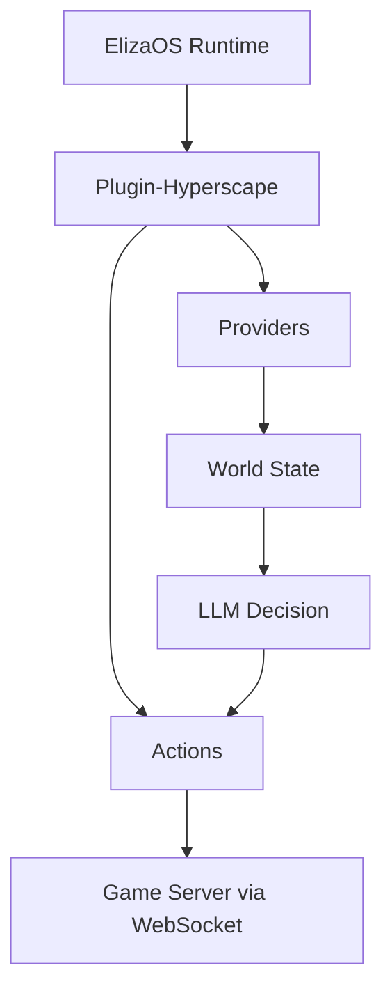

## Overview

The `@hyperscape/plugin-hyperscape` package enables AI agents to play Hyperscape autonomously using ElizaOS:

- Agent actions (combat, skills, movement)
- World state providers
- LLM decision-making via OpenAI/Anthropic/OpenRouter
- Full player capabilities

## Package Location

```
packages/plugin-hyperscape/
├── src/
│   ├── actions/        # Agent actions
│   ├── clients/        # WebSocket client
│   ├── config/         # Configuration
│   ├── content-packs/  # Character templates
│   ├── evaluators/     # Goal evaluation
│   ├── events/         # Event handlers
│   ├── handlers/       # Message handlers
│   ├── managers/       # State management
│   ├── providers/      # World state providers
│   ├── routes/         # API routes
│   ├── services/       # Core services
│   ├── systems/        # Agent systems
│   ├── templates/      # LLM prompts
│   ├── testing/        # Test utilities
│   ├── types/          # TypeScript types
│   ├── utils/          # Helper functions
│   ├── index.ts        # Plugin entry
│   └── service.ts      # Main service
└── .env.example        # Environment template
```

## Actions

Agent capabilities are defined in `src/actions/`:

```typescript
// From packages/plugin-hyperscape/src/index.ts
actions: [
  // Movement (6 actions)
  moveToAction,
  followEntityAction,
  stopMovementAction,
  exploreAction,
  approachEntityAction,
  navigateToAction,

  // Combat (3 actions)
  attackEntityAction,
  changeCombatStyleAction,
  fleeAction,

  // Skills (4 actions)
  chopTreeAction,
  catchFishAction,
  lightFireAction,
  cookFoodAction,

  // Inventory (4 actions)
  equipItemAction,
  useItemAction,
  dropItemAction,
  pickupItemAction,  // NEW in ElizaOS 1.7

  // Social (1 action)
  chatMessageAction,

  // Banking (2 actions)
  bankDepositAction,
  bankWithdrawAction,

  // Goals (2 actions)
  setGoalAction,
  idleAction,
],
```

### Action Categories

| Category | Actions | Source File |
|----------|---------|-------------|
| **Movement** | moveTo, followEntity, stopMovement, explore, approachEntity, navigateTo | `actions/movement.ts`, `actions/autonomous.ts`, `actions/goals.ts` |
| **Combat** | attackEntity, changeCombatStyle, flee | `actions/combat.ts`, `actions/autonomous.ts` |
| **Skills** | chopTree, catchFish, lightFire, cookFood | `actions/skills.ts` |
| **Inventory** | equipItem, useItem, dropItem, **pickupItem** | `actions/inventory.ts` |
| **Social** | chatMessage | `actions/social.ts` |
| **Banking** | bankDeposit, bankWithdraw | `actions/banking.ts` |
| **Goals** | setGoal, idle | `actions/goals.ts`, `actions/autonomous.ts` |

### New Actions in 1.7

**PICKUP_ITEM**: Pick up items from the ground with smart matching
- Word-boundary scoring prevents false matches
- Auto-walks to items beyond pickup range
- Handles server's 200-tile movement limit

**DROP_ITEM Enhancements**:
- "Drop all" support for entire inventory
- "Drop all \<type\>" for specific item types
- Safety limits (max 50 items)
- Consecutive failure protection

## Providers

World state is accessible to agents via 6 providers:

```typescript
// From packages/plugin-hyperscape/src/index.ts (lines 148-156)
providers: [
  gameStateProvider,        // Player health, stamina, position, combat status
  inventoryProvider,        // Inventory items, coins, free slots
  nearbyEntitiesProvider,   // Players, NPCs, resources nearby
  skillsProvider,           // Skill levels and XP
  equipmentProvider,        // Equipped items
  availableActionsProvider, // Context-aware available actions
],
```

| Provider | Data |
|----------|------|
| `gameStateProvider` | Health, stamina, position, combat status |
| `inventoryProvider` | Current inventory items and coins |
| `nearbyEntitiesProvider` | Players, NPCs, resources in range |
| `skillsProvider` | Skill levels and XP |
| `equipmentProvider` | Currently equipped items |
| `availableActionsProvider` | Context-aware actions (e.g., "can cook fish") |

## Configuration

```bash
# LLM Provider (at least one required)
OPENAI_API_KEY=your-openai-key
# or
ANTHROPIC_API_KEY=your-anthropic-key
# or
OPENROUTER_API_KEY=your-openrouter-key
```

## Running

```bash
bun run dev:elizaos    # Game + AI agents
```

This starts ElizaOS alongside the game server. The AI agent connects as a real player and plays autonomously.

## Agent Architecture



## Dependencies

| Package | Version | Purpose |
|---------|---------|---------|
| `@elizaos/core` | ^1.7.0 | ElizaOS framework |
| `@elizaos/plugin-anthropic` | ^1.5.12 | Anthropic LLM |
| `@elizaos/plugin-openai` | ^1.6.0 | OpenAI LLM |
| `@elizaos/plugin-openrouter` | ^1.5.17 | OpenRouter LLM |
| `@elizaos/plugin-ollama` | ^1.2.4 | Ollama local LLM |
| `@elizaos/plugin-sql` | ^1.7.0 | SQL database |
| `@hyperscape/shared` | workspace | Core engine |
| `ws` | ^8.18.3 | WebSocket client |
| `zod` | ^3.25.67 | Schema validation |

<Info>
**ElizaOS 1.7.0 Upgrade**: The plugin now supports ElizaOS 1.7.0 with backwards-compatible shims for API changes. Ollama support added for local LLM inference.
</Info>

## Building

```bash
cd packages/plugin-hyperscape
bun run build    # Compile TypeScript
bun run dev      # Watch mode
```

## Dashboard Features

The ElizaOS 1.7 upgrade includes comprehensive dashboard improvements:

### Quick Action Menu

One-click commands for common tasks:
- 🪓 **Woodcutting** - Chop nearest tree
- ⛏️ **Mining** - Mine nearest ore
- 🎣 **Fishing** - Fish at nearest spot
- ⚔️ **Combat** - Attack nearest enemy
- 📦 **Pick Up** - Pick up nearby items
- 🏦 **Bank** - Go to bank
- ⏹️ **Stop** - Stop current goal immediately
- ⏸️ **Idle** - Set agent to idle mode

### Stop/Resume Goal Controls

**Stop Button**: Halts agent and prevents auto-goal setting
- Immediate halt - cancels movement path
- Paused state UI - shows "Goals Paused"
- Blocks auto-goals - SET_GOAL actions blocked while paused
- Chat commands still work - user can send commands
- Pause persists - agent returns to idle after commands

**API Endpoints**:
```
POST /api/agents/:agentId/goal/stop    # Stop goal and pause
POST /api/agents/:agentId/goal/resume  # Resume autonomous behavior
```

### Dashboard Panels

**AgentSummaryCard**: Quick overview with combat level, total level, current goal
**AgentGoalPanel**: Goal progress with time estimates and XP rates
**AgentSkillsPanel**: Skill levels with session XP tracking
**AgentActivityPanel**: Recent actions and session stats
**AgentPositionPanel**: Location with nearby POIs and zone detection

### Rate Limiting Improvements

Dashboard polling intervals increased to prevent 429 errors:
- AgentSummaryCard: 2s → 10s
- AgentGoalPanel: 2s → 10s
- AgentSkillsPanel: 2-5s → 10s
- AgentActivityPanel: 3s → 10s
- AgentPositionPanel: 1-3s → 5-10s

All API calls include retry logic with exponential backoff (1s → 2s → 4s).

## Key Files

| File | Purpose |
|------|---------|
| `src/index.ts` | Plugin registration |
| `src/services/HyperscapeService.ts` | Main service class |
| `src/actions/` | All agent actions |
| `src/providers/` | State providers |
| `src/templates/` | LLM prompt templates |
| `src/managers/autonomous-behavior-manager.ts` | Goal management and pause state |

## API Endpoints

### Agent Management

```
GET  /api/agents/:agentId/goal           # Get current goal
POST /api/agents/:agentId/goal           # Set new goal
POST /api/agents/:agentId/goal/stop      # Stop and pause goals
POST /api/agents/:agentId/goal/resume    # Resume autonomous behavior
POST /api/agents/:agentId/message        # Send message to agent
GET  /api/agents/:agentId/quick-actions  # Get quick action menu data
GET  /api/agents/mapping/:agentId        # Get agent-to-character mapping
```

### Data Endpoints

```
GET /api/data/skill-unlocks              # Get skill unlock definitions
GET /api/characters/:characterId/skills  # Get character skills
GET /api/characters/:characterId/position # Get character position
```

## License

MIT License - can be used in any ElizaOS agent.
