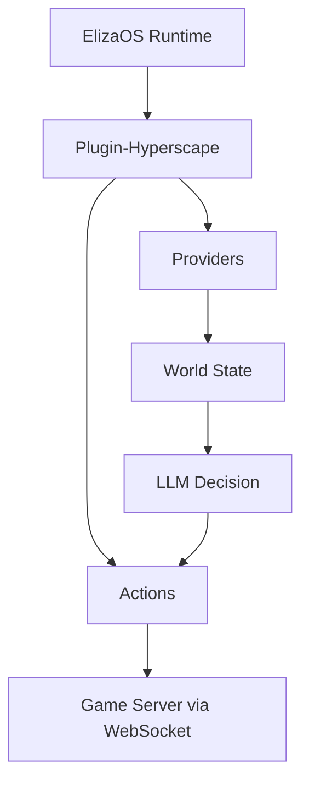

## Overview

The `@hyperscape/plugin-hyperscape` package enables AI agents to play Hyperscape autonomously using ElizaOS:

- Agent actions (combat, skills, movement)
- World state providers
- LLM decision-making via OpenAI/Anthropic/OpenRouter
- Full player capabilities

## Package Location

```
packages/plugin-hyperscape/
├── src/
│   ├── actions/        # Agent actions
│   ├── clients/        # WebSocket client
│   ├── config/         # Configuration
│   ├── content-packs/  # Character templates
│   ├── evaluators/     # Goal evaluation
│   ├── events/         # Event handlers
│   ├── handlers/       # Message handlers
│   ├── managers/       # State management
│   ├── providers/      # World state providers
│   ├── routes/         # API routes
│   ├── services/       # Core services
│   ├── systems/        # Agent systems
│   ├── templates/      # LLM prompts
│   ├── testing/        # Test utilities
│   ├── types/          # TypeScript types
│   ├── utils/          # Helper functions
│   ├── index.ts        # Plugin entry
│   └── service.ts      # Main service
└── .env.example        # Environment template
```

## Actions

Agent capabilities are defined in `src/actions/`:

```typescript
// From packages/plugin-hyperscape/src/index.ts (lines 161-188)
actions: [
  // Movement
  moveToAction,
  followEntityAction,
  stopMovementAction,

  // Combat
  attackEntityAction,
  changeCombatStyleAction,

  // Skills
  chopTreeAction,
  catchFishAction,
  lightFireAction,
  cookFoodAction,

  // Inventory
  equipItemAction,
  useItemAction,
  dropItemAction,

  // Social
  chatMessageAction,

  // Banking
  bankDepositAction,
  bankWithdrawAction,
],
```

### Action Categories

| Category | Actions | Source File |
|----------|---------|-------------|
| **Movement** | moveTo, followEntity, stopMovement | `actions/movement.ts` |
| **Combat** | attackEntity, changeCombatStyle | `actions/combat.ts` |
| **Skills** | chopTree, catchFish, lightFire, cookFood | `actions/skills.ts` |
| **Inventory** | equipItem, useItem, dropItem | `actions/inventory.ts` |
| **Social** | chatMessage | `actions/social.ts` |
| **Banking** | bankDeposit, bankWithdraw | `actions/banking.ts` |

### Action Locks and Fast-Tick Mode (Commit 60a03f4, Feb 26 2026)

**Problem:** Agents would spam LLM calls while waiting for movement to complete, wasting tokens and causing decision conflicts.

**Solution:** Action lock system with fast-tick mode for responsive follow-up actions.

**Action Lock:**
```typescript
// From packages/plugin-hyperscape/src/managers/autonomous-behavior-manager.ts

// Skip LLM tick while movement is in progress
if (this.actionLock) {
  logger.debug('[AutonomousBehavior] Action locked, skipping LLM tick');
  return;
}

// Set lock before movement
this.actionLock = true;
await service.executeMove({ target: resourcePosition });

// Wait for movement to complete
await service.waitForMovementComplete();

// Clear lock after movement
this.actionLock = false;
```

**Fast-Tick Mode:**
```typescript
// Quick follow-up after movement/goal changes (2s instead of 10s)
if (this.shouldUseFastTick()) {
  this.tickInterval = 2000;  // 2 seconds
} else {
  this.tickInterval = 10000; // 10 seconds (normal)
}
```

**Short-Circuit LLM:**

For obvious decisions, skip LLM and execute directly:

```typescript
// Repeat resource gathering
if (lastAction === 'gather' && resourceStillAvailable) {
  return this.executeGather(sameResource);  // No LLM call
}

// Banking completion
if (atBank && inventoryFull) {
  return this.executeBankDeposit();  // No LLM call
}

// Goal-based actions
if (goal.type === 'woodcutting' && nearbyTree) {
  return this.executeChopTree(nearbyTree);  // No LLM call
}
```

**Benefits:**
- **90% reduction in LLM calls** for repetitive tasks
- **Faster response** to movement completion (2s vs 10s)
- **Lower costs** from reduced API usage
- **More natural behavior** (no pauses between actions)

**Configuration:**
```bash
# Disable action locks (not recommended)
AGENT_ACTION_LOCKS_ENABLED=false

# Disable fast-tick mode
AGENT_FAST_TICK_ENABLED=false

# Disable short-circuit LLM
AGENT_SHORT_CIRCUIT_LLM_ENABLED=false
```

### Movement Completion Tracking

**New API:**
```typescript
// Wait for current movement to complete
await service.waitForMovementComplete(timeoutMs?: number);

// Check if currently moving
const moving = service.isMoving;
```

**How it works:**
1. `executeMove()` sets `_isMoving = true`
2. `tileMovementEnd` packet sets `_isMoving = false` and resolves promise
3. `waitForMovementComplete()` returns immediately if not moving
4. Timeout (default 15s) prevents infinite waits

**Example:**
```typescript
// Banking action now awaits movement completion
async executeBankDeposit() {
  // Walk to bank
  await service.executeMove({ target: bankPosition });
  
  // Wait for movement to complete
  await service.waitForMovementComplete();
  
  // Now interact with bank
  await service.openBank(bankId);
  await service.bankDepositAll();
}
```

**Before (commit 60a03f4):**
- Banking actions returned early without waiting
- Agent would spam LLM while walking to bank
- Multiple conflicting actions queued

**After:**
- Banking actions await movement completion
- Action lock prevents LLM spam
- Fast-tick triggers quick follow-up after arrival

## Providers

World state is accessible to agents via 6 providers:

```typescript
// From packages/plugin-hyperscape/src/index.ts (lines 148-156)
providers: [
  gameStateProvider,        // Player health, stamina, position, combat status
  inventoryProvider,        // Inventory items, coins, free slots
  nearbyEntitiesProvider,   // Players, NPCs, resources nearby
  skillsProvider,           // Skill levels and XP
  equipmentProvider,        // Equipped items
  availableActionsProvider, // Context-aware available actions
],
```

| Provider | Data |
|----------|------|
| `gameStateProvider` | Health, stamina, position, combat status |
| `inventoryProvider` | Current inventory items and coins |
| `nearbyEntitiesProvider` | Players, NPCs, resources in range |
| `skillsProvider` | Skill levels and XP |
| `equipmentProvider` | Currently equipped items |
| `availableActionsProvider` | Context-aware actions (e.g., "can cook fish") |

## Configuration

```bash
# LLM Provider (at least one required)
OPENAI_API_KEY=your-openai-key
# or
ANTHROPIC_API_KEY=your-anthropic-key
# or
OPENROUTER_API_KEY=your-openrouter-key
```

## Running

```bash
bun run dev:elizaos    # Game + AI agents
```

This starts ElizaOS alongside the game server. The AI agent connects as a real player and plays autonomously.

## Agent Architecture



## Dependencies

| Package | Version | Purpose |
|---------|---------|---------|
| `@elizaos/core` | ^1.2.9 | ElizaOS framework |
| `@elizaos/plugin-anthropic` | ^1.5.12 | Anthropic LLM |
| `@elizaos/plugin-openai` | 1.5.16 | OpenAI LLM |
| `@elizaos/plugin-openrouter` | ^1.5.15 | OpenRouter LLM |
| `@elizaos/plugin-sql` | ^1.6.4 | SQL database |
| `@hyperscape/shared` | workspace | Core engine |
| `ws` | ^8.18.3 | WebSocket client |
| `zod` | ^3.25.67 | Schema validation |

## Building

```bash
cd packages/plugin-hyperscape
bun run build    # Compile TypeScript
bun run dev      # Watch mode
```

## Key Files

| File | Purpose |
|------|---------|
| `src/index.ts` | Plugin registration |
| `src/service.ts` | Main service class |
| `src/actions/` | All agent actions |
| `src/providers/` | State providers |
| `src/templates/` | LLM prompt templates |

## License

MIT License - can be used in any ElizaOS agent.
