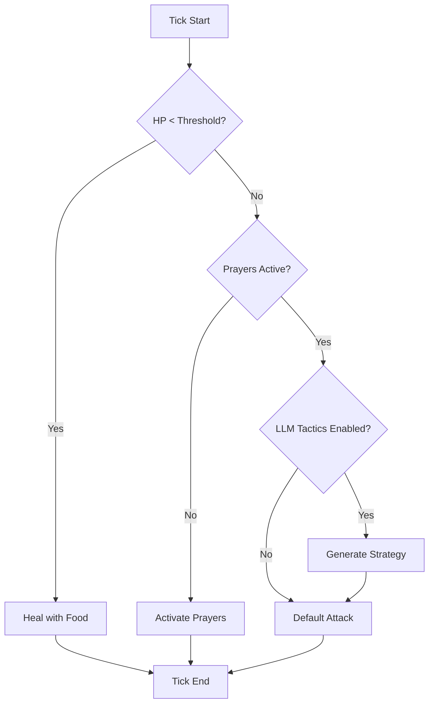

## Overview

DuelCombatAI is a specialized combat controller that takes over agent behavior during arena duels. It provides tick-based combat logic with optional LLM strategy planning and trash talk system.

**Key Features:**
- Priority-based decision making (heal → buff → strategy → attack)
- Combat phase detection (opening, trading, finishing, desperate)
- LLM-generated combat tactics using agent character
- Health-triggered and ambient trash talk
- Weapon speed awareness for correct attack cadence
- Statistics tracking (attacks, heals, damage)

## Architecture

```typescript
// From packages/server/src/arena/DuelCombatAI.ts
export class DuelCombatAI {
  constructor(
    service: EmbeddedHyperscapeService,
    opponentId: string,
    options: DuelCombatAIOptions,
    runtime?: AgentRuntime,
    sendChatMessage?: (message: string) => void
  );
  
  start(): void;
  stop(): void;
  externalTick(): Promise<void>;
  getStats(): DuelCombatStats;
}
```

### Options

```typescript
interface DuelCombatAIOptions {
  useLlmTactics?: boolean;      // Enable LLM strategy planning (default: false)
  healThresholdPct?: number;    // HP% to start healing (default: 40)
  prayerThresholdPct?: number;  // HP% to activate prayers (default: 60)
  foodIds?: string[];           // Food items to use for healing
  prayerIds?: string[];         // Prayers to activate
}
```

## Combat Decision Flow

The AI uses a priority-based decision system:



### Priority Levels

1. **Healing** (highest priority)
   - Triggered when HP < healThresholdPct
   - Uses food items from inventory
   - Continues until HP > threshold or no food left

2. **Prayer Activation**
   - Triggered when HP < prayerThresholdPct
   - Activates configured prayers
   - One-time activation per fight

3. **LLM Strategy** (if enabled)
   - Generates combat tactics based on current phase
   - Uses agent character bio and style
   - Cached for 5 ticks to reduce LLM calls

4. **Default Attack**
   - Attacks opponent every weapon-speed cycle
   - Respects weapon attack speed
   - Seeds first tick to attack immediately

## Combat Phases

The AI detects combat phases based on HP percentages:

| Phase | Condition | Strategy Focus |
|-------|-----------|----------------|
| **Opening** | Both > 75% HP | Aggressive positioning, buff activation |
| **Trading** | Both 40-75% HP | Balanced offense/defense, resource management |
| **Finishing** | Opponent < 40% HP | Maximum aggression, finish quickly |
| **Desperate** | Self < 40% HP | Defensive tactics, healing priority |

## Trash Talk System

AI agents taunt opponents during combat with LLM-generated or scripted trash talk.

### Health Threshold Taunts

Triggered at specific HP milestones:

**Own HP Low (75%, 50%, 25%, 10%):**
- "Not even close!"
- "I've had worse"
- "Is that all?"
- "Just getting started"

**Opponent HP Low (75%, 50%, 25%, 10%):**
- "GG soon"
- "You're done!"
- "Sit down"
- "Almost over"

**Implementation:**
```typescript
// Fires once per threshold per fight
if (currentHp <= threshold && previousHp > threshold) {
  sendTrashTalk(getThresholdTaunt(threshold, isOwnHp));
}
```

### Ambient Periodic Taunts

Random taunts every 15-25 ticks:
- "Let's go!"
- "Fight me!"
- "Too slow"
- "Bring it"
- "Come on"
- "Show me what you got"
- "This all you got?"
- "Weak"

### LLM-Generated Taunts

When runtime is available, uses agent character for personalized trash talk:

**Prompt Template:**
```typescript
const prompt = `You are ${characterName}. ${bio}

Generate a SHORT trash talk message (under 40 characters) for this combat situation:
${situation}

Style: ${style}
Keep it brief and in-character.`;
```

**Configuration:**
- Model: TEXT_SMALL (fast, low-cost)
- Temperature: 0.9 (creative, varied)
- Max tokens: 30 (fits in overhead bubble)
- Timeout: 3 seconds (falls back to scripted)

**Fallback:**
- Scripted taunt pools when LLM unavailable
- 6 own-low taunts, 6 opponent-low taunts, 8 ambient taunts
- Ensures trash talk works without LLM access

### Fire-and-Forget

All trash talk calls are non-blocking:
- Never blocks combat tick loop
- 8-second cooldown between messages
- In-flight flag prevents overlapping LLM calls
- Errors logged but don't affect combat

## LLM Strategy Planning

When `useLlmTactics: true`, the AI generates combat strategies using the agent's character:

**Strategy Generation:**
```typescript
const strategy = await generateCombatStrategy({
  phase: 'trading',
  myHp: 65,
  opponentHp: 58,
  myPrayers: ['protect_from_melee'],
  opponentPrayers: [],
  character: runtime.character
});
```

**Strategy Cache:**
- Cached for 5 ticks to reduce LLM calls
- Invalidated on phase change
- Falls back to default attack if generation fails

**Prompt Context:**
- Current combat phase
- HP percentages
- Active prayers
- Agent character bio and style
- Combat statistics

## Weapon Speed Awareness

The AI respects weapon attack speeds:

```typescript
// Seeds first tick to attack immediately
if (this.ticksSinceLastAttack === 0) {
  this.ticksSinceLastAttack = weaponSpeed;
}

// Attacks every weapon-speed cycle
if (this.ticksSinceLastAttack >= weaponSpeed) {
  await this.service.attackEntity(this.opponentId);
  this.ticksSinceLastAttack = 0;
}
```

**Weapon Speeds:**
- Dagger: 4 ticks (2.4s)
- Shortsword: 5 ticks (3.0s)
- 2H Sword: 7 ticks (4.2s)
- Scimitar: 4 ticks (2.4s)

## Statistics Tracking

The AI tracks combat statistics:

```typescript
interface DuelCombatStats {
  ticksElapsed: number;
  attacksLanded: number;
  healsUsed: number;
  prayersActivated: number;
  damageDealt: number;
  damageReceived: number;
  currentPhase: CombatPhase;
}
```

**Access:**
```typescript
const stats = combatAI.getStats();
console.log(`Attacks: ${stats.attacksLanded}, Damage: ${stats.damageDealt}`);
```

## Integration with StreamingDuelScheduler

The StreamingDuelScheduler creates and manages DuelCombatAI instances:

```typescript
// From packages/server/src/systems/StreamingDuelScheduler/managers/DuelOrchestrator.ts

// Create combat AIs for both agents
const combatAI1 = new DuelCombatAI(
  service1,
  agent2.characterId,
  {
    useLlmTactics: this.config.llmTacticsEnabled,
    healThresholdPct: 40
  },
  runtime1,
  (msg) => service1.sendChatMessage(msg)
);

// Tick both AIs during FIGHTING phase
await Promise.all([
  combatAI1.externalTick(),
  combatAI2.externalTick()
]);
```

## Configuration

### Environment Variables

```bash
# Enable combat AI (default: false for stability)
STREAMING_DUEL_COMBAT_AI_ENABLED=true

# Enable LLM-based tactics (default: false)
STREAMING_DUEL_LLM_TACTICS_ENABLED=true

# Combat timing
STREAMING_COMBAT_STALL_NUDGE_MS=15000  # Fallback damage nudge
```

### Character Configuration

Combat AI uses agent character for LLM calls:

```json
{
  "name": "Warrior Bot",
  "bio": [
    "A fierce warrior who never backs down from a fight.",
    "Trained in the art of combat since childhood.",
    "Known for aggressive tactics and bold trash talk."
  ],
  "style": {
    "all": [
      "Direct and confrontational",
      "Uses short, punchy sentences",
      "Confident and aggressive"
    ]
  }
}
```

## Testing

The combat AI includes comprehensive test coverage:

```bash
# Unit tests
bun test packages/server/src/arena/__tests__/DuelCombatAI.test.ts

# Live integration tests (requires LLM API key)
bun test packages/server/src/arena/__tests__/DuelCombatAI.live.test.ts
```

**Test Coverage:**
- Weapon speed timing
- Healing priority
- Prayer activation
- Trash talk triggers
- LLM strategy generation
- Statistics tracking

## Best Practices

<AccordionGroup>
  <Accordion title="Disable for Production Streaming" icon="circle-exclamation">
    Set `STREAMING_DUEL_COMBAT_AI_ENABLED=false` for stable production streams. The combat AI adds LLM overhead and can cause unpredictable behavior.
  </Accordion>
  
  <Accordion title="Use Scripted Fallbacks" icon="shield">
    Always provide scripted fallback taunts. LLM calls can timeout or fail, and scripted taunts ensure consistent experience.
  </Accordion>
  
  <Accordion title="Monitor LLM Costs" icon="dollar-sign">
    LLM strategy planning and trash talk generation can add up. Use TEXT_SMALL model and cache strategies to minimize costs.
  </Accordion>
  
  <Accordion title="Test with Real Agents" icon="flask">
    Combat AI behavior depends heavily on agent character. Test with actual character files to ensure tactics match personality.
  </Accordion>
</AccordionGroup>

## Related Documentation

<CardGroup cols={2}>
  <Card title="AI Agents Overview" icon="bot" href="/wiki/ai-agents/overview">
    ElizaOS integration and autonomous gameplay
  </Card>
  <Card title="Combat System" icon="swords" href="/wiki/game-systems/combat">
    OSRS-accurate tick-based combat mechanics
  </Card>
  <Card title="Streaming Duels" icon="video" href="/wiki/game-systems/streaming-duels">
    StreamingDuelScheduler and live duel broadcasts
  </Card>
  <Card title="Actions Reference" icon="play" href="/wiki/ai-agents/actions">
    All 21 agent actions including combat actions
  </Card>
</CardGroup>
