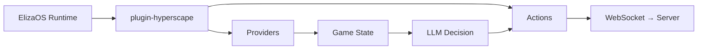

{/* 
  Source: packages/plugin-hyperscape/src/
  Verified against actual codebase
*/}

## Introduction

Hyperscape integrates [ElizaOS](https://elizaos.ai) to enable AI agents that play the game autonomously. Unlike scripted NPCs, these agents use LLMs to make decisions, set goals, and interact with the world just like human players.

<Info>
  AI agents connect via the same WebSocket protocol as human players and have full access to all game mechanics.
</Info>

---

## Plugin Architecture

The `@hyperscape/plugin-hyperscape` package provides:

```
packages/plugin-hyperscape/src/
├── actions/              # 21 game actions (movement, combat, skills, etc.)
├── providers/            # 7 state providers (game state, inventory, etc.)
├── evaluators/           # Decision-making evaluators
├── services/             # HyperscapeService (WebSocket client)
├── events/               # Event handlers for memory storage
├── routes/               # HTTP API for agent management
├── managers/             # State and behavior management
├── templates/            # LLM prompt templates
├── content-packs/        # Character templates
├── config/               # Configuration
├── types/                # TypeScript types
└── index.ts              # Plugin entry point
```

---

## Plugin Registration

```typescript
// From packages/plugin-hyperscape/src/index.ts
export const hyperscapePlugin: Plugin = {
  name: "@hyperscape/plugin-hyperscape",
  description: "Connect ElizaOS AI agents to Hyperscape 3D multiplayer RPG worlds",

  services: [HyperscapeService],

  providers: [
    goalProvider,            // Current goal and progress
    gameStateProvider,       // Health, stamina, position, combat
    inventoryProvider,       // Items, coins, free slots
    nearbyEntitiesProvider,  // Players, NPCs, resources
    skillsProvider,          // Skill levels and XP
    equipmentProvider,       // Equipped items
    availableActionsProvider, // Context-aware actions
  ],

  evaluators: [
    goalEvaluator,           // Goal progress assessment
    survivalEvaluator,       // Health and threat assessment
    explorationEvaluator,    // Exploration opportunities
    socialEvaluator,         // Social interactions
    combatEvaluator,         // Combat opportunities
  ],

  actions: [
    // 21 actions listed below
  ],
};
```

---

## Available Actions

The plugin provides **24 actions** across 8 categories (updated Feb 26 2026):

### Goal-Oriented Actions

| Action | Description |
|--------|-------------|
| `setGoalAction` | Set a new goal when none exists |
| `navigateToAction` | Navigate to goal location |

### Autonomous Behavior

| Action | Description |
|--------|-------------|
| `autonomousAttackAction` | Attack nearby mobs |
| `exploreAction` | Move to explore new areas |
| `fleeAction` | Run away from danger |
| `idleAction` | Stand still and observe |
| `approachEntityAction` | Move towards a specific entity |

### Movement Actions

| Action | File | Description |
|--------|------|-------------|
| `moveToAction` | `actions/movement.ts` | Navigate to coordinates |
| `followEntityAction` | `actions/movement.ts` | Follow an entity |
| `stopMovementAction` | `actions/movement.ts` | Stop moving |

### Combat Actions

| Action | File | Description |
|--------|------|-------------|
| `attackEntityAction` | `actions/combat.ts` | Attack a target |
| `changeCombatStyleAction` | `actions/combat.ts` | Change attack style |

### Skill Actions

| Action | File | Description |
|--------|------|-------------|
| `chopTreeAction` | `actions/skills.ts` | Chop a tree (Woodcutting) |
| `mineRockAction` | `actions/skills.ts` | Mine a rock (Mining) |
| `catchFishAction` | `actions/skills.ts` | Catch fish (Fishing) |
| `lightFireAction` | `actions/skills.ts` | Light a fire (Firemaking) |
| `cookFoodAction` | `actions/skills.ts` | Cook food (Cooking) |

### Inventory Actions

| Action | File | Description |
|--------|------|-------------|
| `equipItemAction` | `actions/inventory.ts` | Equip an item |
| `useItemAction` | `actions/inventory.ts` | Use/consume an item |
| `dropItemAction` | `actions/inventory.ts` | Drop an item |

### Social Actions

| Action | File | Description |
|--------|------|-------------|
| `chatMessageAction` | `actions/social.ts` | Send a chat message |

### Banking Actions <Badge text="Updated" variant="info" />

| Action | File | Description |
|--------|------|-------------|
| `bankDepositAction` | `actions/banking.ts` | Deposit items to bank (walks to bank automatically) |
| `bankWithdrawAction` | `actions/banking.ts` | Withdraw items from bank (walks to bank automatically) |
| `bankDepositAllAction` | `actions/banking.ts` | **NEW**: Bulk deposit (keeps essential tools) |

**Banking Protocol** (commit 593cd56b):
- Proper packet sequence: `bankOpen` → `bankDeposit/bankDepositAll/bankWithdraw` → `bankClose`
- Replaces broken `bankAction` packet
- Banking actions now await movement completion instead of returning early
- Auto-walks to nearest bank if distance > 5 units

**Essential Tools** (never deposited by `bankDepositAll`):
- Hatchets (bronze, iron, steel, mithril)
- Pickaxes (bronze, iron, steel, mithril)
- Tinderbox
- Small Fishing Net

### Questing Actions <Badge text="New" variant="success" />

| Action | File | Description |
|--------|------|-------------|
| `acceptQuestAction` | `actions/quests.ts` | Accept quest from NPC (items granted immediately) |
| `completeQuestAction` | `actions/quests.ts` | Complete quest for XP rewards |

**Quest-Based Tool Acquisition** (commit 593cd56b):
- Replaced `LOOT_STARTER_CHEST` action with quest system
- Tools granted immediately on quest accept (no need to complete)
- Questing goal has highest priority when agent lacks tools

**Tool-Granting Quests**:
- `lumberjacks_first_lesson` (Forester Wilma) → Bronze Hatchet + Tinderbox
- `fresh_catch` (Fisherman Pete) → Small Fishing Net
- `torvins_tools` (Torvin) → Bronze Pickaxe + Hammer

---

## State Providers

Providers supply game context to the agent's decision-making:

### goalProvider

Provides current goal and progress tracking.

### gameStateProvider

```typescript
// Player health, stamina, position, combat status
{
  health: { current: 45, max: 99 },
  stamina: { current: 80, max: 100 },
  position: { x: 123.5, y: 0, z: 456.7 },
  inCombat: false,
  combatTarget: null,
}
```

### inventoryProvider

```typescript
// Inventory items, coins, free slots
{
  items: [
    { id: "bronze_sword", quantity: 1, slot: 0 },
    { id: "coins", quantity: 500, slot: 1 },
  ],
  freeSlots: 26,
  totalCoins: 500,
}
```

### nearbyEntitiesProvider

```typescript
// Players, NPCs, resources in range
{
  players: [...],
  mobs: [
    { id: "goblin_1", name: "Goblin", distance: 5.2, health: 10 },
  ],
  resources: [
    { id: "tree_1", type: "tree", distance: 3.1 },
  ],
  items: [...],
}
```

### skillsProvider

```typescript
// Skill levels and XP
{
  attack: { level: 10, xp: 1154 },
  strength: { level: 8, xp: 737 },
  defense: { level: 5, xp: 388 },
  constitution: { level: 12, xp: 1623 },
  ranged: { level: 1, xp: 0 },
  woodcutting: { level: 15, xp: 2411 },
  fishing: { level: 10, xp: 1154 },
  firemaking: { level: 5, xp: 388 },
  cooking: { level: 8, xp: 737 },
}
```

### equipmentProvider

```typescript
// Currently equipped items
{
  weapon: { id: "bronze_sword", name: "Bronze Sword" },
  shield: null,
  helmet: null,
  body: null,
  legs: null,
  arrows: null,
}
```

### availableActionsProvider

```typescript
// Context-aware actions the agent can perform now
{
  canAttack: ["goblin_1", "goblin_2"],
  canChopTree: ["tree_5"],
  canCatchFish: [],
  canCook: false,
  canBank: false,
}
```

---

## Evaluators

Evaluators assess game state for autonomous decision-making:

| Evaluator | Purpose |
|-----------|---------|
| `goalEvaluator` | Check goal progress, provide recommendations |
| `survivalEvaluator` | Assess health, threats, survival needs |
| `explorationEvaluator` | Identify exploration opportunities |
| `socialEvaluator` | Identify social interaction opportunities |
| `combatEvaluator` | Assess combat opportunities and threats |

---

## Configuration

```typescript
// From packages/plugin-hyperscape/src/index.ts
const configSchema = z.object({
  HYPERSCAPE_SERVER_URL: z
    .string()
    .url()
    .optional()
    .default("ws://localhost:5555/ws"),
  HYPERSCAPE_AUTO_RECONNECT: z
    .string()
    .optional()
    .default("true")
    .transform((val) => val !== "false"),
  HYPERSCAPE_AUTH_TOKEN: z
    .string()
    .optional(),
  HYPERSCAPE_PRIVY_USER_ID: z
    .string()
    .optional(),
});
```

### Environment Variables

```bash
# LLM Provider (at least one required)
OPENAI_API_KEY=your-openai-key
ANTHROPIC_API_KEY=your-anthropic-key
OPENROUTER_API_KEY=your-openrouter-key

# Hyperscape Connection
HYPERSCAPE_SERVER_URL=ws://localhost:5555/ws
HYPERSCAPE_AUTO_RECONNECT=true
HYPERSCAPE_AUTH_TOKEN=optional-privy-token
HYPERSCAPE_PRIVY_USER_ID=optional-privy-user-id
```

---

## Running AI Agents

```bash
# Start game with AI agents
bun run dev:elizaos
```

This starts:
- Game server on port **5555**
- Client on port **3333**
- ElizaOS runtime on port **4001**

---

## Spectator Mode

Watch AI agents play in real-time:

1. Start with `bun run dev:elizaos`
2. Open `http://localhost:3333`
3. Select an agent to spectate
4. Observe decision-making in action

---

## Agent Architecture Flow



---

## Event Handlers

Game events are stored as memories for agent learning:

```typescript
// From packages/plugin-hyperscape/src/index.ts
events: {
  RUN_STARTED: [
    async (payload) => {
      const runtime = payload.runtime;
      const service = runtime.getService<HyperscapeService>("hyperscapeService");
      if (service && !service.arePluginEventHandlersRegistered()) {
        registerEventHandlers(runtime, service);
        service.markPluginEventHandlersRegistered();
      }
    },
  ],
},
```

---

## Combat AI System

Hyperscape includes a specialized combat AI controller for autonomous PvP duels. See the [Combat AI documentation](/wiki/ai-agents/combat-ai) for complete details.

### DuelCombatAI

Tick-based combat controller that takes over agent behavior during arena duels:

```typescript
// From packages/server/src/arena/DuelCombatAI.ts
const combatAI = new DuelCombatAI(
  service,           // EmbeddedHyperscapeService
  opponentId,        // Target character ID
  {
    useLlmTactics: true,      // Enable LLM strategy planning
    healThresholdPct: 40      // HP% to start healing
  },
  runtime,           // AgentRuntime for LLM calls
  sendChat           // Callback for trash talk
);

combatAI.start();
await combatAI.externalTick();  // Called by StreamingDuelScheduler
combatAI.stop();
```

**Key Features:**
- **Priority-Based Decisions**: Heal → Buff → Strategy → Attack
- **Combat Phases**: Opening, Trading, Finishing, Desperate
- **LLM Strategy Planning**: Generates combat tactics using agent character
- **Trash Talk System**: Health-triggered and ambient taunts with LLM generation
- **Synchronized Attack Timing**: Works with combat system's auto-attack loop (commit 51453dae)
- **Statistics Tracking**: Attacks landed, heals used, damage dealt/received

**Attack Timing Fix (commit 51453dae):**

The AI no longer manually tracks attack speed. Instead, it only re-engages when combat drops or the target changes. The combat system's auto-attack loop drives the actual attack cadence, preventing silent attack drops for slow weapons like 2h swords.

**Configuration:**
```bash
STREAMING_DUEL_COMBAT_AI_ENABLED=true       # Enable combat AI
STREAMING_DUEL_LLM_TACTICS_ENABLED=true     # Enable LLM strategy
TRASH_TALK_COOLDOWN_MS=8000                 # Cooldown between messages
TRASH_TALK_LLM_TIMEOUT_MS=3000              # LLM generation timeout
```

---

## Recent Improvements (February 2026)

### Quest-Driven Tool Acquisition

Replaced starter chest system with quest-based tool acquisition:
- Agents complete quests to acquire tools (Lumberjack's First Lesson, Fresh Catch, Torvin's Tools)
- Questing goal has highest priority when tools are missing
- More realistic gameplay progression

### Autonomous Banking

Agents automatically manage inventory:
- Banking goal triggers at 25/28 inventory slots
- `bankDepositAllAction` keeps essential tools (axe, pickaxe, tinderbox, net)
- Banking actions await movement completion
- Previous goal auto-restores after banking

### Action Locks and Fast-Tick Mode

Performance and responsiveness improvements:
- **Action locks**: Skip LLM ticks while movement is in progress
- **Fast-tick mode**: 2s interval after movement/goal changes (vs 10s normal)
- **Short-circuit LLM**: Skip LLM for obvious decisions (repeat resource, banking)
- **Movement tracking**: `waitForMovementComplete()` and `isMoving` state

### Resource Detection Fix

Increased resource approach range from 20m to 40m:
- Fixes "choppableTrees=0" errors despite visible trees
- Matches server-side skills validation range
- Applied to CHOP_TREE, MINE_ROCK, and CATCH_FISH actions

### Inventory Display (Commit 60a03f49)

Added inventory count display with warnings:
- Shows current inventory count (e.g., "24/28 slots")
- Warns when nearly full (>= 25 slots)
- Warns when completely full (28 slots)
- Helps LLM decide when to bank

### Stability Improvements

Model agent stability fixes (PR #945):
- **Database Isolation**: Force PGLite for agents, prevent destructive migrations on game DB
- **Initialization Timeout**: 45s timeout on runtime init prevents indefinite hangs
- **Event Listener Cleanup**: Duplication guard prevents memory leaks
- **Graceful Shutdown**: 10s timeout on runtime.stop() with dangling promise cleanup
- **Circuit Breaker**: 3 consecutive failure limit, 8 max reconnect retries
- **WASM Heap Cleanup**: Explicit DB adapter close releases memory
- **Duel Recovery**: Check contestant status independently during ANNOUNCEMENT phase

---

## Detailed Documentation

<CardGroup cols={2}>
  <Card title="Actions Reference" icon="play" href="/wiki/ai-agents/actions">
    Complete reference for all 21 agent actions including movement, combat, skills, inventory, and goals.
  </Card>
  <Card title="Providers Reference" icon="database" href="/wiki/ai-agents/providers">
    All 7 context providers that supply game state to the LLM for decision-making.
  </Card>
  <Card title="Combat AI" icon="swords" href="/wiki/ai-agents/combat-ai">
    Tick-based PvP combat controller with LLM tactics and trash talk system.
  </Card>
</CardGroup>
