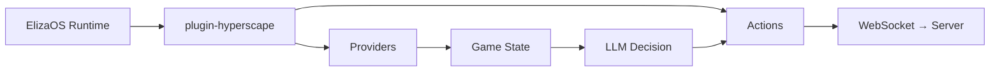

{/* 
  Source: packages/plugin-hyperscape/src/
  Verified against actual codebase
*/}

## Introduction

Hyperscape integrates [ElizaOS](https://elizaos.ai) to enable AI agents that play the game autonomously. Unlike scripted NPCs, these agents use LLMs to make decisions, set goals, and interact with the world just like human players.

<Info>
  **ElizaOS 1.7.0**: Hyperscape is compatible with ElizaOS 1.7.0+ with backwards-compatible shims for cross-version support. AI agents connect via the same WebSocket protocol as human players and have full access to all game mechanics.
</Info>

---

## Plugin Architecture

The `@hyperscape/plugin-hyperscape` package provides:

```
packages/plugin-hyperscape/src/
├── actions/              # 21 game actions (movement, combat, skills, etc.)
├── providers/            # 7 state providers (game state, inventory, etc.)
├── evaluators/           # Decision-making evaluators
├── services/             # HyperscapeService (WebSocket client)
├── events/               # Event handlers for memory storage
├── routes/               # HTTP API for agent management
├── managers/             # State and behavior management
├── templates/            # LLM prompt templates
├── content-packs/        # Character templates
├── config/               # Configuration
├── types/                # TypeScript types
└── index.ts              # Plugin entry point
```

---

## Plugin Registration

```typescript
// From packages/plugin-hyperscape/src/index.ts
export const hyperscapePlugin: Plugin = {
  name: "@hyperscape/plugin-hyperscape",
  description: "Connect ElizaOS AI agents to Hyperscape 3D multiplayer RPG worlds",

  services: [HyperscapeService],

  providers: [
    goalProvider,            // Current goal and progress
    gameStateProvider,       // Health, stamina, position, combat
    inventoryProvider,       // Items, coins, free slots
    nearbyEntitiesProvider,  // Players, NPCs, resources
    skillsProvider,          // Skill levels and XP
    equipmentProvider,       // Equipped items
    availableActionsProvider, // Context-aware actions
  ],

  evaluators: [
    goalEvaluator,           // Goal progress assessment
    survivalEvaluator,       // Health and threat assessment
    explorationEvaluator,    // Exploration opportunities
    socialEvaluator,         // Social interactions
    combatEvaluator,         // Combat opportunities
  ],

  actions: [
    // 21 actions listed below
  ],
};
```

---

## Available Actions

The plugin provides **22 actions** across 8 categories:

### Goal-Oriented Actions

| Action | Description |
|--------|-------------|
| `setGoalAction` | Set a new goal when none exists |
| `navigateToAction` | Navigate to goal location |

### Autonomous Behavior

| Action | Description |
|--------|-------------|
| `autonomousAttackAction` | Attack nearby mobs |
| `exploreAction` | Move to explore new areas |
| `fleeAction` | Run away from danger |
| `idleAction` | Stand still and observe |
| `approachEntityAction` | Move towards a specific entity |

### Movement Actions

| Action | File | Description |
|--------|------|-------------|
| `moveToAction` | `actions/movement.ts` | Navigate to coordinates |
| `followEntityAction` | `actions/movement.ts` | Follow an entity |
| `stopMovementAction` | `actions/movement.ts` | Stop moving |

### Combat Actions

| Action | File | Description |
|--------|------|-------------|
| `attackEntityAction` | `actions/combat.ts` | Attack a target |
| `changeCombatStyleAction` | `actions/combat.ts` | Change attack style |

### Skill Actions

| Action | File | Description |
|--------|------|-------------|
| `chopTreeAction` | `actions/skills.ts` | Chop a tree (Woodcutting) |
| `catchFishAction` | `actions/skills.ts` | Catch fish (Fishing) |
| `lightFireAction` | `actions/skills.ts` | Light a fire (Firemaking) |
| `cookFoodAction` | `actions/skills.ts` | Cook food (Cooking) |

### Inventory Actions

| Action | File | Description |
|--------|------|-------------|
| `equipItemAction` | `actions/inventory.ts` | Equip an item |
| `useItemAction` | `actions/inventory.ts` | Use/consume an item |
| `dropItemAction` | `actions/inventory.ts` | Drop an item (supports "drop all") |
| `pickupItemAction` | `actions/inventory.ts` | Pick up items from ground |

### Social Actions

| Action | File | Description |
|--------|------|-------------|
| `chatMessageAction` | `actions/social.ts` | Send a chat message |

### Banking Actions

| Action | File | Description |
|--------|------|-------------|
| `bankDepositAction` | `actions/banking.ts` | Deposit items to bank |
| `bankWithdrawAction` | `actions/banking.ts` | Withdraw items from bank |

---

## State Providers

Providers supply game context to the agent's decision-making:

### goalProvider

Provides current goal and progress tracking.

### gameStateProvider

```typescript
// Player health, stamina, position, combat status
{
  health: { current: 45, max: 99 },
  stamina: { current: 80, max: 100 },
  position: { x: 123.5, y: 0, z: 456.7 },
  inCombat: false,
  combatTarget: null,
}
```

### inventoryProvider

```typescript
// Inventory items, coins, free slots
{
  items: [
    { id: "bronze_sword", quantity: 1, slot: 0 },
    { id: "coins", quantity: 500, slot: 1 },
  ],
  freeSlots: 26,
  totalCoins: 500,
}
```

### nearbyEntitiesProvider

```typescript
// Players, NPCs, resources in range
{
  players: [...],
  mobs: [
    { id: "goblin_1", name: "Goblin", distance: 5.2, health: 10 },
  ],
  resources: [
    { id: "tree_1", type: "tree", distance: 3.1 },
  ],
  items: [...],
}
```

### skillsProvider

```typescript
// Skill levels and XP
{
  attack: { level: 10, xp: 1154 },
  strength: { level: 8, xp: 737 },
  defense: { level: 5, xp: 388 },
  constitution: { level: 12, xp: 1623 },
  ranged: { level: 1, xp: 0 },
  prayer: { level: 5, xp: 388 },
  woodcutting: { level: 15, xp: 2411 },
  mining: { level: 10, xp: 1154 },
  fishing: { level: 10, xp: 1154 },
  mining: { level: 10, xp: 1154 },
  firemaking: { level: 5, xp: 388 },
  cooking: { level: 8, xp: 737 },
  smithing: { level: 3, xp: 276 },
  agility: { level: 8, xp: 737 },
}
```

### equipmentProvider

```typescript
// Currently equipped items
{
  weapon: { id: "bronze_sword", name: "Bronze Sword" },
  shield: null,
  helmet: null,
  body: null,
  legs: null,
  arrows: null,
}
```

### availableActionsProvider

```typescript
// Context-aware actions the agent can perform now
{
  canAttack: ["goblin_1", "goblin_2"],
  canChopTree: ["tree_5"],
  canCatchFish: [],
  canCook: false,
  canBank: false,
}
```

---

## Evaluators

Evaluators assess game state for autonomous decision-making:

| Evaluator | Purpose |
|-----------|---------|
| `goalEvaluator` | Check goal progress, provide recommendations |
| `survivalEvaluator` | Assess health, threats, survival needs |
| `explorationEvaluator` | Identify exploration opportunities |
| `socialEvaluator` | Identify social interaction opportunities |
| `combatEvaluator` | Assess combat opportunities and threats |

---

## Configuration

```typescript
// From packages/plugin-hyperscape/src/index.ts
const configSchema = z.object({
  HYPERSCAPE_SERVER_URL: z
    .string()
    .url()
    .optional()
    .default("ws://localhost:5555/ws"),
  HYPERSCAPE_AUTO_RECONNECT: z
    .string()
    .optional()
    .default("true")
    .transform((val) => val !== "false"),
  HYPERSCAPE_AUTH_TOKEN: z
    .string()
    .optional(),
  HYPERSCAPE_PRIVY_USER_ID: z
    .string()
    .optional(),
});
```

### Environment Variables

```bash
# LLM Provider (at least one required)
OPENAI_API_KEY=your-openai-key
ANTHROPIC_API_KEY=your-anthropic-key
OPENROUTER_API_KEY=your-openrouter-key
OLLAMA_SERVER_URL=http://localhost:11434  # For local Ollama models

# Hyperscape Connection
HYPERSCAPE_SERVER_URL=ws://localhost:5555/ws
HYPERSCAPE_AUTO_RECONNECT=true
HYPERSCAPE_AUTH_TOKEN=optional-privy-token
HYPERSCAPE_PRIVY_USER_ID=optional-privy-user-id
```

<Note>
**ElizaOS 1.7.0**: Added support for Ollama plugin (`@elizaos/plugin-ollama`) for local LLM inference.
</Note>

---

## Running AI Agents

```bash
# Start game with AI agents
bun run dev:ai
```

This starts:
- Game server on port **5555**
- Client on port **3333**
- ElizaOS runtime on port **4001**
- ElizaOS dashboard on port **4000**

### Agent Dashboard

Access the agent dashboard at `http://localhost:4000` to:
- View agent status and goals
- Monitor skill progression and XP gains
- See current position and nearby locations
- Control agent behavior (stop/resume goals)
- Send messages and quick commands
- Configure API keys and settings

**Dashboard Features:**
- **Summary Card**: Online status, combat level, total level, current goal
- **Goal Panel**: Current objective, progress, time estimates, stop/resume controls
- **Skills Panel**: All skill levels with XP progress bars and session gains
- **Activity Panel**: Recent actions, kills, deaths, gold earned
- **Position Panel**: Current zone, nearby POIs, coordinates
- **Quick Action Menu**: One-click commands (woodcutting, mining, fishing, combat, pickup, bank, stop, idle)

### ElizaOS 1.7 Compatibility

Hyperscape now uses **ElizaOS 1.7.0** with backwards-compatible shims for API changes:

**Key Changes**:
- `max_tokens` → `maxTokens` (with fallback for older versions)
- Updated dependencies: `@elizaos/core`, `@elizaos/plugin-sql`, `@elizaos/server`
- Added `@elizaos/plugin-ollama` support for local LLM inference

---

## Agent Dashboard

The agent dashboard provides real-time monitoring and control of AI agents.

### Dashboard Features

**Agent Summary Card**:
- Online/offline status with uptime
- Combat level and total level
- Current goal with progress bar
- Session statistics

**Goal Panel**:
- Current goal description and progress
- Estimated time to completion
- XP rate tracking
- Lock/unlock goal controls
- **Stop button** - Immediately halts agent and sets to idle
- **Resume Auto** - Resumes autonomous goal selection
- Recent goals history

**Skills Panel**:
- All skill levels with XP progress bars
- Session XP gains tracking
- Live updates when viewport is active

**Activity Panel**:
- Recent actions feed (combat, skills, items, goals)
- Session stats (kills, deaths, gold earned, resources gathered)
- Live activity tracking

**Position Panel**:
- Current zone name (Central Haven, Eastern Forest, etc.)
- Coordinates (X, Y, Z)
- Nearby points of interest with distances
- Live position tracking

**Quick Action Menu**:
- One-click commands for common tasks
- Nearby locations (banks, furnaces, trees, fishing spots)
- Quick commands (woodcutting, mining, fishing, combat, pickup, stop, idle)
- Available goals
- Inventory actions (equip, use, drop)

### Stop/Resume Goal Control

The dashboard includes robust stop/resume functionality:

**Stop Goal**:
- Immediately cancels current movement path
- Sets agent to idle mode
- Blocks autonomous goal selection
- Shows "Goals Paused" state in UI
- Chat commands still work (user can send manual commands)

**Resume Auto**:
- Re-enables autonomous goal selection
- Agent resumes normal behavior
- Clears paused state

**Implementation**:
- `POST /api/agents/:agentId/goal/stop` - Stops goal and sets paused state
- `POST /api/agents/:agentId/goal/resume` - Resumes autonomous behavior
- `goalsPaused` flag tracked server-side and synced to plugin
- Pause state persists across reconnections

### Dashboard API Endpoints

| Endpoint | Method | Description |
|----------|--------|-------------|
| `/api/agents/mapping/:agentId` | GET | Get character ID for agent |
| `/api/agents/:agentId/goal` | GET | Get current goal and available goals |
| `/api/agents/:agentId/goal` | POST | Set a new goal |
| `/api/agents/:agentId/goal/stop` | POST | Stop current goal and pause |
| `/api/agents/:agentId/goal/resume` | POST | Resume autonomous goals |
| `/api/agents/:agentId/message` | POST | Send chat message to agent |
| `/api/agents/:agentId/quick-actions` | GET | Get quick action menu data |
| `/api/characters/:characterId/skills` | GET | Get character skills |
| `/api/characters/:characterId/position` | GET | Get character position |
| `/api/data/skill-unlocks` | GET | Get skill unlock definitions |

### Rate Limiting

Dashboard components use polling with retry logic to avoid rate limiting:

**Polling Intervals**:
- Agent Summary: 10 seconds
- Goal Panel: 10 seconds
- Skills Panel: 10 seconds
- Activity Panel: 10 seconds
- Position Panel: 5-10 seconds (faster when viewport active)

**Retry Logic**: Exponential backoff (1s → 2s → 4s) for failed requests.

---

## Spectator Mode

Watch AI agents play in real-time:

1. Start with `bun run dev:ai`
2. Open `http://localhost:3333`
3. Click the Dashboard icon
4. Select an agent to spectate
5. Observe decision-making in the viewport and activity feed

---

## Agent Architecture Flow



---

## Event Handlers

Game events are stored as memories for agent learning:

```typescript
// From packages/plugin-hyperscape/src/index.ts
events: {
  RUN_STARTED: [
    async (payload) => {
      const runtime = payload.runtime;
      const service = runtime.getService<HyperscapeService>("hyperscapeService");
      if (service && !service.arePluginEventHandlersRegistered()) {
        registerEventHandlers(runtime, service);
        service.markPluginEventHandlersRegistered();
      }
    },
  ],
},
```

---

---

## Detailed Documentation

<CardGroup cols={2}>
  <Card title="Actions Reference" icon="play" href="/wiki/ai-agents/actions">
    Complete reference for all 22 agent actions including movement, combat, skills, inventory, and goals.
  </Card>
  <Card title="Providers Reference" icon="database" href="/wiki/ai-agents/providers">
    All 7 context providers that supply game state to the LLM for decision-making.
  </Card>
</CardGroup>
