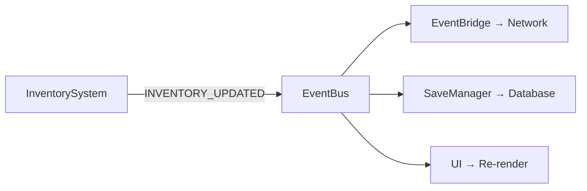
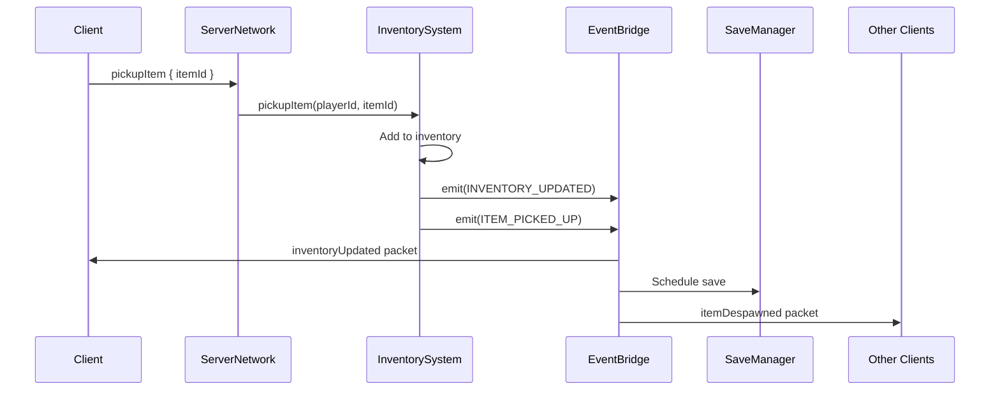

# Event System

Hyperscape uses a **strongly-typed event system** for decoupled inter-system communication. Over 500 event types enable systems to communicate without direct dependencies.

<Info>
Event types are defined in `packages/shared/src/types/events/events.ts`.
</Info>

## Architecture



Systems emit events instead of calling each other directly. This ensures:
- **Loose coupling** - Systems don't know about each other
- **Extensibility** - Add listeners without modifying emitters
- **Testability** - Mock events for unit tests
- **Replay** - Events can be recorded and replayed

---

## Event Types

Events are organized by category in the `EventType` enum:

### Combat Events

```typescript
export enum EventType {
  // Combat lifecycle
  COMBAT_START = "combat:start",
  COMBAT_END = "combat:end",
  COMBAT_ATTACK = "combat:attack",
  COMBAT_KILL = "combat:kill",

  // Damage
  COMBAT_DAMAGE = "combat:damage",
  ENTITY_DAMAGED = "entity:damaged",
  ENTITY_HEALED = "entity:healed",

  // Death
  ENTITY_DEATH = "entity:death",
  PLAYER_DEATH = "player:death",
  MOB_DEATH = "mob:death",

  // Combat level
  COMBAT_LEVEL_CHANGED = "combat:level_changed",
}
```

### Entity Events

```typescript
export enum EventType {
  // Lifecycle
  ENTITY_SPAWNED = "entity:spawned",
  ENTITY_DESTROYED = "entity:destroyed",
  ENTITY_COMPONENT_ADDED = "entity:component_added",
  ENTITY_COMPONENT_REMOVED = "entity:component_removed",

  // State changes
  ENTITY_HEALTH_CHANGED = "entity:health_changed",
  ENTITY_LEVEL_CHANGED = "entity:level_changed",
  ENTITY_INTERACTED = "entity:interacted",
  ENTITY_INTERACT = "entity:interact",
}
```

### Inventory Events

```typescript
export enum EventType {
  // Item operations
  INVENTORY_ADD = "inventory:add",
  INVENTORY_REMOVE = "inventory:remove",
  INVENTORY_UPDATED = "inventory:updated",
  INVENTORY_FULL = "inventory:full",

  // Equipment
  EQUIPMENT_CHANGED = "equipment:changed",
  EQUIPMENT_UPDATED = "equipment:updated",
  ITEM_EQUIPPED = "item:equipped",
  ITEM_UNEQUIPPED = "item:unequipped",

  // Ground items
  ITEM_DROPPED = "item:dropped",
  ITEM_PICKED_UP = "item:picked_up",
  ITEM_SPAWNED = "item:spawned",
  ITEM_DESPAWNED = "item:despawned",
}
```

### Skill Events

```typescript
export enum EventType {
  // XP and leveling
  SKILLS_XP_GAINED = "skills:xp_gained",
  SKILLS_LEVEL_UP = "skills:level_up",
  SKILLS_UPDATED = "skills:updated",
  SKILLS_MILESTONE = "skills:milestone",
  SKILLS_ACTION = "skills:action",
  SKILLS_RESET = "skills:reset",

  // Totals
  TOTAL_LEVEL_CHANGED = "total_level:changed",
}
```

### Player Events

```typescript
export enum EventType {
  // Connection
  PLAYER_CONNECTED = "player:connected",
  PLAYER_DISCONNECTED = "player:disconnected",
  PLAYER_REGISTERED = "player:registered",

  // State
  PLAYER_SPAWNED = "player:spawned",
  PLAYER_MOVED = "player:moved",
  PLAYER_STOPPED = "player:stopped",

  // Actions
  PLAYER_ATTACK = "player:attack",
  PLAYER_CHAT = "player:chat",
}
```

### Resource Events

```typescript
export enum EventType {
  // Gathering
  RESOURCE_GATHERED = "resource:gathered",
  RESOURCE_DEPLETED = "resource:depleted",
  RESOURCE_RESPAWNED = "resource:respawned",
  
  // Gathering tool visuals (OSRS-style)
  GATHERING_TOOL_SHOW = "gathering:tool:show",
  GATHERING_TOOL_HIDE = "gathering:tool:hide",

  // Processing
  RESOURCE_PROCESSED = "resource:processed",
  FIRE_LIT = "fire:lit",
  FOOD_COOKED = "food:cooked",
}
```

**Gathering Tool Events:**

```typescript
interface GatheringToolShowEvent {
  playerId: string;
  itemId: string;  // Tool item ID (e.g., "fishing_rod")
  slot: string;    // Equipment slot to show in (e.g., "weapon")
}

interface GatheringToolHideEvent {
  playerId: string;
  slot: string;    // Equipment slot to hide from
}
```

<Info>
Gathering tool events enable OSRS-style visuals where tools appear in hand during gathering (e.g., fishing rod during fishing) even though they're in inventory, not equipped.
</Info>

### Bank Events

```typescript
export enum EventType {
  BANK_OPENED = "bank:opened",
  BANK_CLOSED = "bank:closed",
  BANK_DEPOSIT = "bank:deposit",
  BANK_WITHDRAW = "bank:withdraw",
  BANK_UPDATED = "bank:updated",
}
```

### Quest Events

```typescript
export enum EventType {
  // Quest lifecycle
  QUEST_STARTED = "quest:started",
  QUEST_PROGRESSED = "quest:progressed",
  QUEST_COMPLETED = "quest:completed",
  QUEST_START_CONFIRM = "quest:start_confirm",
  
  // XP lamps
  XP_LAMP_USE_REQUEST = "xp_lamp:use_request",
  XP_LAMP_SKILL_SELECTED = "xp_lamp:skill_selected",
  XP_LAMP_APPLIED = "xp_lamp:applied",
}
```

**Quest Event Data:**

```typescript
interface QuestStartedEvent {
  playerId: string;
  questId: string;
  questName: string;
  initialStage: string;
}

interface QuestProgressedEvent {
  playerId: string;
  questId: string;
  stage: string;
  progress: Record<string, number>;
  description: string;
}

interface QuestCompletedEvent {
  playerId: string;
  questId: string;
  questName: string;
  rewards: {
    questPoints: number;
    items: Array<{ itemId: string; quantity: number }>;
    xp: Record<string, number>;
  };
}

interface QuestStartConfirmEvent {
  playerId: string;
  questId: string;
  questName: string;
  description: string;
  difficulty: string;
  requirements: {
    quests: string[];
    skills: Record<string, number>;
    items: string[];
  };
  rewards: {
    questPoints: number;
    items: Array<{ itemId: string; quantity: number }>;
    xp: Record<string, number>;
  };
}
```

---

## Usage

### Emitting Events

```typescript
// From any system
this.world.emit(EventType.INVENTORY_UPDATED, {
  playerId: player.id,
  items: inventory.items,
  coins: inventory.coins,
});
```

### Subscribing to Events

```typescript
// In SystemBase subclass
async init(): Promise<void> {
  this.subscribe<InventoryUpdatedEvent>(
    EventType.INVENTORY_UPDATED,
    (data) => this.handleInventoryUpdate(data)
  );
}

private handleInventoryUpdate(data: InventoryUpdatedEvent): void {
  // Handle the event
  console.log(`Player ${data.playerId} inventory changed`);
}
```

### Typed Event Data

Each event type has a corresponding data interface:

```typescript
interface CombatDamageEvent {
  attackerId: string;
  targetId: string;
  damage: number;
  didHit: boolean;
  attackType: AttackType;
  isCritical: boolean;
}

interface SkillsXPGainedEvent {
  playerId: string;
  skill: keyof Skills;
  amount: number;
}

interface InventoryUpdatedEvent {
  playerId: string;
  items: InventoryItem[];
  coins: number;
}

interface EntityDeathEvent {
  entityId: string;
  killerId: string | null;
  position: Position3D;
  drops: Array<{ itemId: string; quantity: number }>;
}
```

---

## Event Bridge

The `EventBridge` automatically converts game events to network packets:

```typescript
// From ServerNetwork/event-bridge.ts
class EventBridge {
  constructor(world: World, network: ServerNetwork) {
    // Map game events to network packets

    // Inventory → inventoryUpdated packet
    world.on(EventType.INVENTORY_UPDATED, (data) => {
      network.sendTo(data.playerId, 'inventoryUpdated', {
        items: data.items,
        coins: data.coins,
      });
    });

    // Combat damage → damageDealt packet (broadcast)
    world.on(EventType.COMBAT_DAMAGE, (data) => {
      network.broadcast('damageDealt', {
        attackerId: data.attackerId,
        targetId: data.targetId,
        damage: data.damage,
        didHit: data.didHit,
      });
    });

    // Skill XP → skillsUpdated packet
    world.on(EventType.SKILLS_UPDATED, (data) => {
      network.sendTo(data.playerId, 'skillsUpdated', {
        skills: data.skills,
      });
    });

    // Entity death → deathNotification packet
    world.on(EventType.ENTITY_DEATH, (data) => {
      network.broadcast('deathNotification', {
        entityId: data.entityId,
        killerId: data.killerId,
      });
    });

    // 50+ more event-to-packet mappings...
  }
}
```

---

## Event Flow Example

Here's how a player picking up an item flows through the system:



---

## Best Practices

<Steps>
  <Step title="Use Typed Events">
    Always define interfaces for event data to catch type errors at compile time.
  </Step>
  <Step title="Keep Handlers Fast">
    Event handlers should complete quickly. Offload heavy work to async tasks.
  </Step>
  <Step title="Avoid Circular Emissions">
    Don't emit events that trigger handlers that emit the same event.
  </Step>
  <Step title="Clean Up Subscriptions">
    Call `unsubscribe()` or use `autoCleanup: true` in SystemBase config.
  </Step>
</Steps>

---

## Related Documentation

- [Entity Component System](/wiki/engine/ecs)
- [Networking Architecture](/wiki/engine/networking)
- [Combat System](/wiki/game-systems/combat)
