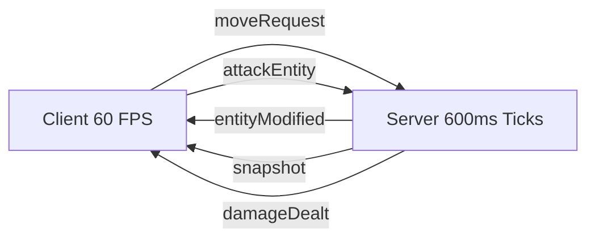

# Networking Architecture

Hyperscape uses a **server-authoritative architecture** with WebSocket-based real-time communication. The server runs at 600ms ticks while clients render at 60 FPS using prediction and interpolation.

<Info>
Network code lives in `packages/shared/src/systems/client/ClientNetwork.ts` (2640+ lines) and `packages/server/src/systems/ServerNetwork/`.
</Info>

## Architecture Overview



| Layer | Rate | Purpose |
|-------|------|---------|
| **Server Tick** | 600ms (1.67 Hz) | Authoritative game logic |
| **Network Sync** | 125ms (8 Hz) | Entity state broadcasts |
| **Client Render** | 16.7ms (60 FPS) | Visual interpolation |
| **Client Input** | 33ms (30 Hz) | Movement/action requests |

---

## Binary Protocol

Communication uses **msgpackr** binary serialization for efficiency.

### Packet Format

```typescript
// From platform/shared/packets.ts
export function writePacket(name: string, data: unknown): ArrayBuffer {
  const id = PACKET_ID_MAP[name];
  const payload = pack(data);
  const buffer = new ArrayBuffer(1 + payload.byteLength);
  new Uint8Array(buffer)[0] = id;
  new Uint8Array(buffer).set(new Uint8Array(payload), 1);
  return buffer;
}

export function readPacket(buffer: ArrayBuffer): { name: string; data: unknown } {
  const id = new Uint8Array(buffer)[0];
  const name = PACKET_NAMES[id];
  const data = unpack(new Uint8Array(buffer.slice(1)));
  return { name, data };
}
```

### Entity Update Optimization

Entity updates use **abbreviated keys** to minimize bandwidth:

| Key | Full Name | Type | Description |
|-----|-----------|------|-------------|
| `p` | position | `[x, y, z]` | World coordinates |
| `q` | quaternion | `[x, y, z, w]` | Rotation |
| `v` | velocity | `[x, y, z]` | Movement vector |
| `e` | emote | `string` | Current emote |
| `h` | health | `{ current, max }` | HP state |
| `i` | id | `string` | Entity ID |
| `t` | type | `string` | Entity type |

### Example Packet

```typescript
// entityModified packet payload
{
  i: "player_abc123",
  t: "player",
  p: [125.5, 10.0, -42.3],
  q: [0, 0.707, 0, 0.707],
  h: { current: 45, max: 99 },
  e: "wave"
}
```

---

## Packet Types

### Client → Server

| Packet | Purpose | Payload |
|--------|---------|---------|
| `moveRequest` | Request movement | `{ x, z, running }` |
| `attackEntity` | Attack target | `{ targetId }` |
| `changeCombatStyle` | Change style | `{ style }` |
| `pickupItem` | Pick up ground item | `{ itemId }` |
| `useItem` | Use inventory item | `{ itemId, slot }` |
| `equipItem` | Equip item | `{ itemId }` |
| `dropItem` | Drop item | `{ itemId, quantity }` |
| `bankDeposit` | Deposit to bank | `{ itemId, quantity }` |
| `bankWithdraw` | Withdraw from bank | `{ itemId, quantity }` |
| `chatMessage` | Send chat | `{ message }` |
| `chopTree` | Start woodcutting | `{ treeId }` |
| `catchFish` | Start fishing | `{ spotId }` |
| `lightFire` | Light fire | `{ logId }` |
| `cookFood` | Cook food | `{ foodId, fireId }` |

### Server → Client

| Packet | Purpose | Payload |
|--------|---------|---------|
| `init` | Connection setup | `{ playerId, worldState }` |
| `snapshot` | Full world state | `{ entities[], tick }` |
| `entityAdded` | New entity | `EntityData` |
| `entityModified` | Entity update | `{ id, ...changes }` |
| `entityRemoved` | Entity despawn | `{ id }` |
| `inventoryUpdated` | Inventory change | `{ items[], coins }` |
| `equipmentUpdated` | Equipment change | `{ slots }` |
| `skillsUpdated` | XP/level change | `{ skills }` |
| `chatMessage` | Incoming chat | `{ sender, message }` |
| `damageDealt` | Combat damage | `{ targetId, damage, didHit }` |
| `deathNotification` | Entity died | `{ entityId, killerId }` |

---

## Client-Side Prediction

The client predicts movement locally for responsive controls, then reconciles with server authority.

### Prediction Flow

```typescript
// From PlayerLocal.ts
class PlayerLocal {
  private pendingMoves: MoveRequest[] = [];
  private lastServerPosition: Position3D;

  fixedUpdate(delta: number): void {
    // 1. Run local physics simulation
    this.physics.step(delta);

    // 2. Store pending move for reconciliation
    this.pendingMoves.push({
      tick: this.world.currentTick,
      position: this.position.clone(),
      input: this.currentInput,
    });

    // 3. Send to server
    this.network.send('moveRequest', {
      x: this.targetPosition.x,
      z: this.targetPosition.z,
      running: this.isRunning,
    });
  }

  updateServerPosition(serverPos: Position3D, serverTick: number): void {
    // 4. Remove acknowledged moves
    this.pendingMoves = this.pendingMoves.filter(m => m.tick > serverTick);

    // 5. Check prediction error
    const error = this.position.distanceTo(serverPos);

    if (error > 0.5) {
      // 6. Snap to server position if too far off
      this.position.copy(serverPos);

      // 7. Replay pending moves
      for (const move of this.pendingMoves) {
        this.applyMove(move.input);
      }
    }
  }
}
```

### Interpolation for Remote Entities

```typescript
// From TileInterpolator.ts
class TileInterpolator {
  private snapshots: EntitySnapshot[] = []; // Buffer of last 3 positions
  private snapshotIndex = 0;

  addSnapshot(position: Position3D, rotation: Quaternion, timestamp: number): void {
    this.snapshots[this.snapshotIndex] = { position, rotation, timestamp };
    this.snapshotIndex = (this.snapshotIndex + 1) % 3;
  }

  interpolate(alpha: number): { position: Position3D; rotation: Quaternion } {
    const prev = this.snapshots[this.snapshotIndex];
    const next = this.snapshots[(this.snapshotIndex + 1) % 3];

    return {
      position: prev.position.clone().lerp(next.position, alpha),
      rotation: prev.rotation.clone().slerp(next.rotation, alpha),
    };
  }
}
```

---

## Server Network System

The server handles all authoritative game logic.

### Connection Flow

```typescript
// From ServerNetwork/index.ts
class ServerNetwork extends SystemBase {
  private sockets: Map<string, WebSocket> = new Map();

  onConnection(socket: WebSocket, query: { token: string }): void {
    // 1. Authenticate via Privy JWT
    const userId = await this.auth.verify(query.token);

    // 2. Load or create character
    const character = await this.db.characters.findOrCreate(userId);

    // 3. Spawn player entity
    const player = this.world.spawnEntity({
      type: 'player',
      id: character.id,
      position: character.position,
      stats: character.stats,
    });

    // 4. Send init packet
    socket.send(writePacket('init', {
      playerId: player.id,
      worldState: this.world.serialize(),
    }));

    // 5. Register socket
    this.sockets.set(player.id, socket);

    // 6. Emit event for other systems
    this.world.emit(EventType.PLAYER_CONNECTED, { playerId: player.id });
  }

  onDisconnect(socket: WebSocket): void {
    const playerId = this.getPlayerIdBySocket(socket);

    // 1. Save character to database
    this.saveManager.savePlayer(playerId);

    // 2. Despawn player entity
    this.world.removeEntity(playerId);

    // 3. Notify other players
    this.broadcast('entityRemoved', { id: playerId });

    // 4. Cleanup
    this.sockets.delete(playerId);
  }
}
```

### Packet Handlers

```typescript
// From ServerNetwork/index.ts
private registerHandlers(): void {
  this.on('moveRequest', this.handleMoveRequest.bind(this));
  this.on('attackEntity', this.handleAttackEntity.bind(this));
  this.on('pickupItem', this.handlePickupItem.bind(this));
  this.on('useItem', this.handleUseItem.bind(this));
  this.on('equipItem', this.handleEquipItem.bind(this));
  this.on('dropItem', this.handleDropItem.bind(this));
  this.on('bankDeposit', this.handleBankDeposit.bind(this));
  this.on('bankWithdraw', this.handleBankWithdraw.bind(this));
  this.on('chatMessage', this.handleChatMessage.bind(this));
  this.on('chopTree', this.handleChopTree.bind(this));
  this.on('catchFish', this.handleCatchFish.bind(this));
  // ... more handlers
}

private handleMoveRequest(playerId: string, data: { x: number; z: number; running: boolean }): void {
  const player = this.world.entities.get(playerId);
  if (!player) return;

  // Validate and set path
  const movementSystem = this.world.getSystem('movement');
  movementSystem.setPlayerDestination(playerId, data.x, data.z, data.running);
}
```

---

## Event Bridge

The `EventBridge` converts game events to network packets automatically.

```typescript
// From ServerNetwork/event-bridge.ts
class EventBridge {
  constructor(world: World, network: ServerNetwork) {
    // Inventory changes → inventoryUpdated packet
    world.on(EventType.INVENTORY_UPDATED, (data) => {
      network.sendTo(data.playerId, 'inventoryUpdated', {
        items: data.items,
        coins: data.coins,
      });
    });

    // Equipment changes → equipmentUpdated packet
    world.on(EventType.EQUIPMENT_UPDATED, (data) => {
      network.sendTo(data.playerId, 'equipmentUpdated', {
        slots: data.slots,
      });
    });

    // Combat damage → damageDealt packet
    world.on(EventType.COMBAT_DAMAGE, (data) => {
      network.broadcast('damageDealt', {
        attackerId: data.attackerId,
        targetId: data.targetId,
        damage: data.damage,
        didHit: data.didHit,
      });
    });

    // ... 50+ more event mappings
  }
}
```

---

## Network Constants

```typescript
// Network configuration
export const NETWORK_CONSTANTS = {
  // Tick and sync rates
  TICK_DURATION_MS: 600,          // Server tick interval
  NETWORK_RATE: 125,              // 8 Hz entity sync
  INPUT_RATE: 33,                 // 30 Hz client input

  // Interpolation
  SNAPSHOT_BUFFER_SIZE: 3,        // Snapshots to buffer
  INTERPOLATION_DELAY_MS: 100,    // Delay for smooth interpolation

  // Prediction
  MAX_PREDICTION_ERROR: 0.5,      // Units before snap correction
  MAX_PENDING_MOVES: 10,          // Moves to buffer for reconciliation

  // Connection
  PING_INTERVAL_MS: 5000,         // Latency measurement interval
  RECONNECT_DELAY_MS: 1000,       // Initial reconnect delay
  MAX_RECONNECT_DELAY_MS: 30000,  // Max backoff delay
  RECONNECT_MULTIPLIER: 2,        // Exponential backoff factor

  // Timeouts
  CONNECTION_TIMEOUT_MS: 10000,   // Max time to connect
  IDLE_TIMEOUT_MS: 300000,        // Disconnect after 5 min idle
};
```

---

## Related Documentation

- [Entity Component System](/wiki/engine/ecs)
- [Combat System](/wiki/game-systems/combat)
- [Tick System](/wiki/engine/tick)
