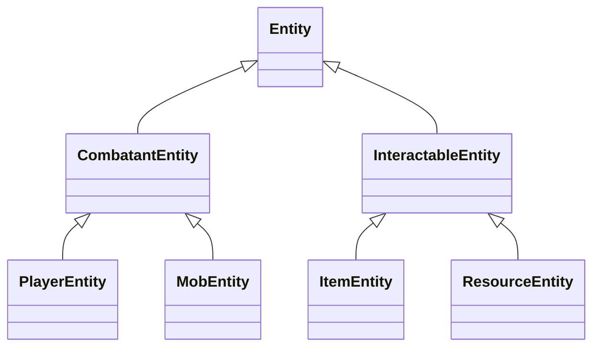

{/* 
  Source: packages/shared/src/
  Verified against actual codebase structure
*/}

## Architecture Overview

Hyperscape is built on a custom 3D multiplayer engine using **Entity Component System (ECS)** architecture. The engine lives in `packages/shared/` and provides:

- **Entity Component System** — Game object architecture
- **Three.js Integration** — 3D rendering (v0.180.0)
- **PhysX Bindings** — Physics simulation via WASM
- **Real-time Networking** — WebSocket multiplayer sync
- **React UI Components** — In-game interface

<Info>
  The engine is designed as a general-purpose 3D world engine. The RPG-specific code is conceptually isolated from core engine systems.
</Info>

---

## Core Package Structure

```
packages/shared/src/
├── components/          # ECS component definitions
├── constants/           # Game constants (combat, physics)
├── core/                # Core engine classes (World, etc.)
├── data/                # Game manifests (loaded at runtime)
├── entities/            # Entity definitions (Player, Mob, Item)
├── extras/              # Additional utilities
├── libs/                # Third-party integrations
├── nodes/               # Scene graph nodes
├── physics/             # PhysX wrapper
├── platform/            # Platform-specific code
├── runtime/             # Runtime environment
├── systems/             # ECS systems (combat, economy, etc.)
├── types/               # TypeScript type definitions
└── utils/               # Utility functions
```

---

## ECS Architecture

The game uses a strict **Entity Component System** pattern where:

| Concept | Description | Location |
|---------|-------------|----------|
| **Entities** | Game objects (players, mobs, items, trees) | `entities/` |
| **Components** | Data containers (position, health, inventory) | `components/` |
| **Systems** | Logic processors (combat, skills, movement) | `systems/` |

<Warning>
  All game logic runs through systems, not entity methods. Entities are pure data containers.
</Warning>

### Components

Components are pure data containers attached to entities:

```
components/
├── ColliderComponent.ts      # Physics collision data
├── CombatComponent.ts        # Combat state and stats
├── Component.ts              # Base component class
├── DataComponent.ts          # Generic data storage
├── HealthComponent.ts        # Health and regeneration
├── InteractionComponent.ts   # Interactable state
├── MeshComponent.ts          # 3D mesh reference
├── StatsComponent.ts         # Skill levels and XP
├── TransformComponent.ts     # Position, rotation, scale
├── UsageComponent.ts         # Item usage data
└── VisualComponent.ts        # Visual appearance
```

### Systems

Systems process entities and implement game logic:

```
systems/
├── client/                   # Client-only systems
├── server/                   # Server-only systems
└── shared/                   # Shared systems (run on both)
    ├── character/            # Character-related systems
    ├── combat/               # Combat system (20+ files)
    ├── death/                # Death and respawn
    ├── economy/              # Banks, shops, trading
    ├── entities/             # Entity management
    ├── infrastructure/       # Core infrastructure
    ├── interaction/          # Player interactions
    ├── movement/             # Movement and pathfinding
    ├── presentation/         # Visual presentation
    ├── tick/                 # Game tick system
    └── world/                # World management
```

---

## The World Class

The `World` class is the central orchestrator that manages all entities, components, and systems:

```typescript
// Getting systems from the world
const combatSystem = world.getSystem('combat') as CombatSystem;

// Querying entities by type
const players = world.getEntitiesByType('Player');

// Event handling
world.on('inventory:add', (event: InventoryAddEvent) => {
  // Handle event
});
```

<Info>
  Source: `packages/shared/src/core/World.ts`
</Info>

---

## Entity Types

The engine defines several entity types in `entities/`:

```
entities/
├── Entity.ts                 # Base entity class
├── CombatantEntity.ts        # Entity that can fight
├── InteractableEntity.ts     # Entity that can be interacted with
├── managers/                 # Entity management utilities
├── npc/
│   └── MobEntity.ts          # NPCs and monsters
├── player/
│   └── PlayerEntity.ts       # Player characters
└── world/
    ├── ItemEntity.ts         # Items in the world
    ├── ResourceEntity.ts     # Trees, fishing spots, etc.
    └── ...
```

### Entity Hierarchy



---

## Type System

Hyperscape uses a **modular type system** with types split across multiple files:

```
types/
├── core/
│   ├── core.ts               # Re-export hub (backward compat)
│   ├── base-types.ts         # Position3D, Vector types
│   ├── identifiers.ts        # EntityID, ItemID, etc.
│   └── misc-types.ts         # Shared miscellaneous types
├── entities/
│   ├── entity-types.ts       # ECS component types
│   ├── player-types.ts       # Player-related types
│   └── npc-mob-types.ts      # NPC and mob types
├── game/
│   ├── combat-types.ts       # Combat types
│   ├── item-types.ts         # Item/equipment types
│   ├── inventory-types.ts    # Inventory and banking
│   ├── interaction-types.ts  # Interaction system
│   └── spawning-types.ts     # Spawn points and respawn
├── world/
│   └── world-types.ts        # World, zones, biomes, chunks
├── systems/
│   └── system-types.ts       # System configuration
└── events/
    └── events.ts             # Event type definitions
```

<Tip>
  New code should import from specific type files for better organization. All types are also re-exported from `types/core/core.ts` for backward compatibility.
</Tip>

---

## TypeScript Rules

Hyperscape enforces strict TypeScript rules:

<AccordionGroup>
  <Accordion title="No any types" icon="ban">
    `any` is forbidden by ESLint. Use specific types, union types, or generic constraints instead.
    
    ```typescript
    // ❌ FORBIDDEN
    const player: any = getEntity(id);
    
    // ✅ CORRECT
    const player = getEntity(id) as Player;
    ```
  </Accordion>
  
  <Accordion title="Prefer classes over interfaces" icon="code">
    Classes provide runtime type information and better `instanceof` checks.
    
    ```typescript
    // ✅ Preferred
    class Player {
      constructor(
        public id: string,
        public health: number
      ) {}
    }
    ```
  </Accordion>
  
  <Accordion title="Use type assertions" icon="check">
    When you know the type from context, assert it confidently.
    
    ```typescript
    // ✅ Good - we know the world has these systems
    const combatSystem = world.getSystem('combat') as CombatSystem;
    ```
  </Accordion>
  
  <Accordion title="Use import type" icon="arrow-right-arrow-left">
    For type-only imports, use `import type` to avoid circular dependencies.
    
    ```typescript
    import type { Player, Mob } from '../types';
    ```
  </Accordion>
</AccordionGroup>

---

## Build System

The engine uses Turbo for monorepo builds with dependency ordering:

```json
// turbo.json
{
  "tasks": {
    "build": {
      "dependsOn": ["^build"],
      "outputs": ["dist/**"]
    }
  }
}
```

Build order is automatically handled:
1. `physx-js-webidl` (PhysX WASM)
2. `shared` (depends on physx)
3. All other packages (depend on shared)

---

## Detailed Documentation

<CardGroup cols={2}>
  <Card title="ECS Deep Dive" icon="boxes-stacked" href="/wiki/engine/ecs">
    Deep dive into entities, components, systems, and the World class with full code examples.
  </Card>
  <Card title="Combat System" icon="swords" href="/wiki/game-systems/combat">
    OSRS-accurate tick-based combat mechanics, damage formulas, and aggro system.
  </Card>
  <Card title="Skills & XP" icon="chart-line" href="/wiki/game-systems/skills">
    RuneScape XP curves, leveling, combat level calculation, and skill requirements.
  </Card>
  <Card title="Tile Movement" icon="route" href="/wiki/game-systems/movement">
    Discrete tile-based movement, pathfinding, and OSRS melee range rules.
  </Card>
</CardGroup>
