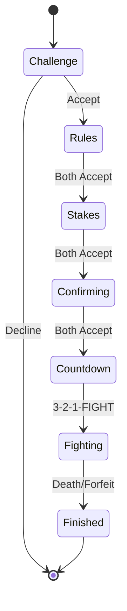

# Duel Arena System

The Duel Arena allows players to engage in **player-versus-player combat** with customizable rules and optional item stakes. The system is OSRS-accurate with a complete state machine for challenge, negotiation, and combat.

<Info>
Duel Arena code lives in `packages/server/src/systems/DuelSystem/` with client UI in `packages/client/src/game/panels/DuelPanel/`.
</Info>

## Duel Flow



### 1. Challenge

Players initiate duels by walking to their opponent and sending a challenge:

```typescript
// Server validates challenge
duelSystem.createChallenge(
  challengerId,
  challengerName,
  targetId,
  targetName
);
```

**Challenge Rules:**
- Must be in Duel Arena lobby zone
- Cannot challenge yourself
- Cannot challenge if already in a duel
- 30-second timeout for acceptance
- Cancels if players move >15 tiles apart

**UI:**
- Clickable red chat message: "Player wishes to duel with you."
- DuelChallengeModal shows challenger name and combat level
- Accept/Decline buttons

### 2. Rules Screen

Both players negotiate combat rules and equipment restrictions:

**Combat Rules (10 toggles):**
- No Ranged
- No Melee
- No Magic
- No Special Attack
- No Prayer
- No Potions
- No Food
- No Movement
- No Forfeit
- Fun Weapons (future)

**Equipment Restrictions (11 slots):**
- Head, Cape, Amulet, Weapon, Body, Shield, Legs, Gloves, Boots, Ring, Ammo

**Rule Validation:**
```typescript
// Invalid combination check
if (rules.noForfeit && rules.noMovement) {
  return { error: "Cannot enable both No Forfeit and No Movement" };
}
```

**Acceptance:**
- Either player can toggle rules
- Toggling resets both players' acceptance
- Both must accept to proceed to Stakes

### 3. Stakes Screen

Players stake items from their inventory:

**Staking:**
- Left-click inventory item: stake 1
- Right-click: context menu for quantity (1, 5, 10, All)
- Click staked item to remove from stakes
- Staked items show with gold border in inventory

**Anti-Scam Features:**
- Value imbalance warnings (>50% difference, >10k gp)
- Opponent modification warnings
- Total value display for each player
- Acceptance resets when stakes change

**Acceptance:**
- Both players must accept to proceed to Confirmation

### 4. Confirmation Screen

Final read-only review before combat:

**Displays:**
- Active rules summary
- Disabled equipment summary
- "If You Win, You Receive:" (opponent's stakes)
- "If You Lose, They Receive:" (your stakes)
- Total values in gold

**Acceptance:**
- Both players must accept to start countdown
- No modifications allowed on this screen

### 5. Countdown

3-2-1-FIGHT countdown with teleportation:

```typescript
// Arena reservation
const arenaId = arenaPool.reserveArena(duelId);

// Teleport to spawn points
teleportPlayersToArena(session);

// Apply equipment restrictions
applyEquipmentRestrictions(session);

// Start countdown (3 seconds)
session.state = "COUNTDOWN";
```

**Countdown Sequence:**
- Players teleported to arena spawn points
- Restricted equipment automatically unequipped
- 3-2-1 countdown displayed (1 second per tick)
- Players frozen during countdown
- "FIGHT!" displayed when combat begins

### 6. Fighting

Active combat with rule enforcement and real-time health synchronization:

**Combat AI Improvements:**
- **2H Sword Attack Timing**: DuelCombatAI attacks every weapon-speed cycle (no re-engagement delay)
- **First Tick Attack**: Seeds first tick to attack immediately since startCombat() has no auto-attack
- **Health Bar Sync**: Inline HP sync in handleEntityDamaged + updateContestantHp before broadcasts
- **Teleport Handling**: Health restore with quiet parameter skips visual events during fight-start HP sync
- **Countdown Display**: CountdownOverlay stays mounted 2.5s into FIGHTING phase with fade-out animation

**Rule Enforcement:**
```typescript
// Example: No Food rule
if (duelSystem.canEatFood(playerId)) {
  // Allow food consumption
} else {
  // Reject with "You cannot eat food in this duel."
}
```

**Available Checks:**
- `canUseRanged(playerId)`
- `canUseMelee(playerId)`
- `canUseMagic(playerId)`
- `canUseSpecialAttack(playerId)`
- `canUsePrayer(playerId)`
- `canUsePotions(playerId)`
- `canEatFood(playerId)`
- `canMove(playerId)`
- `canForfeit(playerId)`

**Combat HUD:**
- Opponent health bar at top center
- Active rule indicators
- Forfeit button (if allowed)
- Disconnect status with countdown

**Win Conditions:**
- Opponent's health reaches 0
- Opponent forfeits (if allowed)
- Opponent disconnects for 30 seconds

### 7. Result

Duel resolution and stake transfer with proper cleanup:

```typescript
// Combat resolver handles:
// 1. Determine winner/loser
// 2. Transfer stakes to winner
// 3. Restore both players to full health (individual try/catch blocks)
// 4. Teleport to lobby
// 5. Release arena
// 6. Emit completion event
combatResolver.resolveDuel(session, winnerId, loserId, reason);
```

**Cycle Management:**
- `endCycle()` chains cleanup→delay→new cycle via .finally()
- INTER_CYCLE_DELAY_MS ensures proper cleanup before next cycle
- Cleanup always teleports both agents to lobby
- Prevents stale avatars stuck in arena between cycles

**Result Modal:**
- Victory trophy (🏆) or defeat skull (💀)
- Items won/lost with gold values
- Total value summary
- Forfeit indicator if applicable

---

## Arena System

### Arena Pool

6 arenas arranged in a 2×3 grid:

```typescript
// From ArenaPoolManager.ts
const ARENA_CONFIG = {
  arenaCount: 6,
  columns: 2,
  rows: 3,
  arenaWidth: 20,
  arenaLength: 24,
  arenaGap: 4,
  baseX: 70,
  baseZ: 90,
  baseY: 0,
};
```

**Arena Features:**
- Automatic reservation when duel confirmed
- Fence posts and rails (replaced solid walls for better visibility)
- Flattened terrain for fair combat via terrain flat zones
- Forfeit pillars (if forfeit allowed)
- Released when duel ends
- Lit torches at all 4 corners with fire particles
- Procedural stone tile floor texture (unique per arena)

**Terrain Flat Zones (commit b8f56e8, 7a60135):**

The duel arena system registers flat zones with the terrain system to prevent players from sinking into arena floors:

```typescript
// From DuelArenaVisualsSystem.ts
// Register flat zones for all 8 floor areas (6 arenas + lobby + hospital)
private registerArenaFlatZones(): void {
  const FLAT_ZONE_HEIGHT_OFFSET = 0.4; // Where players stand above procedural terrain
  const BLEND_RADIUS = 1.0;
  const CARVE_INSET = 1.0;

  for (let i = 0; i < ARENA_COUNT; i++) {
    const proceduralHeight = this.getProceduralTerrainHeight(centerX, centerZ);
    const zone: FlatZone = {
      id: `duel_arena_floor_${i + 1}`,
      centerX,
      centerZ,
      width: ARENA_WIDTH,
      depth: ARENA_LENGTH,
      height: proceduralHeight + FLAT_ZONE_HEIGHT_OFFSET,
      blendRadius: BLEND_RADIUS,
      carveInset: CARVE_INSET,
    };
    this.terrainSystem.registerFlatZone(zone);
  }
}
```

**Why Flat Zones Are Needed:**

Before flat zones were registered, players/agents were sinking ~0.4m into duel arena floors because:
- Flat zones were removed from the terrain system
- `getHeightAt()` returned raw procedural terrain height instead of floor-level height
- Grass was growing through floor surfaces

**How It Works:**

1. **DuelArenaVisualsSystem** registers flat zones during `start()` for all 8 floor areas
2. **TerrainSystem** stores flat zones in a spatial index (terrain tiles for O(1) lookup)
3. **Height queries** (`getHeightAt()`) check flat zones first before procedural terrain
4. **Terrain mesh** is carved under floors to prevent grass/vegetation clipping
5. **Players spawn** at the correct floor-level height (procedural + 0.4m offset)

**Flat Zone Parameters:**
- `height`: Procedural terrain height + 0.4m (where players stand)
- `blendRadius`: 1.0m smooth transition to surrounding terrain
- `carveInset`: 1.0m inset from zone edges to preserve blend padding

**Affected Areas:**
- 6 duel arenas (20m × 24m each)
- Lobby floor (40m × 25m)
- Hospital floor (30m × 25m)

### Visual Enhancements

#### Lit Torches

Each arena has 4 lit torches at the fence corners:

```typescript
// Torch configuration
const TORCH_GLOW_PRESET = {
  particleCount: 6,
  spread: 0.08,  // Tight spread for concentrated flame
  riseSpeed: 0.5,
  lifetime: 1.0,
};
```

**Features:**
- PointLights with flicker animation
- Fire particles using "torch" glow preset
- Tight particle spread (0.08) for concentrated flame effect
- Preset-aware particle respawn system

#### Procedural Stone Tile Texture

Arena floors use canvas-generated sandstone tile patterns:

```typescript
// Each arena gets unique randomized texture
const texture = generateStoneTileTexture(arenaId);
```

**Features:**
- OSRS medieval aesthetic
- Grout lines between tiles
- Color variation for natural stone look
- Speckle noise for texture detail
- Unique texture per arena (seeded by arena ID)

### Spawn Points

Each arena has 2 spawn points (north and south):

```typescript
// Spawn offset from center
const spawnOffset = 8;

const spawnPoints: [ArenaSpawnPoint, ArenaSpawnPoint] = [
  { x: centerX, y: baseY, z: centerZ - spawnOffset }, // North
  { x: centerX, y: baseY, z: centerZ + spawnOffset }, // South
];
```

Players face each other when teleported to arena.

### Arena Bounds

Movement is restricted to arena bounds:

```typescript
interface ArenaBounds {
  min: { x: number; y: number; z: number };
  max: { x: number; y: number; z: number };
}
```

Collision walls are registered in the `CollisionMatrix` to prevent escape.

---

## Server Architecture

### DuelSystem

Main orchestrator for the duel state machine:

```typescript
export class DuelSystem {
  // Sub-managers
  private readonly pendingDuels: PendingDuelManager;
  private readonly arenaPool: ArenaPoolManager;
  private readonly sessionManager: DuelSessionManager;
  private readonly combatResolver: DuelCombatResolver;

  // Public API
  createChallenge(challengerId, challengerName, targetId, targetName);
  respondToChallenge(challengeId, responderId, accept);
  toggleRule(duelId, playerId, rule);
  toggleEquipmentRestriction(duelId, playerId, slot);
  acceptRules(duelId, playerId);
  addStake(duelId, playerId, inventorySlot, itemId, quantity, value);
  removeStake(duelId, playerId, stakeIndex);
  acceptStakes(duelId, playerId);
  acceptFinal(duelId, playerId);
  forfeitDuel(playerId);
  cancelDuel(duelId, reason, cancelledBy?);

  // Rule enforcement
  isPlayerInActiveDuel(playerId): boolean;
  canUseRanged(playerId): boolean;
  canUseMelee(playerId): boolean;
  canUseMagic(playerId): boolean;
  canUsePrayer(playerId): boolean;
  canEatFood(playerId): boolean;
  canMove(playerId): boolean;
  canForfeit(playerId): boolean;
  getDuelOpponentId(playerId): string | null;
}
```

### DuelSessionManager

Handles session CRUD operations:

```typescript
export class DuelSessionManager {
  createSession(challengerId, challengerName, targetId, targetName): string;
  getSession(duelId): DuelSession | undefined;
  getPlayerSession(playerId): DuelSession | undefined;
  deleteSession(duelId): DuelSession | undefined;
  isPlayerInDuel(playerId): boolean;
  getOpponentId(playerId): string | undefined;
  resetAcceptance(session): void;
  setPlayerAcceptance(session, playerId, accepted): boolean;
}
```

### PendingDuelManager

Tracks challenge requests with timeouts:

```typescript
export class PendingDuelManager {
  createChallenge(challengerId, challengerName, targetId, targetName);
  acceptChallenge(challengeId, acceptingPlayerId);
  declineChallenge(challengeId, decliningPlayerId);
  cancelChallenge(challengeId);
  cancelPlayerChallenges(playerId);
  processTick(); // Distance checks, timeouts
}
```

### ArenaPoolManager

Manages arena reservation and collision:

```typescript
export class ArenaPoolManager {
  reserveArena(duelId): number | null;
  releaseArena(arenaId): boolean;
  releaseArenaByDuelId(duelId): boolean;
  getSpawnPoints(arenaId): [ArenaSpawnPoint, ArenaSpawnPoint];
  getArenaBounds(arenaId): ArenaBounds;
  getArenaCenter(arenaId): { x: number; z: number };
  registerArenaWallCollision(collision: ICollisionMatrix): void;
}
```

### DuelCombatResolver

Handles combat resolution and stake transfers:

```typescript
export class DuelCombatResolver {
  resolveDuel(session, winnerId, loserId, reason): DuelResolutionResult;
  returnStakedItems(session): void;
}
```

### DuelCombatAI

Tick-based combat AI for streaming duels with trash talk system:

**Location:** `packages/server/src/arena/DuelCombatAI.ts`

```typescript
export class DuelCombatAI {
  constructor(
    service: EmbeddedHyperscapeService,
    opponentId: string,
    options: { useLlmTactics?: boolean },
    runtime?: IAgentRuntime,
    sendChatMessage?: (text: string) => void
  );

  setContext(agentName: string, opponentLevel: number, opponentName: string): void;
  start(): void;
  stop(): void;
  externalTick(): Promise<void>;
  getStats(): { attacksLanded: number; healsUsed: number; totalDamageDealt: number };
}
```

**Attack Loop Simplification (commit 51453dae):**

The AI no longer manually tracks attack-speed timing. Instead, it relies on the combat system's auto-attack loop to drive attack cadence:

```typescript
// The combat system's auto-attack loop (processPlayerCombatTick →
// processAutoAttackOnTick) drives the actual attack cadence once combat is
// established. The AI only needs to (re-)engage when combat has dropped
// or the target has changed.
const needsEngagement =
  !state.inCombat || state.currentTarget !== this.opponentId;

if (needsEngagement) {
  await this.service.executeAttack(this.opponentId);
}
```

**Why This Change:**
- Removes redundant manual attack-speed tracking from DuelCombatAI
- Combat system's auto-attack loop already drives attack cadence
- AI only re-engages when combat drops or target changes
- Fixes 2H sword attack timing issues (slow weapons were silently dropping attacks)

**Default Attack Styles:**

All weapon types now have default attack styles defined, including the previously missing `TWO_HAND_SWORD`:

```typescript
// From WeaponStyleConfig.ts
export const DEFAULT_ATTACK_STYLES: Record<WeaponType, AttackStyle> = {
  UNARMED: AttackStyle.ACCURATE,
  SWORD: AttackStyle.ACCURATE,
  TWO_HAND_SWORD: AttackStyle.ACCURATE,  // Added in commit 51453dae
  SCIMITAR: AttackStyle.ACCURATE,
  // ... other weapon types
};
```
```

**Features:**

#### Health Threshold Taunts

Triggered at 75%, 50%, 25%, 10% HP milestones:

```typescript
// Own HP low taunts
const OWN_LOW_TAUNTS = [
  "Not even close!",
  "I've had worse",
  "Is that all?",
  "Still standing",
  "Barely a scratch",
  "You'll have to do better"
];

// Opponent HP low taunts
const OPPONENT_LOW_TAUNTS = [
  "GG soon",
  "You're done!",
  "Sit down",
  "Almost there",
  "One more hit",
  "Time to finish this"
];
```

**Behavior:**
- Fires once per threshold per fight (prevents spam)
- Compares previous vs current HP to detect threshold crossings
- Tracks fired thresholds in `firedOwnThresholds` and `firedOpponentThresholds` sets
- 8-second cooldown between messages (`TRASH_TALK_COOLDOWN_MS`)

#### Ambient Periodic Taunts

Random taunts every 15-25 ticks:

```typescript
const AMBIENT_TAUNTS = [
  "Let's go!",
  "Fight me!",
  "Too slow",
  "Bring it",
  "Come on",
  "Show me what you got",
  "Is that your best?",
  "Pathetic"
];
```

**Behavior:**
- Scheduled via tick counter with randomized intervals
- Adds personality to prolonged fights
- Respects 8-second cooldown between all messages

#### LLM-Generated Taunts

Uses agent character bio/style via TEXT_SMALL model:

```typescript
// Prompt includes:
// - Agent bio (first 200 chars)
// - Communication style hints (first 3)
// - Current HP percentages
// - Fight situation (own HP low, opponent HP low, or general)

const prompt = `You are ${agentName} in a duel against ${opponentName}.
Your HP: ${ownHpPercent}%
Opponent HP: ${opponentHpPercent}%

Generate a short trash talk message (under 40 characters).
${situation === 'own_low' ? 'You are low on health but still confident.' : ''}
${situation === 'opponent_low' ? 'Your opponent is almost defeated.' : ''}
Be creative and match your personality.`;
```

**Configuration:**
- 30-token limit for overhead chat bubble
- 3-second LLM timeout with scripted fallback
- Temperature 0.9 for creative, varied responses
- Fire-and-forget (never blocks combat tick loop)
- In-flight flag prevents overlapping LLM calls

**Fallback:**
- Uses scripted taunt pools when LLM unavailable
- Ensures trash talk works without LLM access
- Used when LLM call fails or times out

#### Integration with DuelOrchestrator

```typescript
// From DuelOrchestrator.ts
const ai1 = new DuelCombatAI(
  service1,
  agent2.characterId,
  { useLlmTactics: llmTacticsEnabled && !!runtime1 },
  runtime1 ?? undefined,
  // Trash talk callback
  (text) => {
    service1.sendChatMessage(text).catch(() => {});
  }
);
ai1.setContext(agent1.name, agent2.combatLevel, agent2.name);
ai1.start();
```

**Combat Loop:**
- DuelOrchestrator drives AI ticks via `externalTick()`
- Runs every 600ms (game tick duration)
- Synchronized with combat system tick cadence
- Stats logged on AI stop (attacks, heals, damage dealt)

#### Social System Update

CHAT_MESSAGE action now allowed during combat:

```typescript
// From packages/plugin-hyperscape/src/actions/social.ts
// Previously blocked in combat state
// Now enables trash talk without breaking combat flow
```

---

## Duel Session Structure

```typescript
export interface DuelSession {
  duelId: string;
  state: DuelState; // RULES | STAKES | CONFIRMING | COUNTDOWN | FIGHTING | FINISHED

  // Participants
  challengerId: string;
  challengerName: string;
  targetId: string;
  targetName: string;

  // Rules & Restrictions
  rules: DuelRules;
  equipmentRestrictions: EquipmentRestrictions;

  // Stakes
  challengerStakes: StakedItem[];
  targetStakes: StakedItem[];

  // Acceptance state (per screen)
  challengerAccepted: boolean;
  targetAccepted: boolean;

  // Arena
  arenaId: number | null;

  // Timestamps
  createdAt: number;
  countdownStartedAt?: number;
  fightStartedAt?: number;
  finishedAt?: number;

  // Result
  winnerId?: string;
  forfeitedBy?: string;
}
```

---

## Network Protocol

### Client → Server

```typescript
// Challenge
socket.send("duel:challenge:send", { targetId });
socket.send("duel:challenge:respond", { challengeId, accept });

// Rules
socket.send("duel:toggle:rule", { duelId, rule });
socket.send("duel:toggle:equipment", { duelId, slot });
socket.send("duel:accept:rules", { duelId });

// Stakes
socket.send("duel:add:stake", { duelId, inventorySlot, quantity });
socket.send("duel:remove:stake", { duelId, stakeIndex });
socket.send("duel:accept:stakes", { duelId });

// Confirmation
socket.send("duel:accept:final", { duelId });

// Combat
socket.send("duel:forfeit", { duelId });
socket.send("duel:cancel", { duelId });
```

### Server → Client

```typescript
// UI updates via UI_UPDATE event
world.emit(EventType.UI_UPDATE, {
  component: "duel",
  data: { isOpen: true, duelId, opponent, isChallenger }
});

world.emit(EventType.UI_UPDATE, {
  component: "duelRulesUpdate",
  data: { duelId, rules, challengerAccepted, targetAccepted, modifiedBy }
});

world.emit(EventType.UI_UPDATE, {
  component: "duelStakesUpdate",
  data: { duelId, challengerStakes, targetStakes, challengerAccepted, targetAccepted, modifiedBy }
});

world.emit(EventType.UI_UPDATE, {
  component: "duelStateChange",
  data: { duelId, state }
});

world.emit(EventType.UI_UPDATE, {
  component: "duelCompleted",
  data: { duelId, won, opponentName, itemsReceived, itemsLost, totalValueWon, totalValueLost, forfeit }
});

// Countdown events
world.emit("duel:countdown:tick", { duelId, count, challengerId, targetId });
world.emit("duel:fight:start", { duelId, challengerId, targetId, arenaId, bounds });
```

---

## Configuration

### Timing Constants

All timing values use game ticks (600ms each):

```typescript
// From packages/server/src/systems/DuelSystem/config.ts
export const CHALLENGE_TIMEOUT_TICKS = 50;        // 30 seconds
export const DISCONNECT_TIMEOUT_TICKS = 50;       // 30 seconds
export const SESSION_MAX_AGE_TICKS = 3000;        // 30 minutes
export const DEATH_RESOLUTION_DELAY_TICKS = 8;    // 4.8 seconds
export const CLEANUP_INTERVAL_TICKS = 17;         // 10.2 seconds
```

### Distance Constants

```typescript
export const CHALLENGE_DISTANCE_TILES = 15; // Max distance for challenge
```

### Arena Configuration

```typescript
export const ARENA_COUNT = 6;
export const ARENA_GRID_COLS = 2;
export const ARENA_GRID_ROWS = 3;
export const ARENA_WIDTH = 20;
export const ARENA_LENGTH = 24;
export const ARENA_GAP_X = 4;
export const ARENA_GAP_Z = 4;
export const SPAWN_OFFSET_Z = 8;
```

### Spawn Locations

```typescript
export const LOBBY_SPAWN_WINNER = { x: 102, y: 0, z: 60 };
export const LOBBY_SPAWN_LOSER = { x: 108, y: 0, z: 60 };
export const LOBBY_SPAWN_CENTER = { x: 105, y: 0, z: 60 };
```

---

## Rule Enforcement

The DuelSystem provides rule enforcement APIs for other systems:

### Combat System Integration

```typescript
// From CombatSystem.ts
handleMeleeAttack(attackerId, targetId) {
  // Check if in duel with no melee rule
  if (!duelSystem.canUseMelee(attackerId)) {
    return { error: "You cannot use melee in this duel." };
  }
  // ... proceed with attack
}
```

### Food System Integration

```typescript
// From PlayerSystem.ts
handleEatFood(playerId, itemId) {
  // Check if in duel with no food rule
  if (!duelSystem.canEatFood(playerId)) {
    return { error: "You cannot eat food in this duel." };
  }
  // ... consume food
}
```

### Movement System Integration

```typescript
// From TileMovementManager.ts
movePlayer(playerId, destination) {
  // Check if in duel with no movement rule or during countdown
  if (!duelSystem.canMove(playerId)) {
    return; // Silently reject movement
  }
  // ... process movement
}
```

---

## Disconnect Handling

### During Setup (RULES/STAKES/CONFIRMING)

Immediate cancellation:
- Duel cancelled
- Stakes returned to both players
- Arena released (if reserved)
- Opponent notified

### During Combat (FIGHTING)

30-second grace period:

```typescript
// Start disconnect timer
startDisconnectTimer(playerId, session);

// If player reconnects within 30s
onPlayerReconnect(playerId);
// Timer cleared, duel continues

// If timeout expires
// Auto-forfeit: disconnected player loses
```

**Special Case: No Forfeit Rule**
- Instant loss on disconnect (can't forfeit, so disconnect = loss)

---

## Death Handling

When a player dies during a duel:

```typescript
// From DuelSystem.ts
handlePlayerDeath(playerId) {
  const session = getPlayerDuel(playerId);
  if (!session || session.state !== "FIGHTING") return;

  // Set state to FINISHED immediately (prevents double-resolution)
  session.state = "FINISHED";

  // Delay resolution for death animation (8 ticks = 4.8s)
  setTimeout(() => {
    resolveDuel(session, winnerId, loserId, "death");
  }, ticksToMs(DEATH_RESOLUTION_DELAY_TICKS));
}
```

**Death Resolution:**
1. Winner receives loser's stakes
2. Both players restored to full health
3. Winner teleported to LOBBY_SPAWN_WINNER
4. Loser teleported to LOBBY_SPAWN_LOSER
5. Arena released
6. Session deleted

<Info>
**OSRS-Accurate**: Players don't actually die in duels. Health is restored after combat ends.
</Info>

---

## Stake Transfer

Stakes are transferred atomically when duel ends:

```typescript
// From DuelCombatResolver.ts
transferStakes(session, winnerId, loserId, winnerStakes, loserStakes) {
  // Combine winner's own stakes + loser's stakes
  const allWinnerItems = [...winnerStakes, ...loserStakes];

  // Single atomic operation prevents race conditions
  world.emit("duel:stakes:settle", {
    playerId: winnerId,
    ownStakes: winnerStakes,
    wonStakes: loserStakes,
    fromPlayerId: loserId,
    reason: "duel_won",
  });
}
```

**Security:**
- Server-authoritative stake validation
- Atomic database transactions
- Audit logging for economic tracking
- Prevents item duplication exploits

---

## Testing

Comprehensive test coverage for all duel functionality:

### Unit Tests

**DuelSystem.test.ts** (1,066 lines):
- Challenge creation and validation
- State transitions through all screens
- Rule toggling and validation
- Equipment restriction toggling
- Stake operations (add/remove)
- Combat outcomes (death, forfeit)
- Disconnect handling
- Error cases and edge conditions

**PendingDuelManager.test.ts** (456 lines):
- Challenge creation and validation
- Acceptance and decline
- Expiration cleanup
- Distance-based cancellation
- Player disconnect cleanup

**ArenaPoolManager.test.ts** (233 lines):
- Arena initialization (6 arenas)
- Reservation and release
- Spawn point and bounds retrieval
- Pool exhaustion handling
- Grid layout validation

### Integration Tests

- Full duel flow from challenge to result
- Rule enforcement during combat
- Stake transfer verification
- Disconnect/reconnect scenarios

---

## UI Components

### DuelPanel

Main duel interface with screen switching:

```typescript
export function DuelPanel({
  state,
  inventory,
  onToggleRule,
  onToggleEquipment,
  onAcceptRules,
  onAddStake,
  onRemoveStake,
  onAcceptStakes,
  onAcceptFinal,
  onCancel,
}: DuelPanelProps)
```

**Screens:**
- `RulesScreen` - Rules and equipment negotiation
- `StakesScreen` - Item staking with three panels (my stakes, opponent stakes, inventory)
- `ConfirmScreen` - Final read-only review

### DuelChallengeModal

Incoming challenge popup:

```typescript
export function DuelChallengeModal({
  state: {
    visible,
    challengeId,
    fromPlayer: { id, name, level }
  },
  onAccept,
  onDecline,
}: DuelChallengeModalProps)
```

### DuelCountdown

Full-screen countdown overlay:

```typescript
export function DuelCountdown({
  state: {
    visible,
    count, // 3, 2, 1, 0 (FIGHT!)
    opponentName
  }
}: DuelCountdownProps)
```

**Features:**
- Large centered countdown number
- Color-coded stages (red → orange → yellow → green)
- Expanding ring pulse effect
- "FIGHT!" display on 0

### DuelHUD

In-combat overlay:

```typescript
export function DuelHUD({
  state: {
    visible,
    opponentName,
    opponentHealth,
    opponentMaxHealth,
    rules,
    opponentDisconnected,
    disconnectCountdown
  },
  onForfeit
}: DuelHUDProps)
```

**Features:**
- Opponent health bar with color coding
- Active rule indicators
- Forfeit button (if allowed)
- Disconnect status with countdown

### DuelResultModal

Post-duel result display:

```typescript
export function DuelResultModal({
  state: {
    visible,
    won,
    opponentName,
    itemsReceived,
    itemsLost,
    totalValueWon,
    totalValueLost,
    forfeit
  },
  onClose
}: DuelResultModalProps)
```

**Features:**
- Animated entrance with icon pop
- Victory trophy or defeat skull
- Items won/lost with gold values
- Total value summary

---

## Audit Logging

All duel outcomes are logged for economic tracking:

```typescript
// From AuditLogger.ts
logDuelComplete(
  duelId,
  winnerId,
  loserId,
  loserStakes,
  winnerStakes,
  winnerReceivesValue,
  reason
);

logDuelCancelled(
  duelId,
  cancelledBy,
  reason,
  challengerId,
  targetId,
  challengerStakes,
  targetStakes
);
```

**Logged Events:**
- Duel completion (winner, loser, stakes transferred)
- Duel cancellation (if stakes were involved)
- Large stake transfers (≥1M gold value)

---

## Related Documentation

- [Combat System](/wiki/game-systems/combat) - Combat mechanics and damage formulas
- [Inventory System](/wiki/game-systems/inventory) - Item staking and transfers
- [Movement System](/wiki/game-systems/movement) - Arena bounds and pathfinding
- [Death System](/wiki/game-systems/death) - Death handling and respawning
