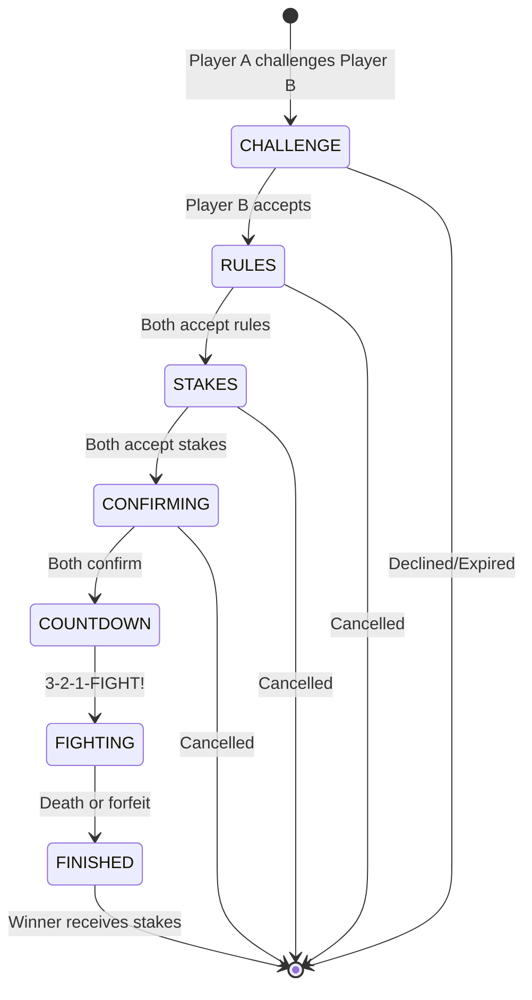

# Duel Arena System

The Duel Arena is a **server-authoritative PvP dueling system** where players can challenge each other to combat with customizable rules and stakes. The system follows OSRS-style mechanics with a multi-stage negotiation process before combat begins.

<Info>
**Location**: `packages/server/src/systems/DuelSystem/` (server) and `packages/client/src/game/panels/DuelPanel/` (client UI)
</Info>

---

## Duel Flow

The duel system uses a **state machine** with 6 distinct phases:



### Phase Breakdown

| Phase | Description | Can Cancel? |
|-------|-------------|-------------|
| **CHALLENGE** | 30-second window for target to accept/decline | Yes (auto-expires) |
| **RULES** | Both players toggle combat rules and equipment restrictions | Yes |
| **STAKES** | Both players add items to stake | Yes |
| **CONFIRMING** | Read-only review of rules and stakes | Yes |
| **COUNTDOWN** | 3-second countdown, players teleported to arena | No |
| **FIGHTING** | Combat until death or forfeit | No (unless forfeit allowed) |
| **FINISHED** | Stakes transferred, players teleported to lobby | No |

---

## Duel Rules

Players can toggle **10 combat rules** that restrict actions during the duel:

| Rule | Effect | Incompatible With |
|------|--------|-------------------|
| **No Ranged** | Cannot use ranged attacks | — |
| **No Melee** | Cannot use melee attacks | — |
| **No Magic** | Cannot use magic attacks | — |
| **No Special Attack** | Cannot use special attacks | — |
| **No Prayer** | Prayer points drained | — |
| **No Potions** | Cannot drink potions | — |
| **No Food** | Cannot eat food | — |
| **No Forfeit** | Fight to the death (no surrender) | Fun Weapons |
| **No Movement** | Frozen at spawn point | — |
| **Fun Weapons** | Boxing gloves only | No Forfeit |

<Warning>
**Invalid Combinations**: The server validates rule combinations. For example, "No Forfeit" + "No Movement" is blocked because it could create unwinnable scenarios.
</Warning>

### Rule Validation

```typescript
// From packages/shared/src/types/game/duel-types.ts
export function validateRuleCombination(rules: DuelRules): string | null {
  for (const [rule1, rule2, message] of INVALID_RULE_COMBINATIONS) {
    if (rules[rule1] && rules[rule2]) {
      return message;
    }
  }
  return null;
}
```

---

## Equipment Restrictions

Players can disable **11 equipment slots** for the duel:

| Slot | Effect |
|------|--------|
| **Head** | Helmets disabled |
| **Cape** | Capes disabled |
| **Amulet** | Amulets disabled |
| **Weapon** | Weapons disabled (fists only) |
| **Body** | Chest armor disabled |
| **Shield** | Shields disabled |
| **Legs** | Leg armor disabled |
| **Gloves** | Gloves disabled |
| **Boots** | Boots disabled |
| **Ring** | Rings disabled |
| **Ammo** | Ammunition disabled |

<Info>
Items in disabled slots are **automatically unequipped** when the countdown begins. They are returned to the player's inventory after the duel.
</Info>

---

## Stakes System

Players can stake **inventory items** with the following mechanics:

### Staking Items

- **Left-click** inventory item: Stake 1
- **Right-click** inventory item: Context menu (Stake 1, 5, 10, All)
- **Click staked item**: Remove from stakes
- **Maximum stakes**: 28 items (full inventory)

### Anti-Scam Protection

The system includes OSRS-style anti-scam features:

1. **Acceptance Reset**: When either player modifies stakes, both players' acceptance is reset
2. **Opponent Modified Warning**: Red banner appears when opponent changes their stakes
3. **Value Imbalance Warning**: Warns if you're risking >50% more than opponent (and >10k gp)
4. **Final Confirmation Screen**: Read-only review before combat begins

```typescript
// From packages/client/src/game/panels/DuelPanel/StakesScreen.tsx
const valueImbalanceWarning = useMemo(() => {
  if (myTotalValue === 0 && opponentTotalValue === 0) return null;
  const difference = myTotalValue - opponentTotalValue;
  const percentDiff = Math.abs(difference) / Math.max(myTotalValue, opponentTotalValue, 1);
  
  // Warn if difference is > 50% and > 10k gp
  if (percentDiff > 0.5 && Math.abs(difference) > 10000) {
    if (difference > 0) {
      return `You are risking ${formatGoldValue(difference)} gp more than ${opponentName}!`;
    }
  }
  return null;
}, [myTotalValue, opponentTotalValue, opponentName]);
```

---

## Arena System

The Duel Arena contains **6 rectangular arenas** arranged in a **2×3 grid**.

### Arena Configuration

```typescript
// From packages/shared/src/data/duel-manifest.ts
export interface DuelArenaConfig {
  baseX: number;           // 60 (top-left arena)
  baseZ: number;           // 80
  baseY: number;           // 0 (ground level)
  arenaWidth: number;      // 20 tiles
  arenaLength: number;     // 24 tiles
  arenaGap: number;        // 4 tiles between arenas
  columns: number;         // 2 columns
  rows: number;            // 3 rows
  arenaCount: number;      // 6 total arenas
  spawnOffset: number;     // 8 tiles from center
  lobbySpawnPoint: { x: number; y: number; z: number };
}
```

### Arena Features

- **Spawn Points**: Each arena has 2 spawn points (north and south)
- **Wall Collision**: Invisible walls prevent escape during combat
- **Terrain Flattening**: Ground is leveled for fair combat
- **Forfeit Pillars**: Interact to surrender (if allowed by rules)

### Arena Pool Management

```typescript
// From packages/server/src/systems/DuelSystem/ArenaPoolManager.ts
export class ArenaPoolManager {
  reserveArena(duelId: string): number | null;
  releaseArena(arenaId: number): boolean;
  getSpawnPoints(arenaId: number): [ArenaSpawnPoint, ArenaSpawnPoint] | undefined;
  getArenaBounds(arenaId: number): ArenaBounds | undefined;
  getAvailableCount(): number;
}
```

<Warning>
If all 6 arenas are in use, new duels cannot start until an arena becomes available. Players receive an error message and must try again.
</Warning>

---

## Server Architecture

The DuelSystem follows **SOLID principles** with separated concerns:

### Core Components

| Component | Responsibility |
|-----------|----------------|
| **DuelSystem** | Main orchestrator, state machine, public API |
| **DuelSessionManager** | Session CRUD operations, player-to-session mapping |
| **PendingDuelManager** | Challenge lifecycle, timeout handling, distance checks |
| **ArenaPoolManager** | Arena reservation, spawn points, bounds |
| **DuelCombatResolver** | Combat resolution, stake transfers, health restoration |

### File Structure

```
packages/server/src/systems/DuelSystem/
├── index.ts                    # Main DuelSystem class (1600+ lines)
├── DuelSessionManager.ts       # Session management (290 lines)
├── PendingDuelManager.ts       # Challenge tracking (310 lines)
├── ArenaPoolManager.ts         # Arena pool (260 lines)
├── DuelCombatResolver.ts       # Combat resolution (280 lines)
├── config.ts                   # Centralized constants (195 lines)
├── validation.ts               # Runtime type guards (87 lines)
└── __tests__/                  # Comprehensive unit tests
    ├── DuelSystem.test.ts      # 1066 lines
    ├── ArenaPoolManager.test.ts # 233 lines
    ├── PendingDuelManager.test.ts # 456 lines
    └── mocks.ts                # Test utilities
```

---

## Network Protocol

### Client → Server Events

| Event | Payload | Description |
|-------|---------|-------------|
| `duel:challenge` | `{ targetPlayerId }` | Challenge another player |
| `duel:challenge:respond` | `{ challengeId, accept }` | Accept/decline challenge |
| `duel:toggle:rule` | `{ duelId, rule }` | Toggle a combat rule |
| `duel:toggle:equipment` | `{ duelId, slot }` | Toggle equipment restriction |
| `duel:add:stake` | `{ duelId, inventorySlot, quantity }` | Add item to stakes |
| `duel:remove:stake` | `{ duelId, stakeIndex }` | Remove staked item |
| `duel:accept:rules` | `{ duelId }` | Accept rules screen |
| `duel:accept:stakes` | `{ duelId }` | Accept stakes screen |
| `duel:accept:final` | `{ duelId }` | Accept final confirmation |
| `duel:forfeit` | `{ duelId }` | Surrender the duel |
| `duel:cancel` | `{ duelId }` | Cancel before fighting |

### Server → Client Events

| Event | Payload | Description |
|-------|---------|-------------|
| `UI_UPDATE` | `{ component: "duel", data }` | Open duel panel |
| `UI_UPDATE` | `{ component: "duelRulesUpdate" }` | Rules changed |
| `UI_UPDATE` | `{ component: "duelEquipmentUpdate" }` | Equipment restrictions changed |
| `UI_UPDATE` | `{ component: "duelStakesUpdate" }` | Stakes changed |
| `UI_UPDATE` | `{ component: "duelStateChange" }` | State transition |
| `UI_UPDATE` | `{ component: "duelCompleted" }` | Duel finished |
| `duel:countdown:tick` | `{ duelId, count }` | Countdown update (3, 2, 1, 0) |
| `duel:fight:start` | `{ duelId, arenaId, bounds }` | Combat begins |
| `duel:cancelled` | `{ duelId, reason }` | Duel cancelled |
| `player:teleport` | `{ playerId, position, rotation }` | Teleport to arena/lobby |

---

## Combat Resolution

### Death Handling

When a player dies during a duel:

1. **State set to FINISHED** immediately (prevents double-resolution)
2. **8-tick delay** (4.8 seconds) for death animation
3. **Stakes transferred** to winner
4. **Health restored** to both players (no death penalty in duels)
5. **Teleport to lobby** (winner and loser to different spawn points)
6. **Arena released** back to pool

```typescript
// From packages/server/src/systems/DuelSystem/index.ts
private handlePlayerDeath(playerId: string): void {
  const session = this.sessionManager.getPlayerSession(playerId);
  if (!session || session.state !== "FIGHTING") return;

  // Determine winner
  const winnerId = playerId === session.challengerId 
    ? session.targetId 
    : session.challengerId;

  // Set state to FINISHED to prevent race conditions
  session.state = "FINISHED";

  // Delay resolution for death animation (OSRS-accurate)
  setTimeout(() => {
    this.resolveDuel(session, winnerId, playerId, "death");
  }, ticksToMs(DEATH_RESOLUTION_DELAY_TICKS)); // 8 ticks = 4.8s
}
```

### Forfeit Handling

Players can forfeit via **forfeit pillars** in the arena (if `noForfeit` rule is not active):

```typescript
// From packages/server/src/systems/DuelSystem/index.ts
forfeitDuel(playerId: string): DuelOperationResult {
  const session = this.getPlayerDuel(playerId);
  
  // Check if noForfeit rule is active
  if (session.rules.noForfeit) {
    return {
      success: false,
      error: "You cannot forfeit - this duel is to the death!",
      errorCode: DuelErrorCode.CANNOT_FORFEIT,
    };
  }

  // Opponent wins
  const winnerId = playerId === session.challengerId 
    ? session.targetId 
    : session.challengerId;

  this.resolveDuel(session, winnerId, playerId, "forfeit");
  return { success: true };
}
```

### Stake Transfer

```typescript
// From packages/server/src/systems/DuelSystem/DuelCombatResolver.ts
private transferStakes(
  session: DuelSession,
  winnerId: string,
  loserId: string,
  winnerStakes: StakedItem[],
  loserStakes: StakedItem[],
): void {
  // Combine winner's own stakes AND loser's stakes
  const allWinnerItems = [...winnerStakes, ...loserStakes];

  // Emit single settlement event to prevent race conditions
  this.world.emit("duel:stakes:settle", {
    playerId: winnerId,
    ownStakes: winnerStakes,
    wonStakes: loserStakes,
    fromPlayerId: loserId,
    reason: "duel_won",
  });
}
```

---

## Rule Enforcement

The DuelSystem provides a **public API** for other systems to check active rules:

### Combat Integration

```typescript
// From packages/server/src/systems/DuelSystem/index.ts
export class DuelSystem {
  // Check if player is in active duel
  isPlayerInActiveDuel(playerId: string): boolean;
  
  // Get active rules for a player
  getPlayerDuelRules(playerId: string): DuelRules | null;
  
  // Rule-specific checks
  canUseRanged(playerId: string): boolean;
  canUseMelee(playerId: string): boolean;
  canUseMagic(playerId: string): boolean;
  canUseSpecialAttack(playerId: string): boolean;
  canUsePrayer(playerId: string): boolean;
  canUsePotions(playerId: string): boolean;
  canEatFood(playerId: string): boolean;
  canMove(playerId: string): boolean;
  canForfeit(playerId: string): boolean;
  
  // Get opponent ID
  getDuelOpponentId(playerId: string): string | null;
}
```

### Movement Restriction

```typescript
// Movement is blocked during COUNTDOWN and if noMovement rule is active
canMove(playerId: string): boolean {
  const session = this.getPlayerDuel(playerId);
  if (!session) return true;

  // Freeze during countdown (OSRS-accurate)
  if (session.state === "COUNTDOWN") {
    return false;
  }

  // Check noMovement rule during fight
  if (session.state === "FIGHTING" && session.rules.noMovement) {
    return false;
  }

  return true;
}
```

---

## Client UI Components

The client implements a **multi-screen modal system** with state synchronization:

### UI Components

| Component | Purpose |
|-----------|---------|
| **DuelChallengeModal** | Incoming challenge popup with accept/decline |
| **DuelPanel** | Main interface with screen switching |
| **RulesScreen** | Rule and equipment negotiation |
| **StakesScreen** | Item staking with inventory integration |
| **ConfirmScreen** | Read-only final review |
| **DuelCountdown** | Full-screen 3-2-1-FIGHT overlay |
| **DuelHUD** | In-combat overlay with opponent health |
| **DuelResultModal** | Victory/defeat screen with items won/lost |

### State Management

```typescript
// From packages/client/src/hooks/useModalPanels.ts
export interface DuelData {
  visible: boolean;
  duelId: string;
  opponentId: string;
  opponentName: string;
  isChallenger: boolean;
  screenState: "RULES" | "STAKES" | "CONFIRMING";
  rules: DuelRules;
  equipmentRestrictions: EquipmentRestrictions;
  myAccepted: boolean;
  opponentAccepted: boolean;
  myStakes: StakedItem[];
  opponentStakes: StakedItem[];
  opponentModifiedStakes: boolean;
}
```

### UI Update Events

The server sends `UI_UPDATE` events to synchronize state:

```typescript
// From packages/client/src/hooks/useModalPanels.ts
world.on(EventType.UI_UPDATE, (data: unknown) => {
  const d = data as { component: string; data: Record<string, unknown> };

  switch (d.component) {
    case "duel":
      // Open duel panel
      setDuelData({ visible: true, ...d.data });
      break;
    
    case "duelRulesUpdate":
      // Update rules and acceptance state
      setDuelData(prev => ({ ...prev, rules: d.data.rules }));
      break;
    
    case "duelStakesUpdate":
      // Update stakes and reset acceptance
      setDuelData(prev => ({ 
        ...prev, 
        myStakes: d.data.myStakes,
        opponentStakes: d.data.opponentStakes,
        opponentModifiedStakes: true,
      }));
      break;
    
    case "duelCompleted":
      // Show result modal
      setDuelResultData({ visible: true, ...d.data });
      break;
  }
});
```

---

## Countdown System

The countdown uses **tick-based timing** with visual and audio feedback:

### Countdown Phases

| Count | Duration | Visual |
|-------|----------|--------|
| **3** | 0-1s | Red number with expanding ring |
| **2** | 1-2s | Orange number |
| **1** | 2-3s | Yellow number |
| **0** | 3s+ | Green "FIGHT!" text |

### 3D Countdown Splats

The client renders **3D countdown numbers** on the arena floor:

```typescript
// From packages/shared/src/systems/client/DuelCountdownSplatSystem.ts
export class DuelCountdownSplatSystem extends SystemBase {
  // Creates 3D text meshes at player positions
  // Countdown numbers appear on the ground
  // Fade out after each tick
}
```

### Movement Freeze

Players are **frozen during countdown** to prevent positioning advantages:

```typescript
// From packages/server/src/systems/DuelSystem/index.ts
canMove(playerId: string): boolean {
  const session = this.getPlayerDuel(playerId);
  if (!session) return true;

  // Freeze during countdown (OSRS-accurate)
  if (session.state === "COUNTDOWN") {
    return false;
  }

  return true;
}
```

---

## Disconnect Handling

The system handles disconnects gracefully with different behavior based on duel state:

### Setup States (RULES, STAKES, CONFIRMING, COUNTDOWN)

**Immediate cancellation** — Duel is cancelled and stakes are returned to both players.

```typescript
// From packages/server/src/systems/DuelSystem/index.ts
onPlayerDisconnect(playerId: string): void {
  const session = this.sessionManager.getPlayerSession(playerId);
  if (!session) return;

  // For setup states, cancel immediately
  if (session.state !== "FIGHTING") {
    this.cancelDuel(session.duelId, "player_disconnected", playerId);
    return;
  }

  // For FIGHTING state, start disconnect timer
  this.startDisconnectTimer(playerId, session);
}
```

### Fighting State

**30-second grace period** — Opponent is notified, and a timer starts:

- If player **reconnects** within 30 seconds: Duel continues
- If player **doesn't reconnect**: Auto-forfeit (opponent wins)
- If **noForfeit rule** is active: Instant loss (no grace period)

```typescript
private startDisconnectTimer(playerId: string, session: DuelSession): void {
  // Notify opponent
  this.world.emit("duel:player:disconnected", {
    duelId: session.duelId,
    playerId,
    timeoutMs: 30000,
  });

  // If noForfeit rule, instant loss
  if (session.rules.noForfeit) {
    const winnerId = playerId === session.challengerId 
      ? session.targetId 
      : session.challengerId;
    this.resolveDuel(session, winnerId, playerId, "forfeit");
    return;
  }

  // Start 30-second timer
  const timer = setTimeout(() => {
    this.resolveDuel(session, winnerId, playerId, "forfeit");
  }, 30000);

  this.disconnectTimers.set(playerId, timer);
}
```

---

## Testing

The DuelSystem has **comprehensive unit tests** with 100% coverage of critical paths:

### Test Coverage

| Test Suite | Lines | Coverage |
|------------|-------|----------|
| **DuelSystem.test.ts** | 1066 | State machine, rules, stakes, combat |
| **ArenaPoolManager.test.ts** | 233 | Arena reservation, bounds, spawn points |
| **PendingDuelManager.test.ts** | 456 | Challenges, timeouts, distance checks |

### Test Utilities

```typescript
// From packages/server/src/systems/DuelSystem/__tests__/mocks.ts
export function createMockWorld(): MockWorld;
export function createMockPlayer(id: string, overrides?: Partial<MockPlayer>): MockPlayer;
export function createDuelPlayers(): [MockPlayer, MockPlayer];
```

### Example Test

```typescript
// From DuelSystem.test.ts
describe("acceptFinal", () => {
  it("transitions to COUNTDOWN when both accept", () => {
    // Progress through screens
    duelSystem.acceptRules(duelId, "player1");
    duelSystem.acceptRules(duelId, "player2");
    duelSystem.acceptStakes(duelId, "player1");
    duelSystem.acceptStakes(duelId, "player2");
    
    // Both accept final confirmation
    duelSystem.acceptFinal(duelId, "player1");
    duelSystem.acceptFinal(duelId, "player2");

    const session = duelSystem.getDuelSession(duelId)!;
    expect(session.state).toBe("COUNTDOWN");
    expect(session.arenaId).toBeDefined();
  });

  it("reserves arena on confirmation", () => {
    duelSystem.acceptFinal(duelId, "player1");
    duelSystem.acceptFinal(duelId, "player2");

    const session = duelSystem.getDuelSession(duelId)!;
    expect(duelSystem.arenaPool.isArenaAvailable(session.arenaId!)).toBe(false);
  });
});
```

---

## Audit Logging

All duel operations are logged for economic tracking and anti-cheat:

```typescript
// From packages/server/src/systems/ServerNetwork/services/AuditLogger.ts
export class AuditLogger {
  logDuelComplete(
    duelId: string,
    winnerId: string,
    loserId: string,
    loserStakes: StakedItem[],
    winnerStakes: StakedItem[],
    totalValue: number,
    reason: "death" | "forfeit",
  ): void;

  logDuelCancelled(
    duelId: string,
    cancelledBy: string | undefined,
    reason: string,
    challengerId: string,
    targetId: string,
    challengerStakes: StakedItem[],
    targetStakes: StakedItem[],
  ): void;
}
```

---

## Configuration

All timing and distance values are centralized in `config.ts`:

```typescript
// From packages/server/src/systems/DuelSystem/config.ts
export const CHALLENGE_TIMEOUT_TICKS = 50;           // 30 seconds
export const DISCONNECT_TIMEOUT_TICKS = 50;          // 30 seconds
export const SESSION_MAX_AGE_TICKS = 3000;           // 30 minutes
export const DEATH_RESOLUTION_DELAY_TICKS = 8;       // 4.8 seconds
export const CLEANUP_INTERVAL_TICKS = 17;            // 10.2 seconds
export const CHALLENGE_DISTANCE_TILES = 15;          // Max challenge distance

// Spawn locations
export const LOBBY_SPAWN_WINNER = { x: 102, y: 0, z: 60 };
export const LOBBY_SPAWN_LOSER = { x: 108, y: 0, z: 60 };
export const LOBBY_SPAWN_CENTER = { x: 105, y: 0, z: 60 };

// Helper to convert ticks to milliseconds
export const ticksToMs = (ticks: number): number => ticks * 600;
```

<Info>
All timing values use **game ticks** (600ms each) for OSRS accuracy. Use `ticksToMs()` helper for `setTimeout`/`setInterval`.
</Info>

---

## Security Features

### Server-Authoritative Design

- **All state on server** — Client cannot manipulate duel state
- **Validation on every action** — Rules, stakes, and state transitions validated
- **Transaction wrapping** — Stake operations use database transactions
- **Rate limiting** — Prevents spam challenges and rapid-fire actions
- **Idempotency** — Duplicate requests are ignored

### Anti-Cheat Measures

```typescript
// From packages/server/src/systems/DuelSystem/index.ts
addStake(duelId: string, playerId: string, inventorySlot: number, ...): DuelOperationResult {
  // SECURITY: Reject duplicate slots to prevent item duplication
  const existingIndex = stakes.findIndex(s => s.inventorySlot === inventorySlot);
  if (existingIndex >= 0) {
    return {
      success: false,
      error: "Item from this slot is already staked.",
      errorCode: DuelErrorCode.ALREADY_STAKED,
    };
  }
  
  // Add stake
  stakes.push({ inventorySlot, itemId, quantity, value });
}
```

### Arena Bounds Enforcement

Arena walls use **collision flags** to prevent escape:

```typescript
// From packages/server/src/systems/DuelSystem/ArenaPoolManager.ts
registerArenaWallCollision(collision: ICollisionMatrix): void {
  for (const [_arenaId, state] of this.arenas) {
    const bounds = state.arena.bounds;
    
    // Block perimeter ring OUTSIDE the arena
    // Players can walk up to the wall but not through it
    
    // North wall: one row north (z = minZ - 1)
    for (let x = minX - 1; x <= maxX + 1; x++) {
      collision.addFlags(x, minZ - 1, CollisionFlag.BLOCKED);
    }
    
    // South, East, West walls...
  }
}
```

---

## Manifest-Driven Configuration

Arena layout is defined in `world-areas.ts` manifest:

```typescript
// From packages/shared/src/data/world-areas.ts
export const ALL_WORLD_AREAS = {
  duel_arena: {
    name: "Duel Arena",
    bounds: { minX: 50, maxX: 120, minZ: 50, maxZ: 150 },
    subZones: {
      lobby: {
        name: "Duel Arena Lobby",
        bounds: { minX: 95, maxX: 115, minZ: 50, maxZ: 70 },
        spawnPoint: { x: 105, y: 0, z: 60 },
      },
      arenas: {
        name: "Combat Arenas",
        bounds: { minX: 60, maxX: 110, minZ: 80, maxZ: 140 },
        arenaLayout: "2x3",
        arenaCount: 6,
        arenaSize: { width: 20, length: 24 },
        arenaGap: 4,
      },
    },
  },
};
```

### Manifest Helpers

```typescript
// From packages/shared/src/data/duel-manifest.ts
export function getDuelArenaConfig(): DuelArenaConfig;
export function isPositionInsideCombatArena(x: number, z: number): boolean;
```

---

## Error Handling

The system uses **typed error codes** for client handling:

```typescript
// From packages/shared/src/types/game/duel-types.ts
export enum DuelErrorCode {
  // Challenge errors
  PLAYER_NOT_FOUND = "PLAYER_NOT_FOUND",
  ALREADY_IN_DUEL = "ALREADY_IN_DUEL",
  TARGET_BUSY = "TARGET_BUSY",
  CHALLENGE_EXPIRED = "CHALLENGE_EXPIRED",
  
  // Session errors
  DUEL_NOT_FOUND = "DUEL_NOT_FOUND",
  NOT_IN_DUEL = "NOT_IN_DUEL",
  INVALID_STATE = "INVALID_STATE",
  NO_ARENA_AVAILABLE = "NO_ARENA_AVAILABLE",
  
  // Rule errors
  INVALID_RULE_COMBINATION = "INVALID_RULE_COMBINATION",
  
  // Stake errors
  ALREADY_STAKED = "ALREADY_STAKED",
  STAKE_NOT_FOUND = "STAKE_NOT_FOUND",
  
  // Forfeit errors
  CANNOT_FORFEIT = "CANNOT_FORFEIT",
}
```

---

## Performance Optimizations

### Memoized Styles

UI components use `useMemo` to prevent unnecessary re-renders:

```typescript
// From packages/client/src/game/panels/DuelPanel/RulesScreen.tsx
function useRulesScreenStyles(theme: Theme, myAccepted: boolean) {
  return useMemo(() => {
    // Style objects only recalculated when theme or myAccepted changes
    return { containerStyle, sectionStyle, gridStyle, ... };
  }, [theme, myAccepted]);
}
```

### Tick-Based Processing

The DuelSystem processes all active duels in a single tick:

```typescript
// From packages/server/src/systems/DuelSystem/index.ts
processTick(): void {
  // Process pending challenges (distance checks, timeouts)
  this.pendingDuels.processTick();

  // Process active duels
  for (const [_duelId, session] of this.sessionManager.getAllSessions()) {
    switch (session.state) {
      case "COUNTDOWN":
        this.processCountdown(session);
        break;
      case "FIGHTING":
        this.processActiveDuel(session);
        break;
      // Other states don't need tick processing
    }
  }
}
```

---

## Related Systems

The Duel Arena integrates with multiple game systems:

| System | Integration |
|--------|-------------|
| **CombatSystem** | Checks `isPlayerInActiveDuel()` to prevent normal combat |
| **PlayerDeathSystem** | Calls `DuelSystem.handlePlayerDeath()` for duel deaths |
| **InventorySystem** | Validates staked items and handles stake transfers |
| **TeleportSystem** | Teleports players to arena and lobby |
| **ChatSystem** | Displays duel challenge messages (clickable red text) |
| **InteractionRouter** | Handles forfeit pillar interactions |

---

## API Reference

### DuelSystem Public Methods

```typescript
// Challenge management
createChallenge(challengerId, challengerName, targetId, targetName): DuelOperationResult;
respondToChallenge(challengeId, responderId, accept): DuelOperationResult;

// Session queries
getDuelSession(duelId): DuelSession | undefined;
getPlayerDuel(playerId): DuelSession | undefined;
isPlayerInDuel(playerId): boolean;

// Rule management
toggleRule(duelId, playerId, rule): DuelOperationResult;
toggleEquipmentRestriction(duelId, playerId, slot): DuelOperationResult;
acceptRules(duelId, playerId): DuelOperationResult;

// Stake management
addStake(duelId, playerId, inventorySlot, itemId, quantity, value): DuelOperationResult;
removeStake(duelId, playerId, stakeIndex): DuelOperationResult;
acceptStakes(duelId, playerId): DuelOperationResult;

// Confirmation
acceptFinal(duelId, playerId): DuelOperationResult & { arenaId?: number };

// Combat
forfeitDuel(playerId): DuelOperationResult;
cancelDuel(duelId, reason, cancelledBy?): DuelOperationResult;

// Rule enforcement (for other systems)
isPlayerInActiveDuel(playerId): boolean;
canUseRanged(playerId): boolean;
canUseMelee(playerId): boolean;
canUseMagic(playerId): boolean;
canEatFood(playerId): boolean;
canMove(playerId): boolean;
canForfeit(playerId): boolean;
getDuelOpponentId(playerId): string | null;

// Arena management
reserveArena(duelId): number | null;
releaseArena(arenaId): void;
getArenaSpawnPoints(arenaId): [ArenaSpawnPoint, ArenaSpawnPoint] | undefined;
getArenaBounds(arenaId): ArenaBounds | undefined;

// Lifecycle
init(): void;
destroy(): void;
processTick(): void;
onPlayerDisconnect(playerId): void;
onPlayerReconnect(playerId): void;
```

---

## Related Documentation

<CardGroup cols={2}>
  <Card title="Combat System" icon="swords" href="/wiki/game-systems/combat">
    OSRS-accurate combat mechanics and damage formulas
  </Card>
  <Card title="Inventory System" icon="backpack" href="/wiki/game-systems/inventory">
    Item management and staking mechanics
  </Card>
  <Card title="Movement System" icon="route" href="/wiki/game-systems/movement">
    Tile-based movement and collision
  </Card>
  <Card title="Death System" icon="skull" href="/wiki/game-systems/death">
    Death handling and respawn mechanics
  </Card>
</CardGroup>
