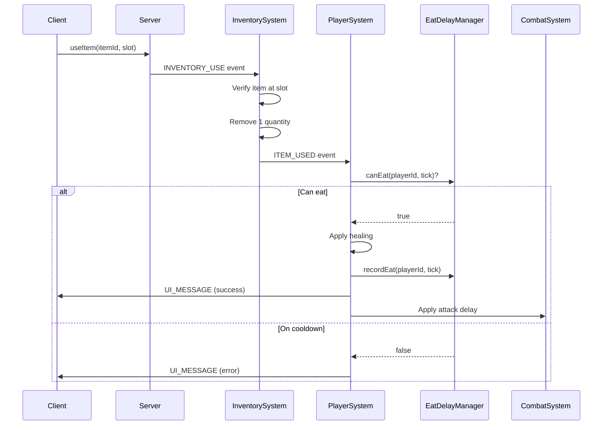

# Eating & Healing System

The eating system provides OSRS-accurate food consumption with proper eat delays, combat integration, and server-authoritative validation.

<Info>
Eating code lives in `packages/shared/src/systems/shared/character/EatDelayManager.ts` and integrates with `InventorySystem` and `PlayerSystem`.
</Info>

## Overview

Food consumption follows Old School RuneScape mechanics:

- **3-tick eat delay** (1.8 seconds) between eating
- **Instant healing** when food is consumed
- **Combat integration** - eating delays your next attack
- **Server-authoritative** - all validation happens server-side
- **Works at full health** - shows message and applies delay even when HP is full

---

## How to Eat

### Inventory Context Menu

Right-click food in your inventory and select **Eat**:

```typescript
// Food items show "Eat" as the primary action
inventoryActions: ["Eat", "Drop", "Examine"]
```

### Left-Click Primary Action

Left-click food to eat immediately (if "Eat" is the primary action in the manifest).

---

## Eat Delay Mechanics

### OSRS-Accurate Timing

```typescript
// From CombatConstants.ts
export const COMBAT_CONSTANTS = {
  TICK_DURATION_MS: 600,        // 600ms per tick
  EAT_DELAY_TICKS: 3,           // 3 ticks = 1.8 seconds
  // ...
};
```

### EatDelayManager

The `EatDelayManager` tracks eat cooldowns per player:

```typescript
export class EatDelayManager {
  private lastEatTick = new Map<string, number>();

  /**
   * Check if player can eat (not on cooldown)
   */
  canEat(playerId: string, currentTick: number): boolean {
    const lastTick = this.lastEatTick.get(playerId) ?? 0;
    return currentTick - lastTick >= COMBAT_CONSTANTS.EAT_DELAY_TICKS;
  }

  /**
   * Record that player just ate
   */
  recordEat(playerId: string, currentTick: number): void {
    this.lastEatTick.set(playerId, currentTick);
  }

  /**
   * Get remaining cooldown ticks
   */
  getRemainingCooldown(playerId: string, currentTick: number): number {
    const lastTick = this.lastEatTick.get(playerId) ?? 0;
    const elapsed = currentTick - lastTick;
    return Math.max(0, COMBAT_CONSTANTS.EAT_DELAY_TICKS - elapsed);
  }
}
```

---

## Server-Authoritative Flow

### 1. Client Initiates

Player clicks "Eat" on food item:

```typescript
// InventoryActionDispatcher.ts
case "eat":
  world.network?.send("useItem", { itemId, slot });
  return { success: true };
```

### 2. Server Validates

Server receives `useItem` message and validates:

```typescript
// ServerNetwork/handlers/inventory.ts
socket.on("useItem", async (data: { itemId: string; slot: number }) => {
  // Validate slot is within bounds
  if (data.slot < 0 || data.slot >= 28) {
    return; // Reject invalid slot
  }

  // Emit INVENTORY_USE event for InventorySystem
  world.emit(EventType.INVENTORY_USE, {
    playerId: socket.playerId,
    itemId: data.itemId,
    slot: data.slot,
  });
});
```

### 3. InventorySystem Processes

```typescript
// InventorySystem.ts
private handleUseItem(data: { playerId: string; itemId: string; slot: number }): void {
  // Verify item exists at slot
  const inventory = this.getInventory(data.playerId);
  const item = inventory.items.find(i => i.slot === data.slot);
  
  if (!item || item.itemId !== data.itemId) {
    return; // Reject if item mismatch
  }

  // Consume the item
  this.removeItem({
    playerId: data.playerId,
    itemId: data.itemId,
    quantity: 1,
  });

  // Emit ITEM_USED event for PlayerSystem to handle healing
  this.emitTypedEvent(EventType.ITEM_USED, {
    playerId: data.playerId,
    itemId: data.itemId,
  });
}
```

### 4. PlayerSystem Heals

```typescript
// PlayerSystem.ts
private handleItemUsed(data: { playerId: string; itemId: string }): void {
  const player = this.world.getPlayer(data.playerId);
  const itemData = getItem(data.itemId);
  
  if (!itemData?.healAmount) return;

  const currentTick = this.world.currentTick ?? 0;

  // Check eat delay
  if (!this.eatDelayManager.canEat(data.playerId, currentTick)) {
    const remaining = this.eatDelayManager.getRemainingCooldown(data.playerId, currentTick);
    this.emitTypedEvent(EventType.UI_MESSAGE, {
      playerId: data.playerId,
      message: `You can't eat yet. (${remaining} ticks)`,
      type: "error",
    });
    return;
  }

  // Record eat for delay tracking
  this.eatDelayManager.recordEat(data.playerId, currentTick);

  // Apply healing (capped at max HP)
  const oldHealth = player.health;
  const maxHealth = player.maxHealth;
  const newHealth = Math.min(maxHealth, oldHealth + itemData.healAmount);
  player.health = newHealth;

  // Show message (even at full health - OSRS behavior)
  const healedAmount = newHealth - oldHealth;
  const message = healedAmount > 0
    ? `You eat the ${itemData.name}. It heals ${healedAmount} HP.`
    : `You eat the ${itemData.name}.`;

  this.emitTypedEvent(EventType.UI_MESSAGE, {
    playerId: data.playerId,
    message,
    type: "success",
  });

  // Apply attack delay (eating delays your next attack)
  this.applyEatAttackDelay(data.playerId, currentTick);
}
```

---

## Combat Integration

### Attack Delay

Eating applies a **3-tick delay** to your next attack:

```typescript
/**
 * Apply attack delay after eating (OSRS-accurate)
 * Eating delays your next attack by 3 ticks
 */
private applyEatAttackDelay(playerId: string, currentTick: number): void {
  const combatSystem = this.world.getSystem('combat') as CombatSystem;
  if (combatSystem) {
    // Set next attack tick to current + 3 (eat delay)
    combatSystem.setNextAttackTick(playerId, currentTick + COMBAT_CONSTANTS.EAT_DELAY_TICKS);
  }
}
```

### PvP Gear + Eat Combos

OSRS allows rapid gear switching + eating combos. The system uses a **separate rate limiter** for consume actions to prevent abuse while allowing legitimate combos:

```typescript
// From InventorySystem.ts
private consumeRateLimiter = new Map<string, number>();

private canConsume(playerId: string): boolean {
  const now = Date.now();
  const lastConsume = this.consumeRateLimiter.get(playerId) ?? 0;
  
  // 100ms minimum between consume actions (allows gear+eat combos)
  if (now - lastConsume < 100) {
    return false;
  }
  
  this.consumeRateLimiter.set(playerId, now);
  return true;
}
```

---

## Food Types

Food items are defined in `items.json` manifest with `healAmount`:

```json
{
  "id": "cooked_shrimp",
  "name": "Cooked shrimp",
  "type": "consumable",
  "healAmount": 3,
  "inventoryActions": ["Eat", "Drop", "Examine"],
  "examine": "I should try eating this."
}
```

### Common Foods

| Food | Heal Amount | Cooking Level |
|------|-------------|---------------|
| Cooked shrimp | 3 HP | 1 |
| Cooked trout | 7 HP | 15 |
| Cooked lobster | 12 HP | 40 |
| Cooked swordfish | 14 HP | 45 |
| Cooked shark | 20 HP | 80 |

---

## Event Flow



---

## Testing

The eating system has comprehensive test coverage:

```typescript
// From EatDelayManager.test.ts
describe("EatDelayManager", () => {
  it("allows eating after 3-tick delay", () => {
    const manager = new EatDelayManager();
    const playerId = "player1";
    
    manager.recordEat(playerId, 100);
    
    expect(manager.canEat(playerId, 102)).toBe(false); // 2 ticks
    expect(manager.canEat(playerId, 103)).toBe(true);  // 3 ticks
  });

  it("tracks multiple players independently", () => {
    const manager = new EatDelayManager();
    
    manager.recordEat("player1", 100);
    manager.recordEat("player2", 105);
    
    expect(manager.canEat("player1", 103)).toBe(true);
    expect(manager.canEat("player2", 103)).toBe(false);
  });
});
```

Integration tests verify the full flow:

```typescript
// From CombatSystem.eatDelay.test.ts
it("eating delays next attack by 3 ticks", async () => {
  const { world, player, goblin } = await setupCombatTest();
  
  // Start combat
  world.emit(EventType.COMBAT_ATTACK_REQUEST, {
    attackerId: player.id,
    targetId: goblin.id,
  });
  
  // Eat food
  world.emit(EventType.INVENTORY_USE, {
    playerId: player.id,
    itemId: "cooked_shrimp",
    slot: 0,
  });
  
  // Verify attack is delayed by 3 ticks
  const combatSystem = world.getSystem("combat") as CombatSystem;
  const nextAttackTick = combatSystem.getNextAttackTick(player.id);
  
  expect(nextAttackTick).toBe(currentTick + 3);
});
```

---

## Related Systems

- [Inventory System](/wiki/game-systems/inventory) - Item storage and management
- [Combat System](/wiki/game-systems/combat) - Attack delays and damage
- [Cooking Skill](/wiki/game-systems/skills#cooking) - Preparing food
- [Item Manifests](/concepts/manifests) - Defining food items

---

## API Reference

### EatDelayManager

```typescript
class EatDelayManager {
  /**
   * Check if player can eat (not on cooldown)
   * @param playerId - Player to check
   * @param currentTick - Current game tick
   * @returns true if player can eat, false if still on cooldown
   */
  canEat(playerId: string, currentTick: number): boolean;

  /**
   * Record that player just ate
   * @param playerId - Player who ate
   * @param currentTick - Current game tick
   */
  recordEat(playerId: string, currentTick: number): void;

  /**
   * Get remaining cooldown ticks
   * @param playerId - Player to check
   * @param currentTick - Current game tick
   * @returns 0 if ready to eat, otherwise ticks remaining
   */
  getRemainingCooldown(playerId: string, currentTick: number): number;

  /**
   * Clear player's eat cooldown (on death, disconnect)
   * @param playerId - Player to clear
   */
  clearPlayer(playerId: string): void;
}
```

### Events

| Event | Data | Description |
|-------|------|-------------|
| `INVENTORY_USE` | `playerId`, `itemId`, `slot` | Player uses item (eating) |
| `ITEM_USED` | `playerId`, `itemId` | Item consumed, ready for healing |
| `PLAYER_HEALED` | `playerId`, `amount`, `newHealth` | Player HP increased |
| `UI_MESSAGE` | `playerId`, `message`, `type` | Feedback message |

---

## Configuration

### Constants

```typescript
// From CombatConstants.ts
export const COMBAT_CONSTANTS = {
  EAT_DELAY_TICKS: 3,           // 3 ticks between eating
  TICK_DURATION_MS: 600,        // 600ms per tick
  // ...
};
```

### Item Manifest

Food items require `healAmount` and `type: "consumable"`:

```json
{
  "id": "cooked_lobster",
  "name": "Cooked lobster",
  "type": "consumable",
  "healAmount": 12,
  "inventoryActions": ["Eat", "Drop", "Examine"],
  "examine": "This looks delicious.",
  "stackable": false,
  "value": 100
}
```

---

## Security Features

### Server-Side Validation

All eating validation happens server-side:

1. **Slot verification** - Item must exist at claimed slot
2. **Item matching** - Item ID must match slot contents
3. **Eat delay check** - Enforced via `EatDelayManager`
4. **Rate limiting** - Separate consume rate limiter (100ms minimum)

### Rate Limiting

```typescript
// Prevents rapid consume spam while allowing gear+eat combos
private consumeRateLimiter = new Map<string, number>();

private canConsume(playerId: string): boolean {
  const now = Date.now();
  const lastConsume = this.consumeRateLimiter.get(playerId) ?? 0;
  
  if (now - lastConsume < 100) {
    return false; // Too fast
  }
  
  this.consumeRateLimiter.set(playerId, now);
  return true;
}
```

---

## OSRS Behavior Parity

### Eating at Full Health

OSRS allows eating at full health (shows message, applies delay):

```typescript
// PlayerSystem.ts - handleItemUsed()
// Show message even if no healing occurred
const healedAmount = newHealth - oldHealth;
const message = healedAmount > 0
  ? `You eat the ${itemData.name}. It heals ${healedAmount} HP.`
  : `You eat the ${itemData.name}.`; // Full health message

// Attack delay applies regardless of healing
this.applyEatAttackDelay(playerId, currentTick);
```

### Combat Interaction

Eating during combat:

1. **Delays next attack** by 3 ticks
2. **Does not cancel combat** - auto-retaliate continues
3. **Instant healing** - HP updates immediately
4. **No animation interrupt** - combat animations continue

---

## Implementation Details

### Event-Driven Architecture

The eating system uses event-driven flow to avoid tight coupling:

```typescript
// Client → Server
world.network.send("useItem", { itemId, slot });

// Server → InventorySystem
world.emit(EventType.INVENTORY_USE, { playerId, itemId, slot });

// InventorySystem → PlayerSystem
world.emit(EventType.ITEM_USED, { playerId, itemId });

// PlayerSystem → Client
world.emit(EventType.UI_MESSAGE, { playerId, message, type });
```

### Health Bar Updates

Health bars are **event-driven only** to prevent stale snapshot race conditions:

```typescript
// From PlayerSystem.ts
// Health bars listen to PLAYER_HEALTH_CHANGED event
this.emitTypedEvent(EventType.PLAYER_HEALTH_CHANGED, {
  playerId: data.playerId,
  health: newHealth,
  maxHealth: player.maxHealth,
  delta: healedAmount,
});
```

---

## Related Documentation

- [Inventory System](/wiki/game-systems/inventory) - Item management
- [Combat System](/wiki/game-systems/combat) - Attack delays
- [Cooking Skill](/wiki/game-systems/skills#cooking) - Preparing food
- [Item Manifests](/concepts/manifests) - Defining food items
