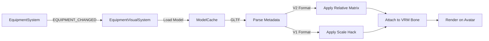
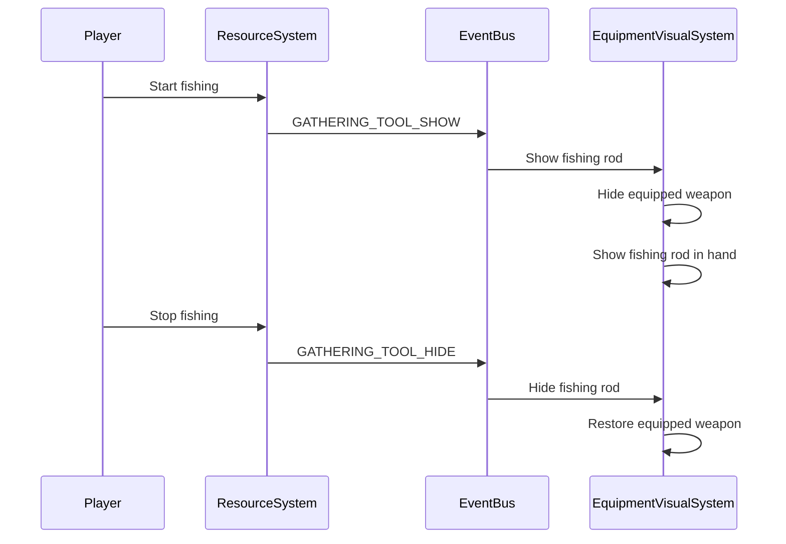

# Equipment Visual System

The Equipment Visual System handles rendering equipped items on VRM avatars, including weapons, shields, helmets, and temporary gathering tools (e.g., fishing rods during fishing).

<Info>
Equipment visual code lives in `packages/shared/src/systems/client/EquipmentVisualSystem.ts` with fitting tools in `packages/asset-forge/`.
</Info>

## Architecture



### Key Components

| Component | Location | Purpose |
|-----------|----------|---------|
| `EquipmentVisualSystem.ts` | `packages/shared/src/systems/client/` | Renders equipment on avatars |
| `EquipmentViewer.tsx` | `packages/asset-forge/src/components/Equipment/` | Equipment fitting tool (720 lines) |
| `AssetSelectionPanel.tsx` | `packages/asset-forge/src/components/Equipment/` | Asset browser for fitting |

---

## Equipment Fitting V2 Format

### Export Format

Equipment models exported from Asset Forge include metadata for proper attachment:

```typescript
interface EquipmentAttachmentData {
  // V2 format fields
  version: 2;
  vrmBoneName: string;           // VRM bone to attach to (e.g., "rightHand")
  relativeMatrix: number[];      // 16-element matrix array
  avatarId: string;              // Avatar used for fitting
  avatarHeight: number;          // Avatar height used for fitting
  
  // Metadata
  weaponType?: string;
  originalSlot: string;
  exportedFrom: "asset-forge-equipment-fitting-v2";
  exportedAt: string;
  usage: string;
}
```

### V2 vs V1 Format

**V2 Format (Current):**
- Uses world-space relative matrix approach
- Captures exact visual relationship between hand bone and weapon
- Preserves scale compensation automatically
- No scale hacks needed in Hyperscape

**V1 Format (Legacy):**
- Used baked position/rotation with scale multiplier hack
- Required `WEAPON_SCALE_MULTIPLIER = 1.75` in Hyperscape
- Less accurate for complex bone hierarchies

### V2 Export Process

```typescript
// EquipmentViewer.tsx - Export logic
const handBone = wrapper.parent;

// Update world matrices to get accurate transforms
handBone.updateMatrixWorld(true);
wrapper.updateMatrixWorld(true);

// Calculate relative transform: weapon position in hand bone's local space
const handWorldInverse = new THREE.Matrix4()
  .copy(handBone.matrixWorld)
  .invert();
const relativeMatrix = new THREE.Matrix4().multiplyMatrices(
  handWorldInverse,
  wrapper.matrixWorld
);

// Create export root and apply the relative matrix
const exportRoot = new THREE.Group();
exportRoot.name = "EquipmentWrapper";

// Decompose relative matrix into position/rotation/scale
const position = new THREE.Vector3();
const quaternion = new THREE.Quaternion();
const scale = new THREE.Vector3();
relativeMatrix.decompose(position, quaternion, scale);

exportRoot.position.copy(position);
exportRoot.quaternion.copy(quaternion);
exportRoot.scale.copy(scale);

// Clone equipment mesh and preserve scale
const equipmentClone = equipmentRef.current.clone(true);
equipmentClone.position.set(0, 0, 0);
equipmentClone.quaternion.identity();
equipmentClone.scale.copy(equipmentRef.current.scale);
exportRoot.add(equipmentClone);
```

### Avatar Height Normalization

Asset Forge normalizes avatar height to 1.6m to match Hyperscape's VRM factory:

```typescript
// Normalize avatar height to 1.6m
// This matches Hyperscape's createVRMFactory.ts
const currentHeight = calculateAvatarHeight(avatar);
const TARGET_HEIGHT = 1.6;
if (currentHeight > 0.1) {
  const scaleFactor = TARGET_HEIGHT / currentHeight;
  avatar.scale.setScalar(scaleFactor);
  avatar.updateMatrixWorld(true);
  console.log(
    `📏 Normalized avatar height: ${currentHeight.toFixed(2)}m → ${TARGET_HEIGHT}m (scale: ${scaleFactor.toFixed(4)})`
  );
}
```

Without this normalization, equipment fitted in Asset Forge would appear at the wrong scale in Hyperscape.

---

## Equipment Loading in Hyperscape

### V2 Format Loading

```typescript
// EquipmentVisualSystem.ts
const hasValidMatrix =
  attachmentData?.version === 2 &&
  Array.isArray(attachmentData.relativeMatrix) &&
  attachmentData.relativeMatrix.length === 16 &&
  attachmentData.relativeMatrix.every(
    (n) => typeof n === "number" && !isNaN(n)
  );

if (hasValidMatrix) {
  const equipmentWrapper = weaponMesh.children.find(
    (child) => child.name === "EquipmentWrapper"
  );
  
  if (equipmentWrapper) {
    // V2: The wrapper already has the correct relative transform baked in
    // Just attach it directly - no scale hacks needed!
    equipment[slotKey] = weaponMesh;
    targetBone.add(weaponMesh);
  }
}
```

### V1 Format Loading (Legacy)

```typescript
// Legacy: Apply scale multiplier hack for V1 exports
const WEAPON_SCALE_MULTIPLIER = 1.75;
weaponMesh.scale.multiplyScalar(WEAPON_SCALE_MULTIPLIER);
```

---

## Gathering Tool Display (OSRS-Style)

During gathering activities (fishing, mining, woodcutting), the appropriate tool is shown in the player's hand even though it's in inventory, not equipped. This matches OSRS behavior.

### Flow



### Implementation

```typescript
// ResourceSystem.ts - Show tool when gathering starts
if (resource.skillRequired === "fishing" && toolInfo?.itemId) {
  this.emitTypedEvent(EventType.GATHERING_TOOL_SHOW, {
    playerId: data.playerId,
    itemId: toolInfo.itemId,
    slot: "weapon", // Show in weapon hand
  });
}

// Hide tool when gathering stops
if (session.skill === "fishing" && session.toolItemId) {
  this.emitTypedEvent(EventType.GATHERING_TOOL_HIDE, {
    playerId: data.playerId,
    slot: "weapon",
  });
}
```

### Visual System Handling

```typescript
// EquipmentVisualSystem.ts
private async handleGatheringToolShow(data: {
  playerId: string;
  itemId: string;
  slot: string;
}): Promise<void> {
  const equipment = this.playerEquipment.get(playerId);
  
  // Temporarily hide the equipped weapon
  if (
    equipment.weapon &&
    equipment.weapon.visible &&
    !this.hiddenWeapons.has(playerId)
  ) {
    equipment.weapon.visible = false;
    this.hiddenWeapons.add(playerId);
  }
  
  // Show gathering tool in weapon hand
  await this.equipVisual(playerId, "gatheringTool", itemId, equipment, vrm);
}

private handleGatheringToolHide(data: {
  playerId: string;
  slot: string;
}): void {
  const equipment = this.playerEquipment.get(playerId);
  
  // Remove the gathering tool visual
  this.unequipVisual(playerId, "gatheringTool", equipment, vrm);
  
  // Restore the equipped weapon
  if (
    this.hiddenWeapons.has(playerId) &&
    equipment.weapon &&
    !equipment.weapon.visible
  ) {
    equipment.weapon.visible = true;
    this.hiddenWeapons.delete(playerId);
  }
}
```

---

## Tool Detection

The resource system now checks both inventory AND equipped items when detecting tools:

```typescript
// ResourceSystem.ts
private playerHasToolCategory(playerId: string, category: string): boolean {
  // Check inventory first
  const inventorySystem = this.world.getSystem("inventory");
  const inv = inventorySystem?.getInventory(playerId);
  const items = inv?.items || [];
  
  const hasInInventory = items.some((item) => {
    if (!item?.itemId) return false;
    return itemMatchesToolCategory(item.itemId, category);
  });
  
  if (hasInInventory) {
    return true;
  }
  
  // Check equipped items (tools go in weapon slot)
  const equipmentSystem = this.world.getSystem("equipment");
  const equipment = equipmentSystem?.getPlayerEquipment(playerId);
  const weaponItemId = equipment?.weapon?.itemId;
  
  if (weaponItemId) {
    const itemIdStr = typeof weaponItemId === "number" 
      ? weaponItemId.toString() 
      : weaponItemId;
    if (itemMatchesToolCategory(itemIdStr, category)) {
      return true;
    }
  }
  
  return false;
}
```

This allows players to:
- Equip a pickaxe and mine without it being in inventory
- Equip a hatchet and chop trees
- Use tools from either inventory or equipment slot

---

## Asset Forge Equipment Panel

The Asset Forge equipment panel now includes tools alongside weapons and shields:

```typescript
// AssetSelectionPanel.tsx
const equipmentAssets = assets.filter((a) => {
  if (a.type === "armor") return false;
  if (a.type === "weapon") return true;
  if (a.type === "tool") return true;    // NEW: Include tools
  if (a.type === "shield") return true;
  return false;
});

// Group assets
const groups: Record<string, Asset[]> = {
  weapons: [],
  tools: [],    // NEW: Tools group
  shields: [],
};

// Get icon for asset type
const getAssetIcon = (asset: Asset) => {
  if (asset.type === "character") return User;
  if (asset.type === "tool") return Pickaxe;  // NEW: Pickaxe icon for tools
  const name = asset.name.toLowerCase();
  if (name.includes("shield")) return Shield;
  return Sword;
};
```

---

## VRM Bone Mapping

Equipment attaches to VRM humanoid bones:

```typescript
// Map Asset Forge bone names to VRM standard bone names
const boneNameMap: Record<string, string> = {
  "weapon": "rightHand",
  "shield": "leftHand",
  "helmet": "head",
  "body": "spine",
  "legs": "hips",
  "boots": "leftFoot",
  "gloves": "leftHand",
};

const vrmBoneName = boneNameMap[equipmentSlot] || "rightHand";
```

### VRM Bone Hierarchy

```
hips
├── spine
│   ├── chest
│   │   ├── upperChest
│   │   │   ├── neck
│   │   │   │   └── head
│   │   │   ├── leftShoulder
│   │   │   │   ├── leftUpperArm
│   │   │   │   │   ├── leftLowerArm
│   │   │   │   │   │   └── leftHand
│   │   │   └── rightShoulder
│   │   │       ├── rightUpperArm
│   │   │       │   ├── rightLowerArm
│   │   │       │   │   └── rightHand
├── leftUpperLeg
│   ├── leftLowerLeg
│   │   └── leftFoot
└── rightUpperLeg
    ├── rightLowerLeg
    │   └── rightFoot
```

---

## Equipment Slots

```typescript
interface PlayerEquipmentVisuals {
  weapon?: THREE.Object3D;
  shield?: THREE.Object3D;
  helmet?: THREE.Object3D;
  // Temporary gathering tool (e.g., fishing rod during fishing)
  gatheringtool?: THREE.Object3D;
}
```

---

## Events

```typescript
export enum EventType {
  // Equipment changes
  EQUIPMENT_CHANGED = "equipment:changed",
  EQUIPMENT_UPDATED = "equipment:updated",
  ITEM_EQUIPPED = "item:equipped",
  ITEM_UNEQUIPPED = "item:unequipped",
  
  // Gathering tool visuals (OSRS-style)
  GATHERING_TOOL_SHOW = "gathering:tool:show",
  GATHERING_TOOL_HIDE = "gathering:tool:hide",
}
```

---

## Network Packets

### Server → Client

```typescript
// Show gathering tool in hand
socket.send("gatheringToolShow", {
  playerId: "player-123",
  itemId: "fishing_rod",
  slot: "weapon"
});

// Hide gathering tool
socket.send("gatheringToolHide", {
  playerId: "player-123",
  slot: "weapon"
});
```

---

## Position Controls

Asset Forge provides fine-grained position controls for equipment fitting:

```typescript
// PositionControls.tsx
<RangeInput
  type="range"
  min="-0.8"    // Increased from -0.2 for more flexibility
  max="0.8"     // Increased from 0.2
  step="0.001"
  value={manualPosition.x}
  onChange={(e) => handlePositionChange("x", e.target.value)}
/>
```

This allows precise positioning of weapons, shields, and tools on VRM avatars.

---

## Mining Skill Check Fix

The mining skill check now properly validates player level:

```typescript
// EquipmentSystem.ts - Skill level caching
const skills = {
  attack: cachedSkills.attack?.level || 1,
  strength: cachedSkills.strength?.level || 1,
  defense: cachedSkills.defense?.level || 1,
  ranged: cachedSkills.ranged?.level || 1,
  constitution: cachedSkills.constitution?.level || 10,
  woodcutting: cachedSkills.woodcutting?.level || 1,
  mining: cachedSkills.mining?.level || 1,  // NEW: Added mining
  fishing: cachedSkills.fishing?.level || 1,
  firemaking: cachedSkills.firemaking?.level || 1,
  cooking: cachedSkills.cooking?.level || 1,
};
```

Previously, mining skill level was not cached, causing equipment requirement checks to fail for mining tools.

---

## Related Documentation

- [Equipment System](/wiki/game-systems/equipment)
- [VRM Avatars](/wiki/client/overview#vrm-avatar-system)
- [Asset Forge](/packages/asset-forge)
- [Resource Gathering](/wiki/game-systems/gathering)
