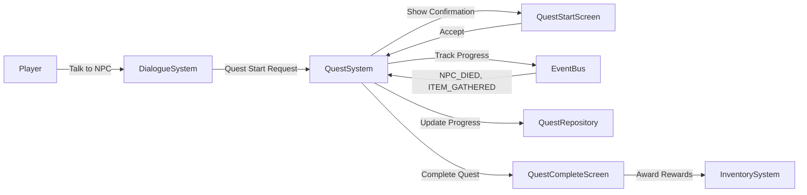

# Quest System

Hyperscape implements an OSRS-style quest system with manifest-driven quest definitions, server-authoritative progress tracking, and comprehensive security features. The quest system supports multi-stage quests with various objective types, requirements, and rewards.

<Info>
Quest code lives in `packages/shared/src/systems/shared/progression/QuestSystem.ts` with database persistence in `packages/server/src/database/repositories/QuestRepository.ts`.
</Info>

## Architecture



### Key Components

| Component | Location | Purpose |
|-----------|----------|---------|
| `QuestSystem.ts` | `packages/shared/src/systems/shared/progression/` | Core quest logic (1091 lines) |
| `QuestRepository.ts` | `packages/server/src/database/repositories/` | Database persistence (480 lines) |
| `quest-types.ts` | `packages/shared/src/types/game/` | Type definitions and validation (383 lines) |
| `quest.ts` | `packages/server/src/systems/ServerNetwork/handlers/` | Network handlers (192 lines) |
| `QuestJournal.tsx` | `packages/client/src/game/panels/` | Quest list UI (434 lines) |
| `QuestStartScreen.tsx` | `packages/client/src/game/panels/` | Quest acceptance UI (310 lines) |
| `QuestCompleteScreen.tsx` | `packages/client/src/game/panels/` | Completion celebration UI (213 lines) |

---

## Quest Definition Format

Quests are defined in `packages/server/world/assets/manifests/quests.json`:

```json
{
  "goblin_slayer": {
    "id": "goblin_slayer",
    "name": "Goblin Slayer",
    "description": "Kill 15 goblins to prove your worth.",
    "difficulty": "novice",
    "questPoints": 1,
    "replayable": false,
    "requirements": {
      "quests": [],
      "skills": {},
      "items": []
    },
    "startNpc": "cook",
    "stages": [
      {
        "id": "talk_to_cook",
        "type": "dialogue",
        "description": "Talk to the Cook to start the quest."
      },
      {
        "id": "kill_goblins",
        "type": "kill",
        "description": "Kill 15 goblins.",
        "target": "goblin",
        "count": 15
      },
      {
        "id": "return_to_cook",
        "type": "dialogue",
        "description": "Return to the Cook."
      }
    ],
    "onStart": {
      "items": [{ "itemId": "bronze_sword", "quantity": 1 }]
    },
    "rewards": {
      "questPoints": 1,
      "items": [{ "itemId": "xp_lamp_1000", "quantity": 1 }],
      "xp": { "attack": 500, "strength": 500 }
    }
  }
}
```

### Quest Properties

| Property | Type | Description |
|----------|------|-------------|
| `id` | string | Unique quest identifier (alphanumeric + underscore) |
| `name` | string | Display name shown in UI |
| `description` | string | Quest summary |
| `difficulty` | string | `novice`, `intermediate`, `experienced`, `master`, `grandmaster` |
| `questPoints` | number | Quest points awarded on completion |
| `replayable` | boolean | Whether quest can be repeated |
| `requirements` | object | Prerequisites to start quest |
| `startNpc` | string | NPC ID that starts the quest |
| `stages` | array | Quest stages (objectives) |
| `onStart` | object | Items granted when quest starts |
| `rewards` | object | Rewards granted on completion |

---

## Stage Types

### Dialogue Stage

```json
{
  "id": "talk_to_npc",
  "type": "dialogue",
  "description": "Talk to the Guard."
}
```

Automatically completes when player talks to the quest NPC.

### Kill Stage

```json
{
  "id": "kill_goblins",
  "type": "kill",
  "description": "Kill 15 goblins.",
  "target": "goblin",
  "count": 15
}
```

Tracks NPC kills via `NPC_DIED` events with HMAC validation to prevent spoofing.

### Gather Stage

```json
{
  "id": "gather_copper",
  "type": "gather",
  "description": "Mine 10 copper ore.",
  "target": "copper_ore",
  "count": 10
}
```

Tracks item gathering via `INVENTORY_ITEM_ADDED` events. Progress is tracked by item ID, allowing flexible completion order (e.g., gather copper and tin in any order).

### Interact Stage

```json
{
  "id": "light_fires",
  "type": "interact",
  "description": "Light 5 fires.",
  "target": "fire",
  "count": 5
}
```

Tracks interactions with entities or objects (fires, altars, ranges, etc.).

---

## Quest Flow

### 1. Quest Request

Player talks to NPC with quest available:

```typescript
// DialogueSystem checks for quest overrides
const questSystem = world.getSystem("quest") as QuestSystem;
const status = questSystem.getQuestStatus(playerId, questId);

// Priority: ready_to_complete > in_progress > completed > default
if (status === "ready_to_complete" && overrides.ready_to_complete) {
  entryNodeId = overrides.ready_to_complete;
} else if (status === "in_progress" && overrides.in_progress) {
  entryNodeId = overrides.in_progress;
}
```

### 2. Quest Confirmation

Server emits `QUEST_START_CONFIRM` event:

```typescript
world.emit(EventType.QUEST_START_CONFIRM, {
  playerId,
  questId,
  questName,
  description,
  difficulty,
  requirements: {
    quests: ["prerequisite_quest"],
    skills: { attack: 10 },
    items: []
  },
  rewards: {
    questPoints: 2,
    items: [{ itemId: "xp_lamp_1000", quantity: 1 }],
    xp: { attack: 500, strength: 500 }
  }
});
```

Client shows `QuestStartScreen` with Accept/Decline buttons.

### 3. Quest Start

Player clicks Accept, client sends `questAccept` packet:

```typescript
world.network.send("questAccept", { questId });
```

Server validates requirements and starts quest:

```typescript
const success = await questSystem.startQuest(playerId, questId);
```

Quest status changes to `in_progress` and starting items are granted.

### 4. Progress Tracking

Quest system subscribes to game events:

```typescript
// Kill tracking with HMAC validation
this.subscribe(EventType.NPC_DIED, (data) => {
  if (!validateKillToken(data.mobId, data.killedBy, data.timestamp, data.killToken)) {
    this.logger.warn("Invalid kill token - possible spoof attempt");
    return;
  }
  this.handleNPCDied(data);
});

// Gather tracking
this.subscribe(EventType.INVENTORY_ITEM_ADDED, (data) => {
  this.handleGatherStage(data);
});

// Interact tracking
this.subscribe(EventType.FIRE_CREATED, (data) => {
  this.handleInteractStage(data);
});
```

Progress updates emit `QUEST_PROGRESSED` events:

```typescript
this.emitTypedEvent(EventType.QUEST_PROGRESSED, {
  playerId,
  questId,
  stage: currentStage,
  progress: { kills: 7 },
  description: "Kill 15 goblins (7/15)"
});
```

### 5. Quest Completion

When all objectives are met, quest status becomes `ready_to_complete`. Player returns to NPC and dialogue triggers completion:

```typescript
// Dialogue effect
case "completeQuest": {
  const questId = params[0];
  await questSystem.completeQuest(playerId, questId);
  break;
}
```

Server awards rewards atomically:

```typescript
await this.questRepository.completeQuestWithPoints(
  playerId,
  questId,
  definition.questPoints
);

// Grant reward items
for (const reward of definition.rewards.items) {
  this.emitTypedEvent(EventType.INVENTORY_ITEM_ADDED, {
    playerId,
    item: { itemId: reward.itemId, quantity: reward.quantity }
  });
}

// Grant XP rewards
for (const [skill, amount] of Object.entries(definition.rewards.xp)) {
  this.emitTypedEvent(EventType.SKILLS_XP_GAINED, {
    playerId,
    skill,
    amount
  });
}
```

Client shows `QuestCompleteScreen` with fanfare.

---

## Quest Status

| Status | Description |
|--------|-------------|
| `not_started` | Quest not yet started |
| `in_progress` | Quest active, objectives incomplete |
| `ready_to_complete` | All objectives met, return to NPC |
| `completed` | Quest finished |

<Tip>
`ready_to_complete` is a **derived state** computed at runtime when status is `in_progress` AND current stage objective is met. It's not stored in the database.
</Tip>

---

## Security Features

### HMAC Kill Token Validation

Prevents spoofed `NPC_DIED` events from malicious clients:

```typescript
// Server generates token when NPC dies
const killToken = generateKillToken(mobId, killedBy, timestamp);

// QuestSystem validates token before counting kill
if (!validateKillToken(mobId, killedBy, timestamp, killToken)) {
  this.logger.warn("Invalid kill token - possible spoof attempt");
  return;
}
```

Uses HMAC-SHA256 with server-side secret and 5-second timestamp window.

### Rate Limiting

Quest network handlers are rate-limited:

```typescript
getQuestListRateLimiter()    // 5 requests/sec
getQuestDetailRateLimiter()  // 10 requests/sec  
getQuestAcceptRateLimiter()  // 3 requests/sec
```

### Input Validation

All quest IDs are validated:

```typescript
export const MAX_QUEST_ID_LENGTH = 64;
export const QUEST_ID_PATTERN = /^[a-z][a-z0-9_]{0,63}$/;

export function isValidQuestId(id: unknown): id is string {
  return (
    typeof id === "string" &&
    id.length > 0 &&
    id.length <= MAX_QUEST_ID_LENGTH &&
    QUEST_ID_PATTERN.test(id)
  );
}
```

### Audit Logging

All quest actions are logged to `quest_audit_log` table:

```typescript
await this.questRepository.logAuditEvent(
  playerId,
  questId,
  "completed",
  {
    questPointsAwarded: definition.questPoints,
    stageId: currentStage,
    stageProgress: progress.stageProgress
  }
);
```

Enables fraud detection and investigation.

---

## Database Schema

### quest_progress Table

```sql
CREATE TABLE quest_progress (
  id SERIAL PRIMARY KEY,
  playerId TEXT NOT NULL REFERENCES characters(id) ON DELETE CASCADE,
  questId TEXT NOT NULL,
  status TEXT NOT NULL DEFAULT 'not_started',
  currentStage TEXT,
  stageProgress JSONB DEFAULT '{}',
  startedAt BIGINT,
  completedAt BIGINT,
  CONSTRAINT quest_progress_player_quest_unique UNIQUE(playerId, questId)
);

CREATE INDEX idx_quest_progress_player ON quest_progress(playerId);
CREATE INDEX idx_quest_progress_status ON quest_progress(playerId, status);
```

### quest_audit_log Table

```sql
CREATE TABLE quest_audit_log (
  id SERIAL PRIMARY KEY,
  playerId TEXT NOT NULL REFERENCES characters(id) ON DELETE CASCADE,
  questId TEXT NOT NULL,
  action TEXT NOT NULL,
  questPointsAwarded INTEGER DEFAULT 0,
  stageId TEXT,
  stageProgress JSONB DEFAULT '{}',
  timestamp BIGINT NOT NULL,
  metadata JSONB DEFAULT '{}'
);

CREATE INDEX idx_quest_audit_log_player ON quest_audit_log(playerId);
CREATE INDEX idx_quest_audit_log_quest ON quest_audit_log(questId);
CREATE INDEX idx_quest_audit_log_timestamp ON quest_audit_log(timestamp);
```

### characters Table Addition

```sql
ALTER TABLE characters ADD COLUMN questPoints INTEGER DEFAULT 0 NOT NULL;
```

---

## Performance Optimizations

### O(1) Stage Lookups

Stage lookups use cached Maps instead of O(n) array searches:

```typescript
private _stageCaches: Map<string, Map<string, QuestStage>> = new Map();

private getStageCache(questId: string): Map<string, QuestStage> {
  let cache = this._stageCaches.get(questId);
  if (!cache) {
    const definition = this.questDefinitions.get(questId);
    cache = new Map(definition.stages.map(s => [s.id, s]));
    this._stageCaches.set(questId, cache);
  }
  return cache;
}
```

### Direct Mutation in Hot Paths

Eliminates object spread allocations:

```typescript
// Before: Creates new object on every kill
progress.stageProgress = {
  ...progress.stageProgress,
  kills: currentKills
};

// After: Direct mutation (safe - we own this object)
progress.stageProgress.kills = currentKills;
```

### Reduced Log Verbosity

Debug-level logging in hot paths, info-level only for milestones:

```typescript
this.logger.debug(`NPC_DIED: killedBy=${killedBy}, mobType=${mobType}`);  // Every kill
this.logger.info(`Quest completed: ${questName}`);  // Milestones only
```

---

## Quest Journal UI

### Quest List

Color-coded status matching OSRS:

| Status | Color | Hex |
|--------|-------|-----|
| Not Started | Red | `#ff4444` |
| In Progress | Yellow | `#ffff00` |
| Ready to Complete | Yellow | `#ffff00` |
| Completed | Green | `#00ff00` |

### Quest Detail View

- Strikethrough for completed stages
- Progress counters for active objectives (e.g., "7/15 goblins killed")
- Requirements and rewards display
- Quest points tracking

### Opening the Journal

Click the **Quests** button (📜 icon) in the sidebar or press the hotkey.

---

## Network Packets

### Client → Server

```typescript
// Request quest list
world.network.send("getQuestList", {});

// Request quest details
world.network.send("getQuestDetail", { questId: "goblin_slayer" });

// Accept quest
world.network.send("questAccept", { questId: "goblin_slayer" });
```

### Server → Client

```typescript
// Quest list response
socket.send("questList", {
  quests: [
    { id: "goblin_slayer", name: "Goblin Slayer", status: "in_progress", difficulty: "novice", questPoints: 1 }
  ],
  questPoints: 5
});

// Quest detail response
socket.send("questDetail", {
  id: "goblin_slayer",
  name: "Goblin Slayer",
  description: "Kill 15 goblins to prove your worth.",
  status: "in_progress",
  currentStage: "kill_goblins",
  stageProgress: { kills: 7 },
  stages: [...]
});

// Quest start confirmation (shows accept screen)
socket.send("questStartConfirm", {
  questId: "goblin_slayer",
  questName: "Goblin Slayer",
  requirements: {...},
  rewards: {...}
});

// Quest progress update
socket.send("questProgressed", {
  questId: "goblin_slayer",
  stage: "kill_goblins",
  progress: { kills: 8 },
  description: "Kill 15 goblins (8/15)"
});

// Quest completed (shows completion screen)
socket.send("questCompleted", {
  questId: "goblin_slayer",
  questName: "Goblin Slayer",
  rewards: {
    questPoints: 1,
    items: [{ itemId: "xp_lamp_1000", quantity: 1 }],
    xp: { attack: 500, strength: 500 }
  }
});
```

---

## Quest Events

```typescript
export enum EventType {
  // Quest lifecycle
  QUEST_START_CONFIRM = "quest:start_confirm",
  QUEST_STARTED = "quest:started",
  QUEST_PROGRESSED = "quest:progressed",
  QUEST_COMPLETED = "quest:completed",
  
  // XP Lamp (quest reward item)
  XP_LAMP_USE_REQUEST = "xp_lamp:use_request",
  XP_LAMP_SKILL_SELECTED = "xp_lamp:skill_selected",
  XP_LAMP_APPLIED = "xp_lamp:applied",
}
```

---

## XP Lamp System

Quest rewards often include XP lamps that let players choose which skill to train:

### Item Definition

```json
{
  "id": "xp_lamp_1000",
  "name": "XP Lamp (1000 XP)",
  "description": "Grants 1000 XP to a skill of your choice.",
  "stackable": false,
  "useEffect": {
    "type": "xp_lamp",
    "xpAmount": 1000
  }
}
```

### Usage Flow

1. Player right-clicks lamp → "Rub" option
2. Client emits `XP_LAMP_USE_REQUEST` event
3. `SkillSelectModal` opens showing all skills
4. Player selects skill
5. Client sends `xpLampUse` packet to server
6. Server validates, consumes lamp, grants XP
7. Server emits `XP_LAMP_APPLIED` event

```typescript
// Handler in packages/server/src/systems/ServerNetwork/handlers/inventory.ts
export async function handleXpLampUse(
  socket: ServerSocket,
  data: { itemId: string; slot: number; skillId: string; xpAmount: number },
  world: World
): Promise<void> {
  // Validate item exists at slot
  // Validate skill ID
  // Remove lamp from inventory
  // Grant XP
  world.emit(EventType.SKILLS_XP_GAINED, {
    playerId,
    skill: skillId,
    amount: xpAmount
  });
}
```

---

## API Reference

### QuestSystem Methods

```typescript
class QuestSystem extends SystemBase {
  // Query methods (IQuestQuery interface)
  getQuestStatus(playerId: string, questId: string): QuestStatus;
  getQuestDefinition(questId: string): QuestDefinition | undefined;
  getAllQuestDefinitions(): QuestDefinition[];
  getActiveQuests(playerId: string): ActiveQuest[];
  getQuestPoints(playerId: string): number;
  hasCompletedQuest(playerId: string, questId: string): boolean;
  
  // Action methods (IQuestActions interface)
  requestQuestStart(playerId: string, questId: string): boolean;
  startQuest(playerId: string, questId: string): Promise<boolean>;
  completeQuest(playerId: string, questId: string): Promise<boolean>;
}
```

### QuestRepository Methods

```typescript
class QuestRepository extends BaseRepository {
  // Progress management
  getQuestProgress(playerId: string, questId: string): Promise<QuestProgressRow | null>;
  getAllPlayerQuests(playerId: string): Promise<QuestProgressRow[]>;
  getCompletedQuests(playerId: string): Promise<string[]>;
  startQuest(playerId: string, questId: string, initialStage: string): Promise<void>;
  updateProgress(playerId: string, questId: string, stage: string, progress: StageProgress): Promise<void>;
  completeQuest(playerId: string, questId: string): Promise<void>;
  
  // Quest points
  getQuestPoints(playerId: string): Promise<number>;
  addQuestPoints(playerId: string, points: number): Promise<void>;
  completeQuestWithPoints(playerId: string, questId: string, questPoints: number): Promise<void>;
  
  // Audit logging
  logAuditEvent(playerId: string, questId: string, action: QuestAuditAction, options?: {...}): Promise<void>;
  getPlayerAuditLog(playerId: string, limit?: number): Promise<AuditLogEntry[]>;
  getQuestAuditLog(questId: string, limit?: number): Promise<AuditLogEntry[]>;
}
```

---

## Testing

Quest system has comprehensive integration tests:

```bash
bun test packages/server/tests/integration/quest/quest.integration.test.ts
```

**Coverage:**
- 45 test cases across 10 test suites
- Quest lifecycle (request → accept → progress → complete)
- Kill tracking with wrong mob filtering
- Prerequisites and validation
- Database persistence
- Event emission verification
- Multi-quest support
- Player cleanup

---

## Related Documentation

- [Dialogue System](/wiki/game-systems/dialogue)
- [Skills System](/wiki/game-systems/skills)
- [Event System](/wiki/engine/events)
- [Database Schema](/wiki/engine/database)
