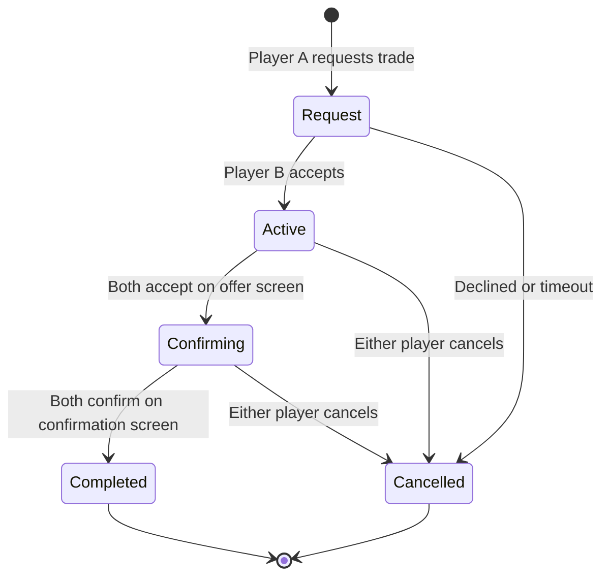

# Trading System

Hyperscape implements OSRS-accurate player-to-player trading with a two-screen confirmation flow and comprehensive anti-scam features.

<Info>
Trading system code is in `packages/server/src/systems/TradingSystem/` and `packages/server/src/systems/ServerNetwork/handlers/trade/`.
</Info>

---

## Two-Screen Confirmation Flow

Trading uses a two-step process to prevent scams:

### Screen 1: Offer Screen

- Players add/remove items from their offers
- Both players must click "Accept" to proceed
- Acceptance resets if either offer changes
- Shows partner's free inventory slots

### Screen 2: Confirmation Screen

- Final review of both offers
- Shows wealth transfer indicator (value difference)
- Both players must click "Confirm" to complete
- No item changes allowed on this screen



---

## Trade Session States

| State | Description | Timeout |
|-------|-------------|---------|
| `pending` | Trade request sent, awaiting response | 5 minutes |
| `active` | Both players in offer screen | 10 minutes |
| `confirming` | Both players in confirmation screen | 10 minutes |
| `completed` | Trade successfully completed | N/A |
| `cancelled` | Trade cancelled by player or timeout | N/A |

---

## UI Interaction

### Offer Screen

**Adding Items:**
- **Left-click** inventory item: Add 1 to trade
- **Right-click** inventory item: Context menu
  - Offer-1
  - Offer-5
  - Offer-10
  - Offer-X (custom quantity with K/M notation)
  - Offer-All
  - Value (shows item value in chat)
  - Examine (shows examine text in chat)

**Removing Items:**
- **Click** item in trade offer: Remove from trade

**Layout:**
- Left: Your offer (4×7 grid, 28 slots)
- Center: Partner's offer (4×7 grid, 28 slots)
- Right: Your inventory (4×7 grid, 28 slots)

### Confirmation Screen

**Layout:**
- Left: Your offer with total value
- Right: Partner's offer with total value
- Center: Wealth transfer indicator

**No inventory shown** — items cannot be changed on this screen.

---

## Anti-Scam Features

### Red Flashing Indicators

When items are removed from either offer, the empty slot shows a red flashing exclamation mark for 5 seconds.

```typescript
// From packages/client/src/game/panels/TradePanel/constants.ts
export const REMOVED_ITEM_DISPLAY_MS = 5000;
export const REMOVED_ITEM_CHECK_INTERVAL_MS = 500;
```

### Wealth Transfer Indicator

Shows the value difference between offers:

- **Green** (+value): You're gaining value
- **Red** (-value): You're losing value
- **White** (0): Equal value trade
- **⚠️ Warning**: Shown if difference >50% of larger offer

```typescript
// Example: You offer 100gp, they offer 200gp
// Display: "+100 gp" in green (you're gaining)
```

### Partner Inventory Slots

Displays partner's free inventory slots to prevent failed trades:

```typescript
// From packages/server/src/systems/ServerNetwork/handlers/trade/helpers.ts
export function calculateFreeSlots(
  world: World,
  playerId: string,
  offeredItems: TradeOfferItem[],
): number {
  // Counts free slots accounting for items being offered
  // (offered items will free up slots when removed)
}
```

---

## Proximity System

Players must be **adjacent (1 tile)** to trade. If out of range, the player automatically walks to the target.

### PendingTradeManager

```typescript
// From packages/server/src/systems/ServerNetwork/PendingTradeManager.ts
export class PendingTradeManager {
  queuePendingTrade(
    playerId: string,
    targetId: string,
    onInRange: () => void,
  ): void;
  
  processTick(): void;  // Re-paths if target moves
  cancelPendingTrade(playerId: string): void;
}
```

**Behavior:**
1. Player clicks another player to trade
2. If not in range, server queues "pending trade"
3. Player walks toward target (re-paths if target moves)
4. When in range, trade request is sent
5. New click or disconnect cancels pending trade

---

## Interface Blocking

Players cannot initiate trades while using other interfaces:

```typescript
// From packages/server/src/systems/ServerNetwork/handlers/common/helpers.ts
export function hasActiveInterfaceSession(
  world: World,
  playerId: string,
): boolean {
  // Returns true if player has active bank/store/dialogue session
}
```

**Blocked interfaces:**
- Bank
- Store/Shop
- Dialogue with NPC

<Warning>
This prevents exploits where players could duplicate items by trading while banking.
</Warning>

---

## Security

### Server-Authoritative Validation

All trade operations are validated server-side:

```typescript
// From packages/server/src/systems/ServerNetwork/handlers/trade/items.ts
export async function handleTradeAddItem(
  socket: ServerSocket,
  data: { tradeId: string; inventorySlot: number; quantity?: number },
  world: World,
  db: DatabaseConnection,
): Promise<void> {
  // 1. Validate authentication
  // 2. Rate limit check
  // 3. Validate trade session exists and is active
  // 4. Validate inventory slot bounds (0-27)
  // 5. Verify item exists in database inventory
  // 6. Validate item definition exists
  // 7. Check tradeable flag
  // 8. Validate quantity against actual inventory
  // 9. Add to trading system
  // 10. Broadcast update to both players
}
```

### Atomic Item Swap

Trade completion uses database transactions to prevent duplication:

```typescript
// From packages/server/src/systems/ServerNetwork/handlers/trade/swap.ts
export async function executeTradeSwap(
  tradingSystem: TradingSystem,
  tradeId: string,
  world: World,
  db: DatabaseConnection,
): Promise<void> {
  // 1. Lock both inventories
  // 2. Flush inventories to database
  // 3. Begin transaction with row-level locks (FOR UPDATE)
  // 4. Validate all items still exist with correct quantities
  // 5. Check tradeable flags
  // 6. Verify inventory space
  // 7. PHASE 1: Remove all offered items from both players
  // 8. PHASE 2: Add traded items to both players
  // 9. Commit transaction
  // 10. Reload inventories from database
  // 11. Unlock inventories
  // 12. Notify both players
}
```

**Two-Phase Swap:**
1. **Phase 1**: Remove ALL offered items from BOTH players
2. **Phase 2**: Add traded items to BOTH players

This prevents partial swaps if the transaction fails mid-execution.

### Tradeable Flag

Items with `tradeable: false` cannot be added to trades:

```json
{
  "id": "quest_item",
  "name": "Quest Item",
  "tradeable": false
}
```

The server validates this flag both when adding items and during the final swap.

---

## Network Protocol

### Client → Server

| Packet | Data | Description |
|--------|------|-------------|
| `tradeRequest` | `{ targetPlayerId }` | Request trade with player |
| `tradeRequestRespond` | `{ tradeId, accept }` | Accept/decline request |
| `tradeAddItem` | `{ tradeId, inventorySlot, quantity? }` | Add item to offer |
| `tradeRemoveItem` | `{ tradeId, tradeSlot }` | Remove item from offer |
| `tradeAccept` | `{ tradeId }` | Accept current state |
| `tradeCancel` | `{ tradeId }` | Cancel trade |

### Server → Client

| Packet | Data | Description |
|--------|------|-------------|
| `tradeIncoming` | `{ tradeId, fromPlayerId, fromPlayerName, fromPlayerLevel }` | Trade request received |
| `tradeStarted` | `{ tradeId, partnerId, partnerName, partnerLevel, partnerFreeSlots }` | Trade session started |
| `tradeUpdated` | `{ tradeId, myOffer, theirOffer, partnerFreeSlots }` | Offer changed |
| `tradeConfirmScreen` | `{ tradeId, myOffer, theirOffer, myOfferValue, theirOfferValue }` | Move to confirmation screen |
| `tradeCompleted` | `{ tradeId, receivedItems }` | Trade completed successfully |
| `tradeCancelled` | `{ tradeId, reason, message }` | Trade cancelled |
| `tradeError` | `{ message, code }` | Trade error occurred |

### Chat Integration

Trade requests appear as pink clickable messages in chat (OSRS-style):

```typescript
// From packages/client/src/game/chat/Chat.tsx
if (msg.type === "trade_request" && msg.tradeId) {
  return (
    <div
      style={{ color: "#FF00FF", cursor: "pointer", textDecoration: "underline" }}
      onClick={() => {
        world.network?.send("tradeRequestRespond", {
          tradeId: msg.tradeId,
          accept: true,
        });
      }}
    >
      {msg.body}
    </div>
  );
}
```

---

## Rate Limiting

Trade operations are rate-limited to prevent spam:

```typescript
// From packages/server/src/systems/ServerNetwork/handlers/trade/helpers.ts
export const rateLimiter = new RateLimitService();

// Default: 10 operations per second per player
// Shared across all trade operations (request, add, remove, accept)
```

---

## Error Codes

| Code | Message | Cause |
|------|---------|-------|
| `NOT_AUTHENTICATED` | Not authenticated | Missing player ID |
| `SYSTEM_ERROR` | Trading system unavailable | TradingSystem not initialized |
| `RATE_LIMITED` | Too fast / Please wait | Rate limit exceeded |
| `INVALID_PLAYER` | Invalid player | Target player ID invalid |
| `PLAYER_OFFLINE` | Player is not online | Target disconnected |
| `INTERFACE_OPEN` | Can't trade while using interface | Player has active bank/store session |
| `PLAYER_BUSY` | That player is busy | Target has active interface session |
| `TOO_FAR` | Need to be closer | Players not adjacent (shouldn't happen with auto-walk) |
| `NOT_IN_TRADE` | Not in an active trade | Trade session doesn't exist or wrong state |
| `INVALID_SLOT` | Invalid inventory slot | Slot out of bounds (0-27) |
| `INVALID_ITEM` | Invalid item / No item in slot | Item doesn't exist or not in inventory |
| `UNTRADEABLE_ITEM` | That item cannot be traded | Item has `tradeable: false` |
| `INVALID_QUANTITY` | Not enough items | Quantity exceeds inventory amount |
| `INVENTORY_FULL` | Inventory is full | Not enough free slots for incoming items |
| `ITEM_CHANGED` | Items changed during trade | Item modified between validation and swap |
| `TRADE_FAILED` | Trade failed | Generic swap failure |
| `SERVER_ERROR` | Trade failed - server error | Unexpected error during swap |

---

## Testing

The trading system has comprehensive integration tests:

```typescript
// From packages/server/tests/integration/trade/trade.integration.test.ts
describe("Trading System", () => {
  it("completes a simple trade", async () => {
    // 1. Create two players
    // 2. Give items to both
    // 3. Initiate trade request
    // 4. Accept request
    // 5. Add items to offers
    // 6. Both accept (move to confirmation)
    // 7. Both confirm (complete trade)
    // 8. Verify items swapped correctly
  });
  
  it("prevents trading untradeable items", async () => {
    // Verify tradeable flag enforcement
  });
  
  it("handles inventory full scenarios", async () => {
    // Verify space validation
  });
});
```

**Test Coverage:**
- Happy path (successful trades)
- Edge cases (inventory full, untradeable items)
- Error conditions (disconnects, timeouts)
- Security (item duplication prevention)

---

## Related Documentation

<CardGroup cols={2}>
  <Card title="Economy Overview" icon="coins" href="/concepts/economy">
    Banking, shops, currency, and item management
  </Card>
  <Card title="Inventory System" icon="backpack" href="/wiki/game-systems/inventory">
    28-slot inventory management and item stacking
  </Card>
  <Card title="Network Protocol" icon="network-wired" href="/api-reference/overview">
    WebSocket packet structure and event flow
  </Card>
  <Card title="Security" icon="shield" href="/wiki/engine/database">
    Database transactions and anti-duplication measures
  </Card>
</CardGroup>
