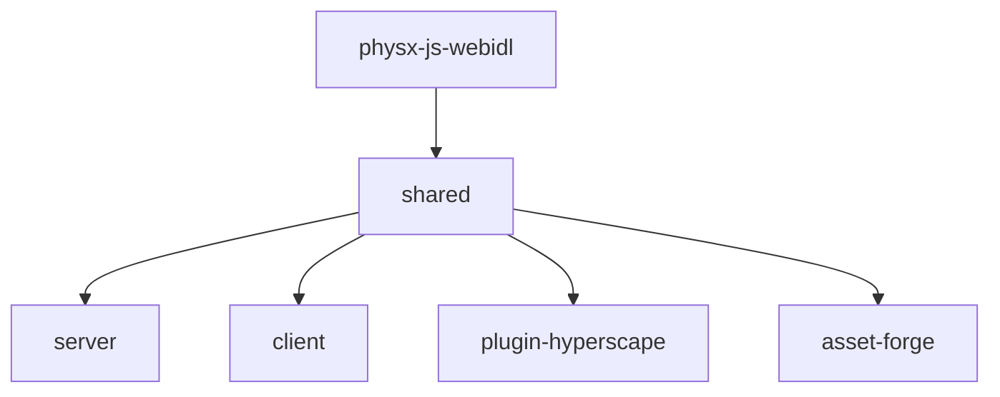

{/* 
  WIKI DOCUMENTATION
  
  This wiki is generated from actual source code analysis of the Hyperscape repository.
  All information is verified against the codebase to ensure accuracy.
  
  Source: https://github.com/HyperscapeAI/hyperscape
*/}

## Welcome to the Hyperscape Wiki

This wiki provides comprehensive technical documentation for Hyperscape, an AI-powered RuneScape-style MMORPG built on a custom 3D multiplayer engine. Every page is verified against the actual source code.

<Info>
  This documentation is generated from source code analysis. All code references link to actual files in the [Hyperscape repository](https://github.com/HyperscapeAI/hyperscape).
</Info>

---

## Quick Navigation

<CardGroup cols={2}>
  <Card title="Engine Architecture" icon="cube" href="/wiki/engine/overview">
    ECS architecture, Three.js integration, PhysX physics, and the core World system
  </Card>
  <Card title="Game Systems" icon="swords" href="/wiki/game-systems/overview">
    Combat, skills, economy, inventory, and all gameplay mechanics
  </Card>
  <Card title="AI Agents" icon="bot" href="/wiki/ai-agents/overview">
    ElizaOS integration, actions, providers, and autonomous gameplay
  </Card>
  <Card title="Data Manifests" icon="database" href="/wiki/data/overview">
    NPCs, items, world areas, and manifest-driven content
  </Card>
</CardGroup>

---

## Repository Structure

The Hyperscape monorepo contains **7 packages** managed by Turbo:

```
hyperscape/
├── packages/
│   ├── shared/              # Core 3D engine (ECS, Three.js, PhysX)
│   ├── server/              # Game server (Fastify, WebSockets, PostgreSQL)
│   ├── client/              # Web client (Vite, React 19)
│   ├── plugin-hyperscape/   # ElizaOS AI agent plugin
│   ├── physx-js-webidl/     # PhysX WASM bindings
│   ├── asset-forge/         # AI asset generation (MeshyAI, GPT-4)
│   └── docs-site/           # Docusaurus documentation
├── world/                   # World configuration and manifests
└── assets/                  # Shared game assets
```

### Build Dependency Graph

Packages must build in this order due to dependencies:



<Warning>
  The first build takes 5-10 minutes due to PhysX WASM compilation. Subsequent builds use cache.
</Warning>

---

## Tech Stack

<Tabs>
  <Tab title="Runtime">
    | Technology | Version | Purpose |
    |------------|---------|---------|
    | **Bun** | v1.1.38+ | JavaScript runtime and package manager |
    | **Turbo** | Latest | Monorepo build orchestration |
    | **Node.js** | 18+ | Fallback compatibility |
  </Tab>
  <Tab title="3D Engine">
    | Technology | Version | Purpose |
    |------------|---------|---------|
    | **Three.js** | 0.180.0 | 3D rendering |
    | **PhysX** | WASM | Physics simulation |
    | **VRM** | @pixiv/three-vrm | Avatar format support |
  </Tab>
  <Tab title="Backend">
    | Technology | Version | Purpose |
    |------------|---------|---------|
    | **Fastify** | 5.x | HTTP server |
    | **WebSockets** | @fastify/websocket | Real-time multiplayer |
    | **PostgreSQL** | Via Neon | Production database |
    | **SQLite** | Local | Development database |
    | **Drizzle ORM** | Latest | Database abstraction |
  </Tab>
  <Tab title="Frontend">
    | Technology | Version | Purpose |
    |------------|---------|---------|
    | **React** | 19.2.0 | UI framework |
    | **Vite** | Latest | Build tool with HMR |
    | **Capacitor** | Latest | iOS/Android mobile builds |
    | **styled-components** | Latest | Component styling |
  </Tab>
  <Tab title="AI">
    | Technology | Purpose |
    |------------|---------|
    | **ElizaOS** | AI agent framework |
    | **OpenAI** | GPT-4o for generation |
    | **Anthropic** | Claude for decisions |
    | **OpenRouter** | Multi-provider routing |
    | **MeshyAI** | 3D model generation |
  </Tab>
</Tabs>

---

## Port Allocation

All services use unique ports to avoid conflicts:

| Port | Service | Environment Variable | Started By |
|------|---------|---------------------|------------|
| **3333** | Game Client | `VITE_PORT` | `bun run dev` |
| **3400** | AssetForge UI | `ASSET_FORGE_PORT` | `bun run dev:forge` |
| **3401** | AssetForge API | `ASSET_FORGE_API_PORT` | `bun run dev:forge` |
| **3402** | Docusaurus | (hardcoded) | `bun run docs:dev` |
| **4000** | ElizaOS Dashboard | (internal) | `bun run dev:ai` |
| **4001** | ElizaOS API | `ELIZAOS_PORT` | `bun run dev:ai` |
| **5555** | Game Server | `PORT` | `bun run dev` |

---

## Development Commands

<CodeGroup>

```bash Core Development
# Install dependencies
bun install

# Build all packages (required before first run)
bun run build

# Development mode with hot reload
bun run dev

# Start game server (production mode)
bun start
```

```bash Package-Specific
# Build individual packages
bun run build:shared    # Core engine (build first)
bun run build:client    # Web client
bun run build:server    # Game server

# Development mode for specific packages
bun run dev:shared      # Shared with watch
bun run dev:client      # Client with HMR
bun run dev:server      # Server with restart
```

```bash With AI Agents
# Core game + ElizaOS agents
bun run dev:elizaos

# Everything: game + AI + AssetForge
bun run dev:all
```

```bash Mobile Development
# iOS
npm run ios             # Build, sync, open Xcode
npm run ios:dev         # Sync and open

# Android
npm run android         # Build, sync, open Android Studio
npm run android:dev     # Sync and open

# Capacitor sync
npm run cap:sync        # Both platforms
```

</CodeGroup>

---

## Wiki Sections

### Engine Architecture

Deep dive into the Hyperscape 3D engine:

- [Engine Overview](/wiki/engine/overview) — Architecture and core concepts
- [Entity Component System](/wiki/engine/ecs) — Entities, components, and systems
- [Networking](/wiki/engine/networking) — WebSocket protocol, packets, sync
- [Database Schema](/wiki/engine/database) — PostgreSQL persistence with Drizzle
- [Event System](/wiki/engine/events) — 500+ typed events

### Game Systems

All gameplay mechanics:

- [Systems Overview](/wiki/game-systems/overview) — How game systems work
- [Combat System](/wiki/game-systems/combat) — Tick-based OSRS-style combat
- [Skills System](/wiki/game-systems/skills) — 9 trainable skills with XP curves
- [Movement](/wiki/game-systems/movement) — Tile-based navigation and pathfinding

### AI Agents

ElizaOS integration:

- [AI Overview](/wiki/ai-agents/overview) — How AI agents play
- [Actions Reference](/wiki/ai-agents/actions) — 21 available agent actions
- [Providers Reference](/wiki/ai-agents/providers) — 7 state providers

### Data Manifests

Content definitions:

- [Data Overview](/wiki/data/overview) — Manifest-driven design
- [NPC Data Structure](/wiki/data/npcs) — Enemy definitions, aggro, drops
- [Item Data Structure](/wiki/data/items) — Weapons, armor, tools, resources

### Technical Reference

- [Constants Reference](/wiki/reference/constants) — Combat, movement, timing values
