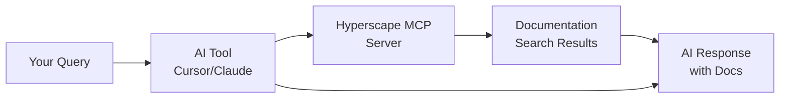

# MCP Server Reference

Hyperscape documentation is available via [Model Context Protocol (MCP)](https://modelcontextprotocol.io/), allowing AI coding tools to search our docs in real-time.

## Server URL

<CodeGroup>
```text MCP Server URL
https://hyperscape-ai.mintlify.app/mcp
```
</CodeGroup>

---

## Quick Setup

<Tabs>
  <Tab title="Cursor">
    Add to your `mcp.json` (via `Ctrl+Shift+P` → "Open MCP settings"):
    
    <CodeGroup>
    ```json mcp.json
    {
      "mcpServers": {
        "Hyperscape": {
          "url": "https://hyperscape-ai.mintlify.app/mcp"
        }
      }
    }
    ```
    </CodeGroup>
  </Tab>
  
  <Tab title="Claude Code">
    Run in terminal:
    
    <CodeGroup>
    ```bash Add MCP Server
    claude mcp add --transport http Hyperscape https://hyperscape-ai.mintlify.app/mcp
    ```
    </CodeGroup>
    
    Verify with:
    
    <CodeGroup>
    ```bash Verify Connection
    claude mcp list
    ```
    </CodeGroup>
  </Tab>
  
  <Tab title="VS Code">
    Create `.vscode/mcp.json`:
    
    <CodeGroup>
    ```json .vscode/mcp.json
    {
      "servers": {
        "Hyperscape": {
          "type": "http",
          "url": "https://hyperscape-ai.mintlify.app/mcp"
        }
      }
    }
    ```
    </CodeGroup>
  </Tab>
  
  <Tab title="Claude Web/Desktop">
    1. Go to **Settings** → **Connectors**
    2. Click **Add custom connector**
    3. Name: `Hyperscape`
    4. URL: `https://hyperscape-ai.mintlify.app/mcp`
  </Tab>
</Tabs>

---

## What Gets Exposed

The MCP server provides a **search tool** that queries all Hyperscape documentation:

| Content | Description |
|---------|-------------|
| Quickstart & Guides | Setup, development, deployment guides |
| Architecture Docs | ECS, networking, database, events |
| Game Systems | Combat, skills, inventory, banking, death |
| AI Agents | Actions, providers, ElizaOS integration |
| API Reference | REST endpoints and schemas |
| Wiki | In-depth technical reference |

---

## How AI Tools Use It



The AI determines when to search automatically based on:
- Your question context
- Keywords matching Hyperscape concepts
- Relevance to game development topics

---

## Example Queries

Once connected, your AI tool can answer:

**Development**
- "How do I set up the Hyperscape dev environment?"
- "What's the command to run with AI agents?"

**Architecture**
- "Explain the Entity Component System"
- "How does WebSocket synchronization work?"

**Game Mechanics**
- "What's the tick duration in combat?"
- "How is max hit calculated?"

**AI Agents**
- "List all ElizaOS actions"
- "What context providers are available?"

---

## Full Documentation

For detailed setup instructions, troubleshooting, and examples:

<Card title="MCP Server Guide" icon="book" href="/guides/mcp-server">
  Complete guide to connecting AI tools to Hyperscape documentation
</Card>
